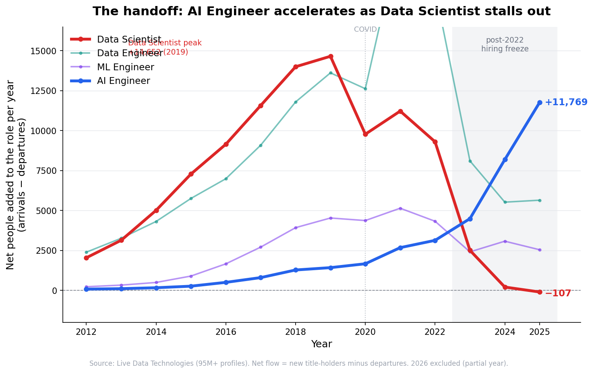
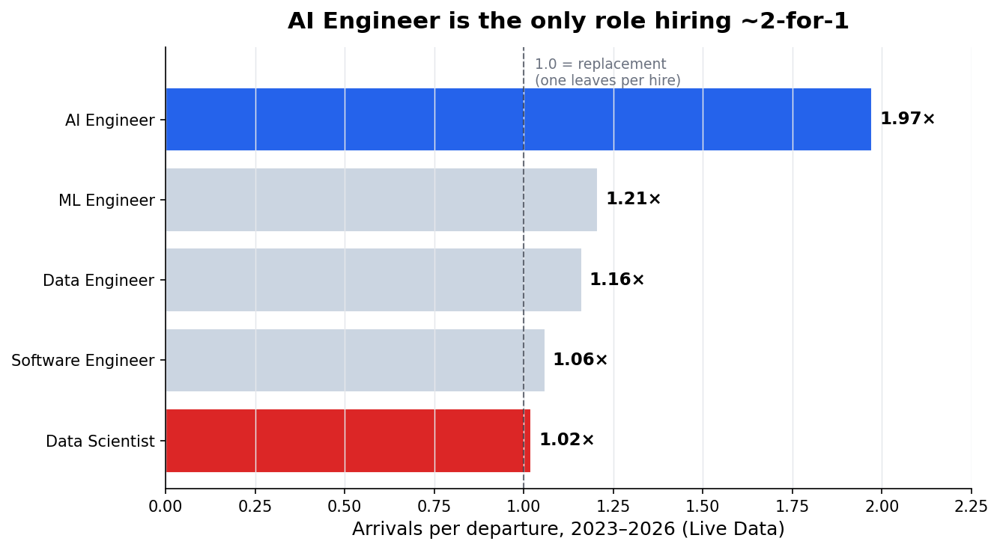
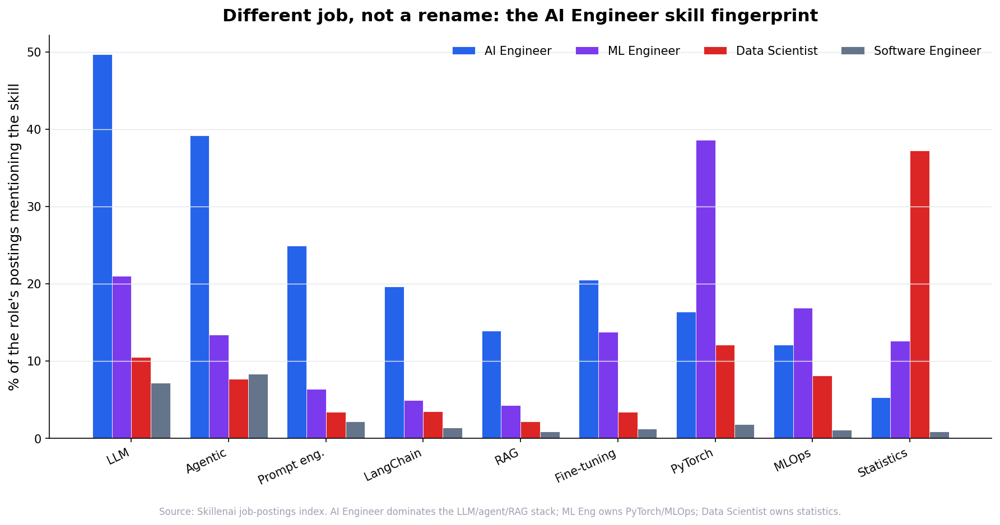
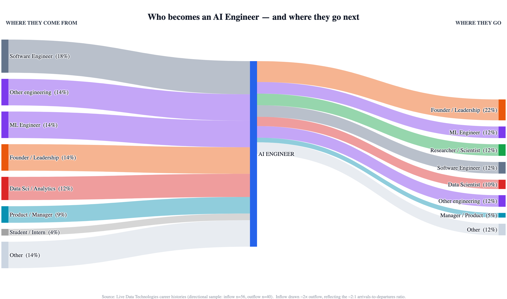
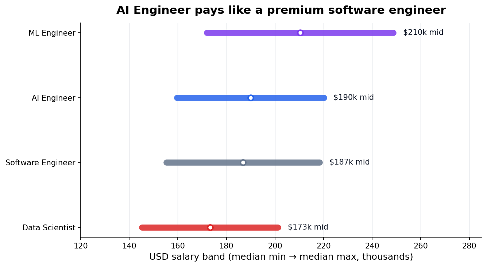

# Who Becomes an AI Engineer — and Why It's the Only Tech Role Still Hiring 2-for-1

*A joint analysis by [Skillenai](https://skillenai.com) and [Live Data Technologies](https://livedatatechnologies.com). July 2026.*

**Sources.** Two complementary datasets:
- **Demand** — Skillenai's job-postings index (what employers are hiring for: titles, skills, salaries).
- **Supply** — Live Data Technologies' database of 95M+ verified professional profiles, refreshed every 10–14 days (who actually holds these titles, and how their careers move between them).

Combining them lets us do something neither can do alone: watch the **demand** for AI Engineers, the **supply** of people flowing into and out of the role, and the **skills** that separate it from its neighbors — all at once.

---

## TL;DR

- **"AI Engineer" is the fastest-growing title in tech**, but it is a *genuine role transition*, not a rename. Its skill fingerprint (LLMs, agents, RAG, prompt engineering) is 2–4× more concentrated than in ML Engineering, Data Science, or Software Engineering.
- Among five adjacent roles, **AI Engineer is the only one still hiring roughly two people for every one who leaves** (1.97×). Every other role sits near replacement (~1:1).
- **Data Scientist has stalled.** After a decade of growth peaking in 2019, its net headcount additions fell to roughly zero by 2024 and went **negative in 2025** — the only one of the five to shrink.
- The role is a **revolving door**: software engineers and data/ML people flow *in*, and AI Engineers flow *out* to ML/research or up into founder/leadership roles. It churns as fast as its neighbors — it just fills twice as fast.
- It pays like a **premium software engineer**: ~$190K median midpoint, above Data Science, roughly level with Software Engineering, below ML Engineering.

---

## 1. The handoff: one role accelerates as another stalls

We measure each role by its **net flow** — the number of people *arriving* into the title each year minus the number *departing* it. Net flow is the honest way to see growth-and-decline: unlike a simple headcount reconstruction (which can only ever rise, because it's built from people who survive in today's data), net flow captures departures in real time.

The picture is a clean generational handoff:

- **Data Scientist** (red) rode a decade-long boom, peaking at **+14,652 net additions in 2019**. Then it decelerated — and after the post-2022 hiring freeze it never recovered, hitting **+203 in 2024 and −107 in 2025**. The defining data role of the 2010s has stopped growing.
- **AI Engineer** (blue) emerged from almost nothing (+75 in 2012) and is the *only* role that **accelerated through the freeze**: +4,486 (2023) → +8,184 (2024) → **+11,769 (2025)**.

An honest caveat: 2023 was a cliff for *every* role here (Software Engineer net additions fell from +120K to +30K) — that's the broad tech-hiring slowdown, not AI Engineering cannibalizing anyone directly. The story isn't that AI Engineer "stole" Data Science's headcount. It's the **divergence after the freeze**: as hiring froze, AI Engineer was the one role that kept pulling people in, while Data Scientist actually started shedding them.

## 2. The only role hiring 2-for-1

Zoom in on 2023–2026 and compute arrivals per departure for each role:

- **AI Engineer: 1.97×** — nearly two arrivals for every departure.
- ML Engineer 1.21×, Data Engineer 1.16×, Software Engineer 1.06×, **Data Scientist 1.02×** (essentially replacement).

Note what this is *not* saying. All five roles churn at similar rates — roughly 20% turnover per year. AI Engineer lost ~30,000 people to other roles over this window. It isn't stickier than its neighbors. What's singular is the **inflow**: it's the only role where arrivals run 2× departures, so it nets enormous growth despite the churn.

## 3. It's a different job, not a rename

If AI Engineer were just Data Science or ML with a fresh coat of paint, the skills in its postings would look the same. They don't. Here's the share of each role's postings mentioning a given skill (Skillenai job index):

- **AI Engineer owns the LLM-native stack**: LLM (50% of postings), agentic (39%), prompt engineering (25%), LangChain (20%), RAG (14%) — 2–4× the rate of any other role.
- **ML Engineer owns the classic training stack**: PyTorch (39%), MLOps (17%).
- **Data Scientist owns statistics** (37%) — and barely touches the LLM stack.

Moving from Software Engineering or Data Science into AI Engineering means learning a genuinely different toolkit. That's a **transition**, not a relabel.

## 4. Who becomes an AI Engineer — and where they go next

Tracing individual career histories, we can see the roles that feed AI Engineering and the roles it feeds into:

- **In:** Software Engineers are the single largest identifiable feeder (~18% of resolved transitions), followed by the ML/data-science family (~26% combined across ML Engineer, Data Science/Analytics), plus a meaningful stream from founders and product/management.
- **Out:** the largest destination is **founder / leadership** (~22%) — people who use the role as a launchpad — followed by a return into ML/Data Science/Research (~47% combined). The AI Engineer / ML Engineer / Data Scientist titles are close enough that people cycle among them as projects change.

The inflow band is drawn roughly twice the width of the outflow band, reflecting the ~2:1 arrivals-to-departures ratio from Section 2.

**At what career stage do people make the jump?** Overwhelmingly mid-career, at the individual-contributor level — about three-quarters of first AI Engineer roles are at a mainstream IC ("Staff") level, and the role's seniority mix mirrors ML Engineering. It's not a title reserved for the newly-minted or the very senior; it's where working engineers are moving.

## 5. The pay

AI Engineer pays like a **premium software engineer**: a ~$190K median midpoint (USD), above Data Science (~$173K), roughly level with Software Engineering (~$187K), and below the ML Engineering specialist (~$210K). In practice: a Data Scientist moving into AI Engineering typically gets a raise; a Software Engineer moves roughly sideways on pay while stepping into a hotter market.

---

## What this means

- **If you're a software engineer or data scientist:** AI Engineering is the highest-momentum move on the board — the one role still hiring aggressively while everything else sits at replacement. It's a real skill shift (LLMs, RAG, agents, prompt engineering), not a title swap, and for data scientists it usually comes with a pay bump.
- **If you're a data scientist specifically:** the classic Data Scientist title has stopped growing. That doesn't make the skills worthless — statistics and experimentation remain rare and valuable — but the *label* is no longer where the hiring is.
- **If you're hiring AI Engineers:** you're recruiting from the software-engineering and ML/data pools, not from a fresh graduate pipeline, and you're competing in the tightest market in tech — one where two people arrive for every one who leaves, but where a lot of people leave.

---

## Methodology & caveats

- **Two instruments.** *Supply* figures come from Live Data Technologies' profile database (self-reported titles and career histories). *Demand* figures (skills, salaries, posting counts) come from Skillenai's job-postings index (recruiter-written postings). They are complementary but measure different things.
- **Net flow, not headcount.** Growth/decline is measured as annual arrivals minus departures for each title. We deliberately avoid a reconstructed active-headcount curve, which is subject to survivorship bias (it is built from people who remain in today's data, so it can only rise and cannot show a genuine decline). Flow data captures departures as they happen.
- **The 2023 inflection is macro.** Net additions fell sharply for *every* role in 2023 (the post-2022 tech hiring slowdown). We attribute the AI-Engineer-vs-Data-Scientist *divergence after* that point to real role dynamics, not the 2023 drop itself. 2026 is excluded from annual charts as a partial year, and very recent months may be undercounted due to job-change detection lag.
- **Title matching** uses fuzzy matching on the primary title (e.g. "AI Engineer" also captures "Senior AI Engineer", "Generative AI Engineer", "AI/ML Engineer"). A precision spot-check found ~98% of matched profiles hold a genuine AI/ML engineering title.
- **The Sankey is a directional sample.** Population-scale flow tools resolve source/destination only to a coarse job-*function* taxonomy that cannot separate Software Engineer from ML Engineer from Data Scientist. The title-level inflow/outflow composition therefore comes from a hand-sampled set of career histories (inflow n=56, outflow n=40 resolved transitions) and should be read as *directional proportions*, not precise population shares. The *magnitude* of the 2:1 inflow-to-outflow ratio, the net-flow time series, and the skill/salary figures are all full-scale.
- **Skill prevalence** is measured as the share of a role's postings whose text mentions a skill; short/ambiguous tokens were handled with care, and figures reflect relative differences between roles rather than absolute skill-adoption rates.
- **Coverage.** Live Data skews toward high-visibility sectors (tech, finance, healthcare, media). Skillenai's postings index is US-heavy and does not fully capture employers on proprietary applicant-tracking systems (e.g. some of Big Tech).

*Raw per-role flow, ratio, and skill tables are included as CSVs in this folder. Underlying per-profile career histories and monthly flow series are available on request.*
