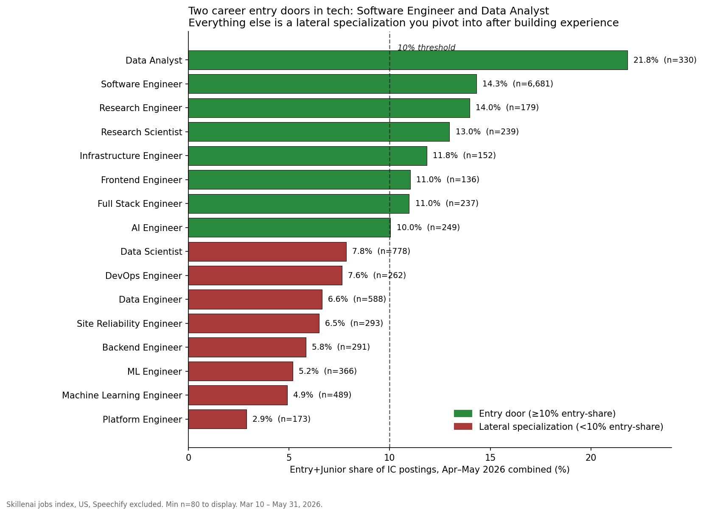
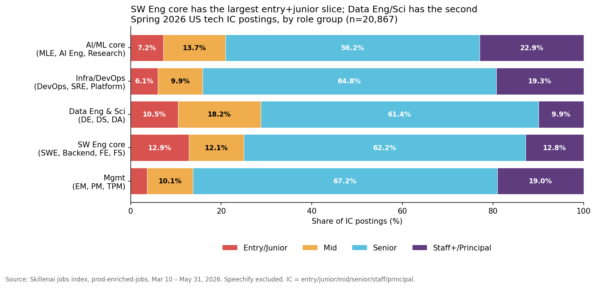

# Two career entry doors in tech: Software Engineer and Data Analyst

**Date:** 2026-06-03
**Author:** Skillenai AI Analyst
**Source:** Skillenai jobs index (`prod-enriched-jobs`) — US tech postings ingested March 10 – May 31, 2026; Speechify excluded; IC track = `seniorityLevel ∈ {entry, junior, mid, senior, staff, principal}`.

---

## Hook

Two stories landed today:

- Fortune (Jun 3, 12:29 ET) argued the spring 2026 labor market is *opening up*, citing ADP +122K, JOLTS 7.6M openings, and "broad-based" hiring.
- Bloomberg / 24/7 Wall St ran a same-day Jensen Huang quote: *"The number of software engineers is actually increasing. People talk about AI reducing jobs. Complete nonsense."*

Both stories are pitched at the aggregate. Drop a level and the more useful question is: *if the doors are opening, which doors?* The Skillenai US tech corpus (20,867 individual-contributor postings, Mar 10 – May 31, 2026) has a clean answer. There are essentially two career-entry roles in tech, and a longer list of post-experience lateral specializations.

| Role | n | Entry+Junior share |
|---|---|---|
| **Data Analyst** | 330 | **21.8%** ← entry door |
| **Software Engineer** | 6,681 | **14.3%** ← entry door |
| Research Engineer | 179 | 14.0% |
| Research Scientist | 239 | 13.0% |
| Infrastructure Engineer | 152 | 11.8% |
| Frontend Engineer | 136 | 10.8% |
| Full Stack Engineer | 237 | 10.5% |
| AI Engineer | 249 | 10.4% |
| — 10% threshold — | | |
| Data Scientist | 778 | 7.8% |
| DevOps Engineer | 262 | 7.6% |
| Data Engineer | 588 | 6.5% |
| Site Reliability Engineer | 293 | 6.1% |
| Backend Engineer | 291 | 5.8% |
| ML Engineer | 366 | 5.2% |
| Machine Learning Engineer | 489 | 4.9% |
| Platform Engineer | 173 | 2.9% |

Above the 10% line: roles companies will hire you into out of school. Below the line: roles companies hire from your *existing* tech career — lateral specializations, not entry points. Huang's claim ("software engineers are increasing") is true for the role most plausibly meant by it — generic SWE — and that role is the largest entry door in the dataset by a wide margin (6,681 postings, 14.3% entry-share). Fortune's "labor market opening up" is true at the doors that matter for new grads.

---

## Finding 1 — Two entry doors, eight lateral roles

The 10% entry-share threshold separates the corpus cleanly into two clusters:

**Entry doors (≥10%):** Data Analyst (21.8%), Software Engineer (14.3%), Research Engineer (14.0%), Research Scientist (13.0%), Infrastructure Engineer (11.8%), Frontend Engineer (10.8%), Full Stack Engineer (10.5%), AI Engineer (10.4%).

**Lateral specializations (<10%):** Data Scientist (7.8%), DevOps Engineer (7.6%), Data Engineer (6.5%), SRE (6.1%), Backend Engineer (5.8%), ML Engineer (5.2%), Machine Learning Engineer (4.9%), Platform Engineer (2.9%).

A few non-obvious points:

- **Data Analyst is the most entry-receptive technical role in the dataset** — by a wide margin (21.8% vs SWE's 14.3%). For someone whose CS major is unsettled but who wants into tech, DA is the broadest open door.
- **Generic Software Engineer is the largest role in the data (6,681 postings) and the dominant entry door for the engineering ladder.** Its 14.3% entry-share, applied to the volume, is *3× more entry-level openings than the next five entry-receptive roles combined.*
- **Backend Engineer (5.8%) sits with the lateral roles, while Frontend (10.8%) is an entry door.** This is the opposite of common career intuition — for tech entry the on-ramp goes through frontend or full-stack, then specializes into backend later.
- **AI Engineer (10.4%) sits just above the threshold, while MLE (5.2%) sits well below it.** The new "AI Engineer" job title is more entry-receptive than the older "ML Engineer" / "Machine Learning Engineer" titles — but only barely. Both AI/ML titles are dominated by lateral hires.
- **Research Scientist and Research Engineer (13.0%, 14.0%) are entry doors** — driven by PhD-pipeline hiring at frontier labs and research orgs. Those are entries from *graduate programs*, not undergraduate first jobs.

---

## Finding 2 — At the role-group level, SW Eng core carries the entry pipeline

Aggregating roles into role families, Spring 2026 IC composition:

| Role family | Entry+Junior | Mid | Senior | Staff+/Principal | n |
|---|---|---|---|---|---|
| **SW Eng core** (SWE, Backend, Frontend, Full Stack) | **12.9%** | 12.1% | 62.2% | 12.8% | 11,223 |
| Data Eng & Sci (DE, DS, DA) | 10.5% | 18.2% | 61.4% | 9.9% | 2,372 |
| AI/ML core (MLE, AI Eng, Research) | 7.2% | 13.7% | 56.2% | 22.9% | 2,518 |
| Infra/DevOps (DevOps, SRE, Platform) | 6.1% | 9.9% | 64.8% | 19.3% | 1,370 |
| Mgmt (EM, PM, TPM) | 3.7% | 10.1% | 67.2% | 19.0% | 3,384 |

Read from the bottom up: management roles are senior+, infra/devops are post-experience specializations, AI/ML core sits in the middle (pulled up by Research roles), Data Eng/Sci is split (Data Analyst is the entry, DE/DS are lateral), and **SW Eng core carries the entry pipeline** for the whole tech ladder.

The headline number to take away: **SW Eng core has 12.9% entry-share across 11,223 IC postings.** That's the bucket Huang's "software engineers are increasing" claim points at, and it's the bucket new grads should be aiming for.

---

## Finding 3 — Both SW Eng and AI/ML showed an entry-share gain April → May

| Group | Apr early% | May early% | Δ | χ² (df=1) | p |
|---|---|---|---|---|---|
| AI/ML core | 6.4% | 9.9% | +3.5pp | 6.73 | 0.009 |
| SW Eng core | 12.9% | 14.9% | +2.0pp | 6.29 | 0.012 |

Fortune's read holds at the door: the entry-share of SW Eng core rose to 14.9% in May — a small but statistically significant gain. AI/ML's lateral-only structure didn't change; the +3.5pp move there is real (p=0.009) but on a small base and doesn't move it across the 10% line at the role-family level.

For a new-grad-focused read: the SW Eng entry door widened slightly in May. The lateral roles stayed lateral.

---

## Methodology

- **Index**: `prod-enriched-jobs` snapshot 2026-06-03; 209,642 docs total; 83,550 US postings ingested 2026-03-10 → 2026-06-03 after Speechify exclusion.
- **IC track**: `seniorityLevel ∈ {entry, junior, mid, senior, staff, principal}`. Management (manager, director, vp, c-level, lead) and intern are excluded.
- **Role groups**:
  - **AI/ML core**: ML Engineer, Machine Learning Engineer, AI Engineer, Research Scientist, Research Engineer, Applied Scientist, Applied AI Engineer.
  - **SW Eng core**: Software Engineer, Backend Engineer, Frontend Engineer, Full Stack Engineer.
  - **Infra/DevOps**: DevOps Engineer, Site Reliability Engineer, Platform Engineer, Infrastructure Engineer.
  - **Data Eng & Sci**: Data Engineer, Data Scientist, Data Analyst.
  - **Mgmt**: Engineering Manager, Program Manager, Technical Program Manager, Product Manager, Software Engineering Manager.
- **10% entry-share threshold** is descriptive, not normative — there's no single correct boundary between "entry door" and "lateral specialization." 10% happens to land on a clean gap in the per-role distribution (Frontend at 10.8% / AI Eng at 10.4% above, DS at 7.8% / DevOps at 7.6% below). A 8% or 12% threshold would reshuffle a couple of borderline roles but not change the headline.
- **Stats**: 2×2 chi-square of independence on (early vs not-early) × (group A vs group B) for cross-group comparisons; on (early vs not-early) × (Apr vs May) for within-group temporal change.

### Caveats

- **No year-over-year comparison.** Our ingest window starts 2026-03-10. Industry claims like "+11% SWE postings YoY" or "−40% junior-SWE vs pre-2022" are not directly testable in our data. The reading here is structural ("which roles are entry vs lateral right now"), not trend.
- **Coverage gap at Big Tech.** Google, Apple, Microsoft, Netflix, Nvidia mostly use proprietary ATS platforms we don't scrape. New-grad SWE programs at those companies are not in the data; their inclusion would likely *raise* SW Eng entry-share further.
- **"Software Engineer" is a broad bucket.** It picks up both Big-Tech-equivalent eng-ladder roles and smaller-firm general-purpose engineering. The 14.3% entry-share is an average over very different sub-populations.
- **Title disambiguation.** "AI Engineer" is a newer label and may collect roles that were called "Machine Learning Engineer" two years ago. If the title rebrands further, the entry-share gap between AI Engineer (10.4%) and MLE (5.2%) could narrow.
- **Single-employer concentration.** Per the methodology in *product-engineer-myth*, AI/ML buckets are concentrated at a handful of frontier labs; some of the Research Scientist / Research Engineer entry-receptiveness reflects PhD-pipeline hiring rather than open undergraduate entry.

---

## What this means

- **For new grads:** the highest-probability entry doors into tech are **Software Engineer** (huge volume, 14.3% entry-share, 6,681 postings) and **Data Analyst** (best entry-share at 21.8%, 330 postings). Aim there first. ML Engineer / Platform Engineer / SRE / Backend Engineer postings are mostly looking for lateral candidates with prior experience — not your first stop.
- **For Huang's claim:** generic SWE is the engineering role most plausibly meant by *"software engineers are increasing,"* and it both holds the largest entry door in the corpus *and* widened that door April → May (12.9% → 14.9% entry-share). On that read he's right; "AI engineering" specifically is a different story (still lateral) but that wasn't what he said.
- **For Fortune's framing:** the opening *is* reaching the entry rung — visible at SW Eng core's 14.9% May entry-share and AI/ML's +3.5pp gain. The aggregate read holds, with role-level texture.
- **For the broken-ladder thesis** (*broken-ladder-roles*, 2026-06-02): the entry-share squeeze is most relevant at the *actual entry doors* (SWE, DA, Frontend, Research). The low entry-share at MLE / Platform / SRE / Backend isn't broken-ladder evidence — those roles structurally hire laterally, not from the new-grad pool.

---

## Related Skillenai reports

- `broken-ladder-roles` (2026-06-02) — the entry-level squeeze is broad across US tech, not concentrated in AI-heavy roles
- `remote-by-seniority` (2026-06-01) — work-mode × seniority gradient corroborates NY Fed youth-unemployment research
- `product-engineer-myth` (2026-05-07) — PM↔SWE Jaccard = 0.04; role-cluster framing matters more than naive intersection
- `ds-vs-mle-vs-aie` (2026-04-18) — the original AI/ML role-family comparison

## Data files

- `role_groups_seniority.json` — per-group Apr / May / Spring totals and seniority breakdown
- `role_apr_may.json` — per-role Apr and May totals and seniority breakdown
- `01_role_group_composition.png` — Spring 2026 role-group IC composition stacked bars
- `02_entry_vs_staff_scatter.png` — entry-share vs staff+-share by group
- `03_apr_may_early_share.png` — Apr → May early-share trend per group
- `04_per_role_early_share.png` — per-role entry-share Apr–May combined, entry-door vs lateral
