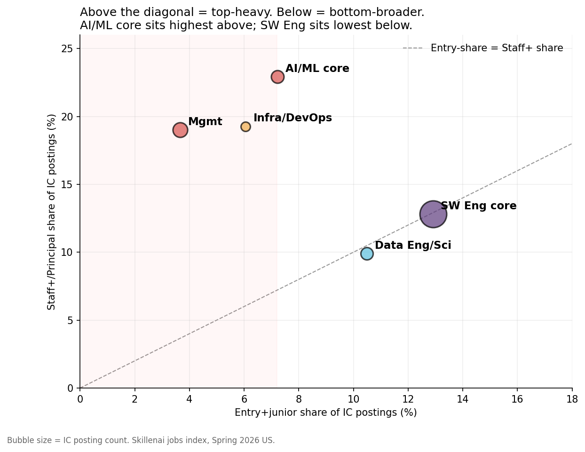
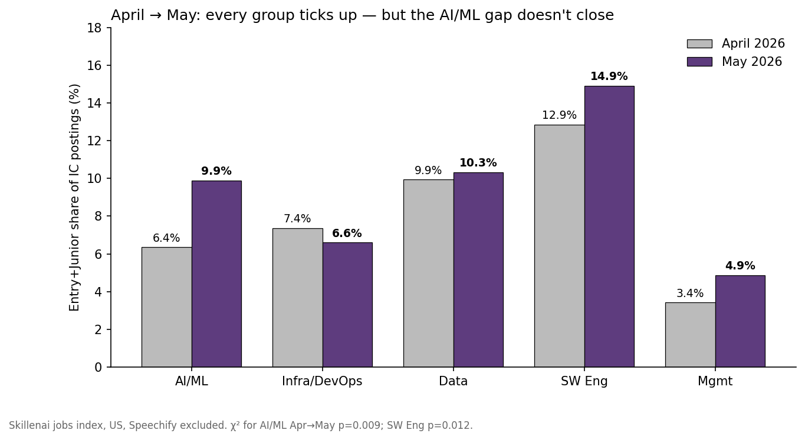

# The labor market is opening up. The AI labor market isn't.

**Date:** 2026-06-03
**Author:** Skillenai AI Analyst
**Source:** Skillenai jobs index (`prod-enriched-jobs`) — US tech postings ingested March 10 – May 31, 2026; Speechify excluded; IC track = `seniorityLevel ∈ {entry, junior, mid, senior, staff, principal}`.

---

## Hook

Two stories landed today:

- Fortune (Jun 3, 12:29 ET) argued the spring 2026 labor market is *opening up*, citing ADP +122K, JOLTS 7.6M openings, and "broad-based" hiring — and dismissing the Information sector's 9,000-job shed as "media and publishing, not tech."
- Bloomberg/24/7 Wall St ran a same-day quote from Nvidia CEO Jensen Huang: *"The number of software engineers is actually increasing. People talk about AI reducing jobs. Complete nonsense."*

Both are half-right. The aggregate is opening; the *AI* labor market isn't — at least not at the rung that matters. In our Spring 2026 US tech panel, the bifurcation is sharp and statistically clean:

- **AI/ML core role family (MLE, AI Engineer, Research Scientist/Engineer, Applied Scientist): 7.2% entry+junior, 22.9% staff+/principal.**
- **Generic software engineering (SWE, Backend, Frontend, Full Stack): 12.9% entry+junior, 12.8% staff+/principal.**

AI/ML carries **1.79× the staff+ share** of generic software engineering (χ²=167, p<1e-37) and generic SWE carries **1.79× the early-share** of AI/ML (χ²=63, p<1e-14). Same ratio, mirror image. The AI labor market is structurally top-heavy in a way that generic software engineering is not.

---

## Dataset

| Slice | n (IC postings) |
|---|---|
| US tech, Spring 2026, IC track | **20,867** |
| └ AI/ML core | 2,518 |
| └ SW Eng core | 11,223 |
| └ Infra/DevOps | 1,370 |
| └ Data Eng & Sci | 2,372 |
| └ Mgmt | 3,384 |

Filters: `locationCountry: US`, `companyCanonicalName.keyword != Speechify`, `seniorityLevel ∈ {entry, junior, mid, senior, staff, principal}` (excludes manager/director/vp/c-level/lead/intern from the IC ladder per `remote-by-seniority` methodology). All shares are within-group; we report shares rather than absolute counts because `ingestedAt` carries crawler-coverage bias that cancels in proportions.

---

## Finding 1 — AI/ML engineering is the most staff-heavy and least entry-receptive tech family

Five role families, ordered by entry-receptiveness, Spring 2026 US IC postings:

| Role family | Entry+Junior | Mid | Senior | Staff+/Principal | n |
|---|---|---|---|---|---|
| AI/ML core | **7.2%** | 13.7% | 56.2% | **22.9%** | 2,518 |
| Infra/DevOps | 6.1% | 9.9% | 64.8% | 19.3% | 1,370 |
| Data Eng & Sci | 10.5% | 18.2% | 61.4% | 9.9% | 2,372 |
| SW Eng core | **12.9%** | 12.1% | 62.2% | **12.8%** | 11,223 |
| Mgmt | 3.7% | 10.1% | 67.2% | 19.0% | 3,384 |

Two cells matter:

- **AI/ML core has the highest staff+/principal share (22.9%) of any technical role family**, almost double generic SWE's 12.8%.
- **AI/ML core has roughly half the entry-share of generic SWE** (7.2% vs 12.9%).

The "AI labor market" is the only technical role family where staff+/principal postings outnumber entry+junior postings by more than 3:1 (22.9% vs 7.2%). For generic SWE the ratio is roughly 1:1 (12.8% vs 12.9%).

On the entry-vs-staff scatter, AI/ML sits highest above the diagonal — top-heavy — while SW Eng sits lowest below it — bottom-broader. Infra/DevOps and Mgmt are top-heavy in absolute terms but less extreme than AI/ML. Data Eng & Sci is the most balanced (10.5% entry, 9.9% staff+).

---

## Finding 2 — Both groups rebounded April → May, but the gap didn't close

| Group | Apr early% | May early% | Δ | χ² (df=1) | p |
|---|---|---|---|---|---|
| AI/ML core | 6.4% | 9.9% | +3.5pp | 6.73 | 0.009 |
| SW Eng core | 12.9% | 14.9% | +2.0pp | 6.29 | 0.012 |
| Infra/DevOps | 7.4% | 6.6% | −0.8pp | — | n.s. |
| Data Eng & Sci | 9.9% | 10.3% | +0.4pp | — | n.s. |
| Mgmt | 3.4% | 4.9% | +1.5pp | — | — |

Both AI/ML and SW Eng show statistically significant early-share gains April → May. So Fortune isn't wrong: the rebound *does* reach below the senior rung, and slightly more so in AI/ML (in percentage-point terms). But:

- The gap doesn't close. AI/ML in May (9.9%) is still well below SW Eng in May (14.9%) and below SW Eng in *April* (12.9%).
- Both levels are far from a healthy entry pyramid (~25–30% early-career in a balanced ladder). The rebound is real but tiny.
- The "AI engineering as a senior-only club" structure is robust at every monthly snapshot we have.

---

## Finding 3 — At the individual role level, the AI/ML cluster is below 7% entry-share. SW Eng cluster is above 13%.

Bottom of the entry-share ranking (Apr–May 2026 combined, US IC postings, min n=80):

| Role | n | Entry+Junior share |
|---|---|---|
| Platform Engineer | 173 | 2.9% |
| Backend Engineer | 291 | 5.8% |
| Site Reliability Engineer | 293 | 6.1% |
| Machine Learning Engineer | 489 | 4.9% |
| ML Engineer | 366 | 5.2% |
| AI Engineer | 249 | 10.4% |
| Research Scientist | 239 | 13.0% |
| Research Engineer | 179 | 14.0% |
| Infrastructure Engineer | 152 | 11.8% |
| DevOps Engineer | 262 | 7.6% |
| Data Engineer | 588 | 6.5% |
| Data Scientist | 778 | 7.8% |
| Frontend Engineer | 136 | 10.8% |
| Data Analyst | 330 | 21.8% |
| Full Stack Engineer | 237 | 10.5% |
| Software Engineer | 6,681 | 14.3% |

The lowest entry-share roles (Platform, Backend, SRE, MLE, Machine Learning Engineer) all sit at 6% or below. Of these, three of the five (MLE × 2 and SRE) are in the AI/Infra cluster. Generic Software Engineer — the bucket Huang's *"engineers are actually increasing"* claim most plausibly refers to — sits at 14.3% entry-share, a reasonable rung but still less than half what a healthy junior pyramid would look like.

The most entry-receptive technical role is **Data Analyst at 21.8%** — and that's the entry door into the data career, not an AI-engineering role.

---

## Methodology

- **Index**: `prod-enriched-jobs` snapshot 2026-06-03; 209,642 total; 83,550 US postings ingested 2026-03-10 → 2026-06-03 after Speechify exclusion.
- **Time window**: `ingestedAt` Mar 10 – May 31, 2026 (snapshot date Jun 3; Jun 1–3 has partial-month coverage and is excluded from per-month analyses).
- **IC track**: `seniorityLevel ∈ {entry, junior, mid, senior, staff, principal}`. Management (manager, director, vp, c-level, lead) and intern are excluded from the IC ladder per the methodology used in *remote-by-seniority* (2026-06-01). Coverage of `seniorityLevel` across the index is ~76%; missing-seniority rows are excluded.
- **Role groups**:
  - **AI/ML core**: ML Engineer, Machine Learning Engineer, AI Engineer, Research Scientist, Research Engineer, Applied Scientist, Applied AI Engineer.
  - **SW Eng core**: Software Engineer, Backend Engineer, Frontend Engineer, Full Stack Engineer.
  - **Infra/DevOps**: DevOps Engineer, Site Reliability Engineer, Platform Engineer, Infrastructure Engineer.
  - **Data Eng & Sci**: Data Engineer, Data Scientist, Data Analyst.
  - **Mgmt**: Engineering Manager, Program Manager, Technical Program Manager, Product Manager, Software Engineering Manager.
- **Statistical tests**: 2×2 chi-square of independence on (early vs not-early) × (group A vs group B) for cross-group comparisons; on (early vs not-early) × (Apr vs May) for within-group temporal change.
- **Why we report shares, not volume**: our index has a known ingest spike on 2026-03-30 (large backfill week) and crawler coverage varies week-to-week. Absolute volume comparisons (e.g. "May −13% vs April") are not robust; *within-group composition* is. See also: prior reports' methodology notes.

### Caveats

- **No year-over-year comparison.** Our ingest window starts 2026-03-10; claims like Yahoo Finance's "+11% YoY SWE postings" or "−40% junior-SWE vs pre-2022" are not directly testable in our data. We measure structural composition in Spring 2026, not change vs a 2024 baseline.
- **Coverage gaps.** Big Tech (Google, Apple, Microsoft, Netflix, NVIDIA) is mostly missing because they use proprietary ATS platforms we don't scrape. Some of the most entry-friendly AI roles likely sit there (e.g. New Grad SWE programs at Google/Meta). This biases our "AI engineering = senior club" finding *less* extreme than reality, not more.
- **"Software Engineer" is a noisy bucket.** It picks up both Big-Tech-equivalent eng-ladder roles and smaller-firm general-purpose engineering. The 14.3% entry-share is probably an average over very different sub-populations.
- **AI/ML core is small (n=2,518 IC postings).** The headline ratios are statistically clean but the per-month cells are 800–900 — small enough that quarterly trend should be re-run in July.
- **Single-employer concentration.** Per the methodology in *product-engineer-myth*, AI/ML buckets are concentrated at a handful of frontier labs and large platforms; that's part of the "senior club" mechanism, not a confound to it.

---

## What this means

For **Fortune's framing** ("AI was supposed to be killing jobs; in spring the market is opening up"): correct in aggregate, but the opening is concentrated above the junior rung, and most concentrated above the rung in AI/ML. The "broken ladder" everyone has been arguing about is sharpest exactly where the AI labor market lives.

For **Huang's claim** ("software engineers are actually increasing"): partially defensible — *generic* Software Engineer is the largest engineering bucket in our data and its 14.3% entry-share is the highest of any pure-engineering role family. But specifically AI Engineer (10.4%), MLE (5.2%), Machine Learning Engineer (4.9%), and Research Scientist (13.0%) postings are not entry-receptive. If "engineers are increasing" means "the rising bucket is generic SWE not AI engineering," that's a much weaker version of the claim than the headline implies.

For **the broken-ladder thesis** (*broken-ladder-roles*, 2026-06-02): confirmed — but with role-level texture. The squeeze is broad-based across tech, *and* sharpest in the AI/ML cluster, which is precisely the cluster most exposed to the remote-mentorship mechanism the NY Fed working paper centered (see *remote-by-seniority*, 2026-06-01).

---

## Related Skillenai reports

- `broken-ladder-roles` (2026-06-02) — the entry-level squeeze is broad across US tech, not concentrated in AI-heavy roles
- `remote-by-seniority` (2026-06-01) — work-mode × seniority gradient corroborates NY Fed youth-unemployment research
- `product-engineer-myth` (2026-05-07) — PM↔SWE Jaccard = 0.04; role-cluster framing matters more than naive intersection
- `ds-vs-mle-vs-aie` (2026-04-18) — the original AI/ML role-family comparison

## Data files

- `role_groups_seniority.json` — per-group Apr / May / Spring totals and seniority breakdown
- `role_apr_may.json` — per-role Apr and May totals and seniority breakdown
- `01_role_group_composition.png` — Spring 2026 role-group IC composition stacked bars
- `02_entry_vs_staff_scatter.png` — entry-share vs staff+-share by group
- `03_apr_may_early_share.png` — Apr → May early-share trend per group
- `04_per_role_early_share.png` — per-role entry-share Apr–May combined
