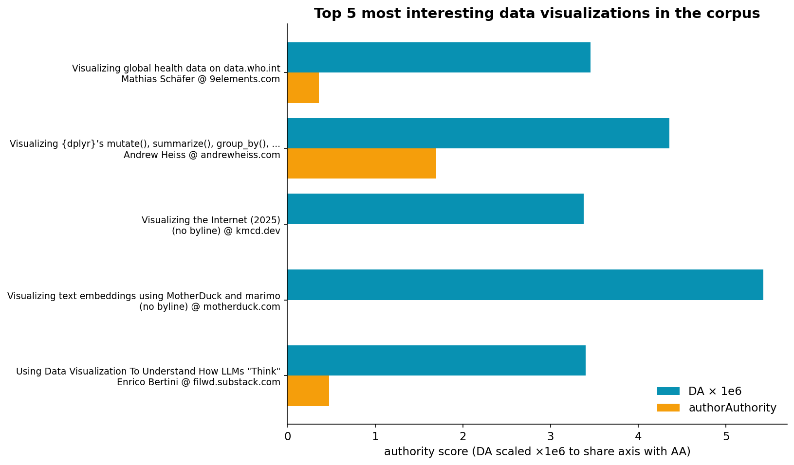
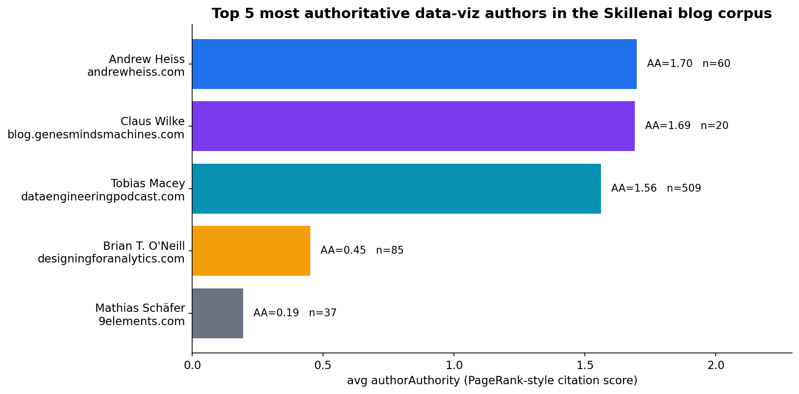
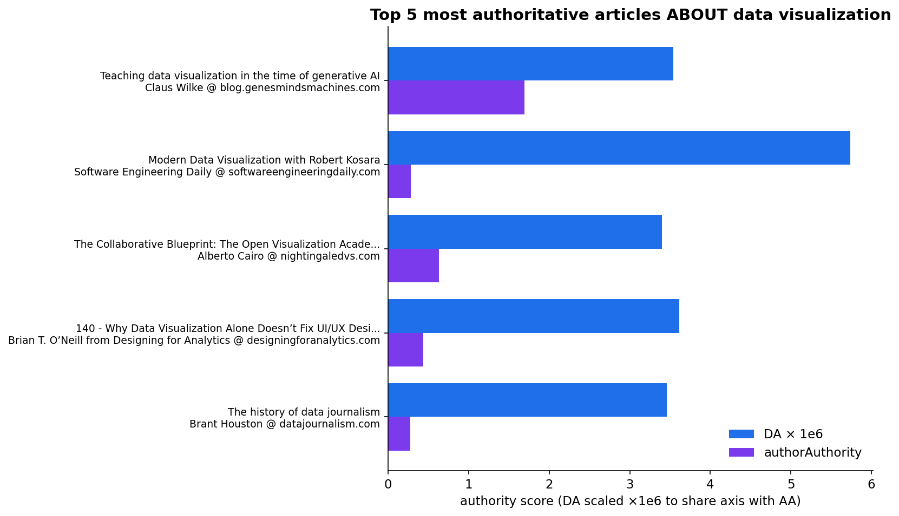
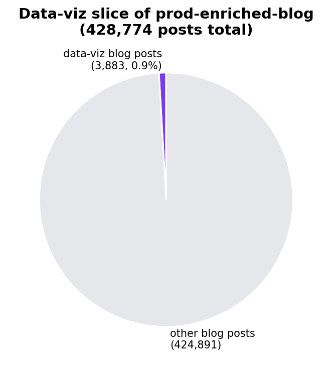

# The data visualizations the open web is quietly voting for

**Date:** 2026-06-07
**Source:** `prod-enriched-blog` (428,774 posts, Skillenai Data Products API)

Three top-5 lists curated from the Skillenai blog index by PageRank-style
citation scores: the most interesting data visualizations on display, the
people who make them, and the writing worth catching up on.

The lists below match the
[blog post](https://skillenai.com/dashboard/posts/the-most-authoritative-data-viz-writing-on-the-web-and-the-people-behind-it/edit);
this README adds the underlying figures and the raw data.

---

## 1. The 5 most interesting data visualizations on display

| # | Visualization | Author | Domain |
|---|---|---|---|
| 1 | [data.who.int — global health dashboard](https://9elements.com/blog/visualizing-global-health-data-on-data-who-int) | Mathias Schäfer | 9elements.com |
| 2 | [Animated dplyr verbs: mutate / summarize / group_by / ungroup](https://www.andrewheiss.com/blog/2024/04/04/group_by-summarize-ungroup-animations) | Andrew Heiss | andrewheiss.com |
| 3 | [Visualizing the Internet (2025)](https://kmcd.dev/posts/internet-map-2025) | kmcd.dev | kmcd.dev |
| 4 | [Text embeddings explorer (MotherDuck × marimo)](https://motherduck.com/blog/MotherDuck-Visualize-Embeddings-Marimo) | MotherDuck team | motherduck.com |
| 5 | [Generative AI is eating culture — AI vs. human dance](https://themarkup.org/artificial-intelligence/2026/01/21/our-video-tests-prove-generative-ai-still-sucks-at-dancing-see-for-yourself) | Khari Johnson & Levi Sumagaysay | themarkup.org |

---

## 2. The 5 people behind the work

| # | Author | Domain | Posts in corpus |
|---|---|---|---|
| 1 | [Andrew Heiss](https://www.andrewheiss.com) | andrewheiss.com | 60 |
| 2 | [Claus Wilke](https://blog.genesmindsmachines.com) | blog.genesmindsmachines.com | 20 |
| 3 | [Tobias Macey](https://www.dataengineeringpodcast.com) | dataengineeringpodcast.com | 509 |
| 4 | [Brian T. O'Neill](https://designingforanalytics.com) | designingforanalytics.com | 85 |
| 5 | [Mathias Schäfer](https://9elements.com/blog) | 9elements.com | 37 |

---

## 3. The 5 articles worth catching up on

| # | Article | Author |
|---|---|---|
| 1 | [Teaching data visualization in the time of generative AI](https://blog.genesmindsmachines.com/p/teaching-data-visualization-in-the) | Claus Wilke |
| 2 | [Modern Data Visualization with Robert Kosara](https://softwareengineeringdaily.com/2025/09/02/modern-data-visualization-with-robert-kosara) | Software Engineering Daily |
| 3 | [The Collaborative Blueprint: The Open Visualization Academy](https://nightingaledvs.com/the-collaborative-blueprint) | Alberto Cairo (Nightingale) |
| 4 | [Why Data Visualization Alone Doesn't Fix UI/UX Design Problems](https://brian2r.podbean.com/e/why-data-visualization-alone-doesn-t-fix-uiux-design-problems-in-analytical-data-products-with-t-from-data-rocks-nz) | Brian T. O'Neill |
| 5 | [The history of data journalism](https://datajournalism.com/read/longreads/the-history-of-data-journalism) | Brant Houston |

---

## Methodology

- **Source:** `prod-enriched-blog` index (428,774 posts) via the
  [Skillenai Data Products API](https://api.skillenai.com).
- **Subset:** 3,883 posts that mention a data-visualization phrase in the
  body (*data visualization, data viz, dataviz, interactive visualization,
  infographic, data journalism, D3.js, Chart.js*) or 116 posts with one
  in the title.
- **Ranking:** blog-post `authorAuthority` and `domainAuthority` —
  PageRank-style citation scores from the cross-document link graph.
- **Filters:** standard junk-author and known-noisy-domain exclusions
  (see [Reproducibility](#reproducibility) below).
- **Caveat:** Our blog crawl undersamples dedicated graphics-desk
  subdomains (graphics.reuters.com, pudding.cool, flowingdata.com),
  so this list is the canon as seen through Skillenai's lens — not as
  it sits in the public imagination.

---

## Reproducibility

All counts and authority scores reproducible from the `raw_picks.json` and
`authors.json` snapshots in this folder. The chart-generation script is
`generate_figures.py`. Rankings apply junk-author filtering and the 333-domain
denylist documented in
[`../synthetic-breakout-may-2026/network_domains_seed.csv`](../synthetic-breakout-may-2026/network_domains_seed.csv).
