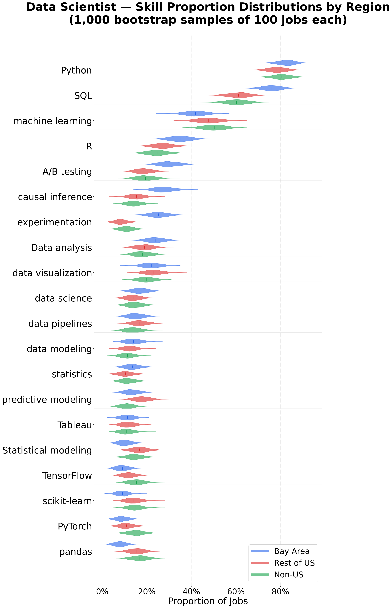
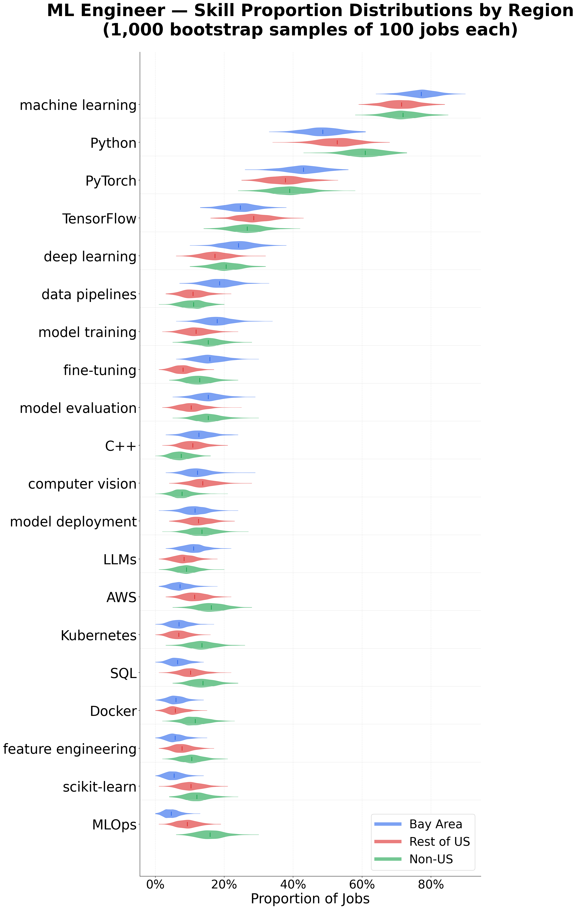
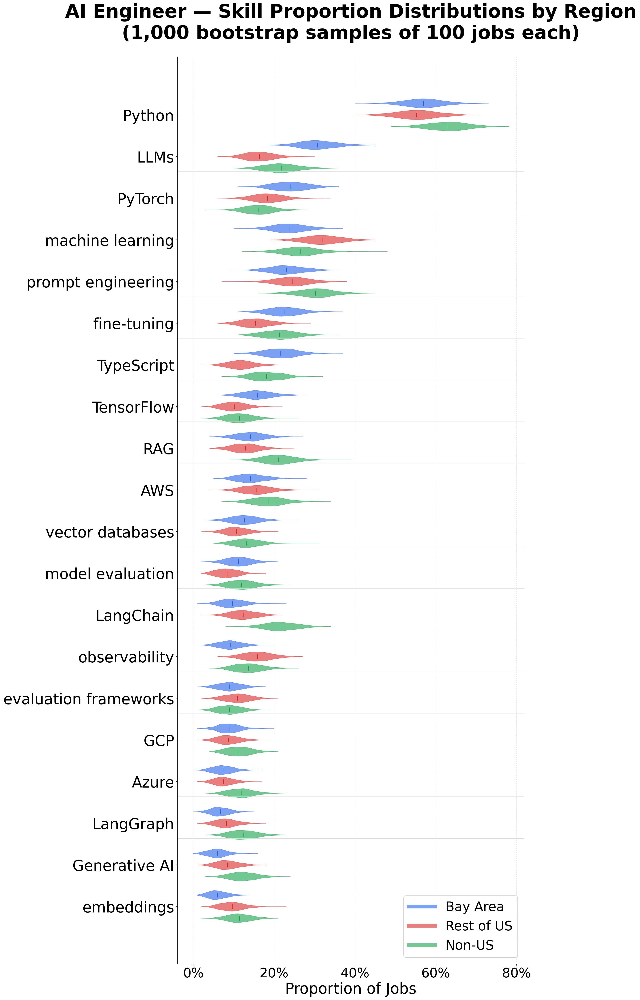

# Geographic Job Profile Comparison: Bay Area vs Rest-of-US vs Rest-of-World

**Date:** 2026-04-14 (updated)
**Source:** Skillenai Job Index (77,735 jobs after dedup and spam exclusion)
**API:** `api.skillenai.com/v1`

> **Methodology:** "Bay Area" = 80km radius around San Francisco (37.77, -122.42), capturing SF, San Jose, Mountain View, Palo Alto, Sunnyvale, Menlo Park, and surrounding cities. One spam employer (Speechify, 2,487 carpet-bombed listings across 10 roles) excluded from all analyses. Duplicate jobs from URL casing differences removed via content hash dedup.

---

## 1. Geographic Distribution

| Region | Jobs | Share |
|--------|-----:|------:|
| Bay Area (80km) | 10,508 | 13.5% |
| Rest of US | 32,762 | 42.1% |
| Non-US | 34,465 | 44.3% |
| **Total** | **77,735** | **100%** |

**Top US cities:** San Francisco (5,601), New York City (5,408), Seattle (1,141), San Jose (1,040), Austin (992), Mountain View (759), Boston (752)

**Top countries after US (43,270):** India (6,586), UK (5,799), Canada (2,355), Germany (1,753), Singapore (1,211), France (1,173), Brazil (923)

---

## 2. Role Distributions

> Chi-square omnibus: X2=1020.2, df=36, p~0, Cramer's V=0.121. All 3 pairwise comparisons significant. The rest-of-US vs non-US difference (V=0.151) is actually the *largest* pairwise effect -- driven by Systems Engineer and Program Manager being US-heavy.

### Top Roles by Region (% of region total)

| Role | Bay Area | Rest-US | Non-US | Bonferroni sig? | Key residuals |
|------|--------:|--------:|-------:|:---:|:--|
| Software Engineer | 18.6% | 15.0% | 13.1% | *** | Bay +11.7, Non -7.8 |
| Product Manager | 3.7% | 3.4% | 3.4% | | (no significant difference) |
| ML Engineer (all) | 2.7% | 1.1% | 1.1% | *** | Bay **+13.4**, Non -4.1 |
| Data Scientist | 2.3% | 1.9% | 1.8% | | (not significant) |
| Engineering Manager | 2.3% | 1.6% | 1.9% | *** | Bay +3.8, RoUS -3.7 |
| Product Designer | 1.9% | 1.4% | 1.3% | *** | Bay +4.3 |
| Staff SWE | 1.8% | 1.2% | 0.9% | *** | Bay +7.5, Non -4.2 |
| Backend Engineer | 1.6% | 0.8% | 2.1% | *** | RoUS **-11.3**, Non **+9.3** |
| Data Engineer | 0.9% | 1.7% | 2.0% | *** | Bay **-6.8**, Non +4.0 |
| Systems Engineer | 0.7% | 1.2% | 0.5% | *** | RoUS **+9.6**, Non **-7.1** |
| AI Engineer | 0.9% | 0.7% | 0.8% | | (not significant) |

**Key observations (Bonferroni-significant only):**
- **ML Engineer** has the single largest residual in the entire analysis (+13.4 for Bay Area) -- 2.4x the concentration of any other region
- **Backend Engineer** shows the sharpest US vs non-US split: heavily underrepresented in rest-of-US (-11.3) but overrepresented non-US (+9.3). "Backend" as a job title is a European/Asian convention.
- **Data Engineer** is significantly underrepresented in the Bay Area (-6.8) -- traditional data infrastructure roles live elsewhere
- **Systems Engineer** and **Program Manager** are both strongly US-specific (rest-of-US residuals of +9.6 and +10.5) and rare globally -- these are defense/enterprise title conventions
- **Product Manager**, **Data Scientist**, and **AI Engineer** show no significant geographic difference -- these roles are globally distributed

### Bay Area-Specific Roles
- **Research Scientist** (1.3%) and **Research Engineer** (1.2%) -- AI labs
- **Founding Engineer** (0.5%) -- startup ecosystem
- **Forward Deployed Engineer** (0.7%) -- Palantir-style deployment roles

---

## 3. Skill Distributions by Role and Geography

> **Statistical methodology:** Two complementary approaches were used to validate geographic differences:
>
> 1. **Chi-square tests of homogeneity** on per-skill 3x2 contingency tables (3 regions x has/doesn't have skill), with Bonferroni correction for multiple comparisons. Each job is one independent observation. Standardized residuals identify which regions drive each difference. Omnibus chi-square tests on the full skill x region contingency table test whether overall skill profiles differ, with Cramer's V for effect size.
>
> 2. **Monte Carlo bootstrap** (1,000 resamples of 100 jobs per region) producing distributions of skill proportions per region. See the violin plots below for visual confirmation of distribution overlap/separation.
>
> Claims below are labeled with standardized residuals from the chi-square analysis. A residual > +2.0 means a region has significantly *more* of a skill than expected; < -2.0 means significantly *less*. Only skills surviving Bonferroni correction (p < 0.0025) are called "significant."

### Overall: Do Skill Profiles Differ by Region?

| Role | Omnibus X2 | p-value | Cramer's V | Bay vs Rest-US p | Bay vs Non-US p | Rest-US vs Non-US p |
|------|----------:|---------:|-----------:|-----------------:|----------------:|--------------------:|
| Data Scientist | 116.0 | 7.9e-10 | 0.094 | 4.8e-08 | 3.3e-10 | **0.18 (n.s.)** |
| ML Engineer | 164.1 | 1.3e-17 | 0.115 | 2.7e-06 | 2.5e-16 | 1.1e-06 |
| AI Engineer | 58.7 | 0.017 | 0.101 | **0.097 (n.s.)** | 0.018 | **0.18 (n.s.)** |

**The fundamental geographic divide is Bay Area vs everywhere else.** For Data Scientists and AI Engineers, rest-of-US and non-US skill profiles are statistically indistinguishable (p = 0.18). The Bay Area is the outlier. ML Engineers are the exception -- all three regions differ significantly, driven by non-US infrastructure skill emphasis.

### 3a. Data Scientist Skills (top 15)

| Rank | Bay Area (n=213) | Rest-US (n=451) | Non-US (n=777) |
|-----:|:-----------------|:-----------------|:---------------|
| 1 | Python (83%) | Python (78%) | Python (81%) |
| 2 | SQL (76%) | SQL (61%) | SQL (61%) |
| 3 | ML (42%) | ML (47%) | ML (50%) |
| 4 | R (35%) | R (27%) | R (25%) |
| 5 | A/B testing (30%) | Data viz (23%) | A/B testing (20%) |
| 6 | Causal inference (28%) | A/B testing (19%) | Data viz (20%) |
| 7 | Experimentation (25%) | Data analysis (19%) | Data analysis (18%) |
| 8 | Data analysis (24%) | Predictive modeling (18%) | Pandas (17%) |
| 9 | Data viz (22%) | Data pipelines (17%) | TensorFlow (15%) |
| 10 | Data science (17%) | Statistical modeling (17%) | PyTorch (15%) |
| 11 | Data pipelines (15%) | Causal inference (15%) | scikit-learn (15%) |
| 12 | Data modeling (14%) | Pandas (15%) | Causal inference (14%) |
| 13 | Statistics (14%) | scikit-learn (14%) | Data science (14%) |
| 14 | Predictive modeling (13%) | Data science (14%) | Statistical modeling (14%) |
| 15 | Tableau (11%) | TensorFlow (12%) | Data pipelines (14%) |

**The Bay Area Data Scientist is fundamentally different** (Bay vs rest-of-US: X2=71.7, p=4.8e-08; rest-of-US vs non-US: p=0.18, not significant -- the divide is Bay Area vs everywhere else):

Only 4 skills survive Bonferroni correction, and they paint a clear picture -- the Bay Area DS is a product experimentation role:
- **Experimentation** (25% vs 8%): residual **+5.3** -- the single largest driver of the geographic difference
- **Causal inference** (28% vs 15%): residual **+4.0**
- **A/B testing** (30% vs 19%): residual **+3.0**
- **SQL** (76% vs 61%): residual **+2.3** -- Bay Area DSes are deeply embedded in data infrastructure

Skills that trend lower in the Bay Area (not surviving Bonferroni, but visible in bootstrap distributions): pandas (8% vs 15%), scikit-learn (9% vs 14%), statistical modeling (10% vs 17%), predictive modeling (13% vs 18%). The Bay Area DS deprioritizes traditional modeling, but these differences aren't statistically robust at the per-skill level -- they contribute to the significant omnibus test collectively.

### 3b. ML Engineer Skills (top 15)

| Rank | Bay Area (n=352) | Rest-US (n=517) | Non-US (n=764) |
|-----:|:-----------------|:-----------------|:---------------|
| 1 | ML (77%) | ML (72%) | ML (72%) |
| 2 | Python (49%) | Python (53%) | Python (61%) |
| 3 | PyTorch (43%) | PyTorch (38%) | PyTorch (39%) |
| 4 | TensorFlow (24%) | TensorFlow (28%) | TensorFlow (27%) |
| 5 | Deep learning (24%) | Deep learning (17%) | Deep learning (21%) |
| 6 | Data pipelines (19%) | Computer vision (14%) | MLOps (16%) |
| 7 | Model training (18%) | Model deployment (12%) | AWS (16%) |
| 8 | Fine-tuning (16%) | AWS (11%) | Model evaluation (15%) |
| 9 | Model evaluation (15%) | Model training (12%) | Model training (15%) |
| 10 | C++ (13%) | Data pipelines (11%) | SQL (14%) |
| 11 | Computer vision (12%) | C++ (11%) | Kubernetes (14%) |
| 12 | LLMs (11%) | SQL (10%) | Model deployment (13%) |
| 13 | Model deployment (11%) | scikit-learn (10%) | Fine-tuning (13%) |
| 14 | JAX (11%) | MLOps (9%) | scikit-learn (12%) |
| 15 | RL (10%) | LLMs (8%) | Docker (12%) |

**MLE is the most geographically differentiated role** (all 3 pairwise comparisons significant). 8 of 20 skills survive Bonferroni correction:

Bay Area MLEs focus on models:
- **Data pipelines** (19% vs 11%): residual **+3.1** -- end-to-end ML ownership
- **Fine-tuning** (16% vs 8%): residual **+2.1** (Bay HIGH), rest-of-US residual **-2.7** (rest-US LOW) -- GenAI-focused ML engineering

Bay Area MLEs avoid infrastructure:
- **MLOps** (5% vs 9% vs 16%): Bay residual **-3.8**, non-US residual **+3.7** -- the largest driver overall
- **AWS** (7% vs 11% vs 16%): Bay residual **-2.9**, non-US residual **+2.6**
- **SQL** (7% vs 10% vs 14%): Bay residual **-2.5**, non-US residual **+2.2**
- **Kubernetes** (7% vs 7% vs 14%): non-US residual **+3.2** -- no Bay-vs-rest-US gap, but a large non-US premium
- **Docker** (6% vs 6% vs 12%): same pattern -- non-US residual **+2.8**

The non-US MLE is a distinctly different job:
- **Computer vision** (12% vs 14% vs 8%): rest-of-US residual **+2.2**, non-US residual **-2.4** -- CV is a US phenomenon (automotive, robotics, defense)

### 3c. AI Engineer Skills (top 15)

| Rank | Bay Area (n=134) | Rest-US (n=239) | Non-US (n=452) |
|-----:|:-----------------|:-----------------|:---------------|
| 1 | Python (57%) | Python (55%) | Python (63%) |
| 2 | LLMs (31%) | ML (32%) | Prompt engineering (30%) |
| 3 | PyTorch (24%) | Prompt engineering (25%) | ML (27%) |
| 4 | ML (24%) | PyTorch (18%) | LLMs (22%) |
| 5 | Prompt engineering (23%) | LLMs (16%) | RAG (21%) |
| 6 | Fine-tuning (22%) | Observability (16%) | Fine-tuning (21%) |
| 7 | TypeScript (22%) | AWS (16%) | LangChain (22%) |
| 8 | TensorFlow (16%) | Fine-tuning (16%) | AWS (19%) |
| 9 | AWS (14%) | RAG (13%) | TypeScript (18%) |
| 10 | RAG (14%) | LangChain (13%) | PyTorch (16%) |
| 11 | Vector databases (13%) | TypeScript (12%) | Observability (14%) |
| 12 | Model evaluation (11%) | Vector databases (11%) | Vector databases (13%) |
| 13 | LangChain (10%) | Evaluation frameworks (11%) | Model evaluation (11%) |
| 14 | Observability (9%) | ML (9%) | Generative AI (12%) |
| 15 | React (9%) | SQL (10%) | LangGraph (12%) |

**The AI Engineer role is too new and too small for strong conclusions** (Bay vs rest-of-US: p=0.097, not significant; rest-of-US vs non-US: p=0.18, not significant). Only the Bay-vs-non-US comparison is significant (p=0.018), and only 1 of 20 skills survives Bonferroni correction:

- **LangChain** (10% vs 13% vs 22%): non-US residual **+2.4**, Bay residual **-2.1** -- the only statistically robust per-skill finding. Non-US AI Engineers are significantly more framework-dependent.

Trends visible in bootstrap distributions but **not surviving correction** (treat as directional, not conclusive):
- **LLMs** (31% vs 16% vs 22%): Bay residual +2.2 (just above threshold) but p=0.006, doesn't survive Bonferroni. The Bay Area LLM emphasis is suggestive but not proven with this sample size.
- **TypeScript** (22% vs 12% vs 18%): Bay residual +1.4 -- not significant. The "full-stack AI product" narrative needs more data.
- **Observability** (9% vs 16% vs 13%): rest-of-US residual +1.0 -- not significant.

With only 134 Bay Area AI Engineers, most individual skill differences are in the noise. The omnibus test (p=0.017) suggests the overall profiles do differ between Bay Area and non-US, but the effect is diffused across many small differences rather than concentrated in a few large ones.

---

## 4. Seniority Distributions

> Chi-square omnibus: X2=1047.8, df=12, p~0, Cramer's V=0.085. All 3 pairwise comparisons significant.

| Seniority | Bay Area | Rest-US | Non-US | Bonferroni sig? | Key residuals |
|-----------|--------:|--------:|-------:|:---:|:--|
| Mid | 31.9% | 27.4% | 30.4% | *** | RoUS -7.1 |
| Senior | 14.3% | 17.5% | 19.6% | *** | Bay **-9.6**, Non +7.2 |
| Lead | 13.9% | 13.1% | 13.0% | | (not significant) |
| Principal | 11.9% | 7.1% | 6.3% | *** | Bay **+18.3**, Non -7.9 |
| Intern | 4.1% | 3.3% | 1.5% | *** | Bay +11.5, RoUS +10.1, Non **-13.4** |
| Executive | 2.9% | 2.7% | 2.2% | *** | RoUS +3.5, Non -4.1 |
| Junior | 0.8% | 1.7% | 1.6% | *** | Bay **-6.0** |

**Key observations (Bonferroni-significant):**
- **Principal** has the largest residual in the entire analysis (+18.3 for Bay Area) -- staff+ IC culture is the single strongest seniority signal. The Bay Area has nearly 2x the principal rate of the global average.
- **Intern** is the sharpest US vs non-US divide: both US regions are significantly overrepresented (+11.5, +10.1) while non-US is drastically underrepresented (-13.4). Formal internship programs are a US phenomenon.
- **Senior** is significantly underrepresented in the Bay Area (-9.6) and overrepresented non-US (+7.2) -- the Bay Area skips senior and goes straight to principal/staff.
- **Junior** is significantly underrepresented in the Bay Area (-6.0) -- the bar for entry is high.
- **Lead** is the only seniority level with no significant geographic difference.

---

## 5. Work Model Distributions

> Chi-square omnibus: X2=1428.9, df=4, p~0, Cramer's V=0.086. All 3 pairwise comparisons significant, but the Bay-vs-non-US effect (V=0.124) is largest.

| Model | Bay Area | Rest-US | Non-US | Bonferroni sig? | Key residuals |
|-------|--------:|--------:|-------:|:---:|:--|
| Onsite | 53.6% | 50.7% | 41.3% | *** | Bay +11.7, RoUS +12.8, Non **-15.7** |
| Remote | 25.9% | 33.9% | 41.6% | *** | Bay **-19.4**, RoUS -9.8, Non **+16.8** |
| Hybrid | 20.3% | 15.2% | 16.5% | *** | Bay **+9.8**, RoUS -5.7 |

**Key observations (all Bonferroni-significant):**
- **Remote** has the largest residual spread: Bay Area is the most underrepresented (-19.4), non-US the most overrepresented (+16.8). The remote gradient runs from Bay Area (26%) to non-US (42%).
- **Onsite** is an almost equally strong signal: non-US is sharply underrepresented (-15.7) while both US regions are overrepresented. The RTO effect is US-wide, not just Bay Area.
- **Hybrid** is the Bay Area's distinctive work model (+9.8 residual) -- significantly higher than both other regions. The Bay Area is the hybrid capital.

---

## 6. Salary Distributions

Using structured `salaryMin`, `salaryMax`, and `salaryCurrency` fields. "Midpoint" = average of salaryMin and salaryMax medians.

### Salary Coverage

| Region | Jobs with salary | Coverage |
|--------|----------------:|---------:|
| Bay Area | 3,961 | 37.7% |
| Rest-US | 9,950 | 30.4% |
| Non-US | 5,239 | 15.2% |

### USD Salaries

| Metric | Bay Area (n=3,956) | Rest-US (n=9,797) |
|--------|-------------------:|-------------------:|
| salaryMin P25 | $139,829 | $109,353 |
| **salaryMin P50** | **$170,011** | **$145,831** |
| salaryMax P50 | $235,641 | $198,388 |
| salaryMax P75 | $276,628 | $246,440 |
| **Midpoint median** | **$202,826** | **$172,109** |

### Non-US Salaries in Local Currency

| Metric | GBP (n=533) | EUR (n=461) |
|--------|------------:|------------:|
| salaryMin P50 | £80,000 | EUR 59,995 |
| salaryMax P50 | £100,321 | EUR 82,085 |
| **Midpoint median** | **£90,160** | **EUR 71,040** |
| **~USD equivalent** | **~$114,500** | **~$76,700** |

Currency breakdown: USD (17,246), CAD (579), GBP (536), EUR (484), PLN (133), others (172)

**Statistical test (Bay Area vs Rest-of-US, USD only):**

> Mann-Whitney U test on salary midpoints: U=26,143, **p=1.1e-07** (highly significant). Rank-biserial correlation r=0.31 (medium effect size). Bootstrap 95% CI for median difference: **$15,000 to $39,500**.

**Key observations:**
- Bay Area midpoint median ($203K) is **18% higher** than rest-of-US ($172K) -- statistically significant with a medium effect size
- The premium is robust: the bootstrap CI excludes zero ($15K-$40K), confirming the gap isn't an artifact of sample composition
- The premium narrows at the top: salaryMax P75 is $277K vs $246K (13% gap) -- top-of-market compensation is converging
- UK salaries (£90K midpoint ~ $115K) run **44% below** the Bay Area in USD terms
- EUR salaries (EUR 71K midpoint ~ $77K) run **62% below** the Bay Area
- Bay Area has the best salary transparency (37.7% coverage) vs 15.2% for non-US

---

## 7. Topic/Theme Distributions

> Chi-square omnibus: X2=7454.2, df=40, p~0, Cramer's V=0.095. All 3 pairwise comparisons significant, but Bay-vs-non-US (V=0.149) is the largest effect, and rest-US-vs-non-US (V=0.074) is the smallest -- again, the main divide is Bay Area vs everywhere else.

| Topic | Bay Area | Rest-US | Non-US | Bonferroni sig? | Key residuals |
|-------|--------:|--------:|-------:|:---:|:--|
| Software Engineering | 74.2% | 76.5% | 77.4% | *** | Bay -3.0 (marginal) |
| Cloud Computing | 53.9% | 53.1% | 56.6% | *** | RoUS -5.0, Non +4.8 |
| **Machine Learning** | **41.1%** | **25.4%** | **22.5%** | *** | Bay **+32.2**, Non -14.3 |
| **MLOps** | **45.3%** | **32.2%** | **32.2%** | *** | Bay **+21.0** |
| **Generative AI** | **37.4%** | **24.2%** | **23.6%** | *** | Bay **+25.0** |
| **LLM** | **29.8%** | **15.2%** | **15.8%** | *** | Bay **+31.9** |
| **Agents** | **22.1%** | **12.6%** | **11.6%** | *** | Bay **+25.9** |
| Data Science | 24.9% | 26.6% | 24.4% | *** | RoUS +5.0 (marginal) |
| Data Engineering | 22.9% | 22.8% | 24.0% | *** | (small residuals) |
| Product Management | 20.4% | 20.7% | 20.4% | | (no significant difference) |
| Ethics/Governance | 5.8% | 5.8% | 5.7% | | (no significant difference) |
| Product Design | 3.5% | 3.1% | 3.2% | | (no significant difference) |
| Backend | 15.3% | 18.2% | 26.1% | *** | Bay -15.2, RoUS -15.5, Non **+19.4** |
| Security | 16.9% | 24.8% | 20.2% | *** | Bay -10.3, RoUS **+13.5** |
| Testing/QA | 9.9% | 16.6% | 18.4% | *** | Bay **-17.7**, Non +8.8 |
| DevOps | 7.5% | 12.0% | 15.4% | *** | Bay **-16.7**, Non +13.1 |
| Computer Vision | 8.9% | 5.9% | 3.1% | *** | Bay **+20.2**, RoUS +10.2, Non **-17.5** |
| Healthcare AI | 5.4% | 4.9% | 2.9% | *** | Bay +8.3, RoUS +9.7, Non **-11.6** |

**The Bay Area AI cluster is statistically overwhelming:**
- **Machine Learning** has the highest residual of any topic (+32.2) -- this is the single strongest geographic signal in the entire dataset
- **LLM** (+31.9) and **Agents** (+25.9) are nearly as extreme -- agentic AI is a Bay Area phenomenon
- **Generative AI** (+25.0) and **MLOps** (+21.0) complete the AI cluster

**The anti-Bay Area cluster is equally robust:**
- **Testing/QA** (-17.7), **DevOps** (-16.7), **Backend** (-15.2), and **Security** (-10.3) are all significantly underrepresented in the Bay Area
- These are non-US strengths: Backend (+19.4 non-US), DevOps (+13.1 non-US), Testing/QA (+8.8 non-US)

**Three topics show no geographic difference at all:** product management, ethics/governance, and product design are globally uniform.

**Computer Vision is uniquely US-centric:** Bay Area (+20.2) *and* rest-of-US (+10.2) are both overrepresented, while non-US is sharply underrepresented (-17.5). This is the one AI topic that doesn't follow the "Bay Area vs everywhere else" pattern.

---

## 8. Top Employers by Region

| Bay Area | Rest-US | Non-US |
|:---------|:--------|:-------|
| OpenAI (480) | Anduril (835) | Nexthink (512) |
| Adobe (305) | Agency (370) | Databricks (509) |
| Waymo (217) | SpaceX (361) | Turing.com (452) |
| Zoox (160) | Launch (345) | Agency (360) |
| Databricks (126) | Anthropic (333) | Hyphen Connect (341) |
| Applied Intuition (119) | Peraton (323) | Capco (327) |
| Discord (112) | Databricks (313) | eBay (314) |
| Verkada (108) | Accenture Federal (271) | Deel (280) |
| Applied (106) | Raytheon (209) | AMD (254) |
| Snowflake (100) | Anduril (177) | Cisco (252) |
| Cisco (97) | CACI (169) | Adobe (236) |
| Anthropic (92) | Canonical (165) | Launch (219) |
| Crusoe (87) | Axon (163) | OKX (211) |
| Meta (82) | Capital One (151) | Cloudflare (207) |
| TikTok (80) | AMD (145) | Airwallex (192) |

**Bay Area is dominated by AI-native and autonomous vehicle companies:** OpenAI, Waymo, Zoox, Applied Intuition, Anthropic, Crusoe
**Rest-of-US has a strong defense/gov-tech cluster:** Anduril, Peraton, Accenture Federal, Raytheon, CACI, Axon
**Global hiring is led by distributed-first and platform companies:** Turing.com, Deel, Cloudflare, eBay, Databricks

---

## 9. Key Takeaways

> Skill-level claims are validated by chi-square tests of homogeneity with Bonferroni correction and Monte Carlo bootstrap distributions. See the violin plots and [chi_square_results.csv](chi_square_results.csv) for the full residual analysis.

1. **The fundamental geographic divide is Bay Area vs everywhere else.** For Data Scientists and AI Engineers, rest-of-US and non-US skill profiles are statistically indistinguishable (p=0.18 for both). The Bay Area is the outlier. Only ML Engineers show a true three-way split, driven by non-US infrastructure emphasis.

2. **The Bay Area Data Scientist is a product experimentation role, not a modeling role.** Just four skills drive the entire geographic difference (Bonferroni-significant): experimentation (residual +5.3), causal inference (+4.0), A/B testing (+3.0), and SQL (+2.3). Traditional modeling skills trend lower in the Bay Area but don't individually survive correction -- the difference is concentrated in the experimentation cluster.

3. **Bay Area MLEs build models; everyone else operates them.** This is the most geographically differentiated role (Cramer's V=0.115, all pairwise comparisons significant). Bay Area MLEs are significantly overrepresented in data pipelines (+3.1) and fine-tuning (+2.1), and significantly underrepresented in MLOps (-3.8), AWS (-2.9), and SQL (-2.5). Non-US MLEs are the infrastructure specialists, with the largest overrepresentation in MLOps (+3.7), Kubernetes (+3.2), Docker (+2.8), and AWS (+2.6).

4. **The AI Engineer role is too new for confident geographic conclusions.** Bay-vs-rest-US skill profiles don't significantly differ (p=0.097) with only 134 Bay Area AIEs. The one robust finding: non-US AIEs are significantly more LangChain-dependent (22% vs 10%, residual +2.4). The LLMs and TypeScript trends favoring the Bay Area are suggestive but don't survive multiple comparison correction.

5. **The Bay Area pays an 18% premium, and it's statistically robust.** Mann-Whitney U test (p=1.1e-07, medium effect r=0.31) confirms the $203K vs $172K median difference. Bootstrap CI: $15K-$40K gap. The premium narrows to 13% at the top.

6. **Remote work is the strongest geographic gradient** (residual spread of 36 points). The Bay Area is the most underrepresented for remote (-19.4) while non-US is the most overrepresented (+16.8). Hybrid is the Bay Area's distinctive model (+9.8). Onsite dominance is US-wide, not Bay Area-specific.

7. **The Bay Area's seniority structure is uniquely top-heavy.** Principal-level has the single largest seniority residual (+18.3). The Bay Area simultaneously underrepresents Senior (-9.6) and Junior (-6.0) -- it skips the middle rungs. Intern programs are a US phenomenon (+11.5 Bay, +10.1 rest-US, -13.4 non-US).

8. **Infrastructure is anti-correlated with the Bay Area at every level of analysis.** Topic-level: DevOps (-16.7), Testing/QA (-17.7), Backend (-15.2). Skill-level: MLOps (-3.8), AWS (-2.9). Role-level: DevOps Engineer barely exists in the Bay Area. The Bay Area abstracts infrastructure behind platform engineering and SRE.

9. **Computer vision is the one AI topic that's US-centric, not Bay Area-centric.** Both Bay Area (+20.2) and rest-of-US (+10.2) are overrepresented, while non-US is sharply underrepresented (-17.5). This is driven by autonomous vehicles (Waymo, Zoox, Cruise) and defense (Anduril, Peraton) -- industries concentrated in the US.

10. **Three things don't vary by geography at all:** product management, ethics/governance, and product design show no significant geographic differences. These are universally distributed concerns. Data science and data engineering are also near-uniform globally.
