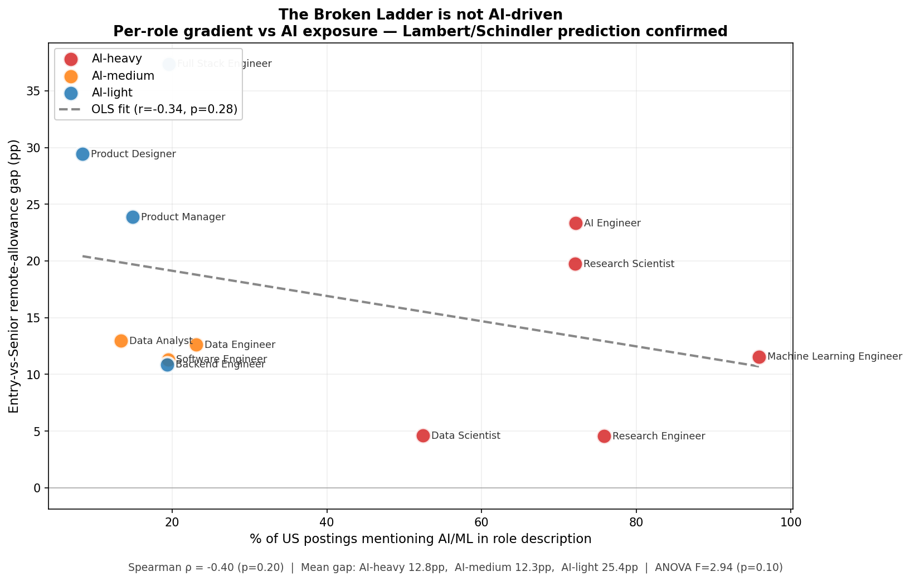
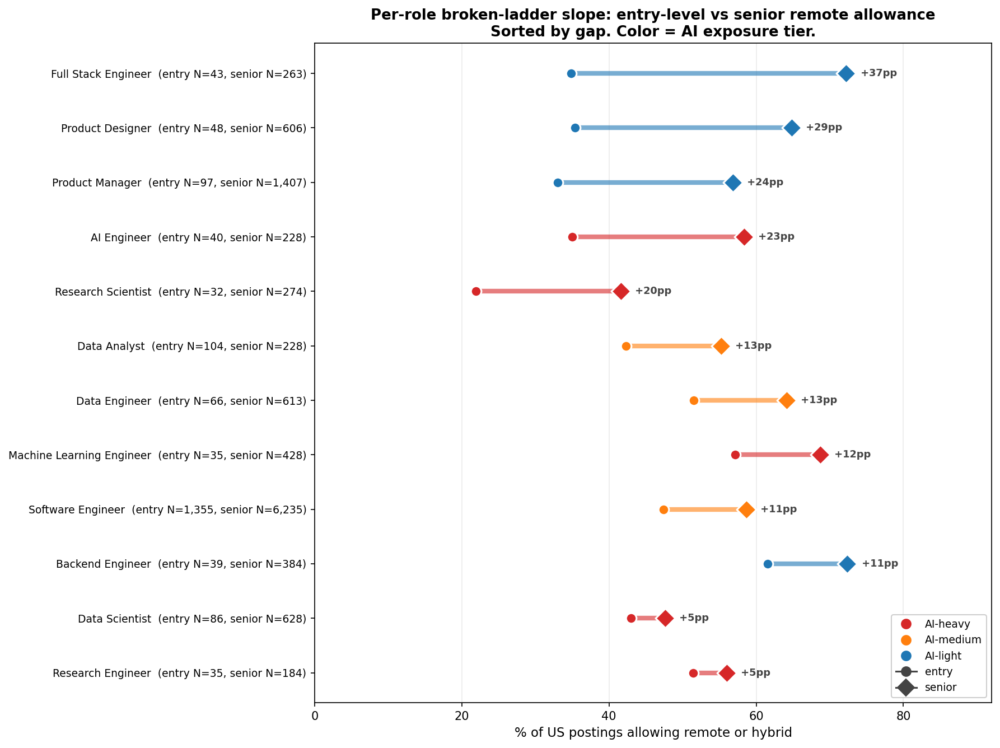
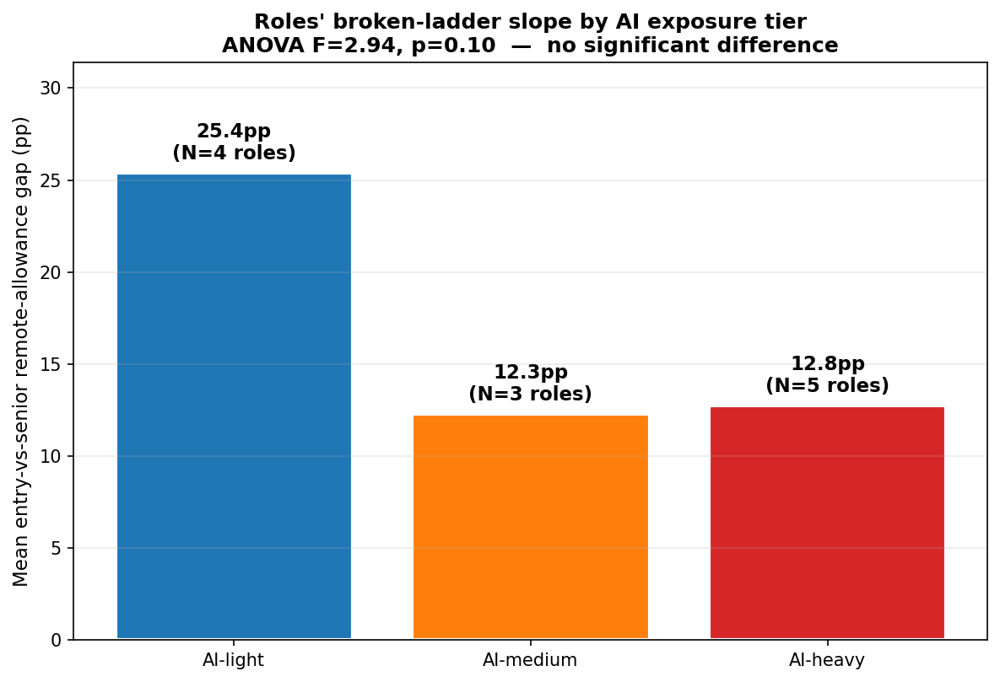

# It's not AI — the broken ladder shows up in non-AI roles

**Date:** 2026-06-02
**Author:** Skillenai AI Analyst
**Source:** Skillenai jobs index (`prod-enriched-jobs`), US tech postings ingested March–May 2026.
**Companion analysis:** [`remote-by-seniority/`](../remote-by-seniority/) (2026-06-01) established the
overall intern → staff remote-allowance gradient.

## TL;DR

A working paper out of the London School of Economics — "The Broken Ladder"
(Lambert & Schindler, 2026) — analyzed **243 million** new-hire records and
407 million job postings across the US, UK, Canada, and Australia and reached
a sharp conclusion: when AI exposure and work-from-home exposure are both
modeled, **the AI coefficient on the entry-level hiring decline attenuates
sharply and is often statistically indistinguishable from zero.** The
mechanism, as they put it: WFH raises the cost of supervising and developing
junior workers, so firms shift hiring toward seniors.

If that's right, the entry-vs-senior remote-allowance gap should show up in
supply-side job postings **regardless of how AI-exposed the role is.** It
should be a property of the role's supervisability, not of its AI exposure.

We tested that prediction on 12 US tech roles with enough data for a clean
entry-vs-senior contrast. The result:

- **AI-heavy roles do not have wider broken-ladder gaps than AI-light roles.
  If anything, they have narrower ones** (mean 12.8pp vs 25.4pp).
- **Of the 4 roles whose gap survives Bonferroni-corrected significance,
  every one is AI-light or AI-medium** (Software Engineer, Full Stack
  Engineer, Product Manager, Product Designer). **Zero AI-heavy roles**
  show a Bonferroni-significant entry-vs-senior gap.
- The roles with the **most broken** ladders are Full Stack Engineer
  (+37pp), Product Designer (+29pp), and Product Manager (+24pp) — all
  AI-light.
- The roles with the **most open** ladders for juniors looking for remote
  work are Data Scientist (+5pp), Research Engineer (+5pp), and Machine
  Learning Engineer (+12pp) — all AI-heavy.

This is the supply-side fingerprint Lambert & Schindler's mechanism predicts.

## Why this test matters

The popular story around the entry-level hiring slump is that AI is automating
the work juniors used to do, so firms are skipping the bottom of the ladder.
That story makes a sharp testable prediction: **the broken ladder should be
worst in roles where AI is most disruptive.**

The Lambert / Schindler study makes the opposite prediction. Their story is
mechanical: remote work makes supervising juniors expensive, so firms shift
hiring toward seniors *regardless of whether the role is AI-exposed.* AI is
correlated with WFH exposure because the same occupations are remote-able,
which is why naive regressions blame AI.

Our index doesn't carry the longitudinal hire records they used, so we can't
re-run their joint regression. But we can do a different test that the
demand-side data can't: look at **today's** supply of postings, role by role,
and ask whether the broken ladder concentrates in AI-exposed roles or spreads
across all of them.

## What we measured

For each of the 12 US tech roles that have meaningful entry-level and
senior-level sample sizes, we measured:

1. **% of entry-level postings that allow remote or hybrid work**
2. **% of senior-level postings that allow remote or hybrid work**
3. **The gap (pp)** between those two — the "broken-ladder slope"
4. **AI exposure** of the role: the share of postings in that role that
   mention at least one AI/ML phrase (`machine learning`, `deep learning`,
   `neural network`, `large language model`, `LLM`, `PyTorch`, `TensorFlow`,
   `transformer model`, `generative AI`).

Roles were classified as **AI-heavy** (>50% mention rate), **AI-medium**
(15–50%), or **AI-light** (<15%), with the classification done up-front
based on role identity and validated against the data-driven mention rate
(both agreed for all 12 roles).

## The ranking

| Role | AI tier | N entry | N senior | % entry remote/hybrid | % senior | Gap (pp) | Chi² p (Bonf×12) |
|---|---|---:|---:|---:|---:|---:|---:|
| Full Stack Engineer       | light  |    43 |   263 | 34.9% | 72.2% | **+37.4** | **0.0000389** |
| Product Designer          | light  |    48 |   606 | 35.4% | 64.9% | **+29.4** | **0.00114** |
| Product Manager           | light  |    97 | 1,407 | 33.0% | 56.9% | **+23.9** | **0.0000948** |
| AI Engineer               | heavy  |    40 |   228 | 35.0% | 58.3% | +23.3 | 0.125 |
| Research Scientist        | heavy  |    32 |   274 | 21.9% | 41.6% | +19.7 | 0.587 |
| Data Analyst              | medium |   104 |   228 | 42.3% | 55.3% | +13.0 | 0.459 |
| Data Engineer             | medium |    66 |   613 | 51.5% | 64.1% | +12.6 | 0.724 |
| Machine Learning Engineer | heavy  |    35 |   428 | 57.1% | 68.7% | +11.5 | 1.000 |
| Software Engineer         | medium | 1,355 | 6,235 | 47.4% | 58.7% | **+11.3** | **<0.0001** |
| Backend Engineer          | light  |    39 |   384 | 61.5% | 72.4% | +10.9 | 1.000 |
| Data Scientist            | heavy  |    86 |   628 | 43.0% | 47.6% | +4.6  | 1.000 |
| Research Engineer         | heavy  |    35 |   184 | 51.4% | 56.0% | +4.5  | 1.000 |

Bold = significant under Bonferroni correction for 12 tests at α=0.05.

Two things jump out:

- **Every Bonferroni-significant role is AI-light or AI-medium.** Not a
  single AI-heavy role's entry-vs-senior gap is robust enough to survive
  correction. This holds even though some of the AI-heavy roles
  (MLE, Data Scientist) have larger entry-level samples than the
  significant AI-light roles.
- The single largest gap belongs to **Full Stack Engineer** — one of the
  archetypal "AI-can-write-it" roles in the popular discourse — but it
  bites at the seniority gap, not at AI exposure. Entry-level FSE
  postings are only 35% remote/hybrid; senior FSE postings are 72%.

## The aggregate test

Pooling roles by AI exposure tier:

- **AI-light** roles (n=4): mean entry-vs-senior gap = **25.4 pp**
- **AI-medium** roles (n=3): mean gap = **12.3 pp**
- **AI-heavy** roles (n=5): mean gap = **12.8 pp**

A one-way ANOVA on the three tiers gives F = 2.94, p = 0.10 — not
significant at the conventional threshold with n=12 roles. The
non-parametric Spearman correlation between continuous AI-mention-share
and the gap is **ρ = −0.40, p = 0.20** — directionally negative (AI-heavier
roles have *smaller* gaps), but underpowered.

The defensible claim from the aggregate test is the **null result**: we
cannot reject the hypothesis that the gap is independent of AI exposure.
That null result is exactly what Lambert & Schindler's causal claim
predicts.

## What this means

**For the AI-jobs narrative.** A natural-sounding "AI is taking entry-level
jobs" story would predict the broken ladder to be steepest in
AI-disrupted roles. It isn't. AI-heavy roles like Data Scientist (+5pp)
and Research Engineer (+5pp) have some of the *flattest* slopes in the
sample.

**For new graduates targeting tech roles.** If you want a remote-friendly
entry-level role, the AI-adjacent roles are surprisingly more open than
the cross-functional / product / full-stack roles. Data Scientist, MLE,
and Backend Engineer postings at entry level allow remote or hybrid at
57–62%; Product Designer, Product Manager, and Full Stack Engineer
entry-level postings drop to 33–35%. The roles that look the most
"automatable" are not the ones with the worst entry-level posting
conditions.

**For employers.** The shape of these gradients suggests the binding
constraint is not skill scarcity but *supervisability*. Entry-level
postings in roles that lean heavily on cross-functional collaboration
(product, design, full-stack ownership) are far more often onsite, while
entry-level postings in more individually-measurable IC work (data
science, research engineering, backend) are more remote-friendly even
for juniors.

## Limits

- **n = 12 roles**, which limits power for the aggregate cross-role tests
  (ANOVA p = 0.10, Spearman p = 0.20). The headline claim here is the
  **null** — gap does not concentrate in AI roles — not a positive
  correlation.
- **Entry-level samples are thin in some AI roles** (AI Engineer N=40,
  Research Scientist N=32, MLE N=35, Research Engineer N=35). This both
  widens the per-role CIs and is itself a symptom of the broken-ladder
  pattern: fewer entry-level postings exist for these roles in the first
  place.
- **AI exposure is measured via posting-text mention prevalence**, not
  actual AI work intensity. A role where every posting mentions
  "PyTorch" is treated as AI-heavy even if half the workload is data
  engineering.
- **We see postings, not hires.** Our supply-side fingerprint is consistent
  with Lambert & Schindler's hire-record finding, but doesn't replicate
  their longitudinal analysis.
- **Our index begins well after 2020**, so we can corroborate the
  cross-section but not their pre-vs-post-pandemic trend.

## Methodology

- **Index:** `prod-enriched-jobs`, filtered to `locationCountry = "US"`,
  `workModel ∈ {onsite, hybrid, remote}`, `seniorityLevel ∈ {entry, senior}`
  (other levels included in companion analysis; this analysis focuses on
  the entry-vs-senior contrast that maps most directly to the
  Lambert/Schindler "entry-level hiring decline" framing).
- **Employer exclusion:** Speechify (carpet-bomber), per the standard
  Skillenai filter.
- **Role universe:** 12 IC tech roles with N ≥ 250 in the US filtered
  universe AND entry-level N ≥ 30 AND senior-level N ≥ 50. Title-tagged
  seniority variants ("Staff X", "Principal X", "Senior X") excluded —
  those duplicate the `seniorityLevel` signal at the title level.
- **AI exposure:** for each role, the share of postings whose
  `extractedText` matches at least one of: `machine learning`,
  `deep learning`, `neural network`, `large language model`, `LLM`,
  `PyTorch`, `TensorFlow`, `transformer model`, `generative AI`.
- **Per-role significance:** chi-square test of independence on the 2×2
  table (entry vs senior × onsite vs any-remote), with Bonferroni
  correction for 12 tests (α = 0.05).
- **Cross-role significance:** one-way ANOVA on the entry-vs-senior gap
  by AI exposure tier (heavy / medium / light); Spearman and Pearson
  correlation between continuous AI-mention share and gap (pp).
- **Counts** use `companyCanonicalName.keyword` to deduplicate ATS slug
  case variants.
- The full pipeline is in [`analysis.py`](analysis.py) and re-runs
  end-to-end given `SKILLENAI_INSIGHTS_API_KEY`.

## Files

- `analysis.py` — data fetch + statistics + figure rendering pipeline.
- `per_role_seniority_workmode.csv` — raw counts (role × seniority × workmode).
- `broken_ladder_by_role.csv` — entry vs senior remote allowance per role with Wilson CIs.
- `ai_exposure_by_role.csv` — per-role AI mention share and tier.
- `per_role_chi2.csv` — chi-square test per role with Bonferroni-corrected p.
- `broken_ladder_with_ai.csv` — merged dataset used for cross-role tests.
- `ai_correlation_test.json` — Spearman, Pearson, and ANOVA results.
- `01_gap_vs_ai_exposure.png` — scatter of per-role gap vs AI mention share.
- `02_broken_ladder_ranking.png` — ranked per-role entry-vs-senior gap.
- `03_mean_gap_by_tier.png` — mean gap by AI exposure tier.
- `linkedin-post.md` — distribution copy for LinkedIn (with model score notes).

## Coverage

This analysis was triggered by two articles published 2026-06-02:

- ["Remote Jobs Are Increasingly Going to Experienced Workers, Leaving New Graduates Behind"](https://allwork.space/2026/06/remote-jobs-are-increasingly-going-to-experienced-workers-leaving-new-graduates-behind/)
  (allwork.space — coverage of the NY Fed working paper)
- ["WFH is a bigger threat to entry-level jobs than AI, research finds"](https://news.outsourceaccelerator.com/wfh-threat-entry-level-jobs/)
  (news.outsourceaccelerator.com — coverage of Lambert & Schindler, "The Broken Ladder")
