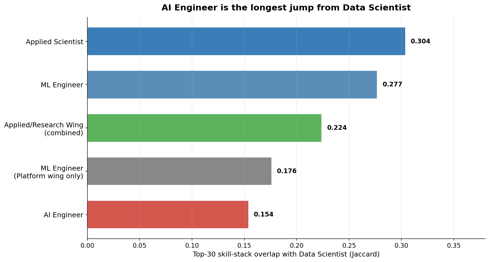
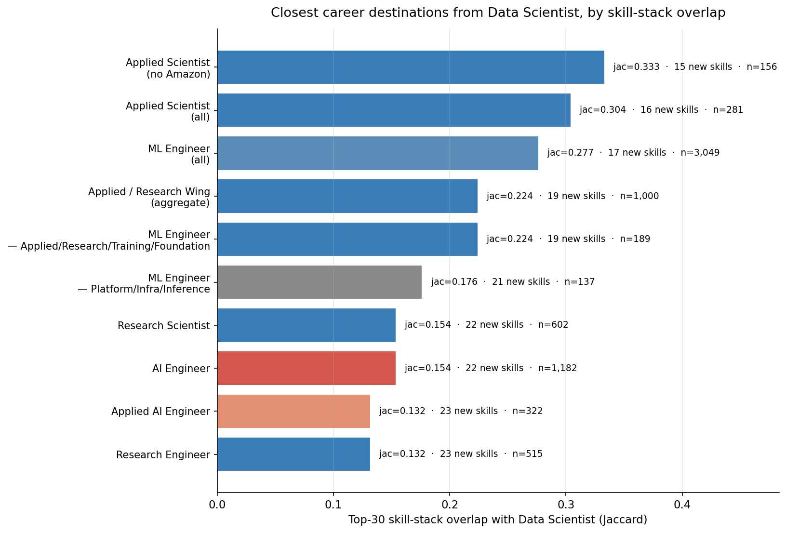
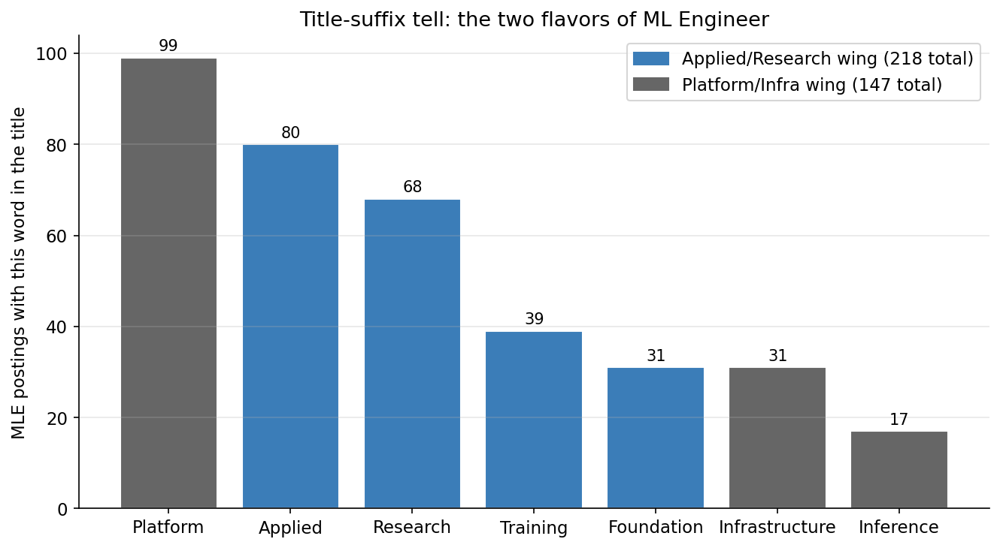
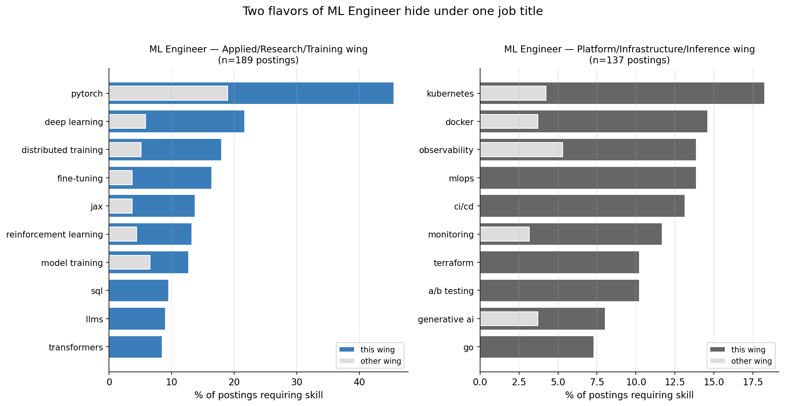
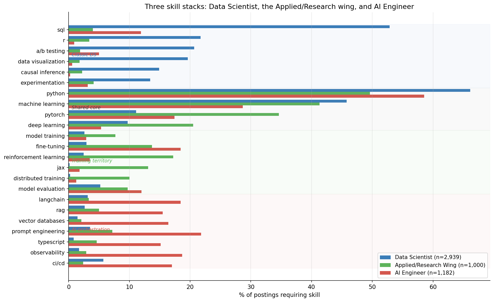

# Where Data Scientists Actually Go Next: The Skill-Overlap Map

**Date:** 2026-05-04
**Source:** Skillenai Data Products API — `/v1/analytics/skills-by-role` and `/v1/query/search` against `prod-enriched-jobs`
**Method:** Cross-sectional skill-stack overlap (no time-series component — see methodology)

---

## TL;DR

The narrative around career mobility in ML/AI roles has fixed on one transition: Data Scientist → AI Engineer. Measured by skill-stack overlap, that's the *longest* jump on the board. The shortest jumps from Data Scientist are into **Applied Scientist** and **ML Engineer** — roles centered on training models, not orchestrating LLMs.

There's a finer story underneath: ML Engineer postings split into two visibly different jobs hiding under one title. One wing is dominated by PyTorch, distributed training, JAX, fine-tuning. The other is dominated by Kubernetes, Docker, Terraform, observability. Only the first wing is a natural Data Scientist destination.

---

## Dataset and scope

| Bucket | Postings | Notes |
|---|---:|---|
| Data Scientist | 2,939 | Anchor role |
| ML Engineer (all aliases) | 3,049 | "ML Engineer" + "Machine Learning Engineer" |
| AI Engineer (all aliases) | 1,182 | "AI Engineer" + "Artificial Intelligence Engineer" |
| Applied Scientist | 281 | Heavy Amazon presence (44%) — see robustness check |
| Applied Scientist (no Amazon) | 156 | Robustness slice |
| Research Scientist | 602 | Frontier labs + research orgs |
| Research Engineer | 515 | Often paired with Research Scientist |
| Applied AI Engineer | 322 | Newer title, mostly LLM-product flavored |
| Applied / Research Wing (aggregate) | 1,000 | Sum of Applied Scientist + Research Scientist + Research Engineer + Applied AI Engineer + Applied ML Engineer |

Skills are derived from each posting's resolved entities (`entities[].label = "SKILL"`) and lowercased canonical names.

A note on what's *not* in this dataset: Big Tech employers using proprietary ATS platforms (Google, Apple, Microsoft, Netflix, NVIDIA) are sparsely represented. Findings should be read as the addressable market visible through standard ATS scrapes.

---

## Method: skill-stack overlap

For each pair (Data Scientist, target role), we take the top-30 skills (≥5% of postings) and compute:

- **Jaccard overlap** — `|A ∩ B| / |A ∪ B|`. Symmetric measure of stack similarity.
- **Weighted overlap** — `Σ min(share_A(k), share_B(k))` over the union. Penalizes shared skills that are far more prevalent in one role than the other.
- **Skills to learn** — skills in the target's top-30 that are not in DS's top-30.

Higher Jaccard / weighted = closer destination. Higher "skills to learn" = larger upskill gap.

---

## Finding 1 — AI Engineer is the longest jump from Data Scientist

| Target role | n | Jaccard | Weighted overlap | Skills to learn |
|---|---:|---:|---:|---:|
| Applied Scientist (no Amazon) | 156 | **0.333** | 3.08 | 15 |
| Applied Scientist (all) | 281 | 0.304 | **3.54** | 16 |
| ML Engineer | 3,049 | 0.277 | 3.25 | 17 |
| Applied / Research Wing | 1,000 | 0.224 | 2.46 | 19 |
| ML Engineer — Applied/Research/Training/Foundation wing | 189 | 0.224 | 2.17 | 19 |
| ML Engineer — Platform/Infrastructure/Inference wing | 137 | 0.176 | 2.14 | 21 |
| AI Engineer | 1,182 | **0.154** | 2.77 | 22 |
| Research Scientist | 602 | 0.154 | 2.19 | — |
| Applied AI Engineer | 322 | 0.132 | 2.76 | 23 |
| Research Engineer | 515 | 0.132 | 2.19 | 23 |

The order is consistent across both metrics: the destinations clustered around training models — Applied Scientist, ML Engineer, the broader Applied/Research wing — share a much larger skill core with Data Scientist than the LLM-orchestration roles (AI Engineer, Applied AI Engineer).

**Robustness check.** Applied Scientist is 44% Amazon postings (123 of 281). Removing Amazon does not flip the finding — Jaccard actually rises to 0.333 (Amazon dilutes the role with C++/Java specifics that aren't in DS's top-30). The closest single role to Data Scientist by Jaccard overlap is non-Amazon Applied Scientist.

---

## Finding 2 — The two flavors of "ML Engineer"

ML Engineer postings split, visibly in the title. Recruiters tag the team:

- **Applied / Research / Training / Foundation** suffixes: 218 postings
- **Platform / Infrastructure / Inference** suffixes: 147 postings

Pulling the skill profile separately for each wing:

| Skill | Applied/Research wing (n=189) | Platform/Infra wing (n=137) |
|---|---:|---:|
| machine learning | 54.5% | 46.7% |
| python | 42.3% | 34.3% |
| pytorch | **45.5%** | 19.0% |
| deep learning | **21.7%** | — |
| distributed training | **18.0%** | — |
| fine-tuning | **16.4%** | — |
| jax | **13.8%** | — |
| reinforcement learning | **13.2%** | — |
| transformers | 8.5% | — |
| foundation models | 7.4% | — |
| kubernetes | — | **18.2%** |
| docker | — | **14.6%** |
| observability | — | **13.9%** |
| mlops | — | **13.9%** |
| ci/cd | — | **13.1%** |
| terraform | — | **10.2%** |
| go | — | **7.3%** |
| model serving | — | **6.6%** |

These are different jobs. The Applied wing trains models; the Platform wing operates them. Within ML Engineer, the Applied wing's Jaccard overlap with Data Scientist (0.224) is meaningfully higher than the Platform wing's (0.176).

This bifurcation is observable today, cross-sectionally. We don't have a clean time-series — `ingestedAt` covers only crawler runtime and includes a backfill spike — so we can't directly say *which* wing came first. A reasonable hypothesis is that Platform/Infra ML Engineer is the older shape (the engineering-flavored ML role of the late 2010s) and that the Applied/Research wing is the newer shape, picking up the training work that used to be done by senior Data Scientists. The data is *consistent with* that direction without confirming it.

---

## Finding 3 — Three skill stacks, three jobs

Reading across the same skill list for Data Scientist, the Applied/Research wing aggregate, and AI Engineer:

Three regions of the chart:

1. **Classic Data Scientist territory** — SQL (53%), R (22%), A/B testing (21%), causal inference (15%), experimentation (13%). The Applied/Research wing carries some of this (Research Engineer in particular shows experimentation, evaluation), but AI Engineer barely touches it.
2. **Shared technical core** — Python, machine learning, PyTorch, AWS, data pipelines. All three roles draw from the same well; the difference is depth.
3. **Training territory** — fine-tuning, model training, reinforcement learning, JAX, distributed training. Heavy in the Applied/Research wing (and in Research Engineer postings); light in DS; light-to-moderate in AIE.
4. **AI orchestration territory** — LangChain (18%), RAG (16%), vector databases (16%), TypeScript (15%), prompt engineering (22%), observability (19%). Almost exclusively AIE — DS sees these in <4% of postings.

The map is clean: DS and AIE share a Python-and-ML core, but the *distinctive* skills of each role barely overlap. The Applied/Research wing is the one bucket that covers DS's stats heritage *and* extends into training-flavored work.

---

## What this means for a Data Scientist's next move

The labor-market data has an opinion on the popular DS → AIE narrative. The opinion is: it's a real role, it's a growing market, and it's not a natural extension of a Data Scientist's skill stack. The natural extensions are roles built around training models — Applied Scientist, the Applied/Research wing of ML Engineer, the broader Applied/Research role family.

If you are choosing what to learn next as a Data Scientist:

- **The shortest road** runs through PyTorch depth, distributed training, fine-tuning, model evaluation. That maps onto roles titled Applied Scientist, ML Engineer (Applied/Research/Foundation), Research Engineer, or — at frontier labs — Research Scientist.
- **The longest road** runs through TypeScript, LangChain, RAG, vector databases, observability. That's a real and hireable destination, but it's an LLM-application engineer's stack. Treating it as the default upgrade for a Data Scientist understates the size of the leap.
- **The bifurcated middle** — ML Engineer — is two jobs. Read the title suffix and the skill bullets carefully before applying.

---

## Caveats

- **Cross-sectional only.** This is a snapshot. We do not have clean per-quarter coverage for trend analysis. The "Platform-MLE is the older shape, Applied-MLE is the newer shape" framing is a hypothesis consistent with the cross-section, not a measurement.
- **Skill overlap measures resume portability, not interview difficulty.** A 17-skill gap to ML Engineer may take less or more wall-clock time to close than a 22-skill gap to AI Engineer, depending on which skills are easy or hard to bootstrap.
- **Title coverage is partial.** "ML Engineer" suffixes are recruiter-controlled and not every team brands its hires that way. The 22% of MLE postings with split-evidence titles is a lower bound on the bifurcation; the actual split is likely larger.
- **Big Tech employer absence.** Google, Apple, Microsoft, Netflix, NVIDIA postings are largely missing from the source index. Findings about role mix and titles should be read against that gap.
- **"Applied Scientist" is Amazon-heavy.** 44% of Applied Scientist postings come from Amazon. The robustness slice (Applied Scientist excluding Amazon, n=156) preserves the headline finding — Applied Scientist remains the closest single role to Data Scientist by Jaccard.

---

## Methodology

- Pulled top-80 skills for each role bucket via `/v1/analytics/skills-by-role` (skills are pre-resolved canonical names).
- For sub-archetype slices (ML Engineer / Applied wing, ML Engineer / Platform wing) we used direct `/v1/query/search` against `prod-enriched-jobs` filtered by `role.keyword IN [ML Engineer, Machine Learning Engineer]` AND `match_phrase` on `title` for the wing-defining tokens, then aggregated `entities[].label = "SKILL"` client-side.
- Skill names are lowercased + stripped before counting; no further canonicalization (the Skillenai resolver already merges most case/hyphen variants).
- Top-30, ≥5% threshold for overlap metrics. Lowering to top-50 / ≥3% does not change the rank order.
- Amazon robustness check uses `companyCanonicalName.keyword` exclusion of `["Amazon", "amazon"]`.

Raw aggregated data: [`role_skills.json`](role_skills.json), [`mle_split.json`](mle_split.json).
