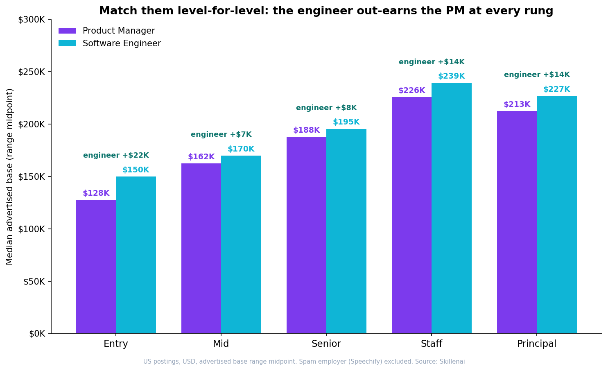
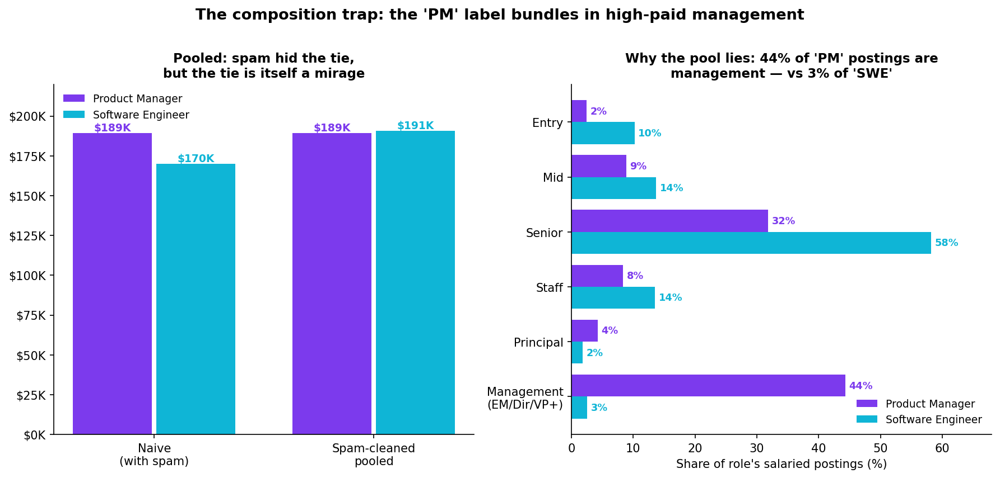
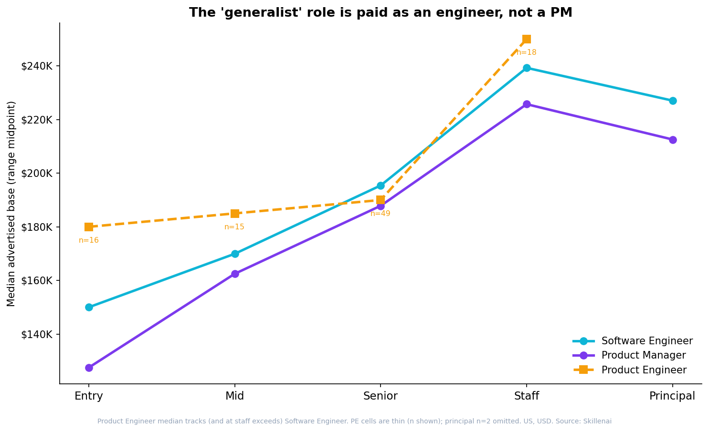

# The median PM doesn't out-earn the engineer — the median PM is just more senior

**Match a product manager and a software engineer rung-for-rung, and the engineer wins at every level of the ladder.**

- **Date**: 2026-07-10
- **Source**: Skillenai labor-market index (`prod-enriched-jobs`), US postings
- **Scope**: ~26K US "Software Engineer" + "Product Manager" postings; salary analysis on the ~8K with a structured USD range
- **Prompt**: A widely-shared Levels.fyi post argued that "the median product manager out-earns the median software engineer at almost every big tech company," with Apple, Nvidia, and Uber as the exceptions. We asked whether that holds up in the open job market — using advertised pay instead of self-reported total comp.

---

## TL;DR

The Levels.fyi claim reproduces in raw form and then evaporates under two corrections.

| Comparison (US, USD, base-range midpoint) | Product Manager | Software Engineer | Verdict |
|---|---:|---:|---|
| **Naive pooled median** | $189K | $170K | PM ahead by $19K |
| **Pooled, after removing one spam employer** | $189K | $191K | Dead heat |
| **Entry** | $128K | $150K | **Engineer +$22K** |
| **Mid** | $162K | $170K | **Engineer +$8K** |
| **Senior** | $188K | $195K | **Engineer +$8K** |
| **Staff** | $226K | $239K | **Engineer +$14K** |
| **Principal** | $213K | $227K | **Engineer +$14K** |

Two things were hiding in the pooled number:

1. **A single spam employer** was posting ~2,300 identical "Software Engineer" listings at a fixed $140K–$200K range — a quarter of all salaried SWE postings — dragging the engineer median down to exactly its boilerplate.
2. **The "Product Manager" label bundles in management.** 44% of PM postings are people-management roles (PM manager, director of product, VP), versus 3% of "Software Engineer" postings. Management pays more, so pooling inflates the PM median.

Clean both up and compare like-for-like, and the software engineer out-earns the product manager **at every rung of the individual-contributor ladder.**

---

## 1. The spam trap

Before any salary comparison, aggregate the salaried postings by employer. One name dominates the engineer bucket:

| Software Engineer — top employers (USD, salary present) | Postings |
|---|---:|
| **Speechify** | **2,301** |
| Waymo | 261 |
| Anduril (all spellings) | ~537 |
| Anthropic | 185 |
| SpaceX | 183 |

Speechify carpet-bombs the same handful of roles across hundreds of cities at an identical advertised range. It alone is **25% of salaried "Software Engineer" postings**, and its fixed $140K–$200K band pins the raw engineer median to exactly that number. It has nothing to do with the PM bucket (top PM employers are Anthropic, Adobe, Databricks, Waymo — a long, flat tail). Removing this one spam account lifts the pooled engineer median from $170K to $191K — erasing the entire naive "PM earns more" gap in a single filter.

**Lesson:** a raw median that lands on a suspiciously round number is a data-quality alarm, not a finding.

---

## 2. The composition trap

Even after the spam is gone, the pooled medians *tie* ($189K PM vs $191K SWE) — and that tie is itself misleading. The two role labels describe populations at very different points on the ladder:

| Seniority | Share of PM postings | Share of SWE postings |
|---|---:|---:|
| Entry | 2% | 10% |
| Mid | 9% | 14% |
| Senior | 32% | 58% |
| Staff | 8% | 14% |
| Principal | 4% | 2% |
| **Management (EM / Director / VP+)** | **44%** | **3%** |

Almost half of everything labelled "Product Manager" is actually a management job — and management pays a premium. "Software Engineer," by contrast, is 96% individual contributors. So when you pool each role across its own seniority distribution, the PM median is lifted by its heavy management tail while the SWE median reflects a mostly-IC population. The pooled "tie" is a composition artifact, not a like-for-like fact.

Fix it by comparing the same rung to the same rung (top chart). The engineer is ahead at entry (+$22K), mid (+$8K), senior (+$8K), staff (+$14K), and principal (+$14K). The advantage is modest but perfectly consistent in sign.

### Is the per-level gap real?

At the senior level — the largest cell (407 PM vs 1,500 sampled SWE) — the engineer median leads by **$8,750**. A Mann-Whitney U test rejects equality decisively (p ≈ 1.7 × 10⁻⁶), and a 2,000-draw bootstrap puts the 95% confidence interval on the median difference at **[+$5.3K, +$14K]** — entirely above zero. The effect size is small (rank-biserial ≈ 0.15; the distributions overlap heavily), which is the honest read: engineers don't dominate PMs at a given level, they edge them out — consistently.

---

## 3. The "generalist" role is paid as an engineer

The Levels.fyi piece also argues that roles are generalizing — "product engineer, design engineer… the people who can wear more than one hat are becoming more valuable." If that hybrid really were half-product, you'd expect its pay to sit between PM and SWE. It doesn't. **Product Engineer tracks the engineering ladder** at every level we can measure, and at staff it *exceeds* it ($250K vs $239K). Its entry rung ($180K) sits well above the entry engineer, consistent with Product Engineer being a selective, senior-leaning software title rather than a generalist on-ramp. (Product Engineer cells are thin — sample sizes shown on the chart; the principal cell, n=2, is omitted.)

This lines up with a [prior Skillenai analysis](https://github.com/skillenai/skillenai-notebooks/tree/master/product-engineer-myth) that measured the *skills* side of the same claim: Product Manager and Software Engineer share only **2 skills** in their top-50 (Jaccard 0.04), so there is no meaningful "PM ∩ SWE" region for a hybrid to occupy — and Product Engineer's distinctive skills turn out to be modern web and AI tooling (Next.js, LLMs, FastAPI), not borrowed PM responsibilities. Same conclusion from two independent angles: the market's "generalist" is an engineer, and it pays like one.

---

## What this means for your career

- **If you're an IC choosing between the tracks for money alone:** at the same level, engineering pays a small, consistent premium over product management in advertised base. The popular "PMs earn more" belief comes from comparing a management-heavy PM pool against an IC-heavy engineer pool.
- **If you're a PM:** the pay ceiling is real, but it runs through *management*. Nearly half of PM demand is for people-managers, and that's where the premium concentrates.
- **If you're eyeing "product engineer" as a softer, more generalist path into (or out of) engineering:** it isn't. It's a senior-leaning software role that pays like — or above — a straight engineer.

---

## Methodology & caveats

- **Roles**: exact `role.keyword` match on `"Software Engineer"`, `"Product Manager"`, `"Product Engineer"`. These labels are entity-resolved and cleanly separated (e.g. "Product Manager" does not collide with "Program Manager" / "Technical Program Manager").
- **Geography / currency**: US postings only (`locationCountry: "US"`), `salaryCurrency: "USD"`, with both `salaryMin` and `salaryMax` present. Salary uses the **range midpoint** `(min+max)/2` per posting.
- **Seniority**: the index's inferred `seniorityLevel` field (~76% coverage). IC ladder = entry / mid / senior / staff / principal; management = manager / director / vp / c-level (and the noisy "lead" grab-bag). Intern excluded.
- **Spam filter**: one carpet-bombing employer (and one known job-aggregator) excluded from all salary figures; it was 25% of the salaried engineer bucket.
- **Statistics**: Mann-Whitney U for the level-matched comparison; 2,000-draw bootstrap for the 95% CI on the median difference.
- **This is advertised base pay, not total compensation.** Levels.fyi reports self-reported total comp (base + equity + bonus); this analysis sees only the advertised base range. At senior levels equity is a large share of engineer comp, so if anything a total-comp view would *widen* the per-level engineer advantage, not close it.
- **Big Tech is largely absent.** Meta, Google, Apple, Nvidia, and Netflix post through proprietary systems this index doesn't crawl, so we **cannot** reproduce the per-company table from the Levels.fyi post and make no claim about any specific company. This is a read on the broad open market, offered as a complement to — not a contradiction of — their company-level numbers. Notably, the Levels.fyi author's own aside ("PMs tend to be slightly more senior") is exactly the effect that, measured here, fully accounts for the pooled gap.
- Raw per-posting salary pulls are available on request; only summary statistics and charts are committed here.
