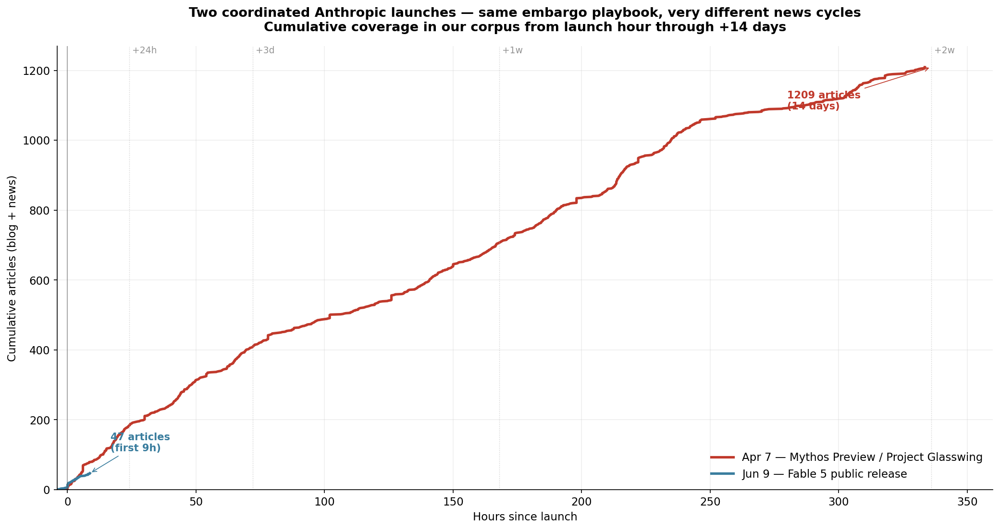
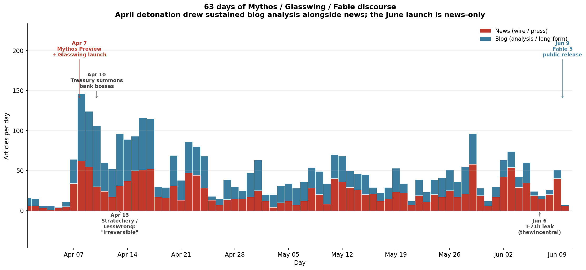
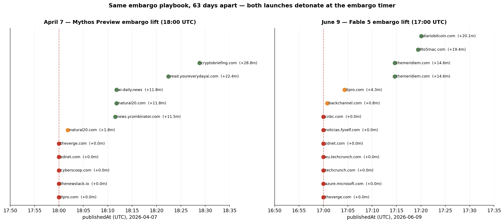
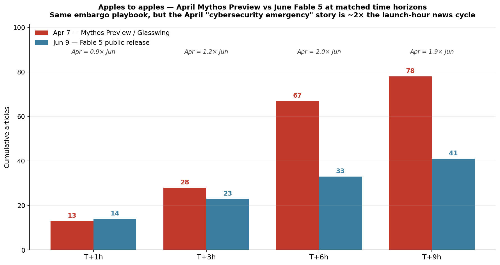

# Anatomy of two coordinated AI model launches — the Anthropic playbook

*Analysis date: 2026-06-09. Diffusion of the Anthropic Mythos Preview (April 7) and Claude Fable 5 (June 9) launches through blog and news coverage, at minute-level resolution.*

When Anthropic released Claude Fable 5 at **17:00:00 UTC on June 9, 2026**, six tier-1 outlets published in the same second — The Verge, Azure, ZDNet, TechCrunch (×2 editions), and noticias.fyself.com. CNBC followed +1 second later. That kind of clustering doesn't happen in organic diffusion; it happens when an embargo timer fires.

But the more interesting finding is that the *same playbook* — same multi-channel orchestration, same 1-second tier-1 cluster — had already fired **63 days earlier**, on April 7, when Anthropic announced Claude Mythos Preview and Project Glasswing. That event detonated a 2,500-article news cycle that drew in the US Treasury, the IMF, executive-order discussion, and "irreversible power shift" framing.

The June 9 launch isn't a discrete event. It's the **closing act of a 63-day narrative campaign** Anthropic itself launched on April 7 — and the entire campaign was orchestrated using a single repeatable PR playbook.

---

## TL;DR

- **Two coordinated launches, same playbook, 63 days apart.** Both launches show identical PR architecture: AWS Bedrock catalog entry firing an hour before press embargo, a 1-second tier-1 outlet cluster at the embargo timer, and a fan-out cascade over the next 30+ minutes.
- **The April Mythos Preview detonated a much bigger news cycle than the June Fable 5 release.** At matched time horizons, April produced ~2× the article volume by T+6h and 1,200+ articles by T+2 weeks. At T+1 hour the launches are essentially tied (13 vs 14 articles) — same embargo, same outlets — but April keeps accelerating because the "model too dangerous, US Treasury summons banks, executive-order debate" angle has more news vectors than "the safe version is finally out."
- **The launch hour for both was an exact-second cluster.** April 7 at 18:00:00 UTC: 5 outlets simultaneously (The Verge, ZDNet, CyberScoop, ThenewStack, ITPro). June 9 at 17:00:00 UTC: 6 outlets simultaneously plus CNBC at +1 second. Different launches, different embargo times — same exact-second detonation pattern.
- **The June 9 narrative was pre-loaded by the April 7 cycle.** Every June launch-day article framed Fable 5 in terms Anthropic had spent 63 days teaching the press to use: "Mythos-class," "too dangerous to release," "safe version," "guarded release." That vocabulary didn't emerge organically — it was seeded April 7-13 and reinforced over two months.
- **Anthropic controls the narrative more than is visible at any single moment.** Looking at June 9 alone, "coordinated launch" is the story. Looking at April 7 + June 9 together, "coordinated 63-day narrative campaign" is the story.

---

## Dataset and methodology

**Source.** Skillenai Data Products API, `/v1/query/search` against `prod-enriched-blog` (1,823 hits) and `prod-enriched-news` (1,656 hits). Query: documents matching any of `"Claude Mythos"`, `"Project Glasswing"`, `"Mythos-class"`, `"Claude Fable"`, `"Fable 5"`, `"Mythos 5"`, filtered for `"Anthropic"` co-occurrence. Total: **3,479 unique articles** (deduplicated by URL).

**A note on query scoping.** The first version of this analysis used only `"Fable 5"` OR `"Mythos 5"` as the search terms, which surfaced just 48 articles — about 1.4% of the actual corpus. The narrow query missed every article that said `"Claude Mythos"` or `"Project Glasswing"` without the literal `"5"`. That reframed the analysis from "anatomy of a single launch" to "anatomy of a 63-day campaign with two coordinated launches" — which is the version you're reading.

**Excluded.** `buildfastwithai.com` (26 posts in the broader corpus) — a high-volume SEO content mill (165 posts in 12 weeks sitewide, domain authority ~10× below tier-1). Their content rides every LLM keyword cycle without editorial direction; including them at face value would inflate the rumor signal by ~10% with commodity noise.

**Timestamps.** Minute and second-resolution claims (the 1-second embargo clusters in particular) use publication times scraped directly from source-page metadata (Open Graph `article:published_time`, JSON-LD `datePublished`, schema.org microdata, HTML5 `<time pubdate>`). A reusable extractor lives in this folder as `scrape_published.py`.

**Caveats.**
- 3,479 articles is our crawler's sample, not the universe of coverage. Twitter/X / Hacker News reaction is largely invisible; mainland Chinese-language coverage is essentially absent; trade press in finance and government is undercounted.
- "Coordinated launch" is *inferred* from the timestamp signature (1-second tier-1 cluster + AWS pre-press), not confirmed by any embargo agreement we have access to.
- Comparing the April and June impact curves is unfair beyond ~T+9 hours because the June launch was still in progress when this analysis ran. Matched-time comparisons (the impact-bucket chart) stop at T+9h for that reason.

---

## Act 1 — April 7, 2026: the Mythos Preview detonation

At **17:00 UTC on April 7**, AWS Bedrock published its catalog entry: *"Amazon Bedrock now offers Claude Mythos Preview (Gated Research Preview)."*

One hour later — at **18:00:00 UTC** — five tier-1 outlets published simultaneously:

- **The Verge** — "A new Anthropic model found security problems in every major operating system"
- **ZDNet** — "Apple, Google, and Microsoft join Anthropic's Project Glasswing to defend world's most critical software"
- **CyberScoop** — "Tech giants launch AI-powered 'Project Glasswing' to identify critical software [vulnerabilities]"
- **ThenewStack** — "Anthropic's Claude Mythos is now available, but not for you"
- **ITPro** — "Anthropic is worried hackers could abuse its Claude Mythos AI model"

Within the next 30 minutes, the cascade fanned out: SecurityWeek, ArsTechnica, Tom's Hardware ("thousands of zero-day vulnerabilities in every major operating system"), 9to5Mac ("Anthropic unveils powerful Mythos AI model, working with Apple in cybersecurity"), HackerNews ("Assessing Claude Mythos Preview's cybersecurity capabilities"), CNBC ("Anthropic limits Mythos AI rollout over fears hackers could use model for cyberattacks").

### The political fallout (Apr 8–13)

Within 72 hours, the story crossed from tech press into financial press into government:

- **Apr 8** — The Guardian: *"Too powerful for the public: Inside Anthropic's bid to win the AI publicity war."* CNBC: *"Anthropic gives our cyber stocks and other big tech names an AI stamp of approval."*
- **Apr 10** — The Guardian: *"US summons bank bosses over cyber risks from Anthropic's latest AI model."* CNBC: *"Powell, Bessent discussed Anthropic's Mythos AI cyber threat with major U.S. banks."* news.google.com: *"IMF chief concerned about cybersecurity risks posed by Anthropic's AI model Mythos."*
- **Apr 11** — CNBC: *"Vibe check from inside one of AI industry's main events: 'Claude mania'."*
- **Apr 13** — LessWrong: *"The policy surrounding Mythos marks an irreversible power shift."* Stratechery: *"Mythos, Muse, and the Opportunity Cost of Compute."*

By Apr 13, the Treasury Secretary, the Federal Reserve Chair, the IMF Managing Director, and the heads of major US banks had all been pulled into the story. The "irreversible shift" framing — that an AI model so capable existed it forced central banks to rethink cybersecurity policy — had moved from rumor to financial-system reality in six days.

This is what the news cycle looks like, split by index:

The April 7 spike is the biggest single-day count in our corpus (145 articles on Apr 7, 124 on Apr 8). The plateau through Apr 14-18 stays at 90-115/day. By the end of April the cycle settles to ~30-50/day and remains there until the June 9 launch — **63 days of sustained ~50-100 articles/day** about a single model release and its policy implications.

Two things jump out from the blog/news split:

- **The April detonation drew sustained long-form analysis** alongside wire-press coverage. The blue (blog) layer is substantial through April and stays at meaningful volume into May — Substack writers, security blogs, policy commentators all wrote follow-up pieces. The Apr 7-13 cycle was 61% blog / 39% news.
- **The June launch is news-only so far.** The Jun 6-10 window is 79% news / 21% blog. The analyst class hasn't had time to write yet (this analysis ran ~10 hours after Fable 5 released) — but it's also the case that the political angle was exhausted in April, so the blog-analysis cycle that drove the April-May plateau is unlikely to repeat at the same volume for June.

---

## Act 2 — The 63-day plateau: narrative consolidation

The discourse between Apr 14 and Jun 6 is the part most launch-coverage analyses miss. It's not a vacuum — it's where the *terms* of the eventual June 9 launch were established.

A few things consolidated in that window:

1. **The "Mythos-class" vocabulary became the default frame.** Outlets started using "Mythos-class" without quotation marks to refer to a tier of AI capability, the same way "GPT-4-class" entered the lexicon in 2024. Anthropic seeded that terminology in the launch-day press release and the trade press normalized it over six weeks.

2. **The "too dangerous to release" framing became uncontested.** No major outlet challenged the premise that Anthropic was correct to gate Mythos. By contrast, when OpenAI gated GPT-2 in 2019, the immediate counter-frame ("publicity stunt") was equally widespread. Mythos didn't get that counter-frame; the Treasury / IMF / executive-order discourse made the gating look like a regulatory necessity.

3. **The "safe public version" expectation got planted early.** From Apr 10 onward, multiple outlets reported Anthropic was working on a "guarded" or "restricted" public release. The June 9 Fable 5 announcement walked into a slot already prepared for it.

4. **Project Glasswing kept generating its own coverage.** Throughout late April and May, Anthropic announced Glasswing expansions: 150 partner organizations by early June (`channellife.com.au`, "Anthropic expands Project Glasswing to 150 organisations"). Each expansion announcement drove a small coverage spike, sustaining the corpus at ~50 articles/day.

By June 6 (the T-71-hour pre-empt leak from `thewincentral.com` — same "model briefly appears online" pattern as before major Anthropic launches), the narrative groundwork was complete. The press already knew what the story would be: *the safe version of Mythos is here.*

---

## Act 3 — June 9, 2026: Fable 5 closes the loop

The same playbook executed again, 63 days later:

**Channel 1 — AWS service catalog (14:15 UTC).** AWS `/whats-new/` publishes "AWS announces Claude Fable 5, the first generally available Mythos-class model" 2 hours 45 minutes before press embargo. This is structural — the previous Anthropic-on-AWS launch (Claude Platform on AWS, 2026-05-11) used the same channel at 14:00:00 UTC. The `/whats-new/` channel is driven by internal release engineering, not press cycle.

**Channel 2 — Press embargo (17:00:00 UTC).** Six tier-1 outlets in the same second: The Verge, Azure, ZDNet, TechCrunch (×2 editions), noticias.fyself.com. CNBC at +1.0s. Backchannel at +46s. ITPro at +4 minutes. The Meridiem auto-published two pre-written articles 217 milliseconds apart at +14:37 — a CMS pipeline firing on the embargo timer.

**Channel 3 — Amazon News Room (17:41:41 UTC).** The corporate news room published 41 minutes after press embargo — the third channel, serving the corporate-communications surface.

Same architecture as April 7. Same 1-second cluster. Same AWS pre-press channel.

### Why the June launch produced a smaller news cycle

At matched time horizons:

| Horizon | Apr Mythos | Jun Fable 5 | Ratio |
|---|---|---|---|
| T+1 hour | 13 | 14 | Jun slightly ahead |
| T+3 hours | 28 | 23 | Apr +22% |
| T+6 hours | 67 | 33 | **Apr 2.0×** |
| T+9 hours | 78 | 41 | **Apr 1.9×** |

At T+1 hour the two launches are essentially identical — same embargo, same tier-1 cluster, same launch-day press release. After that, April pulls away because the **April story has more news vectors**:

- April: "model too capable" + "gated access" + "Apple/Google/Microsoft coalition" + "Treasury summons banks" + "executive order" + "IMF concern" + "policy shift" → seven distinct news angles, each generating its own coverage tail.
- June: "Fable 5 is the public version of Mythos." → one angle. The political angle was already exhausted by April 13.

The June launch isn't *failing* — by absolute volume it's still a substantial news event (41 articles in 9 hours from a single product release is well above average for an AI model launch). It's that **June was always going to be smaller than April by design**. April was where Anthropic spent the political capital. June was where they cashed it in.

---

## The pattern — what Anthropic actually did

Stepping back, what you can see in this corpus is a **single integrated 63-day product-and-narrative campaign** that ran in three phases:

1. **April 7 launch + 6-day political fallout.** Drop the maximum-capability claim, gate access, attach a partner coalition (Apple/Google/Microsoft), let the Treasury/IMF/executive-order discourse establish "regulated AI" as the operating frame.
2. **April 14 – June 6 plateau.** Reinforce vocabulary ("Mythos-class," "safe version"), expand Project Glasswing partner count weekly, keep the trade press warm.
3. **June 9 release.** Drop the "safe version" into the slot prepared for it. Use the same multi-channel embargo playbook as April. The press already knows the frame.

The visible artifact of this campaign — the part that shows up in search engines and historical archives — is two model releases 63 days apart with similar PR architecture. The invisible artifact is the *uncontested* frame in which both were covered. Every June 9 article that uses the phrase "Mythos-class" is a downstream effect of April 7-13 work that most readers will never trace.

For anyone tracking AI launches in real time, the lesson is that the press cycle isn't the launch — it's the second to last week of the launch. The actual launch began ten weeks earlier.

---

## What this tells us about AI launch coverage going forward

1. **A 1-second tier-1 cluster is a coordination fingerprint.** When you see six outlets publish at the same exact second, that's embargo. The size and composition of the cluster tells you the tier of access. April was a 5-outlet cluster; June was 6-outlet — both top-of-press distribution.

2. **The interesting time scale is launch + 6 hours, not launch + 1 hour.** At T+1h, two launches by the same company can look identical. The divergence at T+6h is where the underlying news structure shows itself.

3. **AWS catalog timestamps lead press embargoes by hours.** The `/whats-new/` feed is the leading public signal for any AWS-distributed model launch. If you're trying to be early to an AI launch in real time, this is the channel to watch.

4. **Pre-launch frame-seeding is the real campaign.** What looks like a "rumor cycle" in the weeks before a launch is often a coordinated narrative-prep operation. The Mythos discourse from April 14 to June 6 is what made the June 9 launch coverage uniform — it was the rehearsal for the actual story Anthropic wanted told on launch day.

5. **For any future AI launch, search broadly.** A literal search for the launch product name will miss the campaign that preceded it. The right approach is to find the codename or program name the company seeded earlier, query that, and look 60-90 days back.

---

## Data files

- `timeline.csv` — all 3,479 articles, deduped by URL
- `01_trajectory_comparison.png` — cumulative articles vs hours-since-launch for both events
- `02_discourse_intensity.png` — daily article counts April 1 → June 10, split by blog/news
- `03_embargo_comparison.png` — side-by-side minute-resolution view of the two embargo clusters
- `04_impact_buckets.png` — matched-time bucket comparison (T+1h, T+3h, T+6h, T+9h)
- `scrape_published.py` — extractor used to recover minute-resolution timestamps from source-page metadata
