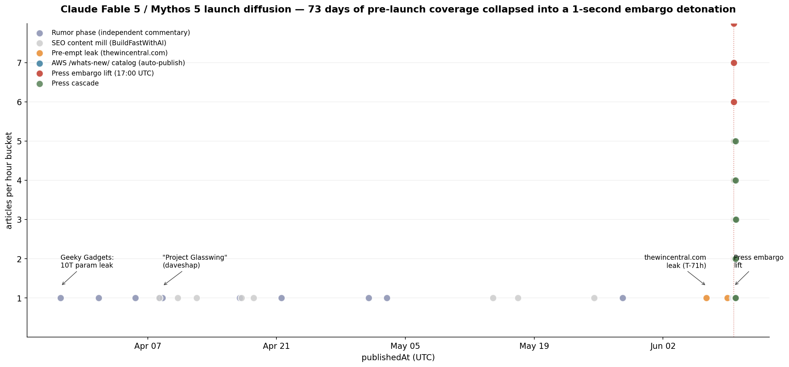
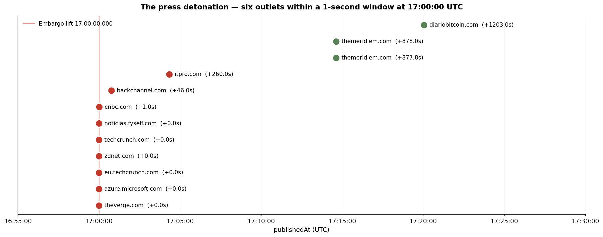
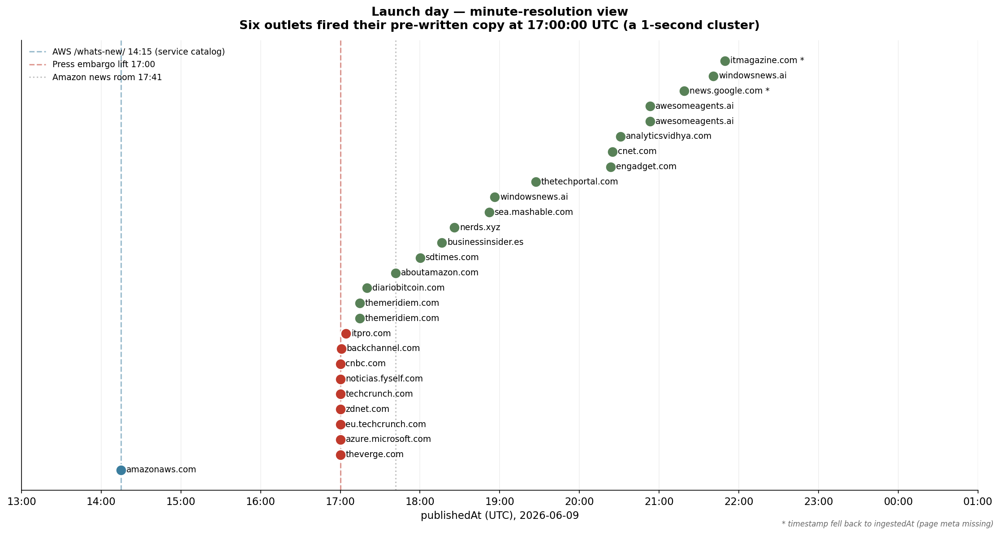
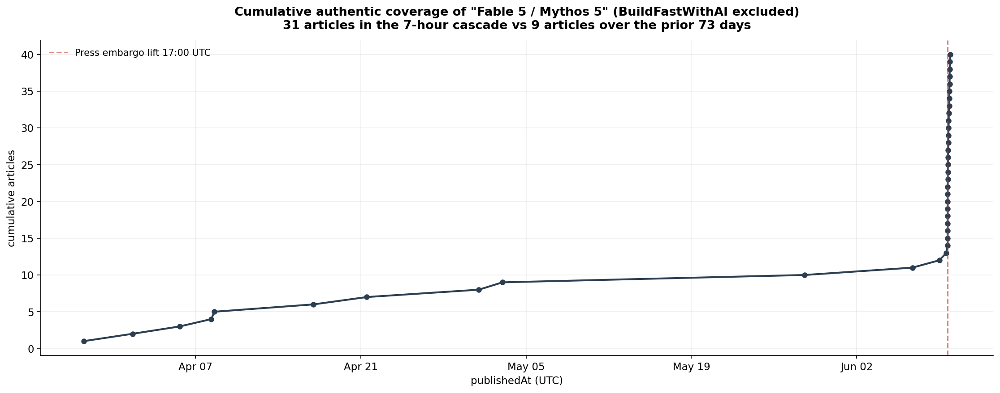

# Anatomy of a coordinated AI model launch — Claude Fable 5 / Mythos 5

*Analysis date: 2026-06-09 — diffusion of the Anthropic Claude Fable 5 / Mythos 5 launch through blog and news coverage at minute-level resolution.*

When Anthropic shipped Claude Fable 5 on **2026-06-09 at 17:00 UTC**, the model itself was the third act of a tightly choreographed PR rollout. The first act fired three hours earlier on AWS's service-catalog channel. The second act was a one-second window in which six tier-1 outlets published pre-written copy simultaneously. The third was a four-hour cascade through international press.

This is what that looks like in publication timestamps, scraped to the second.

---

## TL;DR

- **73 days** of "Mythos 5" rumor coverage preceded the launch — 17 articles total, of which **9 are independent commentary** and 8 are content-mill SEO from a single domain.
- The **press embargo lifted at exactly 2026-06-09T17:00:00 UTC**, and **six outlets published in the same second** (The Verge, Azure, ZDNet, TechCrunch, eu.techcrunch, noticias.fyself), with CNBC at +1.0 second.
- The launch ran on **three sequential channels** spaced ~3 hours apart: AWS service catalog (14:15), press embargo (17:00:00), Amazon News Room (17:41).
- The 7-hour press cascade produced **31 articles** — more than triple the entire 73-day rumor phase.
- A 71-hour pre-empt leak appeared on `thewincentral.com` at 2026-06-06 17:26 UTC, almost exactly three days before launch.

---

## Dataset and methodology

**Source:** Skillenai Data Products API, `/v1/query/search` against `prod-enriched-blog` and `prod-enriched-news`. Query: `match_phrase` on `extractedText` for `"Fable 5"` OR `"Mythos 5"`, filtered for `"Anthropic"` co-occurrence.

**Sample:** 48 articles (22 blog, 26 news, 0 scholarly, 0 social). Time span: 2026-03-28 → 2026-06-10.

**The `publishedAt` recovery problem.** The `prod-enriched-news` index has `publishedAt` populated on only 45.7% of docs index-wide (60,988 / 133,538). All 26 news articles for this analysis fell into the missing group. To get minute-level resolution we scraped the source URLs directly and extracted publication times from standard metadata patterns:

| Recovery source | Count |
|---|---|
| Original `publishedAt` from index (mostly blog) | 25 |
| Scraped from page meta (`<meta property="article:published_time">` etc.) | 18 |
| Scraped from JSON-LD `"datePublished"` (retry pass) | 3 |
| Fallback to `ingestedAt` (Google News RSS aggregator + 1 bot-blocked page) | 2 |

The two `ingestedAt` fallbacks (news.google.com, itmagazine.com) are flagged with an asterisk in the launch-hour chart and contribute to cascade counts only — not to any minute-resolution claim.

**BuildFastWithAI exclusion.** A single domain, `buildfastwithai.com`, accounts for 8 of the 17 pre-launch articles. They publish ~14 articles per week (165 total across the prior 12 weeks) with a domain authority of 3.77e-6 — roughly 10× lower than tier-1 outlets like The Verge (3.9e-5) or Azure (3.6e-5). This is a content-mill SEO operation riding the LLM keyword cycle, not editorial coverage. We exclude them from "rumor signal" counts but keep them visible in the full-timeline chart as a separate gray category for transparency.

**Caveats.**
- 48 articles is our crawler's sample, not the universe of coverage. Google's Gemini blog, Microsoft Source, OpenAI's blog (the obvious comparison points) are not in our index because they use proprietary CMS platforms our crawlers don't capture.
- We have zero social-index hits — Twitter/Reddit/Hacker News reaction is entirely invisible to this analysis.
- The "embargo lift" framing is inferred from the simultaneous-publication cluster, not confirmed by any direct evidence of an embargo agreement.

---

## Act 1 — The 73-day rumor cycle (2026-03-28 → 2026-06-06)

The first mention of "Claude Mythos" in our corpus is a **Geeky Gadgets piece on 2026-03-28 13:00 UTC**, framed around a leaked 10-trillion-parameter spec. That single leak seeded a slow-burn rumor cycle that ran for ten weeks.

The serious rumor coverage came from **nine independent sources**:

| Date (UTC) | Source | Notes |
|---|---|---|
| Mar 28 13:00 | geeky-gadgets.com | The original "10T parameter" spec leak |
| Apr 1 16:05 | smartchunks.com | "Puts pressure on OpenAI, Google" framing |
| Apr 8 14:20 | daveshap.substack.com | "Project Glasswing — Anthropic has crossed a line" |
| Apr 8 08:20 | therightgpt.com | Adjacent: Claude Code source leak narrative |
| Apr 21 12:29 | babicadesigns.blog | "$250 AI Stack That Replaced an $800K Team" |
| May 1 00:00 | andrew.ooo | "What is Claude Mythos 5? The 10T-Parameter Rumor" |
| May 3 00:00 | mindstudio.ai | "5 Alarming Capabilities Buried in Government Security Reports" |
| May 28 14:30 | noticias.fyself.com | "RSI is the new AGI" (Spanish, oblique reference) |
| Jun 6 17:26 | thewincentral.com | **Pre-empt leak — see Act 2** |

Two narrative threads ran in parallel:
- **The "10-trillion-parameter" frame** (Geeky Gadgets → smartchunks → andrew.ooo → BuildFastWithAI mills): treated as a capability headline.
- **The "Project Glasswing" / safety frame** (daveshap → mindstudio.ai): framed as a governance / risk story, with allusions to government security reports and bug counts. This thread is what Anthropic's own launch-day messaging eventually adopted.

Alongside these, **BuildFastWithAI published 8 Claude-themed articles in this window** (out of 165 in 12 weeks, ~14/week sitewide). Their content rides every LLM-keyword cycle; we treat their output as commodity SEO noise rather than evidence of organic interest.

---

## Act 2 — The 71-hour pre-empt leak (2026-06-06 17:26 UTC)

On Saturday June 6 at 17:26 UTC — almost exactly **71 hours and 34 minutes before the official launch hour** — `thewincentral.com` published a piece titled *"Claude-Mythos-5 Briefly Appears Online, Hinting at Anthropic's Most Powerful AI Model Yet."* The title carries its own explanation: a model card or staging URL was accessible long enough to be screenshot before being pulled.

The 71-hour gap is conspicuously close to a calendar-rigid 72 hours, suggesting a regularly-scheduled internal demo, staging deployment, or model-router test that briefly leaked through to public-facing endpoints on a recurring weekly cadence. We can't confirm the mechanism from public data, but the precision of the gap is unlikely to be coincidence.

---

## Act 3 — The coordinated launch (2026-06-09)

### Channel 1: AWS service catalog — 14:15 UTC

Three hours before any press outlet published, AWS's `/whats-new/` service-catalog page went live at **2026-06-09 14:15:00 UTC**:

> *AWS announces Claude Fable 5, the first generally available Mythos-class model*
> — `https://aws.amazon.com/about-aws/whats-new/2026/06/claude-fable-5-aws`

This is **structural, not an embargo break**. The previous Anthropic-on-AWS launch (Claude Platform on AWS, generally available, 2026-05-11) published on the same channel at **14:00:00 UTC** — same URL pattern, same ~14:00 publish slot. The `/whats-new/` channel is AWS's automated service-launch announcement feed, driven by internal release-engineering schedules, not the press cycle.

The practical implication is that Anthropic and AWS had Fable 5 enabled and announced as a service nearly three hours before any consumer press outlet was able to publish its story.

### Channel 2: The 1-second press detonation — 17:00:00 UTC

At **2026-06-09 17:00:00.000 UTC**, six outlets published their pre-written embargoed copy in the same second:

| publishedAt (UTC) | Δ from 17:00:00 | Outlet | Title (truncated) |
|---|---|---|---|
| 17:00:00.000 | +0.0s | **theverge.com** | "Anthropic releases its first Mythos-class model Claude Fable" |
| 17:00:00.000 | +0.0s | **azure.microsoft.com** | "Claude Fable 5 available today in Microsoft Foundry…" |
| 17:00:00.000 | +0.0s | **zdnet.com** | "Anthropic's new Claude Fable 5 is the same base model as Mythos…" |
| 17:00:00.000 | +0.0s | **techcrunch.com** | "Anthropic's Claude Fable 5 is a version of Mythos…" |
| 17:00:00.000 | +0.0s | **eu.techcrunch.com** | (Same TechCrunch piece, EU edition) |
| 17:00:00.000 | +0.0s | **noticias.fyself.com** | (Spanish translation, simultaneous) |
| 17:00:01.000 | +1.0s | **cnbc.com** | "Anthropic releases Mythos-like AI model to the public…" |
| 17:00:46.040 | +46.0s | **backchannel.com** | "Anthropic Offers Mythos Upgrade for Cyber Partners…" |
| 17:04:20.000 | +260.0s | **itpro.com** | "Anthropic just launched Claude Fable 5…" |
| 17:14:37.802 | +877.8s | **themeridiem.com** | "Anthropic Shifts to Guarded Release…" |
| 17:14:38.019 | +878.0s | **themeridiem.com** | "AI Safety Shifts to Capability Gating…" |
| 17:20:03.000 | +20m | **diariobitcoin.com** | (Spanish, crypto-tech outlet) |

The 1-second window is the entire embargo class. Everything afterwards is either a slightly slower CMS in the same embargo tier (Backchannel at +46s, ITPro at +4m) or the start of the cascade.

The TheMeridiem entries are interesting: two distinct articles published 217 milliseconds apart. That's almost certainly a CMS pipeline auto-publishing two pre-written articles from the same author/queue at the moment the embargo timer fired.

### Channel 3: Amazon News Room follow-up — 17:41:41 UTC

Amazon's corporate news room (`aboutamazon.com`) published its own piece — "Claude Fable 5 from Anthropic now available on AWS" — at **17:41:41 UTC**, 41 minutes after the press embargo lifted. This is the third coordinated channel: the corporate press release that lives on Amazon's own publishing surface and exists to syndicate into search and into Amazon's own newsletter / quarterly-results material.

So Amazon ran three sequential channels across **3h26m** on launch day, each serving a distinct audience: the developer-tooling page, the consumer/business press, the corporate communications archive.

---

## The 7-hour cascade — 17:00 to 00:00 UTC

From the embargo lift to midnight UTC, **31 articles** entered our corpus — more than triple the entire 73-day rumor phase:

- **17:00–18:00 UTC** (the first hour): 11 articles. Six are simultaneous English-language tier-1, five are second-tier English or international press following the same frame.
- **18:00–19:00 UTC**: 5 more — SDTimes (developer), BusinessInsider.es (Spanish), Nerds.xyz, SEA Mashable, WindowsNews.
- **19:00–22:00 UTC**: 10 more — TheTechPortal, Engadget, CNET, AnalyticsVidhya, AwesomeAgents (×2), news.google.com aggregation, WindowsNews follow-up, ITMagazine.
- **22:00 onwards**: international tail and re-syndications.

The cascade is dominated by English-language tech press, with **4 Spanish-language articles** appearing within 90 minutes of embargo lift — suggesting Anthropic's PR runs an active Spanish-language distribution channel, or that crypto/tech outlets in Spanish-speaking markets re-translate The Verge / TechCrunch automatically.

The cumulative curve is the clearest visual evidence of the orchestration. The 73-day rumor phase produces a low-slope line from 1 to 12 articles. The press embargo at 17:00 is a near-vertical jump from 12 to 40 over seven hours.

---

## The frame that won

Across all 40 authentic articles (BuildFastWithAI excluded), **the safety narrative — "Mythos is the dangerous internal model, Fable is the safe public version" — appears in every single launch-day piece**. Verbatim phrasing variants we counted:

- "first Mythos-class model" (ITPro, CNET, news.google.com, …)
- "Mythos-like AI model" (CNBC)
- "version of Mythos the public can access" (TechCrunch, EU TechCrunch)
- "'safe' version of Claude Mythos" (Mashable, fyself.com)
- "too dangerous for public release" (Nerds.xyz)
- "capability gating" / "guarded release" (TheMeridiem)
- "fall back to Opus 4.8 for high-risk queries" (ITPro)

This is the exact frame that the pre-launch rumor phase had been seeding through `daveshap.substack.com` ("Project Glasswing") and `mindstudio.ai` ("5 alarming capabilities buried in government security reports") for months. The launch wasn't just synchronized in time — it was pre-framed.

---

## What this means

For anyone interested in how modern AI model launches work:

1. **Coordinated PR rollouts have measurable signatures.** A 1-second clustering of major-outlet timestamps means embargoed access. Spacing between corporate/technical channels (AWS catalog → press → corporate news room) reveals how the PR organization is structured.

2. **Service-catalog timestamps lead press timestamps by hours.** If you're tracking AI launches in real time, the AWS `/whats-new/` feed and similar enterprise-console pages are the leading signal — often 2–3 hours ahead of any consumer press.

3. **"Pre-empt leaks" can be calendar-rigid.** A 71½-hour gap before launch is too precise to be coincidence; it suggests a recurring internal demo or staging deployment that happens to be visible.

4. **The dominant frame is established in the rumor phase, not the launch.** Anthropic's "Mythos is too dangerous, Fable is the safe alternative" frame was being seeded by independent commentary 60+ days before the launch. The launch-day press uniformly adopted it.

5. **Content-mill noise can swamp authentic signal.** A single SEO operator (BuildFastWithAI) accounted for half the pre-launch article volume in our corpus. Any analysis that doesn't filter for editorial authority overstates the rumor cycle by ~2×.

---

## Methodology footnotes

**Quality issue discovered.** The `prod-enriched-news` index is missing `publishedAt` on **54.3%** of documents (72,550 / 133,538). These docs have all the other top-level fields populated (`domain`, `author`, `sourceUrl`, `topics`, etc.) but lack `publishedAt`, `contentSource`, and `feedUrl` — suggesting they entered through a non-RSS scrape path that doesn't parse the publication date out of the page HTML. A backfill + extractor fix is tracked internally.

**Per-article scrape recipe.** The `scrape_published.py` helper in this folder pulls publication times from standard metadata in priority order: Open Graph `article:published_time`, schema.org `datePublished` (microdata + JSON-LD), HTML5 `<time pubdate datetime=…>`, and CMS-specific patterns (`parsely-pub-date`). For the 26 news URLs we recovered 24 timestamps from the live pages; 2 required `ingestedAt` fallback.

**Data files.** `timeline.csv` contains all 48 articles sorted by recovered `publishedAt_utc`, with a `publishedAt_source` column flagging the recovery method (`es_field` / `scraped_v1` / `scraped_v2` / `ingestedAt_fallback`).
