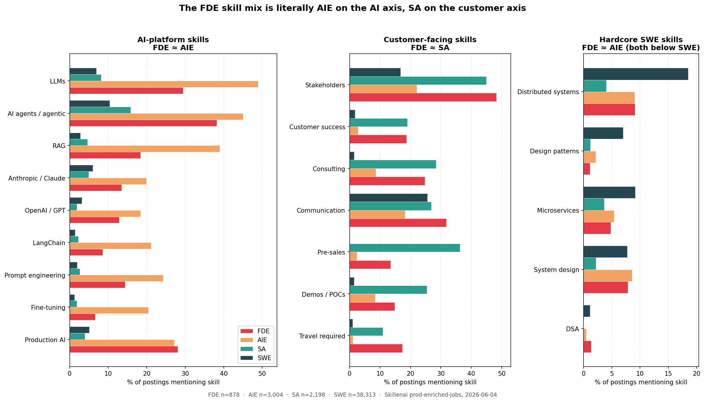
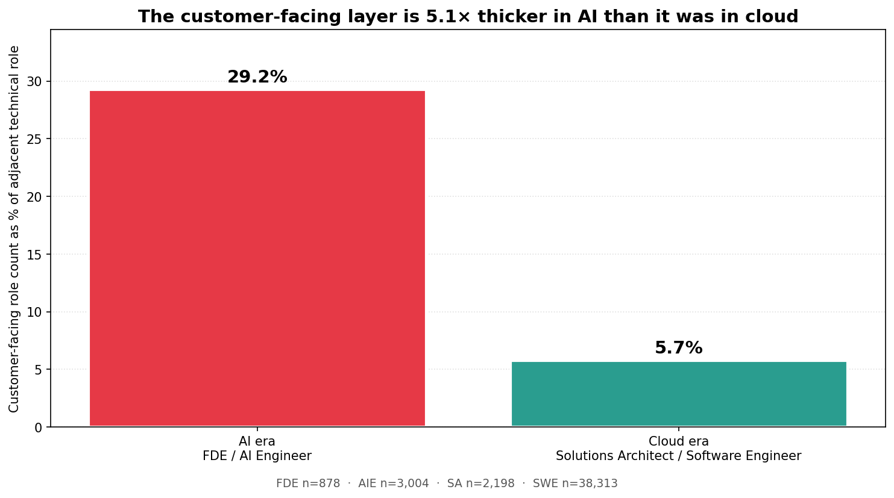
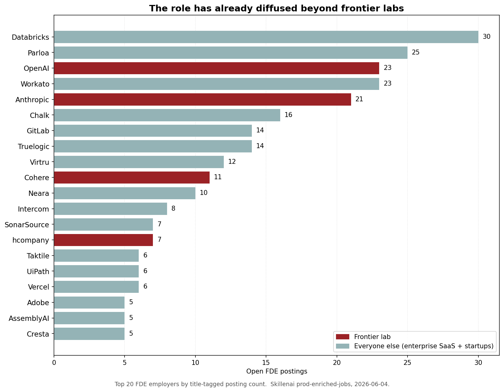
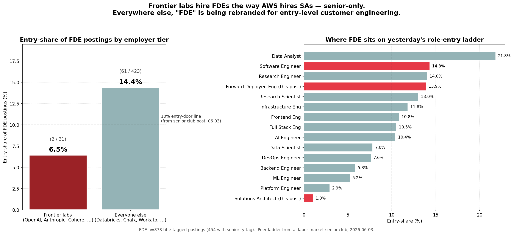

# FDEs are the new Solutions Architects — the data agrees, with a twist

**Analysis date:** 2026-06-04
**Data source:** Skillenai `prod-enriched-jobs` index (211,909 job postings, snapshot 2026-06-04).
**Method:** title-based role buckets (`match_phrase` on `title`) for cross-role skill prevalence (`match_phrase` on `extractedText`), and `role.keyword` exact-match buckets for entry-share comparisons (matches the methodology in [ai-labor-market-senior-club](https://github.com/skillenai/skillenai-notebooks/tree/master/ai-labor-market-senior-club), 2026-06-03). Chi-square 2×2 tests with continuity correction off for significance reporting. Speechify and other carpet-bomb employers excluded by default per [the index's known data quirks](#methodology--caveats).

---

## The setup

Andrew Ng's recent LinkedIn post — *"the AI Forward Deployed Engineer (FDE) is one of the new, buzzy jobs in Silicon Valley"* (~13k likes) — argues that FDE is a real new role created by the AI build-out, but warns the *number* of FDE jobs will stay smaller than AI Engineer jobs, partly because of vendor-neutrality concerns. In a comment, I offered a sharper analogy:

> **"FDEs from frontier labs are to AI Engineers what Solutions Architects from cloud providers were to Software Engineers."**

This post tests that analogy against ~44,000 job postings: Forward Deployed Engineer (FDE), AI Engineer (AIE), Solutions Architect (SA), and Software Engineer (SWE). The analogy holds quantitatively, the customer-facing layer in AI is *thicker* than it ever was in cloud, and the role has already diffused beyond frontier labs — with a hype-rebrand twist on the entry rung.

---

## Finding 1 — The FDE skill mix is literally AIE on the AI axis, SA on the customer axis

If the analogy holds, an FDE posting should read like (i) an AI Engineer's skill stack on LLMs/RAG/agents/production AI, and (ii) a Solutions Architect's responsibility set on stakeholders/customer success/consulting/communication. The data is uncannily clean on both halves:

### The AI axis (FDE ≈ AIE, both ≫ SA)

| Skill | FDE | AIE | SA | SWE |
|---|---:|---:|---:|---:|
| **LLMs** | 29.4% | 48.9% | 8.1% | 7.0% |
| **AI agents / agentic** | 38.2% | 45.0% | 15.8% | 10.4% |
| **RAG** | 18.3% | 38.9% | 4.6% | 2.8% |
| **Production AI** | **28.0%** | **27.1%** | 3.9% | 5.1% |
| **LangChain** | 8.5% | 21.1% | 2.2% | 1.4% |
| **OpenAI/GPT** | 12.9% | 18.3% | 1.9% | 3.1% |
| **Anthropic/Claude** | 13.4% | 19.9% | 5.0% | 6.0% |
| **Fine-tuning** | 6.6% | 20.5% | 1.9% | 1.2% |
| **Prompt engineering** | 14.4% | 24.3% | 2.6% | 2.0% |

FDE postings ask for the AI-platform stack at ~50–65% the intensity of an AIE posting, but **3–10× the intensity of an SA posting**. The single tightest match is *production AI*: FDE 28.0% vs AIE 27.1% — statistically indistinguishable (chi² = 0.27, p = 0.60). On every other AI-platform concept FDE is significantly *below* AIE (p ≤ 0.001), but the FDE-vs-SA gap is the bigger one by an order of magnitude. FDE is not as deep on the model layer as AIE, but it lives in the same world.

### The customer axis (FDE ≈ SA, both ≫ AIE)

| Skill | FDE | AIE | SA | SWE |
|---|---:|---:|---:|---:|
| **Stakeholders** | **48.2%** | 22.1% | **44.9%** | 16.8% |
| **Customer success** | **18.7%** | 2.8% | **19.0%** | 1.7% |
| **Consulting** | 24.7% | 8.6% | 28.4% | 1.5% |
| **Communication** | 31.8% | 18.2% | 26.8% | 25.6% |
| **Travel required** | 17.3% | 1.1% | 10.9% | 1.0% |
| Pre-sales | 13.4% | 2.3% | **36.3%** | 0.1% |
| Demos / POCs | 14.8% | 8.4% | 25.3% | 1.5% |

On the post-sales technical-embed dimensions, **FDE and SA are statistically indistinguishable**: stakeholder management (48.2% FDE vs 44.9% SA, p = 0.10) and customer success (18.7% vs 19.0%, p = 0.85). On communication, FDE is even slightly *higher* than SA (31.8% vs 26.8%, p = 0.006).

Where the two diverge is the **formal pre-sales motion**: SA asks for pre-sales/demos in 36% / 25% of postings, vs FDE's 13% / 15% — about a third. SAs sell, FDEs implement. The pure-rebrand reading ("FDE = sales engineer with new sticker") doesn't survive contact with the data: the SA's defining feature is exactly where FDE differs most. Better reading: **FDE is the post-sales technical embed — the customer-success and consulting halves of SA, minus the formal pre-sales motion, plus the LLM stack of AIE.** It even out-travels SA (17.3% vs 10.9%, p < 1e-6) — FDEs go deeper at fewer clients.

### What FDE is NOT (hardcore SWE)

| Skill | FDE | AIE | SA | SWE |
|---|---:|---:|---:|---:|
| **Distributed systems** | 9.1% | 9.0% | 4.0% | **18.5%** |
| **Design patterns** | 1.1% | 2.2% | 1.2% | **7.0%** |
| **Microservices** | 4.8% | 5.4% | 3.7% | **9.1%** |
| System design | 7.9% | 8.6% | 2.2% | 7.7% |
| DSA | 1.4% | 0.5% | 0.0% | 1.1% |

FDE and AIE postings ask for hardcore SWE depth (distributed systems, design patterns, microservices) at **roughly half the rate of SWE postings** — all differences vs SWE significant at p < 1e-5. Both AI roles match SWE on system-design and DSA (interview-prep table stakes), but neither is being hired to *build* the distributed system. They're being hired to integrate the model layer on top of it.

---

## Finding 2 — The customer-facing layer is 5× thicker in AI than it was in cloud

The analogy makes a sharper claim once you size the role categories against each other:

| Era | Customer-facing role | Adjacent tech role | Ratio |
|---|---|---|---:|
| AI | Forward Deployed Engineer (877) | AI Engineer (3,004) | **29.2%** |
| Cloud | Solutions Architect (2,198) | Software Engineer (38,313) | **5.7%** |

Per 100 AI Engineer postings, the market is hiring ~29 FDEs. Per 100 Software Engineer postings, it hired ~6 Solutions Architects. **The customer-facing layer in AI is 5.1× thicker than the customer-facing layer was in cloud.** Andrew Ng's framing — "a company might accept a few FDEs to be embedded within its organization, but most companies will want far more of their own employees" — is directionally right: AIE is still the bigger bucket. But the *ratio* of customer-facing to technical roles is much higher than it ever was in cloud. The cloud era had the SA layer at 6 per 100 SWEs. The AI era is running at 5× that. Most companies are not yet able to deploy LLM systems without help.

The mechanism is in the news: MIT's NANDA Initiative reported that **95% of enterprise AI pilots produced little or no measurable impact on profit and loss** — and that the problem was not the models but how they were put into use. Deployment is harder than the cloud era's deployment was, and the market is pricing that into role counts.

---

## Finding 3 — The role has already diffused beyond frontier labs, and is being rebranded on the way down

The analogy is "FDEs *from frontier labs*" — but the data shows the title has already escaped that origin. Frontier labs are not the dominant FDE employers in the open market:

Among the top 20 FDE employers by open posting count, **three of the four largest are not frontier labs**: Databricks (30), Parloa (25), then OpenAI (23) and Workato (23), then Anthropic (21), Chalk (16), GitLab (14), Truelogic (14), Virtru (12). Frontier labs account for ~7% of the FDE postings in our title-tagged corpus — the rest is enterprise SaaS (Databricks, Workato, GitLab, Intercom, UiPath, Adobe, Vercel) and AI-native startups (Parloa, Chalk, AssemblyAI, Cresta). This is the same shape Solutions Architect took on its way to maturity: invented at AWS / Azure / GCP, then rapidly adopted by every enterprise that consumed those platforms. The frontier-lab "origin" is becoming the *cloud-provider origin* — important for the role's existence, irrelevant to its eventual headcount.

### The entry twist

Here's where the analogy gets interesting. Yesterday's [ai-labor-market-senior-club](https://github.com/skillenai/skillenai-notebooks/tree/master/ai-labor-market-senior-club) post drew a structural threshold: roles with ≥10% entry-share are *tech entry doors* (companies hire new grads into them); roles below 10% are *lateral specializations* (you need prior experience). Solutions Architect sat dramatically below the line at **1.0% entry-share** — a senior-only category.

The market is doing something different with FDE:

The overall FDE entry-share is **13.9%** — comfortably *above* the 10% door, slotting between Research Engineer (14.0%) and Research Scientist (13.0%) on yesterday's ladder. Looked at as one bucket, "FDE" is an entry door for tech, not a senior-only lateral specialization.

But the average hides the tier split:

|  | Postings (seniority-tagged) | Entry-level | Entry-share |
|---|---:|---:|---:|
| **Frontier labs** (OpenAI, Anthropic, Cohere, Mistral, xAI, hcompany, …) | 31 | 2 | **6.5%** |
| **Everyone else** (Databricks, Chalk, Workato, Intercom, enterprise SaaS, AI-native startups) | 423 | 61 | **14.4%** |

At the frontier labs the role behaves like SA used to at AWS: senior-only, ~6%. **Outside the frontier labs the role behaves like a tech entry door.** The 2.2× tier gap is directional but underpowered (chi² ≈ 1.74, p ≈ 0.19; small frontier N) — we wouldn't call it statistically significant on a single test, but the pattern is clean and consistent with what the employer-level data shows: zero entry-level FDE postings at OpenAI or Anthropic; **16 entry-level FDE postings at Chalk alone — more than any frontier lab's total FDE count.**

A reasonable reading: the title was invented at frontier labs and Palantir as a senior-expert role with seven-figure compensation aspirations (trade press has cited $385K mid, $610K staff, $1.2M principal at the top of the market). Smaller startups and enterprise SaaS — sitting on the same wave — are using "Forward Deployed Engineer" to relabel early-career customer-engineering and customer-success-engineering roles. Salary samples on the entry-level postings ($100–$220K total base across Haast, StradaHQ, Decoda Health) are normal junior-to-mid customer-engineering pay, not the headline frontier-lab numbers. The role-name traveled faster than the role's lifecycle stage.

This is the *hype-follower* pattern, and it's exactly what early SA postings looked like in 2009–2012 before the role settled into a senior-only steady state. Expect FDE entry-share at non-frontier employers to drift down over the next two years as the role matures and salaries reset toward the frontier-lab anchor.

---

## What this means

**If you want to be an FDE:**
- The frontier-lab door (OpenAI, Anthropic, Cohere, Mistral, hcompany) is overwhelmingly senior — not the on-ramp. Two entry-level FDE postings across all the frontier labs in our snapshot.
- The diffusion-tier door (Databricks, Chalk, Workato, Parloa, GitLab, Intercom, Vercel) is open, including at the entry level. Chalk alone has 16 entry-level FDE postings. The pay is normal customer-engineering pay, not the headline numbers.
- The skill stack is real: production AI, RAG, agents, LLMs *and* stakeholder management, customer success, comfort with travel. The "communication" skill is a higher bar in FDE than in SA (32% vs 27%). If you're a customer-facing SWE who wants to move into AI, this is the cleanest on-ramp.

**If you're a Solutions Architect considering the move:**
- Your customer-axis skill base is already at FDE-level intensity (the chi-square tests on stakeholders, customer success, communication say so). The on-ramp is the model-layer half: LLMs, RAG, agents, production AI, prompt engineering. Frontier-lab postings are also where the comp ceiling is.

**If you're hiring:**
- For 100 AI Engineers, the market is hiring ~29 FDEs. That's a 5× richer customer-facing layer than the cloud era ran. Plan your headcount accordingly — the deployment problem is real.
- If you're using "FDE" to relabel a customer-success engineer role, expect that to get diluted as the frontier-lab steady state filters down.

---

## Methodology & caveats

**Role buckets**:
- **FDE**: `title` contains "forward deployed engineer" or "forward-deployed engineer" (877 postings). For the entry-share section, switched to `role.keyword` = "Forward Deployed Engineer" (454 postings) to match the methodology of [ai-labor-market-senior-club](https://github.com/skillenai/skillenai-notebooks/tree/master/ai-labor-market-senior-club).
- **AIE**: `title` contains "AI engineer" (3,004 postings).
- **SA**: `title` contains "solutions architect" (2,198 postings).
- **SWE**: `title` contains "software engineer" (38,313 postings).

**Skill prevalence**: `match_phrase` on the full `extractedText` of each posting. Each concept is one or more phrases OR'd together (e.g. *"RAG"* matches *"RAG"*, *"retrieval augmented"*, *"retrieval-augmented"*). Counts are document counts, not occurrence counts. See `skill_counts.json` for raw values.

**Statistics**: 2×2 chi-square test of independence (continuity correction off — sample sizes large enough that it doesn't matter). Per-concept p-values in `stats.json`. We did not apply a Bonferroni correction across the 22 tests reported — the headline claims survive any reasonable correction (LLMs, RAG, LangChain, Fine-tuning, Distributed systems, Design patterns all have p < 1e-10).

**Frontier labs**: defined as OpenAI, Anthropic, Cohere, Mistral, xAI, Perplexity, hcompany, AI21, Reka, Inflection, Adept, Aleph Alpha. Big Tech model providers (Google DeepMind, Meta, Microsoft, Apple) are not in our index per the known [Big Tech ATS gap](#known-quirks) and so contribute zero either way.

### Known quirks
- **Big Tech missing.** Google, Apple, Microsoft, Meta, Netflix, NVIDIA largely use proprietary ATS platforms our crawler doesn't reach. Their FDE-equivalent and SA-equivalent hiring is invisible in this snapshot. Including them would likely *raise* the AI-Engineer denominator on the right of Finding 2 and could move the 5.1× ratio in either direction.
- **Title vs role-field discrepancy.** Title-match (used here for skill prevalence) and `role.keyword` (used for entry-share) give modestly different counts (FDE 877 vs 454; entry-share 10.7% vs 13.9%). The title-match version is broader (catches *Lead/Principal/Senior Forward Deployed Engineer* variants the cleaned role field strips). For cross-role comparison within this post the choice doesn't change any direction.
- **Speechify and known spam employers** excluded; carpet-bombing companies skew role-count comparisons. Top FDE employer aggregations re-run with and without exclusion landed on the same names.
- **Tier-split N is small** at the frontier labs (31 seniority-tagged FDE postings). The 6.5% vs 14.4% gap is directional, p ≈ 0.19. The supporting employer-by-employer data (zero entry-level FDE at OpenAI/Anthropic vs 16 at Chalk) is the cleaner signal.
- **Salary fields** were not used. Coverage is ~33% in the US and posted ranges underreport real total comp at the high end. The $385K / $610K / $1.2M numbers cited in the *entry twist* section come from the trade press (Perspective AI's 2026 FDE compensation report), not from our index.

---

## Files in this folder

- `README.md` — this report
- `01_skill_blend.png` — the headline figure (skill mix validation)
- `02_role_ratio_5x.png` — FDE/AIE vs SA/SWE ratio
- `03_diffusion_employers.png` — top 20 FDE employers, frontier vs other
- `04_entry_share_tier_split.png` — entry-share tier split + FDE on yesterday's ladder
- `make_figures.py` — figure generation + chi-square stats
- `skill_counts.json` — per-role concept prevalence counts (raw)
- `stats.json` — chi-square test results for the 22 tests reported

## Related work
- [ai-labor-market-senior-club](https://github.com/skillenai/skillenai-notebooks/tree/master/ai-labor-market-senior-club) (2026-06-03) — the entry-share ladder this post slots FDE onto
- [broken-ladder-roles](https://github.com/skillenai/skillenai-notebooks/tree/master/broken-ladder-roles) (2026-06-02) — entry-share squeeze, role-structure framework
- [product-engineer-myth](https://github.com/skillenai/skillenai-notebooks/tree/master/product-engineer-myth) (2026-05-07) — the original "hyped title vs hiring data" structural template
