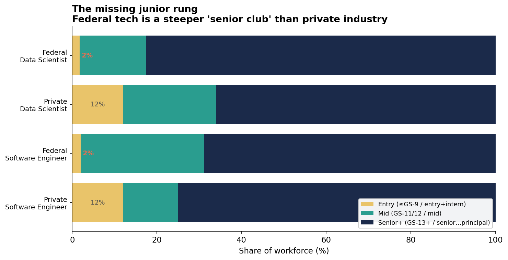
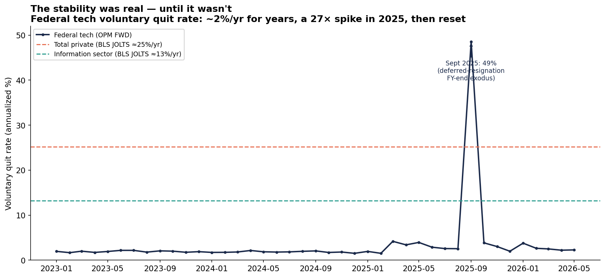

# The Broken Bargain: Inside the Federal Government's Tech Workforce

*Skillenai analysis · July 2, 2026 · federal data from the new [OPM Federal Workforce Data API](https://data.opm.gov), private-sector data from the Skillenai job index, benchmarks from the U.S. Bureau of Labor Statistics.*

For decades the public sector offered technical workers a clear trade: **you give up pay and upside; in return you get stability and security.** The U.S. Office of Personnel Management just opened a public API exposing the entire federal civilian workforce — every hire, every departure, every incumbent's grade, pay, and tenure — so we can finally test all three sides of that bargain against the private market Skillenai tracks.

The verdict: for tech and data roles the government asks you to give up **more** than most people realize, offers **almost no way in early**, and — after 2025 — can no longer credibly promise the one thing that made the deal worth it.

**TL;DR**
- **Pay:** A federal data scientist is hired at a **$118K** median base; comparable private postings sit at a **$149K–$207K** base band — *before* equity or bonus, which federal jobs don't offer. Even in Washington, DC (federal's highest-paying locality), the gap holds at 12–16%.
- **The way in:** Just **~2%** of federal data scientists are entry-level (≤GS-9), versus **~12%** of private data scientists. The federal tech workforce is a steeper "senior club" than industry — it barely hires juniors at all.
- **Stability:** Federal tech quit at **~2%/year** for years — roughly a *tenth* of the private-tech rate. Then in September 2025 the quit rate spiked **27×** to ~49% annualized during the deferred-resignation exodus, before resetting to ~2% by spring 2026. The stability was real — and revocable.

---

## Data & method

- **Federal:** OPM Federal Workforce Data (FWD) API — `employment` (incumbent snapshots), `accessions` (hires), `separations` (departures), monthly. Pay is `annualized_adjusted_basic_pay` (base pay including locality adjustment; **excludes** bonus, TSP, and any incentive). Counts are exact.
- **Private:** Skillenai `prod-enriched-jobs`, US postings, salary in USD, spam employer (Speechify) excluded. Posted salary is the base range (`salaryMin`/`salaryMax`); it also *excludes* equity/bonus, so the comparison is base-to-base.
- **Benchmarks:** BLS JOLTS quits rate (via the public `api.bls.gov`, May 2026) and the BLS Employee Tenure release (January 2024).
- **Role mapping** (deliberately conservative — federal occupational *series* are not job *titles*, so only clean maps are used):
  - **Data Scientist** ↔ federal series **1560** (Data Science)
  - **Software Engineer / IT** ↔ federal series **2210** (IT Management) + **1550** (Computer Science)
  - Fuzzy maps (e.g. Data Analyst ↔ 0343) are intentionally *not* headlined.
- **Rigor note:** the pay comparison uses federal **new-hire** pay (2024 accessions, the last normal hiring year) against private **posted** salary — both are "what you're offered walking in" — rather than comparing incumbents to postings.

---

## Part 1 — The pay penalty (and the ceiling)


| Role | Federal new-hire base (p25 / **p50** / p75) | Private posted base (p50 min → max, **midpoint**) | Gap at midpoint |
|---|---|---|---|
| Data Scientist | $91.9K / **$118.0K** / $148.7K | $149.3K → $207.0K (**$178.2K**) | **−34%** |
| Software Engineer / IT | $99.2K / **$129.0K** / $158.0K | $160.7K → $220.4K (**$190.5K**) | **−32%** |

Two things make the gap worse than the medians suggest:

1. **No equity, no bonus.** Both numbers above are *base* pay. Private tech compensation layers equity and bonus on top — invisible here, and often 20–50%+ of total comp. Federal offers none of it.
2. **A hard ceiling.** Federal base pay caps at the top of the GS scale — roughly **$197K** even at GS-15 with locality adjustment. Private postings have no such ceiling: the private Data Scientist band's 75th-percentile *maximum* is $238K, and Machine Learning Engineer reaches ~$299K. The government literally cannot post the roles at the top of the market.

**It isn't a cost-of-living illusion.** Restricting both sides to the Washington, DC metro — where federal locality pay is highest — the penalty narrows but never closes: federal DS $153.5K vs private DS $173.6K (−12%), federal SWE/IT $158.3K vs private $187.8K (−16%). And that's still before equity.

---

## Part 2 — The missing junior rung



| Workforce | Entry (≤GS-9 / entry+intern) | Mid (GS-11/12 / mid) | Senior+ (GS-13+ / senior…principal) |
|---|---|---|---|
| **Federal** Data Scientist | **1.7%** | 15.7% | 82.6% |
| Private Data Scientist | 12% | 22% | 66% |
| **Federal** Software Engineer / IT | **2.0%** | 29.2% | 68.8% |
| Private Software Engineer | 12% | 13% | 75% |

Both public and private tech skew senior — Skillenai has documented the private sector's shrinking bottom rung before. But the federal workforce is far steeper: **the entry-level rung is roughly six to seven times smaller.** Over 80% of federal data scientists sit at GS-13 or above (the journeyman/expert band); fewer than one in fifty is entry grade.

The practical consequence: the government mostly buys tech talent *mid-career*, after the private sector has trained it — while offering below-market pay to lure it. It is not building its own pipeline. For a new graduate, "go work for the government" is barely an option in these fields.

---

## Part 3 — The stability was real, until it wasn't



Here the traditional bargain actually delivers — spectacularly, and then catastrophically.

| Voluntary quit rate (annualized) | Rate |
|---|---|
| Federal tech, normal (2023 – early 2025) | **~1.8% / yr** |
| Private *Information* sector (BLS JOLTS) | ~13% / yr |
| Total private (BLS JOLTS) | ~25% / yr |
| Federal tech, **September 2025** | **~48.6% / yr** |
| Federal tech, May 2026 | ~2.3% / yr |

For years, federal tech workers quit at roughly **one-tenth to one-fourteenth** the private rate. Median tenure reflects the same stickiness: BLS puts federal tenure at **6.5 years** vs **3.5 years** in the private sector, and within the federal tech series the median length of service runs about a decade.

Then the bargain was tested. Through 2025 a hiring freeze and a government-wide deferred-resignation program drove separations up and hiring down; the program's fiscal-year-end date produced a single-month exodus in **September 2025** that pushed the annualized voluntary quit rate to ~49% — a **27× spike** off its own multi-year baseline. By spring 2026 the quit rate had reset to ~2% and (per the July 2, 2026 BLS Employment Situation) federal employment had roughly stopped falling.

The behavior normalized. The *promise* is what changed: workers who chose federal service for security learned that security could be withdrawn in a single budget cycle. A quit rate can reset in a year; a reputation for stability cannot.

---

## What it means

**If you're early-career in tech:** the federal government is not a realistic first job in these fields — the entry rung barely exists. It becomes an option mid-career, and mainly if you value mission or predictability over compensation.

**If you're mid-career weighing a federal move:** you're trading ~30% of base (and all of your equity upside) for what *was* an exceptionally stable job. After 2025, price the stability discount lower than you would have two years ago.

**For the government:** the three findings compound into one problem. Below-market pay with a hard ceiling, a nonexistent junior pipeline, and a stability guarantee it just spent down — that's a hard combination to hire and retain modern technical talent against, precisely when the public sector needs it most.

---

## Reproduce it yourself

The federal side of this analysis runs entirely on public, no-authentication data through the open-source **[opm-fwd-skill](https://github.com/skillenai/opm-fwd-skill)** (part of the [labor-data-skills](https://github.com/skillenai/labor-data-skills) family). For example:

```bash
# Federal tech hires vs departures, monthly
python3 scripts/netflow.py --start 2023-01 --end 2026-05 --series 2210,1550,1560 --by occupational_series
```

The scripts in this folder (`analyze_federal.py`, `make_figures.py`) and the intermediate CSVs reproduce every number above.

### Methodology notes & caveats

- **Federal civilian only** — excludes military and federal contractors. Contractor headcount changes are invisible here.
- **Base-to-base pay.** Neither figure includes equity or bonus; the true total-comp gap is larger than the base gap shown, because private equity/bonus is omitted and federal jobs have essentially none.
- **Quit rate** uses voluntary quits (separation code SC, excluding retirements and transfers) over a fixed pre-disruption headcount base (2024-12 federal tech ≈ 129,331), annualized; the JOLTS comparison also excludes retirements. Post-2025 rates against the smaller current headcount would be marginally higher, so the federal figures shown are conservative.
- **The September 2025 spike** reflects real departures clustered on the deferred-resignation program's fiscal-year-end effective date; many of those employees had been on leave earlier in the year.
- **Tenure constructs differ slightly**: BLS measures years with current employer (household survey); the FWD length-of-service field reflects federal creditable service. We lead on the cleaner quit-rate comparison and use tenure as supporting context.
