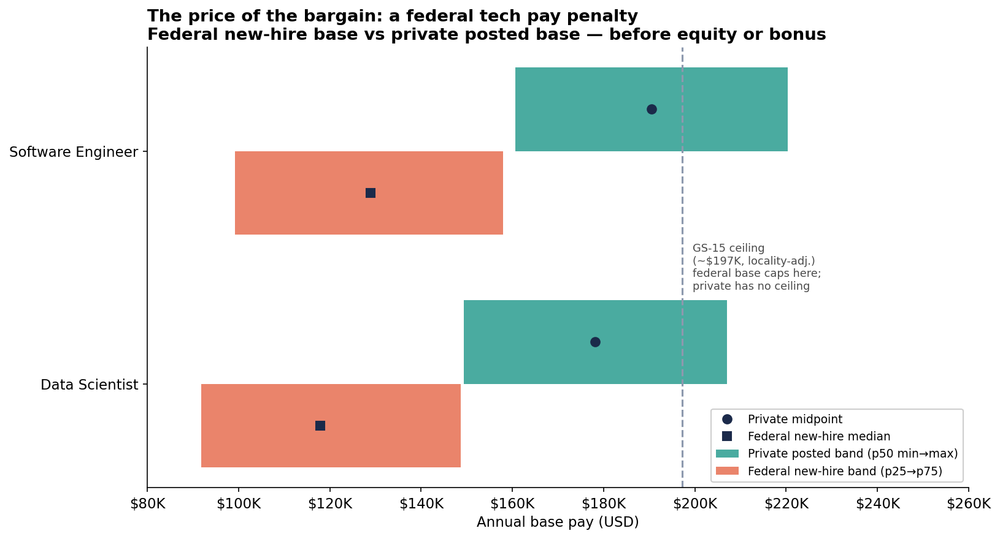
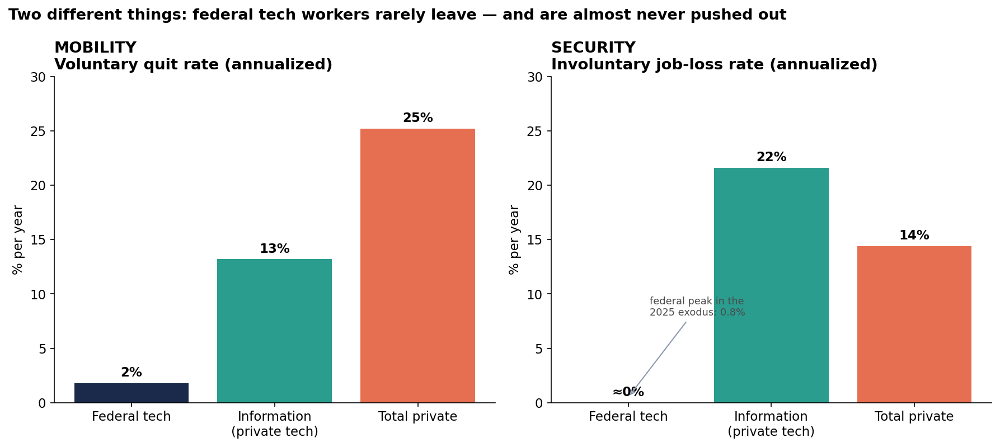
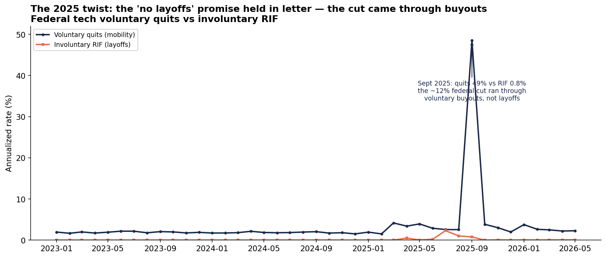
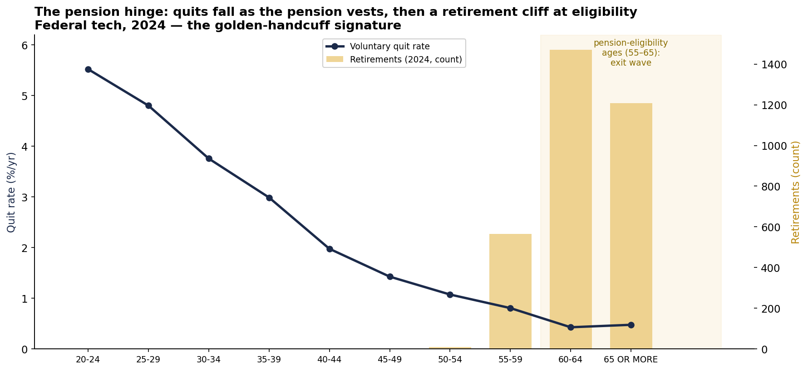

# The Federal Tech Bargain, Priced: Lower Pay and Almost No Mobility — for Near-Total Job Security

*Skillenai analysis · July 2, 2026 · federal data from the new [OPM Federal Workforce Data API](https://data.opm.gov), private-sector data from the Skillenai job index, benchmarks from the U.S. Bureau of Labor Statistics.*

For decades the public sector offered technical workers a simple trade: **give up pay and upside; get stability in return.** The U.S. Office of Personnel Management just opened a public API exposing the entire federal civilian workforce — every hire, departure, grade, and pay rate — so we can finally put exact numbers on both sides of that trade and test it against the private market Skillenai tracks and the BLS benchmarks for the rest of the economy.

The trade turns out to be real, larger than most people assume, and held together by a single design choice: the pension.

**TL;DR**
- **The price:** A federal data scientist is hired at a **$118K** median base; comparable private postings sit at a **$149K–$207K** base band — *before* equity or bonus, which federal jobs don't offer. Even in Washington, DC — federal's highest-paying locality — the gap holds at 12–16%.
- **Mobility:** Federal tech workers quit at **~2%/year** — roughly a *tenth* of the private-tech rate (~13%) and a *fourteenth* of total private (~25%). They almost never leave.
- **Security:** They almost never get pushed out either. Federal involuntary job loss runs **~0%/year** (RIF), versus **~22%/year** layoffs-and-discharges in private tech. That's the payoff for the pay cut — and it's enormous.
- **The 2025 twist:** Even when the government cut ~12% of its workforce, it did so through *voluntary buyouts*, not layoffs — RIF never exceeded ~1%/year. The "no involuntary layoffs" promise held in letter.
- **The hinge:** Quit rates fall monotonically as workers age toward pension eligibility, and retirements erupt exactly at 55–65. The pension back-loads compensation — which partly closes the pay gap with deferred money, and clamps mobility shut. The three findings are one system.

---

## Data & method

- **Federal:** OPM Federal Workforce Data (FWD) API — `employment` (incumbent snapshots), `accessions` (hires), `separations` (departures), monthly. Pay is `annualized_adjusted_basic_pay` (base pay including locality adjustment; **excludes** bonus, TSP match, and any incentive). Voluntary quits = separation code `SC`; retirements = `SD`; involuntary reduction-in-force = `SH`. Counts are exact.
- **Private:** Skillenai `prod-enriched-jobs`, US postings, salary in USD, spam employer (Speechify) excluded. Posted salary is the base range; it also excludes equity/bonus, so the pay comparison is base-to-base.
- **Benchmarks:** BLS via the public `api.bls.gov` — JOLTS quits and layoffs-&-discharges rates (May 2026); Employee Tenure release (January 2024).
- **Role mapping** (conservative — federal occupational *series* are not job *titles*): **Data Scientist** ↔ series **1560**; **Software Engineer / IT** ↔ series **2210** + **1550**. The "tech" aggregate for stability adds Computer/Operations-Research/Statistics series (0854, 1515, 1530).
- **Rigor note:** the pay comparison uses federal **new-hire** pay (2024 accessions, the last normal hiring year) vs private **posted** salary — both "what you're offered walking in."

---

## Part 1 — The price: a real, quantifiable pay penalty



| Role | Federal new-hire base (p25 / **p50** / p75) | Private posted base (p50 min → max, **midpoint**) | Gap at midpoint |
|---|---|---|---|
| Data Scientist | $91.9K / **$118.0K** / $148.7K | $149.3K → $207.0K (**$178.2K**) | **−34%** |
| Software Engineer / IT | $99.2K / **$129.0K** / $158.0K | $160.7K → $220.4K (**$190.5K**) | **−32%** |

That public-sector tech pays less is not news — but the API lets us size it precisely, and two features make it worse than the medians suggest. First, **no equity or bonus**: both numbers are base pay, and private tech layers 20–50%+ on top that federal simply doesn't have. Second, **a hard ceiling**: federal base caps around **$197K** at the top of the GS scale, while private postings run uncapped (the private Data Scientist band's high end is $238K; Machine Learning Engineer reaches ~$299K).

**It's not a cost-of-living illusion.** Restricting both sides to the Washington, DC metro — where federal locality pay is highest — the gap narrows but never closes: federal DS $153.5K vs private $173.6K (−12%), federal SWE/IT $158.3K vs private $187.8K (−16%). Still before equity.

The interesting question isn't *whether* federal tech is underpaid. It's why a gap this large **persists** — because in a market with few barriers between public and private tech work, underpaid workers should simply leave until the gap closes. They don't. The next two sections are why.

---

## Part 2 — The bargain: mobility and security are two different things



A low quit rate is easy to misread as "stability." It isn't — it's **mobility**, and the security is a *separate* axis. Splitting voluntary from involuntary exits shows federal tech is unusual on both:

| | **Mobility** — voluntary quit rate (ann.) | **Security** — involuntary loss rate (ann.) |
|---|---|---|
| Federal tech | **~1.8% / yr** | **~0.01% / yr** (RIF); 2025 peak ~0.8% |
| Information sector (private tech) | ~13% / yr | **~22% / yr** (layoffs + discharges) |
| Total private | ~25% / yr | ~14% / yr |

Federal tech workers quit at **one-tenth to one-fourteenth** the private rate — they rarely leave. And they're almost never pushed out: a private tech worker faces roughly a **1-in-5 annual chance of involuntary job loss**; a federal one, essentially none. BLS tenure tells the same story — 6.5 years federal vs 3.5 private.

**That security is the payoff for the pay cut** — and it is genuinely large. Whether it *fully* justifies a ~30% base gap is a question we return to below.

### The 2025 twist: the promise held in letter



Even the largest federal contraction on record didn't break the "no involuntary layoffs" rule. Through 2025 a hiring freeze and a government-wide deferred-resignation program cut the workforce ~12% — but the mechanism was **voluntary**: the September 2025 fiscal-year-end exodus pushed the annualized quit rate to ~49%, while **involuntary RIF never exceeded ~1%.** The government didn't lay people off; it paid them to leave. The security promise survived the storm — technically. (Whether an induced "voluntary" buyout honors the *spirit* of the bargain is a fair debate; the data only shows the letter held.)

---

## Part 3 — The hinge: the pension both closes the gap and locks the door



Why don't underpaid federal workers leave to arbitrage the gap away? The clearest answer in the data is the **pension**, and its fingerprints are unmistakable:

- **Quits fall monotonically as the pension vests:** 5.5% at age 20–24 → 3.0% at 35–39 → 2.0% at 40–44 → **0.4% at 60–64** — a ~14× decline across a career.
- **Retirements erupt exactly at federal pension-eligibility ages:** near-zero through age 54, then **566 (55–59) → 1,470 (60–64) → 1,208 (65+).** People stay until the pension, then leave in a wave. That cliff at 55–62 is a FERS-eligibility signature — hard to read as anything but golden handcuffs.

Federal compensation is **back-loaded**: a lower salary now in exchange for a defined-benefit pension that vests and grows with tenure. That single design choice does three things at once — it (1) partly closes the "pay gap" with deferred compensation invisible in base salary, (2) manufactures the golden handcuffs above, and (3) that suppressed mobility is exactly what lets the base-pay gap persist without triggering an exodus. **The pay penalty, the low mobility, and the security aren't three facts — they're one back-loaded bargain with the pension at the center.**

### Is it security, or is it lock-in? (An honest ambiguity, mostly resolved)

A low quit rate can mean two very different things, and they're observationally similar:

- **Efficient sorting:** people who value security self-select into government and are content — the total deal is fair, so they don't leave. No distortion.
- **Lock-in:** people are stuck — pensions, non-transferable experience, age — so a below-market wage can persist that mobility would otherwise erode. A friction.

The age evidence tilts toward lock-in being a **real component**: the retirement cliff is mechanically tied to pension eligibility, and prime-age federal tech workers (40–54) quit at just 1–2%, near-immobile with 15+ career years left. But it isn't the whole story — even the *youngest, un-vested* federal tech workers (20–24) quit at only ~5%, far below their private-tech peers, which points to **selection** (security-preferring people sort in) and **non-transferable experience** binding from day one, before any pension handcuff exists. Federal tech is also an *older* workforce, and older workers quit less everywhere — some of the mobility gap is composition, not federal-specific friction.

**The honest read:** the pay gap is substantially the *price of security*, and that security is real and rare; but the pension's back-loading also visibly clamps mobility, which is what lets the gap run wider and longer than a frictionless market would allow. It is both a fair trade *and* a lock-in — and the pension is why it can be both at once.

---

## What it means

**If you're weighing a federal tech job:** you're trading ~30% of base (and all equity upside) for a level of job security that essentially doesn't exist in private tech — a ~1-in-5 annual layoff risk, gone. That trade is rational if you're risk-averse or value the mission. Just know the handcuffs are real: the pension rewards staying and penalizes leaving, and federal experience travels back to the private market imperfectly. It's easier to walk in than to walk back out.

**For the government:** the same pension that retains people is a below-market-salary machine — it works beautifully until you need to hire technical talent *fast* against private compensation, at which point the base-pay ceiling and the thin early-career pipeline bite. And 2025 spent down something that doesn't refill on the same schedule: a quit rate resets in a year; a reputation for security, once shown to be revocable-by-buyout, does not.

---

## Reproduce it yourself

The federal side runs entirely on public, no-authentication data through the open-source **[opm-fwd-skill](https://github.com/skillenai/opm-fwd-skill)** (part of the [labor-data-skills](https://github.com/skillenai/labor-data-skills) family):

```bash
python3 scripts/netflow.py --start 2023-01 --end 2026-05 --series 2210,1550,1560 --by occupational_series
```

The scripts here (`analyze_federal.py`, `analyze_stability.py`, `make_figures.py`) and the intermediate CSVs reproduce every number above.

### Methodology notes & caveats

- **Federal civilian only** — excludes military and federal contractors (contractor cuts are invisible here).
- **Base-to-base pay.** Neither side includes equity or bonus; the *total-comp* gap is smaller than the base gap once the federal pension and benefits (up) and private equity (up) are both counted — which is precisely the point of Part 3.
- **Involuntary comparison.** Federal figure is RIF (`SH`), the direct analog to economic layoffs; BLS layoffs-&-discharges also includes for-cause discharges, so it is a slightly broader measure — the true involuntary gap is somewhat smaller than 22% vs ~0%, but still very large. Federal for-cause removals are rare and not cleanly coded.
- **Quit rate** uses voluntary quits over a fixed pre-disruption headcount base (2024-12 federal tech ≈ 129,331), annualized; JOLTS quits also exclude retirements.
- **The September 2025 spike** reflects real departures clustered on the deferred-resignation program's fiscal-year-end effective date.
- **The lock-in vs sorting question is not fully identified** by quit data alone; we lead with the age/pension evidence and state the residual ambiguity explicitly rather than claiming a clean causal verdict.
