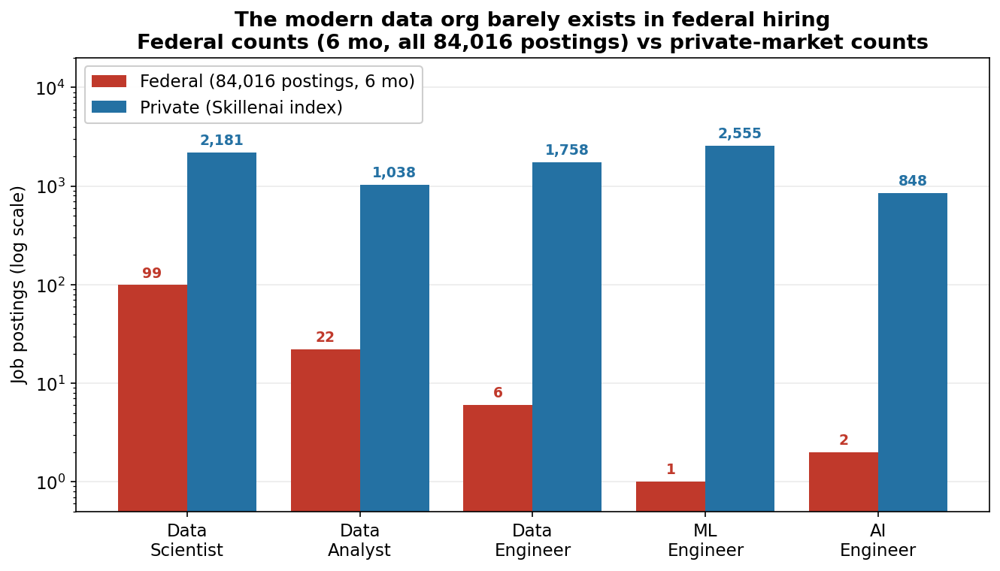
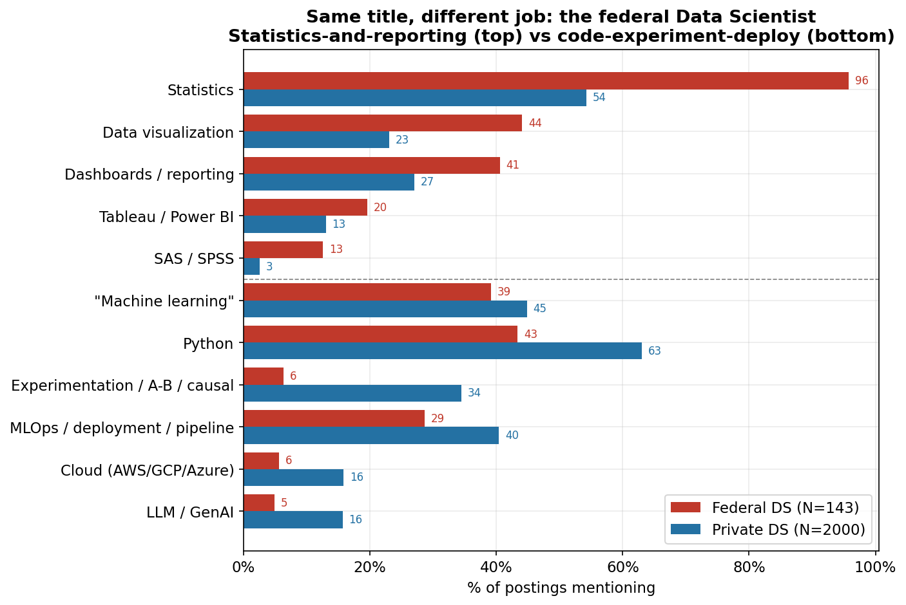
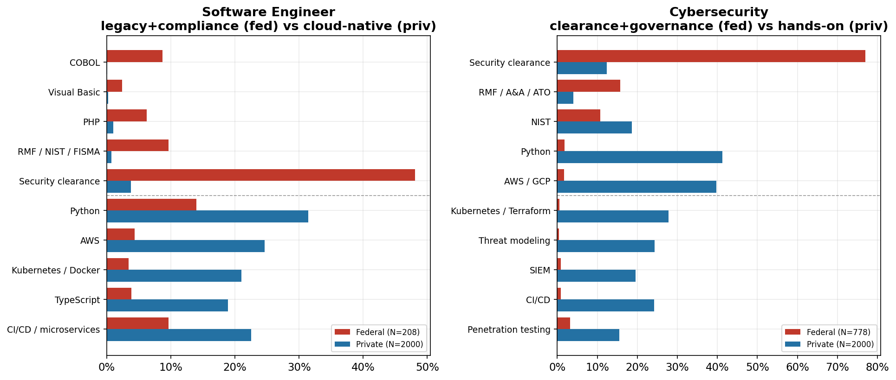
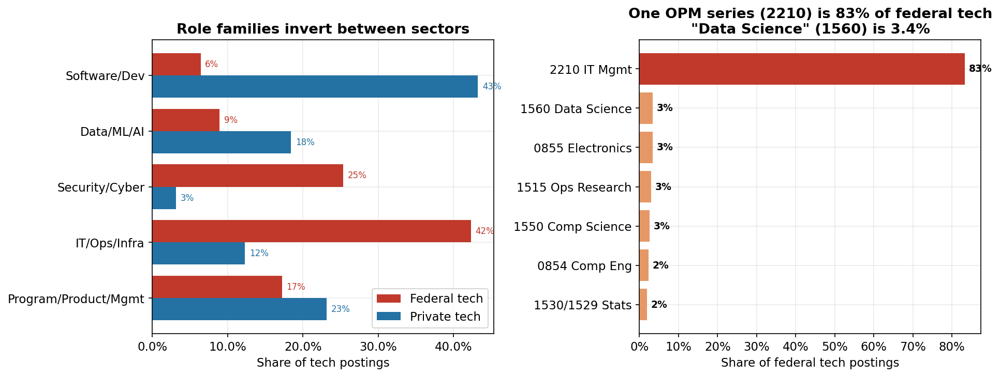
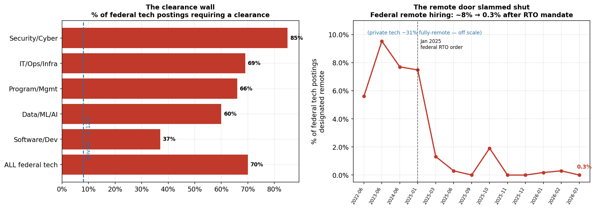

# The Federal Government Posted One Machine Learning Engineer Job in Six Months

*Skillenai analysis · July 2026 · federal postings from the [loyoladatamining/usajobs](https://huggingface.co/datasets/loyoladatamining/usajobs) corpus (USAJOBS, 2025-10 → 2026-03) and the live USAJOBS feed in the Skillenai index; private-sector postings from the Skillenai job index (2026-Q2).*

Two weeks ago we [priced the federal tech bargain](https://github.com/skillenai/skillenai-notebooks/tree/master/federal-tech-broken-bargain): lower pay and almost no mobility, in exchange for near-total job security, with a back-loaded **pension** at the center holding the whole trade together. That analysis explained why federal tech workers so rarely *leave*.

It left one thread hanging. In Part 3 we noted that even the *youngest, un-vested* federal tech workers quit at only ~5% — far below their private-tech peers — and attributed the residual to "selection and **non-transferable experience** binding from day one, before any pension handcuff exists." Data scientist [Abigail Haddad](https://www.linkedin.com/in/abigail-haddad/) put the same point more sharply in response to that piece:

> "I think lack of movement is about skill set / tech stack as much as it's about pension… you'd see more movement if you looked at folks who were more hands-on-keyboard coders."

This post tests that claim — and finds it's right. There is a **second wall**, independent of the pension: the *work itself* is different. Federal and private tech postings, even under identical titles, ask for different tools; and the role categories that dominate private tech mostly **don't exist** as federal jobs at all. A federal worker who overcame the pension handcuff tomorrow would still find their skills mapping to a different market — and a private engineer looking in would find few recognizable jobs behind a wall of security clearances.

**TL;DR**
- **The categories are missing.** Across **84,016 federal postings** over six months, all of federal hiring produced **1 Machine Learning Engineer, 6 Data Engineers, and 2 AI Engineers**. The private index carries thousands of each. The modern data/ML/AI-engineering org simply isn't a federal construct.
- **The federal "data science" workforce is a different species** — Data Scientists, **Operations Research Analysts, and Statisticians** (90% of the federal Data/ML/AI family), the analyst-and-researcher lineage, not the data-engineering one.
- **Same title, different job.** A federal Data Scientist posting is *statistics-and-reporting* (statistics 90%, data-viz 53%); a private one is *code-experiment-deploy* (Python 63%, experimentation 34%, MLOps 40%). Both say "machine learning" equally (~44%) — only one sector tools for it.
- **The pattern repeats in Software and Security.** Federal software still runs **COBOL** (9% of postings vs ~0% private) under an RMF/NIST compliance overlay; federal cybersecurity is clearance-and-governance (Python 2% vs **41%** private; threat modeling 0% vs 24%).
- **Two more walls the pension analysis didn't cover:** **70% of federal tech postings require a real security clearance** (85% in security roles) vs low single digits private; and **federal remote hiring collapsed from ~8% to 0.3%** after the January 2025 return-to-office mandate — the fully-remote door that ~31% of private tech still offers has effectively shut.

This is not a correction to the pension story; it's the other half of it. Low mobility is **over-determined**: even with the pension set aside, the skills don't travel.

---

## Data & method

- **Federal:** the open `loyoladatamining/usajobs` corpus (full USAJOBS announcement text, Jan 2017–Mar 2026), restricted to the six most recent months (2025-10 → 2026-03) and to the tech-relevant OPM occupational **series** — 2210 (IT Management), 1550 (Computer Science), 1560 (Data Science), 0854 (Computer Engineering), 0855 (Electronics), 1515 (Operations Research), 1529/1530 (Statistics). That yields **2,859 federal tech postings**. Structured fields (series, GS grade, salary, clearance, telework) are parsed from the announcement text (≈100% populated). For role counts we scan **all 84,016** postings in the window, not just tech series.
- **Private:** Skillenai `prod-enriched-jobs`, US postings, 2026-Q2, spam employer (Speechify) excluded. ~2,000 postings sampled per matched role.
- **Skill measurement:** raw-text phrase matching applied **identically** to both sides — federal on the parsed Duties+Qualifications section (median ~13K chars), private on the posting body (~5K chars). Because the federal text we match is *longer*, every "federal mentions modern tooling less" result is **conservative**, not a length artifact.
- **Role mapping** follows the pension post: Data Scientist ↔ series 1560 + "Data Scientist"-titled; Software Engineer ↔ series 2210/1550 with a software/developer/application title; Security ↔ cyber/security/InfoSec titles.
- **Windows differ** (federal ends 2026-03, private 2026-Q2). This is a skills *cross-section*, not a time series; adjacent quarters are fine for "what does the work look like."

---

## Part 1 — The roles that don't exist

Start with the simplest possible question: how many of each data role does federal hiring actually post? Over six months and **84,016 postings across every federal occupation**:

| Title | Federal (6 mo) | Private (Skillenai index) |
|---|---:|---:|
| Data Scientist | 99 | 2,181 |
| Data Analyst | 22 | 1,038 |
| **Data Engineer** | **6** | 1,758 |
| **Machine Learning Engineer** | **1** | 2,555 |
| **AI Engineer** | **2** | 848 |
| MLOps (any title) | 0 | — |

Data Engineer, ML Engineer, AI Engineer, MLOps — the roles that make up the *backbone* of a modern private data organization — are, functionally, **not federal jobs**. This is partly a naming convention (federal work hides inside "IT Specialist" and "Computer Scientist"), but it's mostly real: the federal government does not organize technical data work into build-and-deploy engineering roles.

What it *does* have is the older archetype. The federal **Data/ML/AI family (N=254)** breaks down as:

| Federal data role | Count | |
|---|---:|---|
| Operations Research Analyst | 82 | the government quant/analyst |
| Data Scientist | 96 | |
| Statistician | 50 | |
| Data Engineer | 6 | |
| ML Engineer | 1 | |
| AI Engineer | ~0 | |

Operations Research Analysts and Statisticians — 90% of the family with Data Scientists — are the **analyst-and-researcher** lineage of data work, not the **engineering** lineage. That's the first, most literal version of Abigail's point: the "small group" of 1560s isn't just small, it sits inside a data workforce built on a fundamentally different job architecture.

---

## Part 2 — Same title, different job: the federal Data Scientist

So take the one title that *does* exist on both sides — Data Scientist — and read what the postings actually ask for. (Federal N=107, private N=2,000; every gap below is significant at a Bonferroni-corrected threshold.)

The split is clean. Federal Data Scientist postings over-index on the **statistics-and-reporting** half — statistics (90% vs 54%), data visualization (53% vs 23%), dashboards/reporting (37% vs 27%), SAS/SPSS (7% vs 3%). Private Data Scientist postings over-index on the **code-experiment-deploy** half — Python (63% vs 30%), experimentation / A-B / causal inference (34% vs **6%**), MLOps / deployment / pipelines (40% vs 20%), cloud (16% vs 5%), LLM/GenAI (16% vs 3%).

The tell is the middle row: **both sectors say "machine learning" at the same rate (~44%).** Federal data scientists aren't unaware of ML — they name it as often as anyone. What they lack is the *hands-on toolchain to operationalize it*. It stays a concept (statistics, a method, a research output) rather than a deployed system (Python, an experiment, a pipeline). This is "hands-on-keyboard" made measurable: same word, different reality.

It goes further. Read a federal **"Data Scientist (AI)"** posting and the AI work turns out to be *governance*, not building — verbatim: *"Conducts research and development of metrics, measurements, and evaluation methods for… AI… promotes the adoption of standards, guides, best practices, and policy for measuring and evaluating AI technology."* Even where federal hiring reaches for "AI," it reaches for **standards and evaluation policy**, not model development.

> **A federal Data Scientist and a private Data Scientist share a title and a vocabulary, but not a job: one describes machine learning, the other ships it.**

---

## Part 3 — The pattern repeats: Software and Security

Data science isn't special. The two other places where federal and private titles overlap tell the same story.

**Software Engineer** (federal N=208, private N=2,000). Federal software runs a **legacy enterprise stack** — **COBOL appears in 9% of federal software postings and ~0% of private** (a 40×+ gap), alongside Visual Basic and PHP — wrapped in a **security-compliance overlay** (RMF/NIST/FISMA at 5% each, ~0% private; DevSecOps 9% vs 1%). Private software is **cloud-native**: AWS 25% vs 4%, Kubernetes/Docker 17%/13% vs 3%/2%, TypeScript 19% vs 4%. Where federal software modernizes, it modernizes *defensively* (compliance), not *architecturally* (cloud).

**Cybersecurity** (federal N=778, private N=2,000) — the sharpest divergence in the dataset. Federal security is **clearance-and-governance**: security clearance in **77%** of postings, RMF/A&A/ATO 16%, but the hands-on toolset is nearly absent — **Python 2% vs 41%**, threat modeling **0% vs 24%**, Kubernetes/Terraform ~0% vs 18–19%, SIEM 1% vs 20%, CI/CD 1% vs 24%. A private "Security Engineer" is a cloud DevSecOps builder; a federal "Cybersecurity Specialist" is a cleared compliance-and-authorization professional. Same title, opposite work.

---

## Part 4 — Why matched titles cover so little: the composition inverts

There's a reason the matched-title comparisons above only span a *sliver* of federal hiring: the sectors don't hire the same *mix* of roles in the first place.

Collapse both sides into role families and the shares **invert**:

| Role family | Federal tech | Private tech |
|---|---:|---:|
| Software/Dev (hands-on) | **6.4%** | **43.2%** |
| Data/ML/AI | 8.9% | 18.4% |
| Security/Cyber | **25.3%** | 3.1% |
| IT/Ops/Infra | 42.3% | 12.3% |
| Program/Product/Mgmt | 17.2% | 23.1% |

Hands-on software development is **~7× rarer** in federal tech; security is **~8× more common**. And the whole thing is dominated by a single occupational series: **series 2210 (IT Management) is 83% of federal tech postings**, while **series 1560 (Data Science) is 3.4%** — precisely the "2210 is by far the biggest, 1560 is such a small group" structure practitioners describe. Inside the 2210 monolith, hands-on software development is just **7% of the biggest bucket**; the rest is cybersecurity (32%), generic "IT Specialist" (30%), and network/systems administration (17%).

So the population Abigail flagged — hands-on-keyboard coders, the workers most able to arbitrage a pay gap by moving — is exactly the population federal tech barely employs. Low mobility isn't only a handcuff on the people who are there; it's partly a **denominator problem** about who's there to begin with.

---

## Part 5 — Two more walls: clearance and the closed remote door

Even setting skills aside, two hard gates separate the workforces.

**Clearance.** **70% of federal tech postings require a real security clearance** (Secret / Top Secret / SCI) — 85% in security roles, 60% even in data roles — versus low single digits in private postings. A clearance takes months to years to adjudicate and is employer-sponsored; a private engineer without one cannot take most federal tech jobs regardless of skill, and clearance itself is a form of non-transferable, government-specific capital.

**Remote — a door that just slammed shut.** The USAJOBS announcement carries an official **"Remote job"** designation (work-from-anywhere, no duty station), distinct from situational telework. Federal tech remote hiring held at **~6–10% from 2022 through January 2025** — then **collapsed to ~0.3%**, with the drop landing precisely in Q1–Q2 2025: 7.5% (Jan) → 1.3% (Mar) → 0.3% (Jun) → ~0% after. That timing is the federal **return-to-office executive order** (January 2025). Telework-*eligibility* only dipped (77% → 63%), so the mandate hit fully-remote hardest. Private tech, by contrast, still designates ~31% of tech postings fully-remote. The location-independent federal tech job existed as recently as early 2025 — it effectively doesn't now.

This is also the cleanest validation in the analysis that the field is real, not a scraping artifact: the "Remote job" designation is present on **96.6%** of recent postings and parses to a definite Yes/No; it registered a healthy **6–10% for three years** before collapsing exactly when policy changed. A broken or empty field couldn't produce that history.

---

## Salary (the tertiary point, and a cross-check)

We [priced the pay gap](https://github.com/skillenai/skillenai-notebooks/tree/master/federal-tech-broken-bargain) in the pension post: a federal Data Scientist earns a ~$144K median base against a ~$178K private midpoint — about a 20% base gap before equity, against a hard ~$197K GS ceiling private roles blow past. The posting data here **independently reproduces it**: federal DS posted-salary midpoint is **$138.7K** (vs the $143.6K OPM *incumbent* figure — two different federal sources within ~3%), and private DS posted midpoint is **$177.5K** (vs $178.2K). We don't re-litigate salary here; we just note it triangulates.

---

## What it means

**If you're a federal tech worker thinking about leaving:** the pension is the handcuff you can feel, but the skills gap is the one you can't. If your background is Operations Research, statistics-and-reporting data science, COBOL maintenance, or clearance-gated compliance security, the private market you'd be entering runs on Python, cloud, experimentation, and DevSecOps. The move is a *retraining* project, not just a *resignation* — which is exactly why so few make it, vested or not.

**If you're a private engineer eyeing government:** most of the roles you'd recognize (ML Engineer, Data Engineer, platform, cloud-native security) barely exist as federal jobs, and most of the ones that do want a clearance you don't have and can't get on your own. The door is narrower than the pay tables suggest.

**For the government:** the pipeline problem is deeper than pay. Even a fully-funded, competitively-paid federal hiring push would be hiring into role *categories* — analyst/statistician data science, legacy-stack software, compliance security — that don't match where technical talent is trained or where the frontier work happens. Closing the pay gap wouldn't, by itself, make a modern ML-engineering workforce appear. The job architecture has to change first.

---

## Reproduce it & caveats

The federal corpus is public (`loyoladatamining/usajobs` on Hugging Face); the parsing/analysis scripts (`build_federal.py`, `compare.py`, `fed_stats.py`, `make_figures.py`) reproduce every number and figure above.

- **Two corpora, adjacent windows.** Federal (USAJOBS, Oct 2025–Mar 2026) and private (Skillenai, 2026-Q2) are different sources and near-adjacent windows. This is a skills cross-section, not a time series.
- **Skill = raw-text phrase presence,** applied identically to both sides; the federal text matched is longer, so modern-tool gaps are conservative.
- **Private index misses Big-Tech proprietary ATS** (Google/Apple/Microsoft/NVIDIA), which run their own portals; federal is all of USAJOBS.
- **The remote figures use different definitions across sectors.** Federal is the USAJOBS official "Remote job" designation (work-from-anywhere); private is our `workModel` "remote" classification, which is broader (includes remote-friendly). So the exact 0.3%-vs-31% *gap magnitude* is directional, not precise. The robust, definition-independent claims are the **federal time trend** (6–10% → 0.3%, validated within a single consistent field) and the **near-zero current level**. Historical federal points use one monthly parquet shard each (N≈150–670 tech postings/month), so month-to-month wiggle is sampling noise; the 25× collapse is not.
- **Role labels are ours** — federal titles ("IT Specialist (APPSW)") are mapped to comparable role families; series-based counts (2210 = 83%) are exact.
- **We can't see contracting vs civil service.** Much federal↔private technical movement runs through the *contractor* channel (a cleared contractor becoming a civil servant, or vice versa), which neither postings dataset observes. The clearance and skills walls we measure are lower where a contracting bridge exists.
- **Seniority is unreliable for federal** (GS grades don't map to an IC ladder), so we don't feature it; we cite GS grade (median GS-12) instead.
