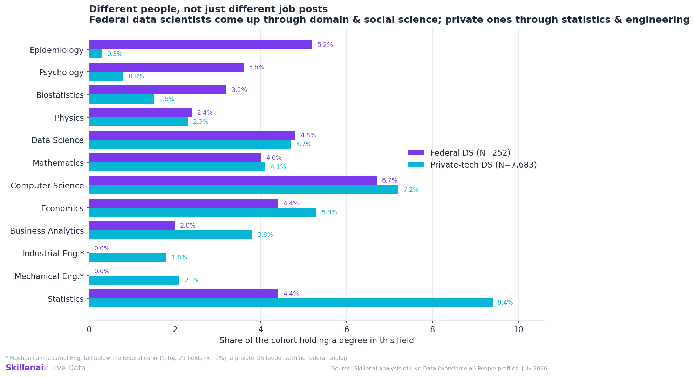
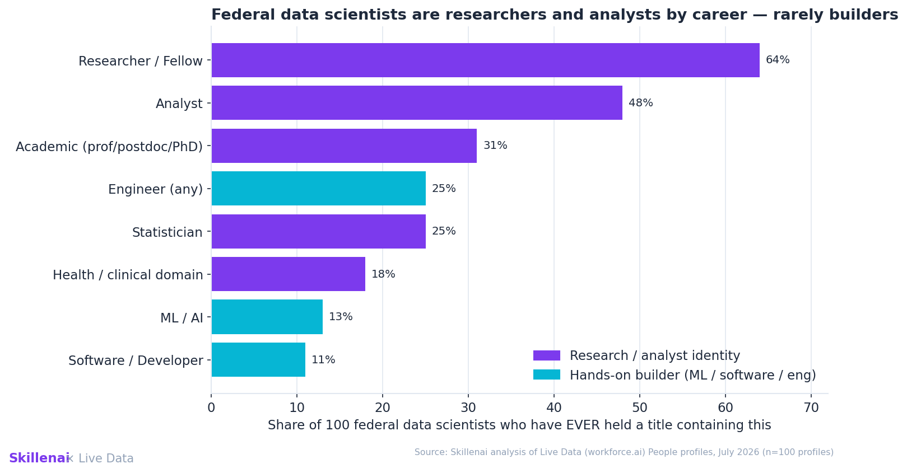
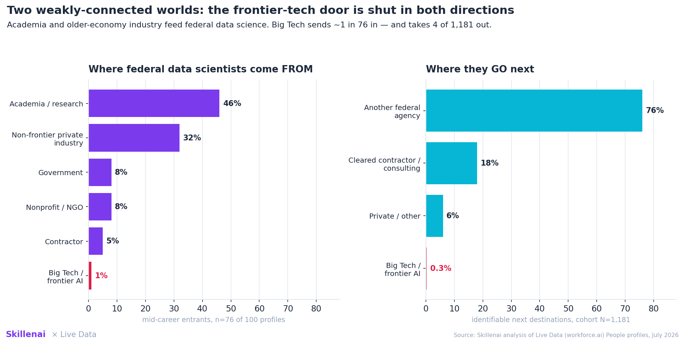

# Two Data-Science Worlds: Who Federal Data Scientists Actually Are, and Where They Come and Go

*Skillenai × Live Data analysis · July 2026 · supply-side profile data from [Live Data (workforce.ai)](https://workforce.ai) People. Draft for joint review — not yet published.*

Two earlier Skillenai posts looked at federal tech from the **demand** side — what employers pay and what postings ask for:

- [The federal tech bargain](https://github.com/skillenai/skillenai-notebooks/tree/master/federal-tech-broken-bargain): lower pay, near-zero mobility, held together by a back-loaded pension.
- [Same title, different job](https://github.com/skillenai/skillenai-notebooks/tree/master/federal-tech-skills-wall): under identical titles, federal and private postings ask for different tools — a federal Data Scientist posting is *statistics-and-reporting*, a private one is *code-experiment-deploy*.

Both raised a question job postings can't answer: **is that because the two sectors hire fundamentally different people — and can those people actually move between the sectors?** This post answers it from the **supply** side, using worker profile histories from Live Data instead of job postings.

**TL;DR**
- **Different people.** Federal data scientists come up through **domain and social science** (Epidemiology is their #2 field of study at 5.2%, Psychology 3.6%) plus statistics. Private-tech data scientists come up through a concentrated **quant-and-engineering** funnel (Statistics 9.4%, plus a Mechanical/Industrial/Chemical-engineering feeder that has *no federal analog*). Computer Science is ~equally common on both sides (6.7% vs 7.2%) — federal DS aren't CS-poor; they're **domain-heavy**.
- **Different careers.** Of 100 federal data scientists, **64% have held a "researcher/fellow" title and 48% an "analyst" title, but only 13% ever an ML/AI title and 11% a software/developer title.** Their federal job titles literally read `Statistician (Data Scientist)`, `Health Scientist (Data Scientist)`, `Mathematical Statistician (Data Scientist)` — the analyst/statistician lineage, embedded in the title.
- **Two weakly-connected worlds.** Federal data scientists are fed by **academia (~46%) and older-economy private industry (~32%)** — but **1 of 76** mid-career entrants came from Big Tech / a frontier-AI lab. On the way out, **4 of 1,181** federal DS went to Google (0.3%); departures overwhelmingly go to **other agencies (76%)** and **cleared beltway contractors** — Booz Allen, MITRE, Deloitte (18%).

**The one-line takeaway:** *A federal data scientist is far more likely to have studied epidemiology than a private one — and far more likely to end up at Booz Allen than at Google. The wall between federal and frontier-tech data science isn't just in the job description; it's in the résumé and the road in and out.*

---

## Data & method

- **Source:** Live Data (workforce.ai) People — supply-side LinkedIn-derived profiles (job history + education), queried via the analytics MCP. This is the mirror image of the Skillenai job index used in the two prior (demand-side) posts.
- **Populations.**
  - *Federal DS:* profiles with a "Data Scientist" title at ten federal agencies — Veterans Affairs, Defense, CDC, NIH, IRS, CMS, Federal Reserve Board, Treasury, NASA, Census.
  - *Private-tech DS:* profiles with a "Data Scientist" title at nine private tech firms — Google, Meta, Amazon, Microsoft, Apple, Netflix, Uber, Airbnb, Salesforce.
- **Sample sizes.** Education-field distributions: **252 federal / 7,683 private** active DS. Career-path (before/after the DS role): **1,181** federal DS. Origin hand-classification: a **100-profile** federal DS sample with full job history.
- **Measures.** Education = share of the cohort holding a degree in each field (multi-degree, so columns don't sum to 100). Title history = share of the 100 who have *ever* held a title containing a given token. Flows = the job immediately before/after the relevant role.

### What this is *not*

- **We do not have the LinkedIn "Skills" field.** Live Data's profile schema exposes job history and education, not the free-text skills/about sections. Everything here is an **education + title + movement proxy** for skill, not a direct read of listed skills. (Directly measuring listed skills would require the People-API profile-text surface — a natural follow-up.)
- **LinkedIn under-captures career civil servants,** and the profile record cannot cleanly separate **civil servants from on-site contractors** — the same limitation the demand-side post flagged. Treat federal shares as indicative, not census-grade.
- **Aggregate flows truncate the long tail** (destinations with <3 people are not itemized), so single-company private destinations are undercounted — the reported private-tech flow shares are **floors**, which only strengthens the "closed door" direction.

---

## 1. Different people: the education funnels

Read the fields these two populations studied and the funnels diverge:

| Field of study | Federal DS | Private-tech DS |
|---|---:|---:|
| Statistics | 4.4% | **9.4%** |
| Computer Science | 6.7% | 7.2% |
| Epidemiology | **5.2%** | 0.3% |
| Psychology | **3.6%** | 0.8% |
| Biostatistics | 3.2% | 1.5% |
| Economics | 4.4% | 5.3% |
| Data Science | 4.8% | 4.7% |
| Mathematics | 4.0% | 4.1% |
| Mechanical / Industrial Eng. | ~0%\* | 3.9% combined |

The distinguishing feature is **not** "federal = stats, private = CS" — Computer Science is essentially tied. It's that **federal data scientists carry a heavy domain- and social-science tail** (epidemiology, psychology, biology, sociology), while **private data scientists sit on a broader quant-and-engineering base** (more concentrated statistics, plus a mechanical/industrial/chemical-engineering feeder with no federal counterpart). The federal data scientist is often a *subject-matter expert who took up data science*; the private one is a *technical specialist*.

\* *Mechanical/Industrial Engineering fall below the federal cohort's top-25 fields (<~1%).*

## 2. Different careers: what they've actually done

Of 100 federal data scientists, the share who have **ever held a title containing**:

| Role token | Share |
|---|---:|
| Researcher / Fellow | 64% |
| Analyst | 48% |
| Academic (professor / postdoc / PhD) | 31% |
| Statistician | 25% |
| Engineer (any) | 25% |
| Health / clinical domain | 18% |
| ML / AI | **13%** |
| Software / Developer | **11%** |

These are researchers and analysts by career, not system-builders — which is exactly what the demand-side postings implied when federal DS listings named "machine learning" as often as private ones yet rarely asked for Python, experimentation, or MLOps. And the identity is stamped right into the current titles: federal data scientists are literally titled `Statistician (Data Scientist)`, `Health Scientist (Data Scientist)`, `Mathematical Statistician (Data Scientist)`, `Supervisory Health Scientist | Data Science Lead` — the occupational-series lineage worn on the badge.

## 3. Two weakly-connected worlds

**Where they come from** (100-profile hand-classification; shares are of the 76 who entered federal service mid-career):

| Origin | Share |
|---|---:|
| Academia / research institute | 46% |
| Non-frontier private industry (Micron, Illumina, Roche, Verizon, Target, USAA, insurance, telecom…) | 32% |
| Government (other public) | 8% |
| Nonprofit / NGO | 8% |
| Contractor / consulting | 5% |
| **Big Tech / frontier AI** | **1%** |

**Where they go next** (career-path over 1,181 federal DS; identifiable next destinations):

| Destination | Share |
|---|---:|
| Another federal agency | 76% |
| Cleared contractor / consulting (Booz Allen, MITRE, Deloitte) | 18% |
| Private / other | 6% |
| **Big Tech / frontier AI (Google)** | **0.3% (4 people)** |

There *is* a real pipeline into federal data science — but it runs through **universities and the older-economy private sector**, not frontier tech. Not one of the 76 mid-career entrants came from Google, Meta, Amazon, Apple, Microsoft, OpenAI or Anthropic; the single most "tech" origin in the whole sample was eBay. And the exit almost never lands at a frontier lab. **The door between federal and frontier-tech data science is shut in both directions** — while the doors to academia and legacy industry stay open.

---

## What it means

This is the supply-side confirmation of the two demand-side posts, and it sharpens their conclusion. The "same title, different job" divergence isn't a quirk of how agencies write postings — it reflects **genuinely different people on genuinely different career circuits**. Federal data scientists are domain experts and statisticians drawn from academia and legacy industry; they do analyst and research work; and when they move, they circulate within government and its contractor belt.

That reframes the current federal hiring problem. The worry isn't that the government *used* to hire from private industry and suddenly can't — it hired from academia and older-economy firms all along, and still could. The worry is narrower and harder: **there was never a frontier-tech ↔ federal pipeline to begin with.** You cannot quickly rebuild a modern ML-engineering bench by poaching from Google, because that path has essentially never been walked — in either direction — and the pipelines that *do* feed federal data science (academia, legacy industry) are slower and are exactly the people most exposed to the recent turmoil.

**If you're a federal data scientist eyeing private tech:** your background likely reads as *domain scientist / statistician / analyst*, and the frontier-tech market you'd be entering hires for *engineering and experimentation*. The move is a retraining project, and the near-total absence of this path in the data is the honest signal of how hard it is.

**If you're at a frontier-tech firm thinking about federal service:** almost no one has made this move, which cuts two ways — the culture gap is real, but the scarcity is also the opportunity if the mission appeals.

**For the government:** closing the pay gap wouldn't, by itself, make a modern ML-engineering workforce appear. The talent it can realistically attract is the analyst/researcher lineage it already draws — a different job architecture from the one frontier tech runs on.

---

## Reproduce it & caveats

- All figures render from `make_figures.py` using values captured from the Live Data People analytics run (education facets, career-path before/after, and a 100-profile job-history pull).
- **Supply-side proxy, not listed skills.** Education + title + movement stand in for skill; the LinkedIn skills field is not in the profile schema used here.
- **Federal agency mix is health/benefits-heavy** (VA, CDC, NIH, CMS), which drives the specific domains in the tail (epidemiology, biostatistics). A defense/intelligence-weighted set would shift the *domains* (toward physics/EE) but not the general pattern — a domain-expert funnel versus a technical-specialist funnel.
- **Contractor-vs-civil-service** movement is only partially observable; much federal↔private technical mobility runs through the contractor channel, which shows up here as the Booz Allen / MITRE / Deloitte destinations.
- **Private-tech flow shares are floors** due to long-tail truncation in the aggregate flows; the 100-profile origin split is hand-classified from actual employer names.
