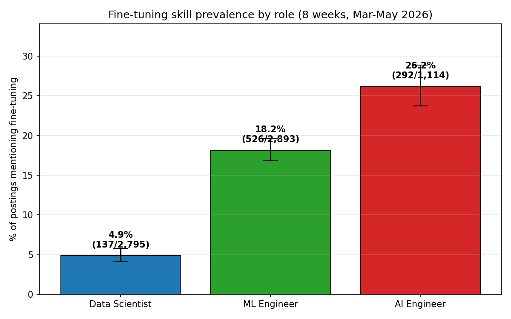
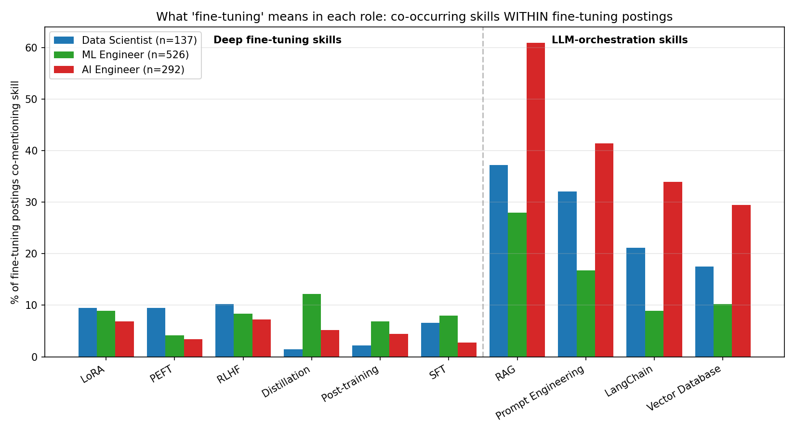
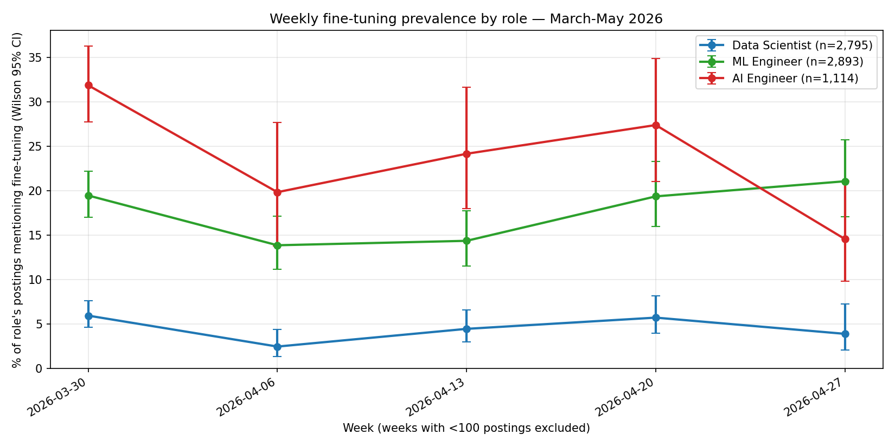

# Is Fine-Tuning Coming Back for AI Engineers, or Moving to MLEs?

**Date:** 2026-05-02
**Source:** Skillenai `/v1/query/search` against `prod-enriched-jobs` (8 weeks, 2026-03-10 → 2026-05-03)
**Scope:** 6,802 job postings across three roles — Data Scientist (2,795), ML Engineer + Machine Learning Engineer (2,893), AI Engineer + Artificial Intelligence Engineer (1,114)

---

## TL;DR

Three findings that contradict each other in interesting ways:

1. **AI Engineer postings mention fine-tuning more than any other role** — 26.2% vs 18.2% for ML Engineers and 4.9% for Data Scientists. The differences are highly significant (chi-square *p* < 1e-80, Cramér's V = 0.23).

2. **But "fine-tuning" means very different things in each role.** When an **AI Engineer** posting mentions fine-tuning, it overwhelmingly co-mentions RAG (61%), prompt engineering (41%), LangChain (34%), and vector databases (30%). The deep fine-tuning skills — LoRA, PEFT, distillation, RLHF, post-training — are barely there. **AI Engineers fine-tune as one item on a long LLM-orchestration to-do list.**

3. **ML Engineers are where actual model-surgery fine-tuning lives.** When an MLE posting mentions fine-tuning, it co-mentions distillation (12.2%), LoRA (8.9%), RLHF (8.4%), SFT (8.0%), and post-training (6.8%) — all roughly 2× the AI Engineer rates. **MLEs are the ones actually building and running fine-tuning pipelines.**

The 2-month time-series is too short and too noisy (Mann-Kendall *p* > 0.4 for all three roles) to confirm or refute the "fine-tuning is making a comeback" narrative. But the cross-sectional picture is clear: **fine-tuning is not being absorbed away from AI Engineers — but the deep technical fine-tuning work is concentrated in ML Engineer postings, not AI Engineer postings.**

---

## The headline number

| Role | Postings | % mentioning fine-tuning | 95% CI |
|---|---:|---:|---|
| Data Scientist | 2,795 | 4.9% | 4.1% – 5.8% |
| ML Engineer | 2,893 | 18.2% | 16.8% – 19.6% |
| AI Engineer | 1,114 | 26.2% | 23.7% – 28.9% |

**Pairwise chi-square tests** (all significant after Bonferroni):

| Pair | Difference | 95% CI | *p* |
|---|---:|---|---|
| AIE vs MLE | +8.0 pp | +5.1, +11.0 | 2.1e-08 |
| AIE vs DS  | +21.3 pp | +18.6, +24.0 | 5.0e-82 |
| MLE vs DS  | +13.3 pp | +11.7, +14.9 | 1.3e-54 |

Even with a generous phrase match (`fine-tuning`, `fine tuning`, `finetuning`, `fine-tune`, `finetune`), AI Engineers come out clearly ahead. The bar chart looks like a stack you'd expect: more AI in your title means more fine-tuning in your job description. That's the cross-section. Below is where it gets weird.

---

## What "fine-tuning" actually means in each role

This is the central finding. Within the subset of postings *that mention fine-tuning*, we counted co-occurrence with two clusters of skills:

- **Deep fine-tuning skills**: LoRA, PEFT, RLHF, distillation, post-training, SFT
- **LLM-orchestration skills**: RAG, prompt engineering, LangChain, vector databases

| Skill | DS (n=137) | MLE (n=526) | AIE (n=292) |
|---|---:|---:|---:|
| **Deep fine-tuning skills** | | | |
| LoRA | 9.5% | 8.9% | 6.8% |
| PEFT | 9.5% | 4.2% | 3.4% |
| RLHF | 10.2% | 8.4% | 7.2% |
| Distillation | 1.5% | **12.2%** | 5.1% |
| Post-training | 2.2% | 6.8% | 4.5% |
| SFT | 6.6% | 8.0% | 2.7% |
| **LLM-orchestration skills** | | | |
| RAG | 37.2% | 27.9% | **61.0%** |
| Prompt engineering | 32.1% | 16.7% | **41.4%** |
| LangChain | 21.2% | 8.9% | **33.9%** |
| Vector database | 17.5% | 10.3% | **29.5%** |

Look at the deep-fine-tuning column for **AI Engineer**: every single one is *lower* than the ML Engineer rate. Distillation in MLE postings is 2.4× the AIE rate. Even SFT (the most generic LLM-tuning term) is 3× more common in MLE fine-tuning postings.

Now look at the orchestration column for **AI Engineer**: RAG at 61% is more than 2× the MLE rate. LangChain at 34% is 4× the MLE rate. **A "fine-tuning" mention in an AI Engineer posting is overwhelmingly accompanied by orchestration skills, not training skills.**

This is the picture you get when you read a sample of postings:

> *"AI Engineer | NeuBird.ai: You will work with RLHF and fine-tuning of LLMs."* — fine-tuning as one of several LLM-stack tasks.
>
> *"Senior AI Engineer | sage49: design repeatable fine-tuning pipelines that allow models to continuously improve with new production data."* — operational, pipeline-level.
>
> *"AI Engineer | ruby-labs: performing fine-tuning when necessary to meet specific domain requirements."* — defensive, occasional.

Versus an ML Engineer posting:

> *"ML/AI Software Engineer – Optimization for Training, Fine-Tuning | AMD: ML pipelines for training, fine-tuning, reinforcement learning, and agentic systems."* — fine-tuning is the job.
>
> *"Forward Deployed Engineer | LLM Post-training | reflectionai: drive model fine-tuning and evaluations for enterprise customers."* — fine-tuning *is* the role.

---

## Did anything move over 2 months?

We tested for a monotonic trend with the Mann-Kendall test on the five weeks with N≥100 postings per role:

| Role | Weeks observed | Range | Mann-Kendall *S* | *p* |
|---|---|---|---:|---:|
| Data Scientist | 5 | 2.5% – 6.0% | -2 | 0.81 |
| ML Engineer | 5 | 13.9% – 21.1% | +4 | 0.46 |
| AI Engineer | 5 | 14.6% – 31.9% | -4 | 0.46 |

**No significant trend in any role.** The ML Engineer series has the most directional shape — a dip in early April followed by a climb back to 21.1% by the last full week — but with five data points and no replication it's not a finding. The AI Engineer series is dominated by week-to-week noise driven by small per-week sample sizes (~150 postings).

The honest answer to *"is fine-tuning making a comeback for AI Engineers?"* is **the 2-month window is too short to tell.** What we can say with confidence is the *level*: AI Engineers ask for fine-tuning more than any other role, and that has been true throughout the observation window. But whether the level itself is rising is a question for September.

---

## So is fine-tuning being absorbed by MLEs and Data Scientists?

**Data Scientists: no.** At 4.9% prevalence, fine-tuning is barely on the DS radar — and where it does appear (LoRA at 9.5%, PEFT at 9.5% within fine-tuning postings), it's mostly research-flavored work in places like healthcare LLMs and recommendation systems. The DS role is still defined by SQL, statistics, and experimentation, not by model surgery.

**ML Engineers: partially yes.** This is where the user's intuition has the most support. ML Engineer postings have the deepest co-occurrence with the technical fine-tuning toolkit:

- Distillation: 12.2% vs AIE's 5.1% (the biggest split)
- Post-training: 6.8% vs AIE's 4.5%
- LoRA: 8.9% vs AIE's 6.8%
- RLHF: 8.4% vs AIE's 7.2%

If by "absorbed by MLEs" we mean *the actual production training work — distillation, RLHF, post-training pipelines — is concentrated in ML Engineer postings rather than AI Engineer postings*, then yes. The AI Engineer role has captured the *word* "fine-tuning" more than any other role; the ML Engineer role has captured the *substance* of it.

**The cleanest one-line summary:** *AI Engineers fine-tune the API. ML Engineers fine-tune the model.*

---

## Caveats and methodology

- **Phrase matching, not entity tagging.** We used `match_phrase` on `extractedText` for `["fine-tuning", "fine tuning", "finetuning", "fine-tune", "finetune"]` rather than the entity-resolved skill canonical names. Reason: the entity resolver fragments fine-tuning into 30+ near-duplicate canonical names (a known data-quality issue tracked internally), and phrase matching gives much better recall. The cost is that we may pick up prose mentions in addition to listed-skill mentions; spot checks of 18 postings (6 per role) found all matches were genuine job-relevant references, but we have not formally measured precision.
- **Co-occurrence, not skill graphs.** Counting whether two terms co-occur in a posting is a coarser signal than counting whether they're both listed as required skills. A posting can mention "RAG" once in a tool list and "fine-tuning" once in a paragraph about the team's mission; both contribute to the co-occurrence count. We expect this overcounts orchestration skills slightly more than deep-FT skills (RAG and LangChain appear in tool lists more often than LoRA).
- **Time-series uses `ingestedAt`, not `postedDate`.** The platform doesn't store posting dates yet, so the time bins reflect when the crawler picked up the posting. The week of 2026-03-30 is a 58K-document backfill spike that scrambles absolute counts but should not bias the *proportion* — both numerator and denominator are drawn from the same week.
- **Big Tech under-representation.** Google, Apple, Microsoft, NVIDIA and Netflix are largely absent from the index because their proprietary ATS platforms are not scraped. These five hire heavily for fine-tuning at all three role labels; their absence likely *under*-states the deep-FT signal in MLE postings. The direction of bias supports the headline finding rather than threatening it.
- **Spam filter.** The `Speechify` spam carpet-bomb is excluded by default in the Skillenai pipeline; no separate filter applied.
- **Ingestion window.** 2026-03-10 → 2026-05-03 (8 weeks). Two early weeks (Mar 9, Mar 16) excluded from trend tests because per-role N < 100.

### Reproduction

Scripts in `/tmp/finetuning-analysis/` of the analysis machine:

- `run_analysis.py` — pulls weekly counts and adjacency aggregations
- `stats_and_plots.py` — chi-square, Mann-Kendall, Wilson CIs, the three figures
- `sample_contexts.py` — the qualitative read

Raw counts in `results.json` alongside this README.

---

## Takeaways

1. **AI Engineer postings ask for fine-tuning more than any role** (26.2% vs 18.2% MLE vs 4.9% DS). All pairwise differences are highly significant.

2. **But the term means orchestration in AI Engineer postings and training in ML Engineer postings.** AIE fine-tuning postings co-mention RAG, LangChain, prompt engineering, and vector databases at 2–4× the MLE rate; MLE fine-tuning postings co-mention distillation, post-training, and SFT at 1.5–2.5× the AIE rate.

3. **The "fine-tuning is making a comeback" claim cannot be tested with two months of data** — Mann-Kendall trend tests are non-significant for all three roles. Revisit in Q3 when a longer time series is available.

4. **The "fine-tuning is being absorbed by other roles" claim is partially true for ML Engineers** — they own the deep technical fine-tuning toolkit — but flatly false for Data Scientists, who still barely engage with the topic.

5. **For practitioners**: if you want to fine-tune as a hands-on job-shaping skill, the role to target is *ML Engineer*, not AI Engineer. AI Engineer postings will mention fine-tuning more often, but the role is shaped around LLM orchestration; the depth lives in the MLE postings.
