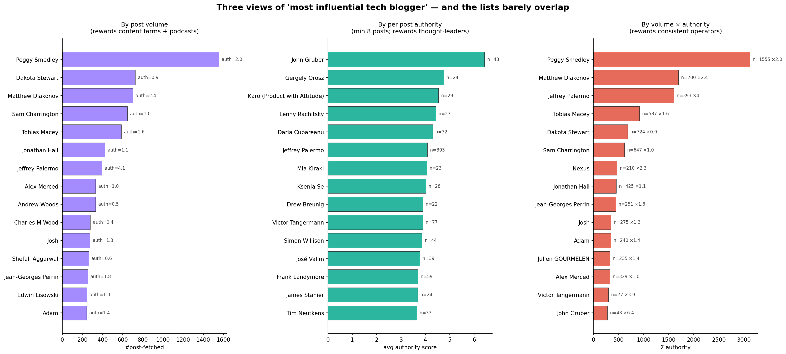
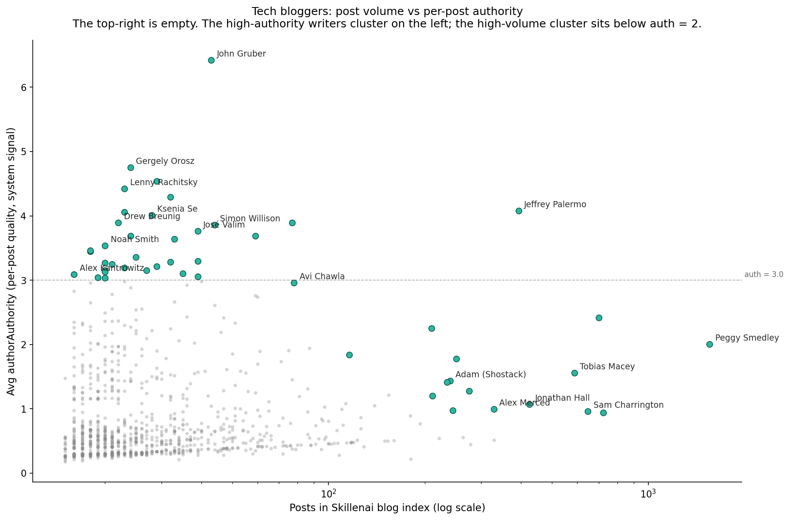
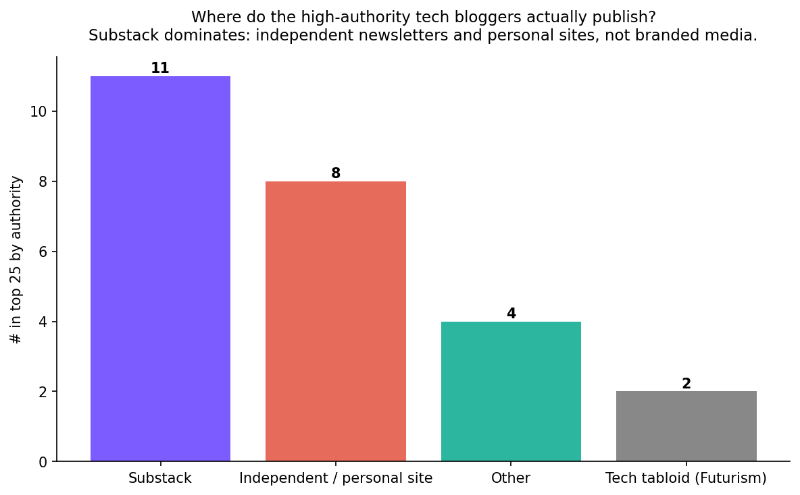
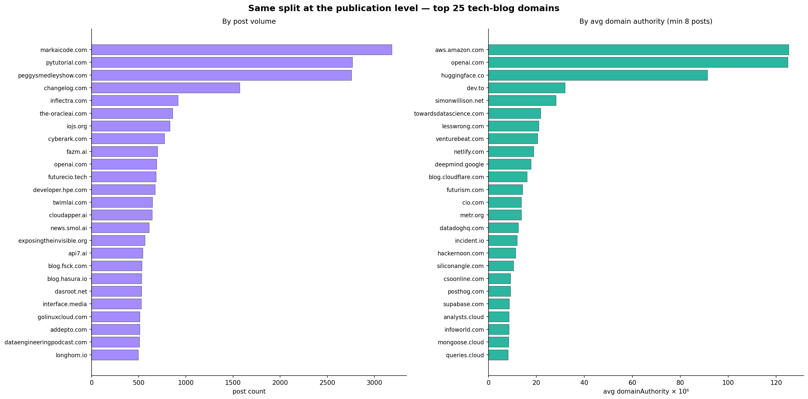

# Who are the most influential bloggers in tech?

**Date:** 2026-05-08
**Source:** Skillenai blog index — 335,373 enriched documents (`source_type = blog`).
**Methodology:** OpenSearch aggregations on `prod-enriched-blog`, filtered to docs with both an `author` byline and a system-computed `authorAuthority` score (~99K docs); junk authors and misclassified domains removed; minimum 5 posts per author for inclusion in author-level rankings.

---

## TL;DR

There is no single "most influential tech blogger" — there are three almost-disjoint populations, depending on which lens you use, and **the volume ranking and the authority ranking share exactly one name**.

| Lens | What it rewards | Top-of-list flavor |
|---|---|---|
| Post **volume** (raw count) | Throughput | SEO content farms, niche industry publications, podcast feeds |
| Per-post **authority** (avg system score) | Topical credibility | Substack newsletters and personal sites — the names you'd actually recognize |
| **Σ authority** (volume × per-post authority) | Sustained, on-topic operation | Tech podcasters and a handful of operator-bloggers |

**Jaccard overlap between the top-20 lists:**
- Volume vs Authority → **0.026** (1 overlap: Jeffrey Palermo)
- Authority vs Σ → **0.111** (4 overlaps)
- Volume vs Σ → **0.600** (15 overlaps — they're the same population, just re-weighted)

The two rankings that matter for the question — *volume* and *authority* — barely overlap at all.

---

## The shape of "influence"

Plot every author with ≥ 5 posts and you get an L-shape. The top-right quadrant — high volume *and* high authority — is essentially empty. There are only two ways to get into the corpus a lot: be a content farm (low authority) or be a podcaster (mid authority). Real thought leaders cluster on the left at < 50 posts.

The high-authority writers — John Gruber, Gergely Orosz, Lenny Rachitsky, Nathan Lambert, Simon Willison, Ksenia Se, Ethan Mollick, Drew Breunig, Noah Smith, José Valim, Melanie Mitchell, Jack Clark, Alex Kantrowitz — all sit between 8 and 60 posts. Their sustained output isn't blog-volume, it's quality-per-post.

The high-volume writers — Peggy Smedley (1,555 posts at peggysmedleyshow.com), Dakota Stewart (724 posts at the-oracleai.com), Matthew Diakonov (700 posts at fazm.ai), Charles M Wood (278 posts at javascriptjabber.com), Edwin Lisowski (245 posts at addepto.com) — all sit below authority = 2.0. Most of these names are unfamiliar to most working tech readers; the few that are familiar (Sam Charrington of TWIML, Tobias Macey of Data Engineering Podcast) are podcasters, not bloggers in the conventional sense.

The single name straddling both buckets is **Jeffrey Palermo** (393 posts, authority 4.08), who runs Azure DevOps Show — the rare both-volume-and-quality outlier.

---

## Top 25 by per-post authority — the recognizable names

Minimum 8 posts to filter incidental drive-by authors.

| Rank | Author | Posts | Avg authority | Primary publication |
|---:|---|---:|---:|---|
| 1 | John Gruber | 43 | 6.42 | Daring Fireball (via RSS aggregator) |
| 2 | Gergely Orosz | 24 | 4.75 | blog.pragmaticengineer.com |
| 3 | Karo (Product with Attitude) | 29 | 4.54 | karozieminski.substack.com |
| 4 | Lenny Rachitsky | 23 | 4.42 | lennynewsletter.com |
| 5 | Daria Cupareanu | 32 | 4.30 | aiblewmymind.substack.com |
| 6 | Jeffrey Palermo | 393 | 4.08 | azuredevops.show |
| 7 | Mia Kiraki | 23 | 4.06 | robotsatemyhomework.substack.com |
| 8 | Ksenia Se | 28 | 4.01 | turingpost.substack.com |
| 9 | Drew Breunig | 22 | 3.90 | dbreunig.com |
| 10 | Victor Tangermann | 77 | 3.90 | futurism.com |
| 11 | Simon Willison | 44 | 3.86 | simonwillison.net |
| 12 | José Valim | 39 | 3.77 | dashbit.co |
| 13 | Frank Landymore | 59 | 3.69 | futurism.com |
| 14 | James Stanier | 24 | 3.69 | theengineeringmanager.substack.com |
| 15 | Tim Neutkens | 33 | 3.64 | rc.nextjs.org |
| 16 | Noah Smith | 20 | 3.54 | noahpinion.substack.com |
| 17 | Neil Perkin | 18 | 3.46 | onlydeadfish.substack.com |
| 18 | James Wang | 18 | 3.45 | weightythoughts.com |
| 19 | Karen Spinner | 25 | 3.36 | wonderingaboutai.substack.com |
| 20 | Jenny Ouyang | 39 | 3.30 | buildtolaunch.substack.com |
| 21 | Dheeraj Sharma | 32 | 3.28 | genaiunplugged.substack.com |
| 22 | Eric Newcomer | 20 | 3.27 | intellyx.com |
| 23 | Heather Baker | 21 | 3.25 | thehumansintheloop.ai |
| 24 | Devansh | 29 | 3.21 | artificialintelligencemadesimple.com |
| 25 | Kendra Ramirez | 23 | 3.20 | kendratech.substack.com |

---

## Top 20 by raw post volume — the throughput-of-words view

Same corpus, different ranking. Most of these are unfamiliar to most working tech readers.

| Rank | Author | Posts | Avg authority | Primary publication |
|---:|---|---:|---:|---|
| 1 | Peggy Smedley | 1,555 | 2.01 | peggysmedleyshow.com |
| 2 | Dakota Stewart | 724 | 0.94 | the-oracleai.com |
| 3 | Matthew Diakonov | 700 | 2.42 | fazm.ai |
| 4 | Sam Charrington | 647 | 0.96 | twimlai.com |
| 5 | Tobias Macey | 587 | 1.56 | dataengineeringpodcast.com |
| 6 | Jonathan Hall | 425 | 1.07 | jhall.io |
| 7 | Jeffrey Palermo | 393 | 4.08 | azuredevops.show |
| 8 | Alex Merced | 329 | 1.00 | datalakehousehub.com |
| 9 | Andrew Woods | 329 | 0.52 | supplychainstrategy.media |
| 10 | Charles M Wood | 278 | 0.45 | javascriptjabber.com |
| 11 | Josh | 275 | 1.28 | aisdr.com |
| 12 | Shefali Aggarwal | 263 | 0.56 | qubole.com |
| 13 | Jean-Georges Perrin | 251 | 1.78 | jgp.ai |
| 14 | Edwin Lisowski | 245 | 0.98 | addepto.com |
| 15 | Adam | 240 | 1.44 | shostack.org |
| 16 | Julien GOURMELEN | 235 | 1.41 | wizops.fr |
| 17 | aiforgoodstg2 | 222 | 0.54 | aiforgood.itu.int |
| 18 | Waylon Walker | 211 | 1.20 | waylonwalker.com |
| 19 | Nexus | 210 | 2.25 | nexusconnect.io |
| 20 | Artur Haponik | 193 | 0.77 | addepto.com |

A few of these are real domain-influential figures — Tobias Macey runs the Data Engineering Podcast, Sam Charrington runs TWIML, Jonathan Hall publishes a long-running DevOps newsletter, "Adam" at shostack.org is Adam Shostack of *Threat Modeling: Designing for Security*. But the bulk of the list is unfamiliar even to specialists.

---

## Where do the high-authority bloggers actually publish?

Of the top 25 by per-post authority, **11 publish on Substack**, **8 on independent personal sites** (`dbreunig.com`, `simonwillison.net`, `dashbit.co`, etc.), and only 2 are on traditional tech-media properties (both from Futurism). The traditional tech press — TechCrunch, Wired, The Verge, Ars Technica — does not surface in the top 25 author list at all. Their high-authority work shows up at the *publication* level, not the byline level: in the by-domain ranking, theverge.com, openai.com, huggingface.co, and aws.amazon.com all rank in the top 5.

Read alongside the volume ranking, the implication is clean: **influential individual bloggers in 2026 are mostly newsletter writers**. The "blog" form has bifurcated — Substack newsletters carry the names, traditional blog-form CMSes carry the volume.

---

## At the publication level

The same volume-vs-authority gap repeats at the domain level. The top-volume domains are content farms (`markaicode.com`, `pytutorial.com`) and niche shows (`peggysmedleyshow.com`); the top-authority domains are research labs (`openai.com`, `huggingface.co`, `aws.amazon.com`), major platforms (`medium.com`, `dev.to`, `news.ycombinator.com`), and a single personal site (`simonwillison.net` at #11, with 92 posts indexed).

The Skillenai-recognized "domain authority" scores are tiny absolute numbers (~10⁻⁶) but rank-stable — the chart shows them as `× 10⁶` for readability.

---

## Caveats and methodology notes

- **Corpus selection bias.** The Skillenai blog index is the subset of tech-relevant content the crawler discovered through public RSS feeds. Substack writers without exposed RSS, walled-garden newsletters, and influential bloggers who don't expose feeds are under-represented. Many traditional tech-press bylines (Ars, Wired, NYT-tech) are absent or thin because their feeds aren't directly ingested.
- **Author-field coverage is 41%.** Of 335,373 blog docs, only 138,586 have an `author` field at all. RSS feeds are inconsistent about exposing authors; many real bylines are buried in HTML or invisible to the crawler.
- **Author-string quality is uneven.** Initial passes surfaced HTML fragments, Gravatar URLs, raw email addresses, generic "admin"/"Author"/"Unknown", multi-author blobs ("Justin Brodley, Jonathan Baker, Ryan Lucas and Matt Kohn | Cloud Computing & AI News"), and team accounts ("FutureCIO Editors", "Cribl", "BigPanda"). All filtered out before ranking.
- **Mis-classified `source_type=blog`.** A few non-blog sources were classified as blogs and surfaced in the top-volume list: `search.jobs.barclays` (1,049 records — ATS job listings), `nofluffjobs.com` (697 records — job board), `vascularnews.com` (1,001 records — vascular medicine, not tech), `researchsquare.com` (1,056 records — preprint server), `lup.lub.lu.se` (Lund University academic repository). All filtered from these rankings.
- **System authority signal.** `authorAuthority` is a Skillenai-pre-computed score (likely a relevance × diversity composite over the author's posts). Face validity is strong — the highest-authority list contains the canonical names of contemporary tech commentary — but it is *not* a measure of citations, social sharing, or external influence; it's an internal embedding-derived signal.
- **Volume is post-fetched, not posts-published.** The crawler's coverage of a feed depends on when discovery happened and whether the feed exposes archives. A blogger publishing for ten years may have only their last year of posts in the index.

---

## Files in this folder

- `01_three_rankings.png`, `02_volume_vs_authority.png`, `03_domains.png`, `04_publication_homes.png` — figures
- `authors_cleaned.json`, `domains_cleaned.json`, `rankings_summary.json` — ranked datasets
- `fetch_rankings.py`, `make_charts.py` — reproducer scripts
