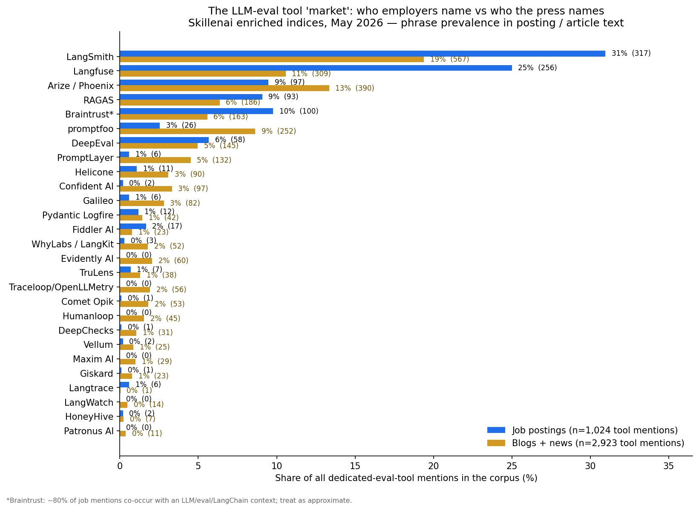
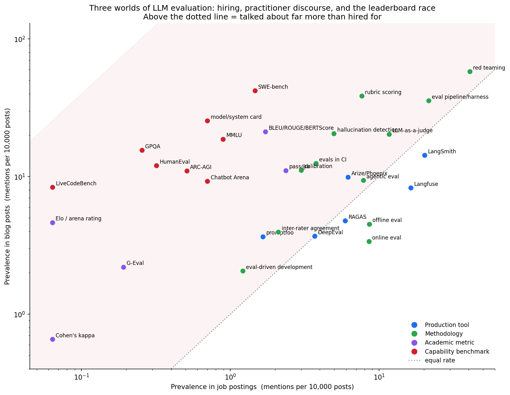
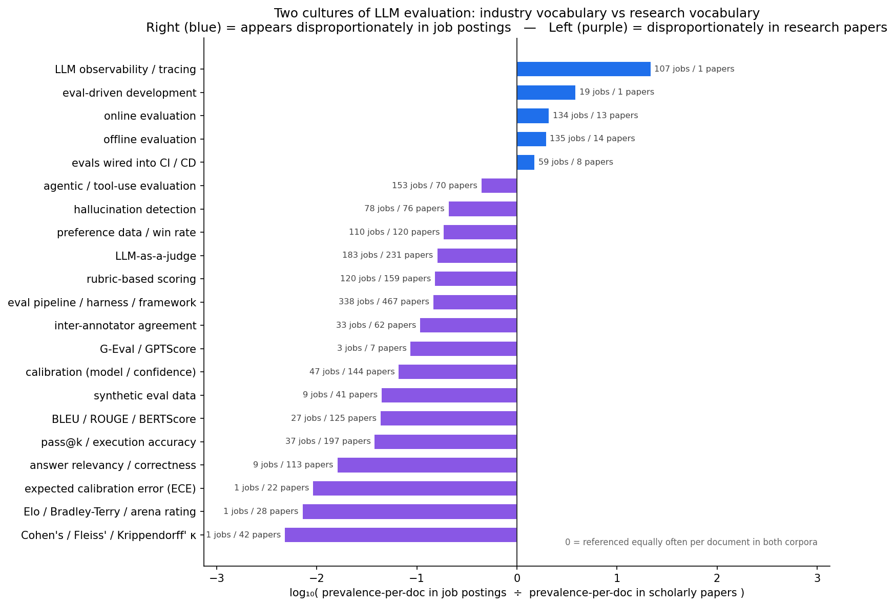
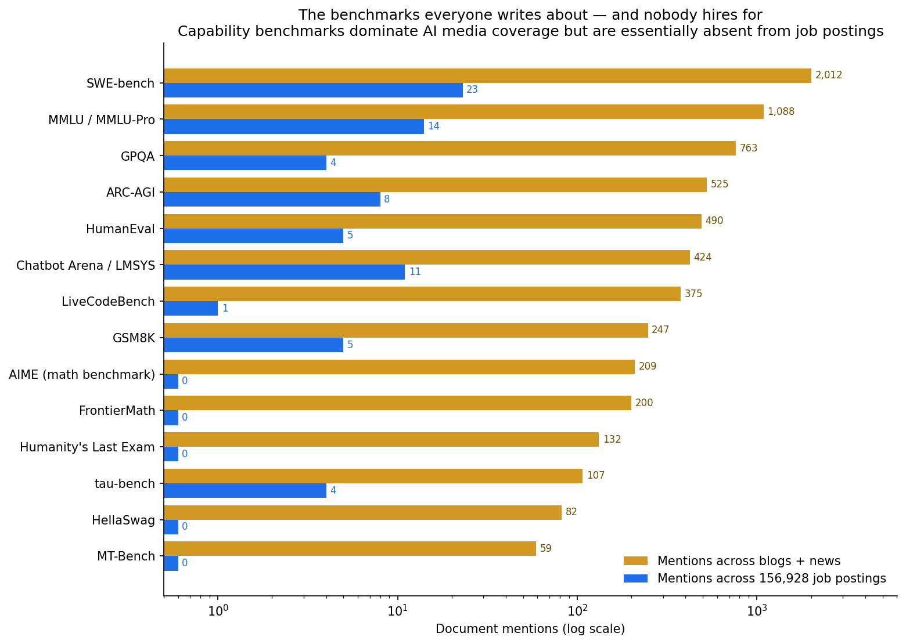
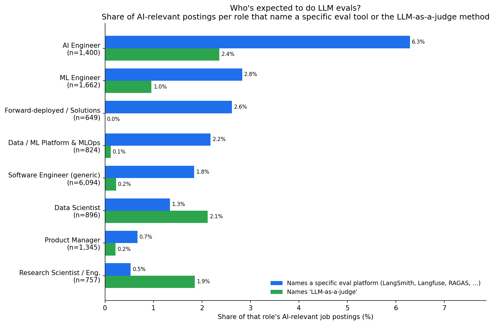

# The LLM-eval landscape: what employers name, what the press argues about, and what (if anything) is standardizing

**Analysis date:** 2026-05-12
**Data source:** Skillenai enriched indices — `prod-enriched-jobs` (156,928 job postings), `prod-enriched-blog` (349,305 posts), `prod-enriched-news` (86,184 articles), `prod-enriched-scholarly` (31,720 papers). Snapshot as of 2026-05-12.
**Method:** phrase prevalence (`match_phrase` on the full `extractedText` of each document) for ~90 eval frameworks / observability platforms / benchmarks and ~55 evaluation methodologies & metric names. Counts are document counts (`track_total_hits: true`), not occurrences. Multi-spelling concepts are OR-groups of phrases. See *Methodology & caveats* at the bottom.

---

## TL;DR

The "LLM evaluation" space looks like one topic but is really **three separate conversations that barely touch**:

1. **Hiring** names a tiny set of *production tools.* Of 156,928 job postings, **no eval framework cracks 1% adoption.** LangSmith (317 postings) and Langfuse (256) are the only two that have crossed into hiring at any scale; RAGAS (93) is the de-facto library when the job is RAG; everything else — DeepEval, Braintrust, Arize/Phoenix, promptfoo, Helicone, PromptLayer, Comet/Opik, Evidently, Galileo, Patronus, TruLens, Giskard, DeepChecks, Humanloop, Traceloop, WhyLabs, Maxim, LangWatch, Literal AI, Lunary, Autoblocks, HoneyHive, … — registers in **single digits or zeros.**
2. **Practitioner discourse** (blogs/news) is converging on a *method, not a product*: **LLM-as-a-judge**, almost always paired with a **rubric**, plus an **offline + online** eval split that often gets **wired into CI**. "LLM-as-a-judge" out-mentions every individual tool in the blog corpus (709 vs LangSmith's 500).
3. **AI media** obsesses over *capability benchmarks* — SWE-bench, MMLU, GPQA, HumanEval, ARC-AGI, Chatbot Arena, LiveCodeBench, AIME, FrontierMath, Humanity's Last Exam — that show up in **roughly zero job postings.** SWE-bench: 2,012 blog+news mentions, **23** in 156,928 job postings. GPQA: 763 vs **4**.

And the rigor academia uses to validate evaluators — **Cohen's / Fleiss' / Krippendorff's κ, ICC, expected calibration error, Elo/Bradley-Terry** — essentially **did not transfer to industry**: combined, those terms appear in **~3 job postings** total. The classic NLP metrics (BLEU, ROUGE, BERTScore) are headed the same way — 27 job postings vs 125 scholarly papers.

> **The AI industry agreed on _how_ to evaluate LLMs — "LLM-as-a-judge", with a rubric, offline and online — long before it agreed on _what to evaluate with_. No eval framework has more than ~0.2% penetration in job postings, the statistics academics use to validate judges are absent from hiring, and the benchmarks every blog argues about don't appear in job descriptions at all.**

---

## 1. Scope: how much "eval" is in the corpus at all

| Corpus | Total docs | Mention an LLM / GenAI term | …and an eval / benchmark term |
|---|---:|---:|---:|
| Job postings | 156,928 | 33,580 (21%) | **8,569** (5.5% of all; **~26% of AI-relevant postings**) |
| Blog posts | 349,305 | 75,805 (22%) | 13,292 |
| News articles | 86,184 | 27,557 (32%) | 3,217 |

So roughly **one in four AI-relevant job postings** says something about evaluating or benchmarking models. The question is *what* they say.

---

## 2. The eval-tool "market": who employers name vs who the press names

Among postings/articles that name **any dedicated eval or eval-capable observability tool**, here is each tool's share of those mentions.

| Tool | Job postings | share of tool-mentions | Blogs + news | share |
|---|---:|---:|---:|---:|
| **LangSmith** | 317 | **31%** | 567 | 20% |
| **Langfuse** | 256 | **25%** | 309 | 11% |
| Arize / Phoenix | 97 | 9% | 390 | 13% |
| Braintrust\* | ~100 | 10% | 163 | 6% |
| **RAGAS** | 93 | 9% | 186 | 6% |
| DeepEval | 58 | 6% | 145 | 5% |
| promptfoo | 26 | 2% | 252 | 9% |
| Helicone | 11 | 1% | 90 | 3% |
| PromptLayer | 6 | <1% | 132 | 5% |
| Confident AI | 2 | <1% | 97 | 3% |
| Galileo | 6 | <1% | 82 | 3% |
| Pydantic Logfire | 12 | 1% | 42 | 1% |
| Comet Opik | 1 | <1% | 53 | 2% |
| Traceloop / OpenLLMetry | 0 | 0% | 56 | 2% |
| Evidently AI | 0 | 0% | 60 | 2% |
| WhyLabs / LangKit | 3 | <1% | 52 | 2% |
| Fiddler AI | 17 | 2% | 23 | 1% |
| TruLens | 7 | <1% | 38 | 1% |
| Humanloop | 0 | 0% | 45 | 2% |
| Langtrace | 6 | <1% | 1 | 0% |
| DeepChecks | 1 | <1% | 31 | 1% |
| Giskard | 1 | <1% | 23 | 1% |
| Vellum | 2 | <1% | 25 | 1% |
| Maxim AI | 0 | 0% | 29 | 1% |
| LangWatch | 0 | 0% | 14 | <1% |
| Patronus AI | 0 | 0% | 11 | <1% |
| HoneyHive | 2 | <1% | 7 | <1% |
| *(Athina AI, Literal AI, Lunary, Autoblocks, Gentrace, Parea, Freeplay, Phospho, Ragmetrics, UpTrain, …)* | 0–5 each | — | 0–10 each | — |

\*`Braintrust` is noisy: of the ~100 job-posting mentions, about 80 co-occur with an LLM / eval / LangChain / OpenAI context; the rest may be the plain English phrase or the unrelated freelance marketplace of the same name. Treat as approximate.

**Read this two ways:**
- **Hiring is highly concentrated** — LangSmith + Langfuse account for **56% of all eval-tool mentions in job postings**. If a posting names an eval tool at all, more than half the time it's one of those two. The whole *category* is ~1,000 of 156,928 postings — fragmented and early, but what little there is has a clear top-two.
- **Discourse is much flatter** — in blogs+news, LangSmith's lead shrinks to 20%, with Arize/Phoenix (13%), Langfuse (11%), promptfoo (9%), RAGAS (6%) and DeepEval (5%) all live, plus a long tail of vendors (PromptLayer, Confident AI, Helicone, Galileo, Comet/Opik, Traceloop, Evidently, WhyLabs, Humanloop, Maxim) each in the 1–5% band that **never show up in hiring at all.** The vendor ecosystem is far larger than the hiring market reflects.

A note on what's *missing* from the tool table because it isn't really an eval tool: **MLflow** appears in 2,438 job postings and **Weights & Biases** in ~100 — but these are experiment-tracking / MLOps platforms that happen to ship an `mlflow.evaluate()` style helper, not dedicated eval frameworks. Within the 8,569 AI-eval job postings, MLflow appears in 4.7% — i.e. when someone says "we evaluate LLMs and we use a platform," the platform they already have is often MLflow, not a purpose-built eval tool. And **"guardrails"** appears in 3,587 postings, but ~58% of those are the plain English word ("project guardrails", "financial guardrails"); the named tools Guardrails-AI and NeMo-Guardrails are tiny (4 and 14 postings).

---

## 3. The three worlds, in one picture

Plot each concept by how often it appears per 10,000 documents in **job postings** (x) vs **blog posts** (y). Points far above the dotted line are *discussed far more than they're hired for*.

- **Production tools (blue)** sit near or below the diagonal — LangSmith and Langfuse are actually mentioned *more* per-capita in job postings than in blogs, which is the signature of something that has entered the hiring stack rather than just the conversation.
- **Capability benchmarks (red)** are all up in the top-left corner: SWE-bench, MMLU, GPQA, HumanEval, ARC-AGI, Chatbot Arena, LiveCodeBench, model/system cards — heavy in media, ~0 in hiring.
- **Academic metrics (purple)** — Cohen's kappa, Elo/arena ratings, G-Eval — are low everywhere but, where they exist, lean to research, not jobs.
- **Methodology (green)** is the spread-out middle: LLM-as-a-judge, rubric scoring, online/offline eval, evals-in-CI, agentic eval, hallucination detection.

---

## 4. Is anyone standardizing on a *methodology*? Yes — and it's not the academic one

We searched for ~55 methodology and metric phrases (rubrics, calibration, inter-rater agreement / Cohen's & Fleiss' & Krippendorff's kappa, golden datasets, online vs offline eval, A/B testing, human eval, preference data / Elo, regression testing, evals-in-CI, eval-driven development, red teaming, hallucination/groundedness, the RAGAS quartet, BLEU/ROUGE/BERTScore/G-Eval, pass@k, agent/trajectory eval, model cards, …). Doc counts:

| Methodology / concept | Jobs | Blog | News | Scholarly |
|---|---:|---:|---:|---:|
| **LLM-as-a-judge** | **183** | **709** | 125 | 231 |
| **rubric / rubric-based scoring** | **120** | 1,346 | 264 | 159 |
| **offline evaluation** | **135** | 158 | 15 | 14 |
| **online evaluation** | **134** | 118 | 13 | 13 |
| evals wired into CI / CD | 59 | 436 | 65 | 8 |
| evaluation pipeline / harness / framework | 338 | 1,245 | 274 | 467 |
| eval-driven development (as a coined term) | 19 | 72 | 2 | 0 |
| agent / agentic evaluation | 123 | 328 | 88 | 52 |
| trajectory / step-level / tool-use eval | 30 | 48 | 6 | 18 |
| LLM observability / tracing | 107 | 362 | 56 | 1 |
| hallucination detection / rate | 78 | 717 | 121 | 76 |
| groundedness / faithfulness / factual consistency\* | 483 | 1,278 | 289 | 331 |
| red teaming / adversarial testing\* | 638 | 2,030 | 556 | 115 |
| jailbreak / prompt-injection testing | 16 | 264 | 32 | 11 |
| safety / content-moderation eval | 130 | 177 | 52 | 44 |
| preference data / win rate\* | 110 | 463 | 121 | 120 |
| pairwise / side-by-side comparison\* | 1 | 735 | 83 | 40 |
| context precision / recall / relevancy (RAGAS) | 10 | 390 | 75 | 28 |
| answer relevancy / correctness (RAGAS) | 9 | 257 | 44 | 113 |
| golden dataset / golden set | 23 | 199 | 22 | 3 |
| synthetic eval data | 9 | 131 | 16 | 41 |
| inter-annotator / inter-rater agreement | **33** | 138 | 20 | 62 |
| **Cohen's kappa** | **1** | 23 | 0 | 24 |
| **Fleiss' kappa** | **0** | 11 | 1 | 14 |
| **Krippendorff's alpha** | **0** | 10 | 0 | 4 |
| intraclass correlation (ICC) | 0 | 14 | 6 | 4 |
| **expected calibration error (ECE)** | **0** | 21 | 3 | 22 |
| calibration (model / confidence) | 47 | 389 | 76 | 144 |
| **Elo / Bradley-Terry / arena rating** | **1** | 162 | 64 | 28 |
| pass@k / execution accuracy | 37 | 387 | 93 | 197 |
| BLEU / ROUGE / BERTScore / chrF / BLEURT | **27** | 740 | 104 | 125 |
| G-Eval / GPTScore | 3 | 77 | 16 | 7 |
| model card / system card | 11 | 889 | 305 | 7 |

\*Broad / generic terms — "faithfulness" alone is 41 job postings (the rest of that row is "factual accuracy" etc.); "red teaming" includes general security usage; "pairwise comparison"'s blog count is inflated by the generic phrase "side-by-side comparison"; "A/B testing" (3,180 job postings, not shown) is overwhelmingly product/marketing, not LLM eval. We don't headline these.

What stands out:

1. **LLM-as-a-judge is the only LLM-native methodology with real hiring traction.** It out-mentions every individual product in the blog corpus and shows up as an explicit line in ~2% of AI-eval job postings. It's "converging," not yet "converged" — but it's the spine of the methodology story.
2. **The form is rubric-based / model-graded scoring** — "rubric" appears in 120 job postings and 1,346 blog posts; "model-graded eval" is the same idea under another name. The standard pattern is: write a rubric, have an LLM grade against it.
3. **The offline / online split is established practitioner vocabulary** — almost perfectly balanced (135 vs 134 job postings) and one of the few methodology distinctions that appears *more* in jobs than in research papers.
4. **The industry bolts LLM eval onto existing software-testing language** rather than coining new terms: "evals in CI" (59 postings), "regression suite for prompts," "eval pipeline / harness" (338). "Eval-driven development" as a branded term is still small (19 postings) but it's the obvious next coinage.
5. **Formal inter-rater statistics did not make the jump from NLP research to industry.** Cohen's κ: 1 job posting. Fleiss' κ: 0. Krippendorff's α: 0. ICC: 0. "Inter-annotator agreement": 33. They survive in scholarly papers (κ 24, Fleiss 14, …). Even the informal version — "agreement with human judgment" — is 0 job postings and only 69 blog posts. **Practitioners ship LLM judges without quantifying judge reliability by any named statistic; researchers don't.**
6. **Calibration is a research/blog concept, barely a hiring one** — 47 job postings vs 144 scholarly papers; "expected calibration error" specifically is 0 job postings.
7. **Classic NLP metrics are becoming a scholarly artifact** — BLEU/ROUGE/BERTScore: 27 job postings vs 125 papers. G-Eval (the LLM-judge-flavored successor) is also tiny in hiring (3).
8. **The newest frontier — agentic / trajectory / tool-use evaluation — is small but present in hiring** (123 + 30 postings) and growing in blogs (328 + 48). Worth watching.

---

## 5. The benchmarks everyone writes about, and nobody hires for

| Benchmark | Blog + news mentions | Job-posting mentions |
|---|---:|---:|
| SWE-bench | 2,012 | **23** |
| MMLU / MMLU-Pro | 1,088 | **14** |
| GPQA | 763 | **4** |
| ARC-AGI | 525 | **8** |
| HumanEval | 490 | **5** |
| Chatbot Arena / LMSYS | 424 | **11** |
| LiveCodeBench | 375 | **1** |
| GSM8K | 247 | **5** |
| AIME (math benchmark) | 209 | **0** |
| FrontierMath | 200 | **0** |
| Humanity's Last Exam | 132 | **0** |
| tau-bench | 107 | **4** |
| HellaSwag | 82 | **0** |
| MT-Bench | 59 | **0** |

This is the cleanest split in the analysis. Capability benchmarks — the leaderboard apparatus that dominates model-release coverage — are essentially **not part of how companies describe the eval work they're hiring for.** That makes sense: those benchmarks measure *model* capability (a lab/research concern); a company hiring an AI Engineer cares about *product* eval (does our RAG system answer correctly on our data), which is the LangSmith/Langfuse/RAGAS/LLM-as-a-judge layer. But the gap is wide enough — three orders of magnitude — that it's worth saying out loud: **the benchmark you saw in this week's model announcement is not on the job description.**

---

## 6. Who's expected to do LLM evals? (by role and seniority)

Within AI-relevant job postings (those mentioning an LLM/GenAI term), grouped by role family:

| Role family | AI-relevant postings | mention "evaluation/eval/benchmarking"\* | name a specific eval platform | name "LLM-as-a-judge" | top tools named |
|---|---:|---:|---:|---:|---|
| **AI Engineer** (incl. Applied AI Engineer) | 1,400 | 58% | **6.3%** | **2.4%** | LangSmith 46 · Langfuse 43 · RAGAS 22 |
| ML Engineer (incl. MLE, AI/ML Engineer) | 1,662 | 45% | 2.8% | 1.0% | LangSmith 20 · Langfuse 21 · RAGAS 3 |
| Forward-deployed / Solutions | 649 | 32% | 2.6% | 0.0% | LangSmith 7 · Langfuse 3 |
| Data / ML Platform & MLOps | 824 | 14% | 2.2% | 0.1% | Langfuse 9 · LangSmith 3 |
| Software Engineer (generic) | 6,094 | 22% | 1.8% | 0.2% | LangSmith 57 · Langfuse 51 · RAGAS 13 |
| Data Scientist | 896 | 36% | 1.3% | 2.1% | LangSmith 10 · RAGAS 9 · Langfuse 4 |
| Product Manager | 1,345 | 25% | 0.7% | 0.2% | LangSmith 3 |
| Research Scientist / Research Engineer | 757 | 52% | 0.5% | 1.9% | Langfuse 4 |

\*The "evaluation/eval/benchmarking" column is a loose proxy — those words appear in plenty of contexts beyond LLM eval, so read it as a rough ceiling, not a clean requirement. The named-platform and LLM-as-a-judge columns are the harder signal.

- **"LLM eval tooling" is, concretely, an AI Engineer job.** AI Engineer postings name a specific eval platform at **2–3× the rate of any other role** and name LLM-as-a-judge more than anyone except Data Scientists. If you want to do this work, that's the title to look for.
- **Research Scientists evaluate heavily but in a parallel universe** — 52% of their postings reference evaluation, but only 0.5% name a commercial platform. They use research benchmarks and write their own harnesses; the SaaS eval market mostly isn't talking to them.
- **MLOps / Platform engineers barely touch LLM eval** (14% — the lowest of any engineering role), and when they do they lean Langfuse over LangSmith — self-hosted observability fits the infra crowd.
- **PMs talk about eval, don't get asked for tools** — 25% of AI-PM postings mention evaluation, 0.7% name a platform.

By seniority (within AI-relevant postings): naming a specific eval platform peaks at **senior (4.7%)** and **staff (3.1%)**; naming LLM-as-a-judge peaks at **principal (1.2%)**. It reads as a *you-own-the-eval-strategy* signal, not an entry-level checkbox — interns 0.8%, entry-level 1.9%, C-level 0%.

---

## 7. So — is the industry standardizing?

| On a… | Verdict | Evidence |
|---|---|---|
| **single framework / product** | **No.** Early and fragmented; a clear top-two (LangSmith, Langfuse) but neither over ~0.2% of all job postings; 20+ vendors round to zero in hiring. | §2 |
| **library for RAG eval specifically** | **Closest thing to a default: RAGAS** (93 postings; its metric vocabulary — faithfulness, answer relevancy, context precision/recall — is the one that propagated). | §2, §4 |
| **methodology** | **Yes, converging — on LLM-as-a-judge**, usually rubric-based, run **offline and online**, increasingly **in CI**. | §4 |
| **the academic eval toolkit** (κ stats, ICC, ECE, Elo, BLEU/ROUGE) | **No — it didn't transfer.** Near-zero in hiring; alive only in scholarly papers. | §4 |
| **capability benchmarks** (SWE-bench, MMLU, GPQA…) | **Standardized in *media*, irrelevant to hiring.** Three-orders-of-magnitude gap. | §5 |

**The one-liner:** the industry agreed on *how* to evaluate LLMs (LLM-as-a-judge, with a rubric, offline and online) well before it agreed on *what to evaluate with* — and the rigor academia uses to validate evaluators stayed in academia.

---

## Methodology & caveats

- **Phrase matching ≠ requirement.** A posting that mentions "LangSmith" or "LLM-as-a-judge" may list it as nice-to-have, or simply describe the team's stack. These are *prevalence* signals across the document text, not strict job requirements. They also under-count concepts that are described without the canonical name and over-count words with non-eval meanings (flagged inline with `*`).
- **Counts are document counts** (`track_total_hits: true` on `/v1/query/search`), de-duplicated per document; multi-spelling concepts are OR-groups of `match_phrase` clauses on `extractedText` (the standard analyzer lower-cases and folds camelCase, so `LangSmith` → `langsmith`, etc.).
- **Noisy tokens deliberately excluded or caveated:** `perplexity` (≈ all the company *Perplexity AI*, not the metric — the metric phrases "perplexity score/metric" were ~0 in hiring); `A/B testing`, `regression testing`, `shadow/canary testing`, `human raters / manual review`, `drift detection`, `statistical significance`, `leaderboard`, `model card`, `side-by-side comparison` (generic software / product / monitoring usage); `Braintrust` (~20% of job mentions are *not* in an LLM context); `Phoenix` as a bare token (Elixir framework) — only the `"arize phoenix"` phrase is folded into the Arize count; `MLflow` and `Weights & Biases` (experiment-tracking platforms with an eval helper, not dedicated eval tools — reported separately, not in the tool table); `guardrails` (~58% the plain English word).
- **No time trend available.** The jobs index spans roughly March–May 2026 (the crawler's runtime); proportions are flat across that window, so this is a cross-sectional snapshot, not a trajectory.
- **Big-tech ATS gap.** Google, Apple, Microsoft, NVIDIA and Netflix are mostly absent from the jobs index (they use proprietary ATS platforms we don't crawl), so any in-house eval tooling at those companies is invisible here.
- **Role buckets** are unions of role-title variants on `role.keyword`; the "Software Engineer (generic)" bucket is large and heterogeneous, so its absolute tool counts are high mostly because of size.
- **Scholarly** (`prod-enriched-scholarly`, 31,720 docs) is a small, eval-dense corpus, so per-capita rates there run high for everything — the §4 "two cultures" chart uses the *ratio* of per-capita rates precisely to factor that out.
- **Raw query results** (per-tool / per-method counts for all four indices, role and seniority cross-tabs) were captured during the analysis and are baked into [`make_figures.py`](make_figures.py); the bulky intermediate JSON dumps were not committed. Available on request.
