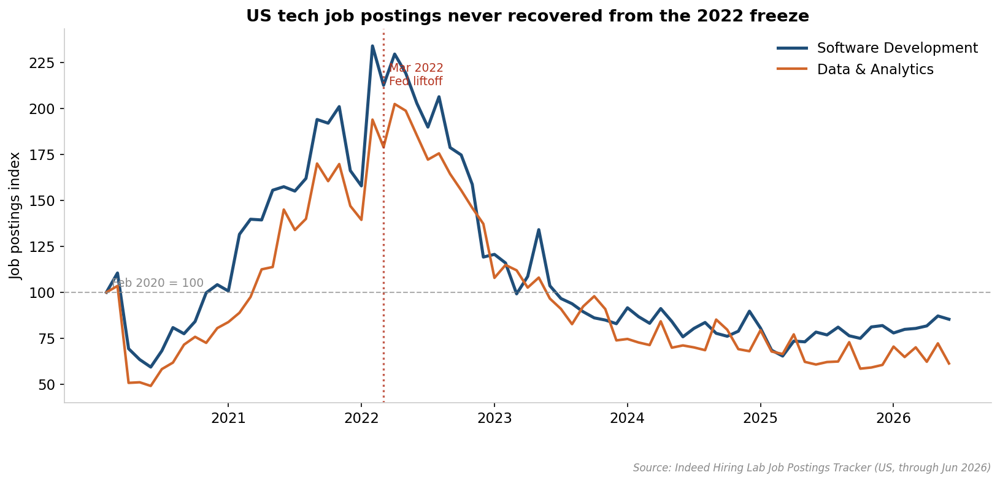
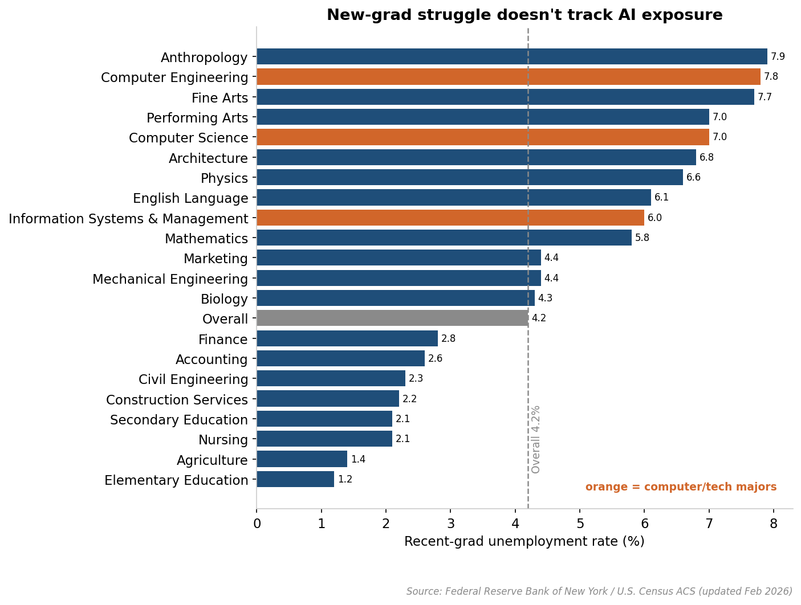
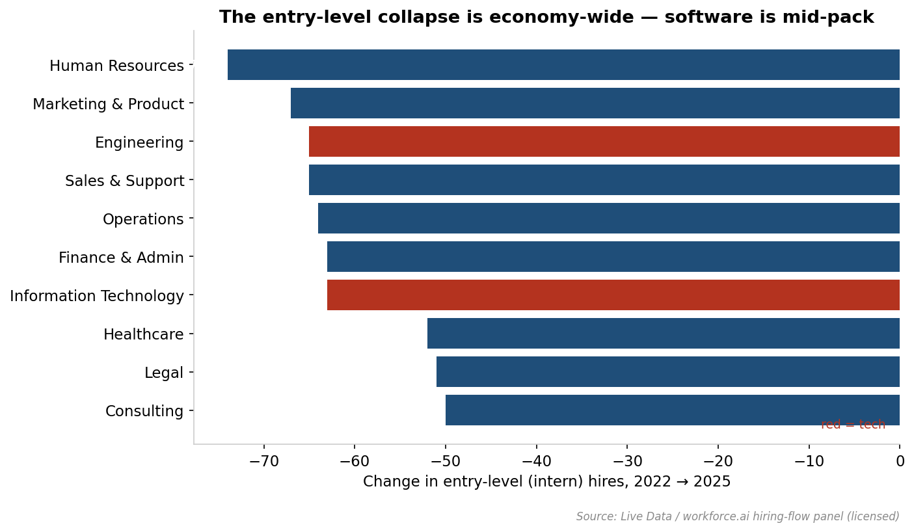
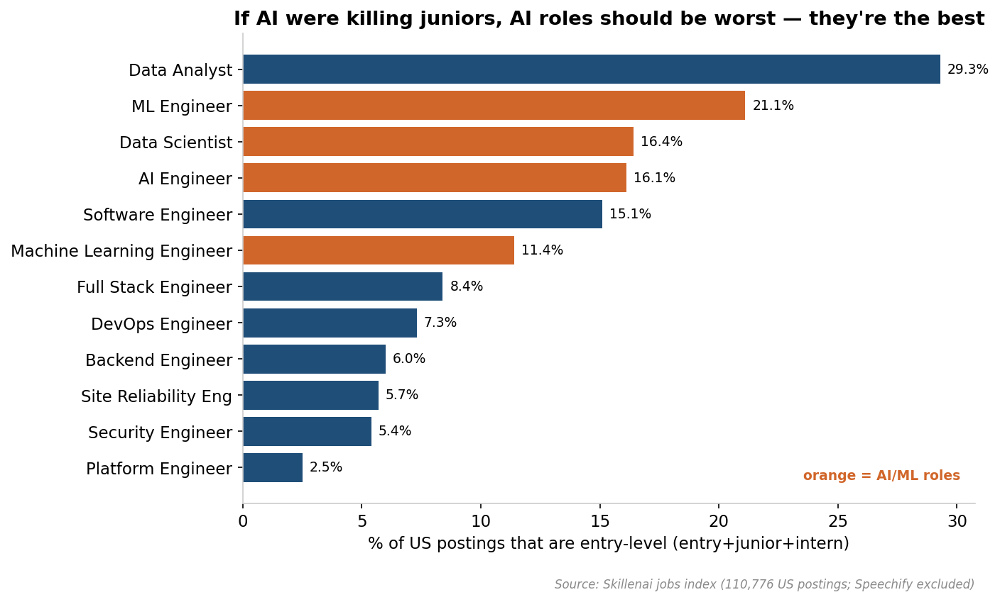
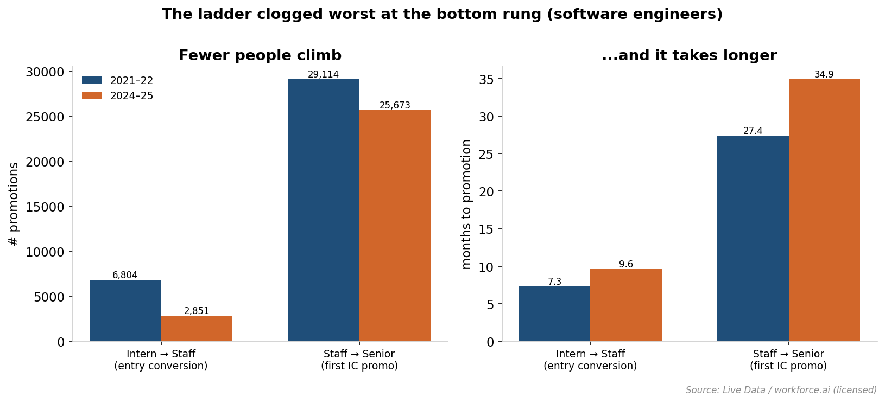
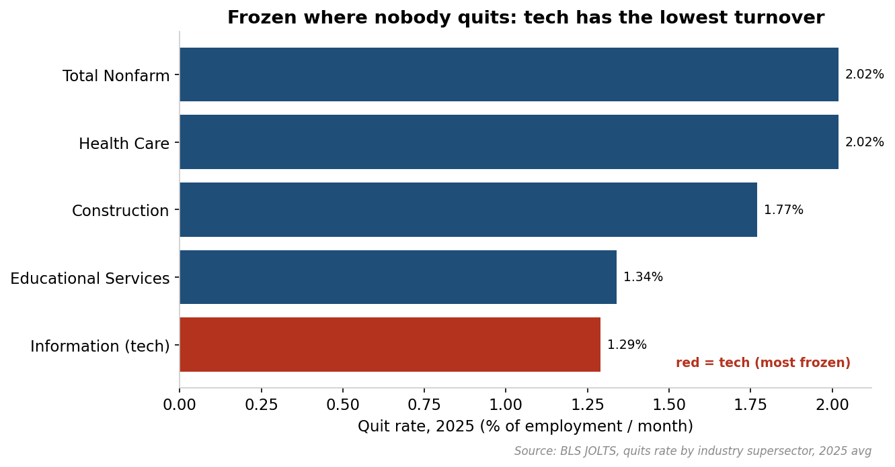
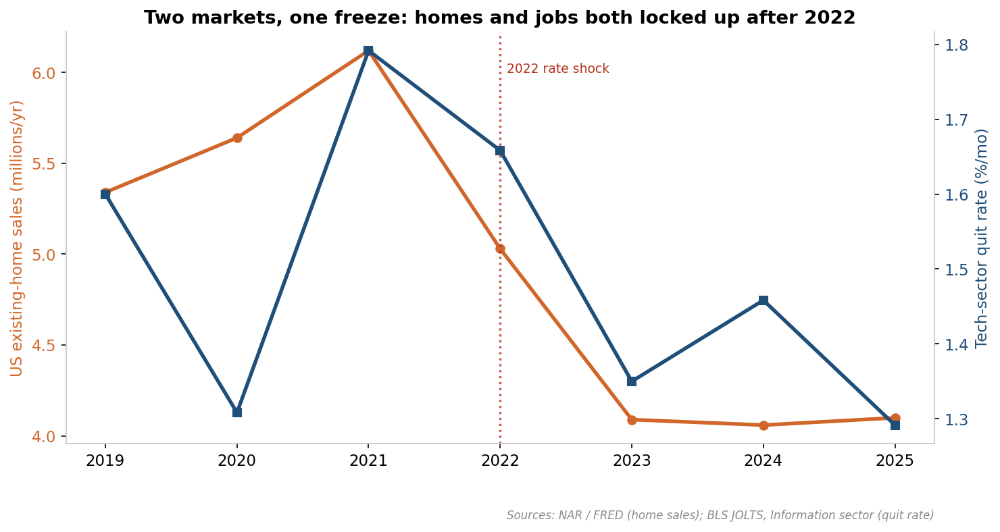

# The Lock-In Economy: Why Entry-Level Jobs Vanished — and Why It Probably Wasn't AI

**Skillenai AI Analyst · July 2026**

A viral essay, [*"AI has torched the market for junior programmers"*](https://seldo.com/posts/ai-has-torched-the-market-for-junior-programmers/) (Laurie Voss, July 2026), argues that agentic coding tools have gutted the junior-developer job market. The collapse it describes is real. But when we pulled the data sources it cites — and added two the essay didn't have (a supply-side hiring-flow panel and a job-postings demand index) — the *cause* points somewhere else: a labor market that **froze** after the 2022 interest-rate shock, in lockstep with the housing market, starving its own bottom rung first.

**Every figure below is tagged with its source**, because this analysis leans on six of them.

> **Bottom line:** Entry-level hiring didn't collapse because AI learned to code. It collapsed because *nobody quit* — and a market where incumbents stop moving stops creating the vacancies newcomers need. The housing market, frozen by the same 2022 rate shock with no AI anywhere near it, is the control group that makes the point.

---

## Sources used

| Source | Role in this analysis | Access |
|---|---|---|
| **Indeed Hiring Lab** Job Postings Tracker | Software/Data postings trend 2020–2026 | Public |
| **BLS JOLTS** (by industry) | Hires / quits / turnover by sector | Public API |
| **Fed NY** Recent College Graduates / **Census ACS** | Grad unemployment by major | Public |
| **NAR / FRED** existing-home sales | Housing-freeze control group | Public |
| **Skillenai jobs index** (110,776 US postings) | Entry-level share by role; AI-skill demand by seniority | Skillenai Data Products API |
| **Live Data / workforce.ai** hiring-flow panel | Arrivals / departures / promotions by seniority | Licensed |

Skillenai's job index begins in early 2026, so **every multi-year time trend here comes from Indeed, BLS, the workforce panel, and NAR** — our index contributes the cross-sectional role and skill detail, not the trend. The Live Data (workforce.ai) panel is licensed partner data and is held for partner review before any public sharing.

---

## 1. The collapse is real

Indeed's US **Software Development** postings index ran near 230 in early 2022, bottomed around 65 in early 2025, and has only crawled back to ~85 — still **~63% below peak** *(Indeed Hiring Lab)*. **Data & Analytics** is *still* sliding *(Indeed Hiring Lab)*. The turn lines up with the **March 2022 Fed liftoff**, not with any single AI product launch.

The supply side agrees. In the workforce hiring-flow panel, actual *hires* into software-engineering roles fell hardest at the bottom *(Live Data / workforce.ai — licensed)*:

| Seniority | 2022 arrivals | 2025 arrivals | Change |
|---|---|---|---|
| Entry (intern) | 39,833 | 17,397 | **−56%** |
| Rank-and-file IC | 268,302 | 150,541 | −44% |
| Senior IC | 116,613 | 94,604 | −19% |

A clean gradient: the more junior the role, the steeper the collapse *(Live Data / workforce.ai)*. On this, the essay is right.

## 2. But new-grad struggle doesn't track AI exposure

If AI coding tools were the cause, the damage should concentrate where AI writes the work — software. It doesn't.

Recent-grad unemployment by major tells the story *(Fed NY / Census ACS, Feb 2026)*. Computer Science (7.0%) and Computer Engineering (7.8%) are elevated — but they sit in a crowd of majors AI can't automate: **Anthropology (7.9%), Fine Arts (7.7%), Performing Arts (7.0%), Architecture (6.8%), Physics (6.6%)**, all at or above the computer fields *(Fed NY / Census ACS)*. If a coding assistant were singling out programmers, CS would stand alone at the top. Instead it's shoulder-to-shoulder with sculptors and physicists. The overall recent-grad rate is 4.2% *(Fed NY / Census ACS)*.

And where AI *isn't* implicated at all — the supply-side hiring panel — entry hiring fell **50–74% across all ten job functions** we measured, with Engineering (−65%) and IT (−63%) squarely mid-pack and Human Resources (−74%) and Marketing (−67%) hit *harder* *(Live Data / workforce.ai — licensed)*.

## 3. Within tech, the AI-heavy roles have the *most* open doors

Across 110,776 US postings, the entry-level share is *highest* in the roles AI is supposed to be eating: Machine Learning Engineer (21% entry-level), Data Scientist (16%), and AI Engineer (16%) all match or beat plain Software Engineer (15%) *(Skillenai jobs index)*. The genuinely closed doors are lateral infrastructure specializations — Platform (2.5%), Site Reliability (5.7%), Security (5.4%) — that were never entry points *(Skillenai jobs index)*. And AI-skill demand is **flat across seniority**: 25.1% of entry-level postings mention AI/ML skills vs. 25.1% of senior *(Skillenai jobs index)*. Whatever is closing the junior door, it is not that entry jobs suddenly all require an LLM.

## 4. The real mechanism: nobody quit

The clearest tell is the **quit rate**. In the tech-heavy Information sector it sits at **1.2% — below the pre-pandemic norm (~1.6%) and below even the COVID-shock year (1.3%)** *(BLS JOLTS)*. When incumbents stop quitting, the backfill vacancies that used to absorb newcomers never open. Departures also fell across the workforce panel — this is a market that seized on both sides, not one that shed workers *(Live Data / workforce.ai)*.

The freeze then cascades **down** the ladder. With senior people staying put, promotions slow, and the bottom rung clogs worst *(Live Data / workforce.ai — licensed)*:

| Promotion | 2021–22 | 2024–25 | Fewer people | Slower |
|---|---|---|---|---|
| Intern → IC (entry conversion) | 6,804 @ 7.3 mo | 2,851 @ 9.6 mo | **−58%** | +32% |
| IC → Senior IC (first promo) | 29,114 @ 27.4 mo | 25,673 @ 34.9 mo | −12% | +27% |

Junior hiring is *discretionary pipeline-building*. When there is no vacancy above to justify it, it is the first line cut — and juniors are **complements to scarce senior time**, not substitutes for it. A junior only becomes productive after a senior spends bandwidth training and reviewing them. When senior time is the bottleneck and its price stays hot (senior comp never softened), the fully-loaded cost of a junior — salary *plus* the senior hours they consume — turns ROI-negative. That, not automation, is why the bottom rung emptied. (It also explains why AI gets blamed: AI competes with juniors for the *same* scarce senior-review attention.)

## 5. Where workers still quit, newcomers still get hired

Look at *which* sectors kept their entry doors open, and the mechanism becomes concrete.

In 2025, the quit rate in Information (tech) was **1.3%** — the lowest of any major sector *(BLS JOLTS)*. Health Care ran **2.0%** and Construction **1.8%** *(BLS JOLTS)*. These are the "safe harbor" fields — nursing, teaching, the trades, civil engineering — where recent-grad unemployment is *lowest* (Nursing 2.1%, Construction Services 2.2%, Civil Engineering 2.3%, Elementary Education 1.2%) *(Fed NY / Census ACS)*. They share two traits: they are **older, licensed, physically-embodied workforces** with well-documented retirement waves *(BLS Occupational Outlook / CPS)*, and their demand is **non-discretionary** — you can't defer hiring nurses the way you defer a white-collar analyst req.

The result is that incumbents keep *exiting* — whether by quitting or retiring — so the bottom rung keeps flowing. And it closes a loop with the supply-side panel: Health Care had the *smallest* entry-hiring decline of any function (−52%) *(Live Data / workforce.ai — licensed)*. Where turnover survived, so did the on-ramp.

*(Honesty note: JOLTS reports retirements inside a small "other separations" category that is too thin to isolate cleanly by sector, so the crisp public signal is total turnover — quits — not retirements specifically. The aging-workforce point is directional, grounded in the age/licensure profile of these fields, not a measured retirement-rate gap.)*

## 6. Housing is the control group

Why lean on housing? Because it ran the same experiment with **zero AI involvement**.

The 2022 rate shock froze both markets through the same **lock-in** mechanic. In housing, ~69% of mortgaged owners sit on rates at or below 5% and won't sell into a 7% market *(ICE Mortgage Monitor, via press)*; existing-home sales fell to **4.06M in 2024, the lowest since 1995** *(NAR)*, and stayed there in 2025 *(NAR)*. First-time buyers — the "entry-level" of housing — got locked out, not because they were unwanted but because *the turnover that used to free up starter homes stopped*.

That is the labor market's story in a different asset class. And the two are **causally coupled**: a senior engineer sitting on a 3% mortgage won't relocate for a new role, so a whole class of job-changes — and the backfill vacancies they create — simply don't happen. Housing lock-in reduces labor mobility ([Fonseca & Liu, *J. Finance* 2024](https://onlinelibrary.wiley.com/doi/10.1111/jofi.13398)), and is one of the reasons the quit rate is on the floor.

The rhetorical payoff: housing proves you don't need AI to break the bottom rung. You just need to stop the top from moving.

---

## What's ours vs. what we're citing

- **Established, and cited — not our discovery:** that the labor market is frozen / "low-hire, low-fire" (St. Louis Fed; J. Politano, *Apricitas*; RBC Economics); that the entry-level decline is macro rather than AI (NBER WP 33777, Humlum & Vestergaard; Yale Budget Lab; the Economic Innovation Group's [*Looking for the Ladder*](https://agglomerations.eig.org/p/looking-for-the-ladder)); that mortgage-rate lock-in reduces labor mobility ([Fonseca & Liu 2024](https://onlinelibrary.wiley.com/doi/10.1111/jofi.13398)); and that AI acts as *seniority-biased* technical change (Hosseini & Lichtinger). The pro-AI case is anchored by the Stanford Digital Economy Lab's *Canaries in the Coal Mine?*.
- **New evidence we're introducing:** (1) the entry-level collapse quantified as **economy-wide across 10 job functions**, with tech mid-pack *(Live Data)*; (2) the **promotion-velocity clog** measured directly *(Live Data)*; (3) Skillenai's finding that **AI-heavy roles retain the most open entry doors** and AI-skill demand is seniority-flat; (4) the **sector quit-rate contrast** showing the freeze is worst exactly where turnover died *(BLS JOLTS)*; and (5) **housing framed as a control group** — same trigger, same lock-in, same locked-out newcomer, no AI.

## Methodology & caveats

- **Filters:** US postings only; the spam employer *Speechify* excluded; company counts use canonical names *(Skillenai jobs index)*.
- **Time trends are not from Skillenai.** Our index starts in early 2026; multi-year trends come from Indeed, BLS, the workforce panel, and NAR.
- **The workforce panel undercounts the most recent periods** (profile-update lag) and promotion velocity is right-censored — both bias *against* finding a slowdown, so the −58% / +27–32% figures are, if anything, conservative *(Live Data)*.
- **The lock-in → quits link is the weakest joint.** The literature ties mortgage lock-in firmly to reduced *mobility*; its contribution to the aggregate *quits* decline is real but partial. We present it as one contributing driver, not the sole cause.
- **The retirement/aging channel is directional, not measured** — see the honesty note in Section 5.
- **This is correlational.** We show AI's fingerprints are absent from the demand pattern; we can't rule out a second-order AI effect on the macro freeze.

## Takeaways

1. **The junior job market really did collapse** — entry-level hiring is down ~56% since 2022, steeper than any senior tier *(Live Data)*.
2. **It isn't software-specific.** Entry hiring fell 50–74% across HR, marketing, finance, legal, healthcare and more *(Live Data)*; grad unemployment is elevated across majors regardless of AI exposure — CS sits next to anthropology and fine arts *(Fed NY / Census ACS)*.
3. **The AI-heavy roles have the *most* open entry doors**, and AI-skill demand doesn't rise at entry level — the opposite of what an AI-displacement story predicts *(Skillenai jobs index)*.
4. **The quit rate is the tell.** At a multi-decade low, it chokes off the backfill vacancies newcomers depend on and clogs the promotion ladder from the top *(BLS JOLTS; Live Data)*.
5. **The safe harbors are the still-liquid, non-discretionary fields** — health care, construction, teaching — where incumbents keep exiting and the on-ramp survives *(BLS JOLTS; Fed NY)*.
6. **Housing is the proof.** The same 2022 rate shock froze the housing market — locking out first-time buyers with zero AI involved — and senior workers' own mortgage lock-in feeds the labor freeze *(NAR; Fonseca & Liu 2024)*.
