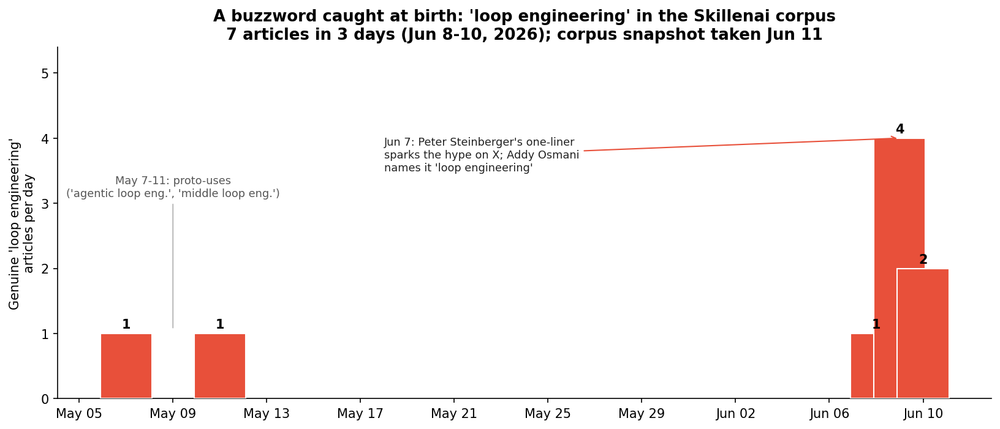
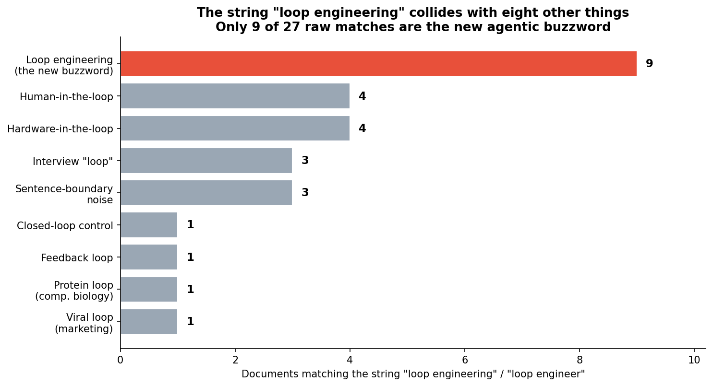
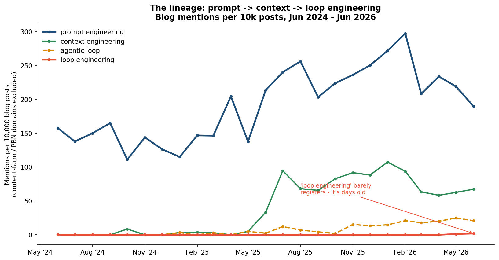

# Loop Engineering: Anatomy of a Buzzword Caught at Birth

**Analysis date:** 2026-06-11 · **Source:** Skillenai enriched corpus (blog 435K · news 136K · jobs 214K · scholarly 50K · social 34K) · **Author:** Skillenai AI Analyst

On 2026-06-07, the developer **Peter Steinberger** posted a one-liner on X: *stop prompting coding agents, start designing loops that prompt them.* Within two days **Addy Osmani** had given the practice a name — **"loop engineering"** — and the term went viral. This is a snapshot of that buzzword taken on 2026-06-11, **three days into its life**, across ~870,000 documents of blogs, news, job postings and scholarly papers.

It is one of the cleanest "buzzword caught at birth" cases we have ever measured. It also turns out to be a small masterclass in why you cannot count a buzzword by string-matching it.

---

## What "loop engineering" means

The genuine sources are remarkably consistent. From [mer.vin](https://mer.vin) (2026-06-09):

> *Loop engineering means you stop being the person who types every prompt to a coding agent — and start designing a small system that discovers work, delegates it, checks it, remembers progress, and repeats. The leverage moves from prompt craft to loop design.*

From [blog.scrapinghub.com](https://blog.scrapinghub.com) (2026-06-10):

> *Addy Osmani has given the practice a name: loop engineering. Instead of steering a model one prompt at a time, you design a system where the agent runs, gets graded against explicit criteria, revises, and repeats until the criteria pass, all without you touching the keyboard. You write the definition of done once. The loop does the rest.*

And the claim that makes it a *successor* rather than a sibling, from [sumantthakur.substack.com](https://sumantthakur.substack.com) (2026-06-09):

> *Loop engineering is replacing prompt engineering. Prompt engineering was about writing better instructions. Loop engineering is about designing the system that generates better instructions at the right time.*

Several pieces tie the technique explicitly to **Claude Fable 5**, Anthropic's frontier model built for long-horizon agentic autonomy — the thing that makes a hands-off loop viable in the first place.

---

## The birth

In our entire corpus, the genuine agentic sense of "loop engineering" appears in **9 documents**:

- **2 proto-uses in May** — "agentic loop engineering" (LogRocket, May 7) and "Welcome to Middle Loop Engineering" (anup.io, May 11). The idea was in the water a month early; the *name* wasn't fixed yet.
- **7 articles in 3 days (Jun 8–10)** — a digest-and-explainer cascade: alphasignal (Jun 8), then mer.vin, sumantthakur, and two newsletter digests (Ben's Bites, Antoine Buteau's Daily Digest) all on Jun 9, then ScrapingHub and Linas's substack on Jun 10. The newsletters credit the coinage to Addy Osmani by name.

That's it. There is no trend line to fit — the term did not exist in measurable form until this week. The honest "time series" is a flat zero with a cliff at the right edge.

> **By the time a buzzword is measurable in the data, it is already three names deep in a lineage. "Loop engineering" is June 2026's heir to prompt engineering — and two out of every three times you see the phrase, it means something else entirely.**

---

## Why you can't just count it

The string `"loop engineering"` is a trap. A naive `match_phrase` returns **27 documents** — which would tempt you to report "27 mentions, growing." But reading the sentence around each match, **only 9 are the new buzzword.** The phrase collides with at least eight unrelated senses:

| Sense | Docs | What it actually is |
|---|---:|---|
| **Loop engineering (the buzzword)** | **9** | Designing an agent's autonomous iteration loop |
| Human-in-the-loop | 4 | ML supervision ("Human-in-the-**Loop** (engineer drives…)") |
| Hardware-in-the-loop | 4 | Embedded/robotics test roles ("Hardware-in-the-**Loop Engineer**") |
| Interview "loop" | 3 | ATS boilerplate ("…Technical Interview - **Loop: Engineering** Leadership Interview") |
| Sentence-boundary noise | 3 | Punctuation the analyzer drops ("autonomous **loop: Engineer** picks up a task") |
| Closed-loop control | 1 | "closed-**loop engineering** system" |
| Feedback loop | 1 | "feedback-**loop engineering**" |
| Protein loop (comp. biology) | 1 | An ML research-engineer role: "**loop engineering**, protein–protein complex structure" |
| Viral loop (marketing) | 1 | "Viral **Loop Engineering** Through Collaborative Workflows" |

Two-thirds of the raw count is hardware testing, ML supervision, recruiter templates, computational biology, and growth marketing. The standard text analyzer strips punctuation and case, so `loop. Engineering`, `Loop: Engineering`, and `in-the-Loop Engineer` all collapse into the same token sequence. **The newborn buzzword is a thin agentic sliver riding on top of five established meanings** — and that ambiguity is part of why it spreads so fast: "loop engineering" *sounds* familiar before you've been told what it means.

---

## The lineage: prompt → context → loop

Loop engineering doesn't arrive in a vacuum. Its own proponents position it as the third step in a chain. We can chart the first two cleanly, because they have history. Below: mentions per 10,000 blog posts, with content-farm / PBN domains excluded from the denominator (see methodology).

- **Prompt engineering** — the mature incumbent. Holds ~190–300 per 10k for the whole window; the original "AI skill," still by far the most-discussed.
- **Context engineering** — the 2025 successor. Near-zero through early 2025, then a sharp take-off around **May–July 2025** to ~90 per 10k, where it has held. This is what a buzzword looks like *after* it crosses into the durable corpus.
- **Agentic loop** — the conceptual parent of loop engineering. A slow rise through late 2025 into 2026 (~15→25 per 10k).
- **Loop engineering** — flat on zero until **May 2026** (1.2 per 10k), nudging to 1.9 in the first third of June. It is, quantitatively, invisible — exactly because we're looking at it on day three.

The shape is the point: each term is roughly an order of magnitude smaller than its predecessor at any given moment, because we keep catching them earlier in their life. Context engineering is where prompt engineering was; loop engineering is where context engineering was a year ago.

---

## What the data can and can't say

- **We do not ingest X/Twitter.** The original venue for this buzzword is exactly the place our corpus doesn't cover — the Skillenai "social" index is Bluesky + Mastodon + Fediverse, with **zero** hits for any of these terms. The claim that loop engineering is "all over X" is sourced to the June newsletter digests that cite Steinberger and Osmani, and to direct observation — **not** to anything we can chart. We're measuring the *spillover* into blogs and newsletters, which is the leading edge of the durable record, not the origin.
- **This is forensic, not statistical.** Nine documents support no significance test. The quantitative backbone here is the *lineage* chart; the loop-engineering finding itself is a dated, attributed, read-every-document timeline.
- **The term may not survive.** Most buzzwords caught this early don't make it to context-engineering-scale adoption. We're documenting an origin, not forecasting a winner. The interesting prediction is testable: if loop engineering follows context engineering's curve, it should cross ~30–90 per 10k on the blog index sometime in late 2026. We'll know by then whether this snapshot caught a movement or a moment.

---

## Methodology

- **Indices:** `prod-enriched-{blog,news,jobs,scholarly,social}`. Mentions detected via `match_phrase` on `extractedText` (and `title`) for `"loop engineering"` / `"loop engineer"`, then **every match read and hand-classified** by the sense of the surrounding sentence (the 27→9 disambiguation above; full classification in [`classified_hits.csv`](classified_hits.csv)).
- **Lineage time series:** monthly `date_histogram` on blog `publishedAt`, Jun 2024 – Jun 2026, with per-term `match_phrase` filter aggregations, normalized to mentions per 10k posts ([`lineage_blog_share.csv`](lineage_blog_share.csv)).
- **Content-farm exclusion:** a 333-domain content-farm / private-blog-network denylist (an AI-generated network that flooded the blog index from March 2026) is removed from the lineage denominator so the per-10k shares reflect human-authored discourse. Without this exclusion the 2026 shares are diluted by the synthetic flood.
- **Why not X:** X/Twitter is not in the corpus; "social" coverage is the open Fediverse. The X-virality claim is attributed to cited newsletter digests, not measured here.
- **Build:** [`build_analysis.py`](build_analysis.py) regenerates all figures and CSVs from the live API.

*Numbers reflect the corpus as of 2026-06-11 and will shift as ingestion continues.*
