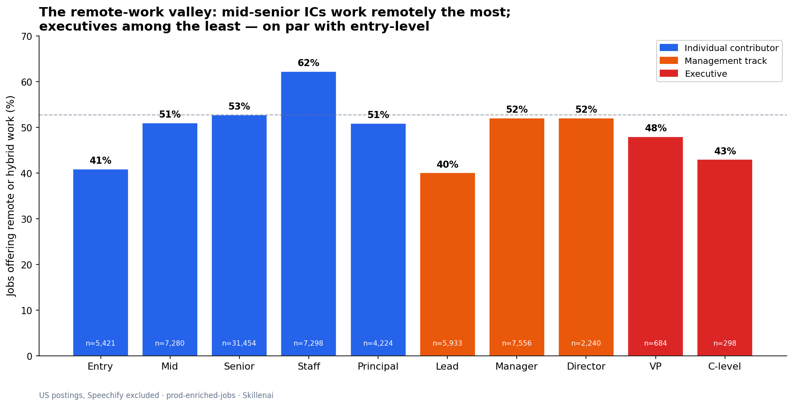
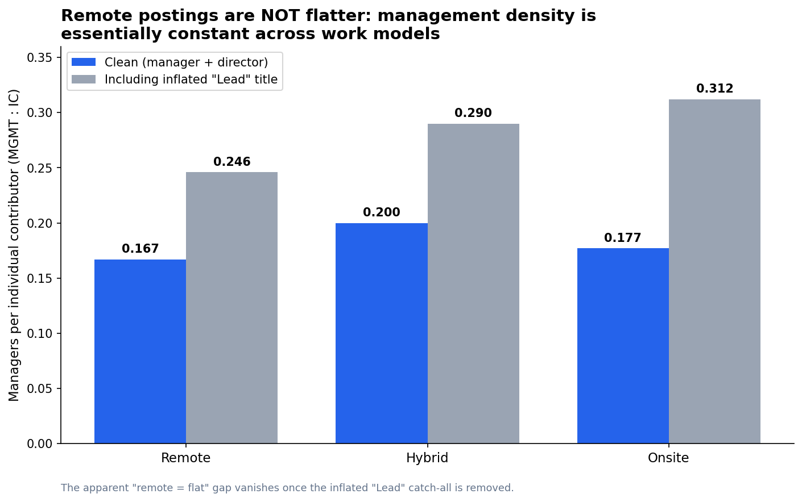
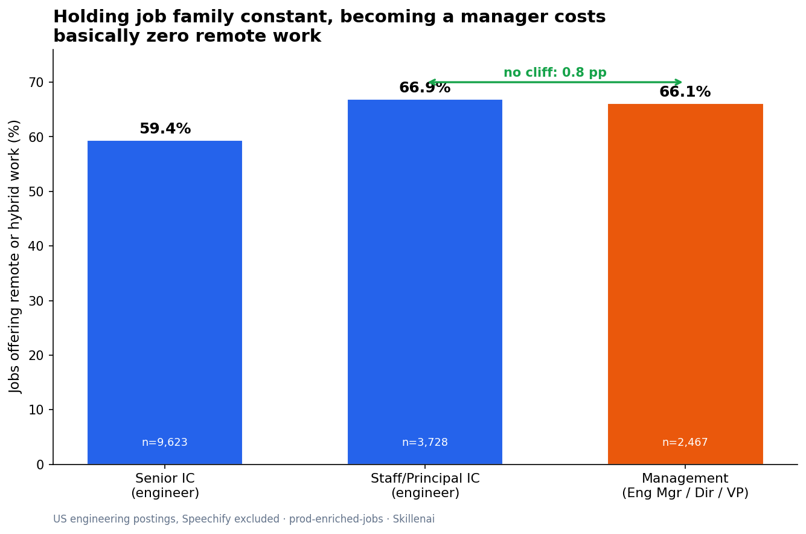
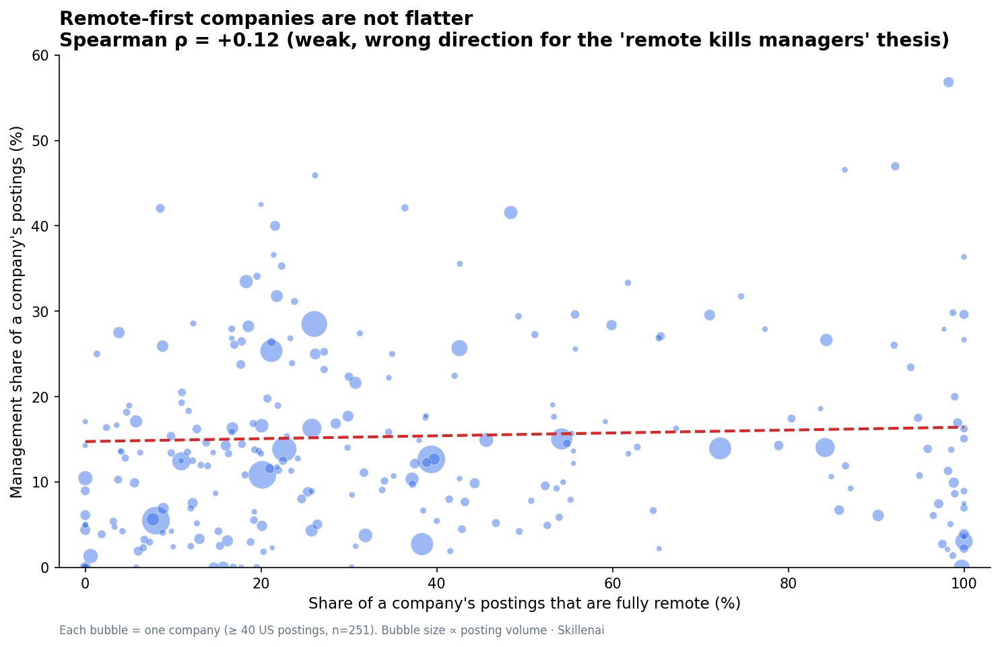

# The Middle-Management Purge: It's Not AI, and It's Not Remote Work

**Date:** 2026-06-17
**Source:** Skillenai labor-market index (`prod-enriched-jobs`), ~97,500 US job postings
**Scope:** US postings, Speechify excluded (carpet-bombing spam employer). Work-mode and seniority fields have ~95% and ~76% coverage respectively.

---

## The question

A widely-shared analysis (covered in *Bloomberg Businessweek*, built on Live Data Technologies departures data) shows that **middle managers' share of layoffs and excess departures has risen every year since 2020** — roughly 20% of layoffs in 2019 to ~32% in 2023. Executives from Block's Jack Dorsey to Amazon's Andy Jassy increasingly question whether the management layer should exist at all, and AI is the usual culprit named.

We tested the two explanations everyone reaches for — **AI** and **remote work** — against the structure of the US hiring market. Both fail. This report documents the tests and points to the explanation that actually fits the timing: the unwinding of a decade-long **management/title-inflation bubble**.

A note on what this data is and isn't: we measure the **role structure** of the job market (what's being advertised, at what seniority, under what work model). We do **not** measure departures or layoffs directly — that's the Live Data Technologies dataset. Our contribution is structural corroboration, not a time-series of exits.

---

## Finding 1 — The remote-work valley

Remote/hybrid availability is not monotonic in seniority. On the **individual-contributor (IC) ladder** it rises to a peak at Staff, then the **management ladder sits lower**, and **executives land at the bottom of the experienced ranks** — on par with entry-level workers (C-level 43% vs Entry 41%) and below every senior IC and management tier.

| Tier | Track | Any-remote % | N |
|---|---|---:|---:|
| Entry | IC | 40.9% | 5,421 |
| Mid | IC | 51.0% | 7,280 |
| Senior | IC | 52.8% | 31,454 |
| **Staff** | IC | **62.3%** | 7,298 |
| Principal | IC | 50.9% | 4,224 |
| Lead | Mgmt* | 40.1% | 5,933 |
| Manager | Mgmt | 52.1% | 7,556 |
| Director | Mgmt | 52.1% | 2,240 |
| VP | Exec | 48.0% | 684 |
| **C-level** | Exec | **43.0%** | 298 |

\* "Lead" is a contaminated bucket — see Finding 2.

**Takeaway:** the people issuing return-to-office mandates (VPs, C-level) have barely more remote flexibility than the most junior workers — they aren't coming back *to* anything; they never left.

---

## Finding 2 — Remote companies are NOT flatter (the substitution test fails)

The cleanest mechanism for "remote work hollowed out middle management" is **substitution**: if remote tooling replaces the coordination work managers do, remote-heavy environments should carry fewer managers per IC. They don't.

Management-to-IC ratio (manager + director, the clean people-management tiers):

| Work model | MGMT : IC (clean) | (including "Lead") |
|---|---:|---:|
| Remote | 0.167 | 0.246 |
| Hybrid | **0.200** | 0.290 |
| Onsite | 0.177 | 0.312 |

Pooled across postings, management density is **essentially flat** across work models — and hybrid is actually the *highest*. The large gap that appears in the right-hand column is almost entirely an artifact of the **"Lead" title**, which in our index is a grab-bag of non-management roles (`Technology Lead`, `Technical Test Lead`, `Lead Software Engineer`, `Product Designer`). Once "Lead" is removed, the "remote = flat" story disappears.

---

## Finding 3 — Becoming a manager costs ~zero remote work (within engineering)

The aggregate table in Finding 1 shows a 22-point "cliff" between Staff IC (62%) and Lead (40%). It's a mirage: "Lead" is contaminated with inherently-onsite roles. When we hold the **job family constant** (engineering only, where the IC→manager step is clean), the cliff vanishes.

| Engineering tier | Any-remote % | N |
|---|---:|---:|
| Senior IC | 59.4% | 9,623 |
| Staff / Principal IC | 66.9% | 3,728 |
| Management (Eng Mgr / Director / VP Eng) | 66.1% | 2,467 |

Going from staff IC into engineering management moves remote availability by **0.8 points**. There is no remote penalty for entering management. So the "senior remote ICs get promoted into management, then RTO forces them out" narrative isn't in how these roles are advertised.

---

## Finding 4 — Remote-first companies aren't flatter either (between-company test)

Pooled postings mix flat startups with hierarchical enterprises. The sharper test is **between companies**: do firms that post mostly-remote run flatter than onsite-first firms? For 251 companies with ≥40 US postings each, we computed each company's remote share and its management share.

- **Spearman ρ = +0.12** — weak, and the *wrong sign* for the thesis.
- Onsite-first tertile (mean remote 9%): mean management share **13.4%**.
- Remote-first tertile (mean remote 78%): mean management share **16.1%**.

If anything, remote-first companies carry *slightly more* management, not less. (Caveat: noisy, and sector-confounded — the remote-first list is thick with defense/government contractors. The point is the absence of any strong *negative* relationship, which the substitution thesis requires.)

---

## What actually fits: a title-inflation bubble, now correcting

Three independent tests (pooled density, within-engineering, between-company) all fail to find a remote→flatness link. AI fails on timing — the departures trend starts in **2020**, before AI had measurable labor-market impact, and surveyed AI-driven flattening (e.g. Gartner's projection that 20% of orgs will use AI to flatten) is **forward-looking intent**, not the cause of a five-year-old trend.

The explanation that fits the timing is a **boom-and-correction cycle in management headcount**:

- **The bubble (2008–2022):** a decade-plus of cheap capital, then the pandemic hiring frenzy, then the historically tight 2021–22 labor market, drove companies to mint managers at an extraordinary rate. In Canada (where the data is cleanest), management jobs grew **+33% since early 2021** versus +8% for non-management; managers rose from **8.5% to 10.2%** of the workforce. Much of it was **title inflation** — economists describe firms handing out "manager" titles to *justify pay raises and retain talent*, for roles with "influence rather than authority." In tech, job titles containing "Lead" and "Principal" reportedly **doubled between 2019 and 2021**.
- **The correction (2022–present):** rates rose, margins returned, and companies are unwinding the over-hiring — "the Great Flattening" / "unbossing." Span of control is widening (average direct reports ~10.9 → 12.1 from 2024 to 2025; small-company spans doubled since 2019), and ~41% of firms report cutting management layers in 2025.

**Crucially, title inflation does not self-correct.** Titles are asymmetric — trivial to inflate, nearly impossible to deflate (you cannot re-title an incumbent "junior" without losing them). So the inflation got **baked in permanently**, and the correction arrives through *headcount* (the layoffs) rather than demotions. That is exactly why our "Lead" bucket is *still* an incoherent catch-all in 2026 postings: the title stuck even as its meaning dissolved. We cannot prove the inflation timeline from a single cross-section — our index has no pre-2026 history — so we report this as **consistent with**, not proof of, the bubble thesis.

---

## Takeaways

1. **The middle-management purge is real, but the two tidiest explanations both fail in the hiring data.** Remote-first companies are not flatter (three tests, including a between-company ρ of +0.12 in the wrong direction). AI fails on timing.
2. **The remote-work valley:** senior ICs (Staff, 62%) are the most-remote workers in the market; executives (C-level, 43%) sit at the bottom of the experienced ranks — on par with entry-level (41%) and below every senior IC and management tier. RTO mandates flow from a group that already has among the least remote flexibility.
3. **"Lead" has become a meaningless management signal** — a grab-bag of senior-IC and non-management titles — consistent with widely-reported tech title inflation in 2019–2021.
4. **The driver that fits 2020:** an over-hiring/title-inflation bubble built on cheap money and a tight labor market, now correcting through layoffs because inflated titles can't be walked back.

---

## Methodology

- **Index:** `prod-enriched-jobs`, queried via the Skillenai Data Products API (`/v1/query/search`), 2026-06-17.
- **Population:** US postings (`locationCountry: "US"`), Speechify excluded via `companyCanonicalName.keyword` must-not (known carpet-bombing spam employer).
- **Work model:** `workModel` field (~95% coverage); "any-remote" = `remote` + `hybrid`. Onsite/remote/hybrid account for >99% of populated values.
- **Seniority:** `seniorityLevel` field (~76% coverage). IC tier = {entry, mid, senior, staff, principal}; clean middle-management = {manager, director}; exec = {vp, c-level}. The **"lead"** value is reported separately and excluded from the clean management definition because it is title-inflation-contaminated.
- **Within-family control (Finding 3):** IC side filtered to engineering IC titles via `role.keyword`; management side filtered to explicit engineering-management titles. Denominators use the sum of populated `workModel` buckets (the API caps `total` at 10,000; bucket sums are exact).
- **Between-company test (Finding 4):** terms aggregation on `companyCanonicalName.keyword` (top 400 by volume), with parallel `workModel` and `seniorityLevel` sub-aggregations; companies with ≥40 work-mode-tagged and ≥40 seniority-tagged postings retained (n=251). Spearman computed on company-level remote share vs management share.
- **What this is not:** a measurement of layoffs, departures, or individual career transitions. Those come from the Live Data Technologies / Bloomberg analysis. We measure the *advertised role structure* the departures flow out of.
- **External context** (title-inflation and flattening figures) is drawn from published reporting and surveys (Bloomberg/Live Data Technologies, Korn Ferry Workforce 2025, Gartner, Gallup span-of-control, Globe and Mail on Statistics Canada data). Those numbers are cited for context, not produced from our index.

*Generated with the Skillenai insight pipeline. Reusable query patterns documented in the skillenai-api-skill.*
