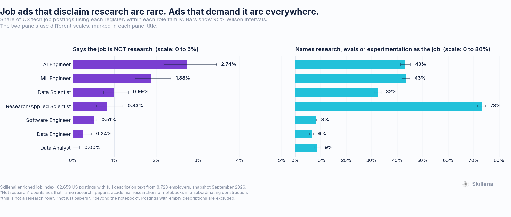
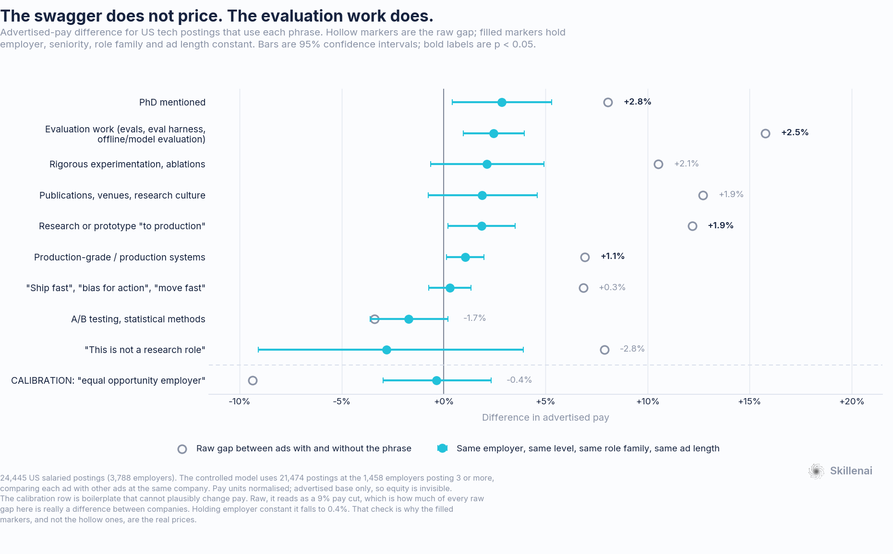
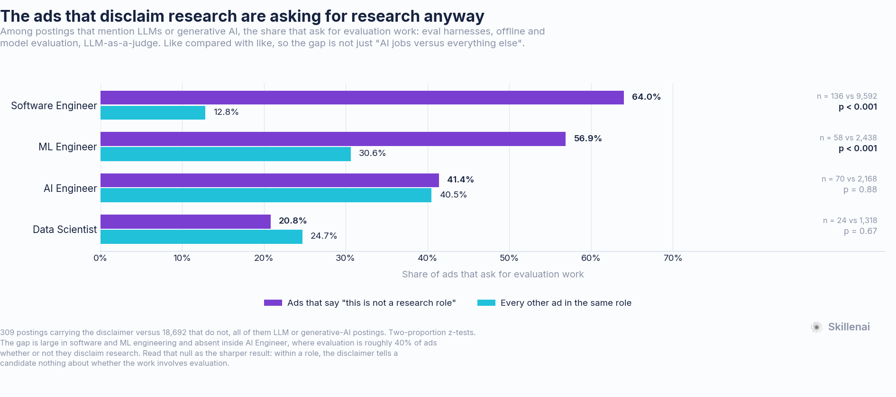

# "This is not a research role": what that line is actually worth

**Analysis date:** 2026-09-22
**Data source:** Skillenai enriched job index (`prod-enriched-jobs`) — 62,659 US tech-role postings that carry a real description, from 8,728 employers. Snapshot September 2026.
**Method:** full posting text downloaded and searched locally for rhetorical *registers* (regex families over cleaned prose, not single keywords); prevalence with Wilson intervals; advertised-pay models with employer fixed effects, cluster-robust standard errors, and two boilerplate calibration placebos.

---

## TL;DR

A recognisable register has appeared in AI and ML job ads. It names research only to put it in its place:

> "This is not a research role. This is not a 'play with models in a lab' role. This is a builder role."
> "Production AI shipping experience, not just research, POCs, demos, or internal experiments."
> "Not a researcher, but you can read one and tell us whether the result matters for our problem."
> — and, in a list headed *You Might Not Be a Fit If*: "Your experience is limited to experimentation without production systems."

Three things are true about it, and all three cut against the belief it encourages:

1. **It is rare.** It appears in **2.74%** of AI Engineer postings (95% CI 2.18–3.44), 1.88% of ML Engineer postings, 0.51% of software engineering postings, and **0.70% of US tech postings overall**. At the employer level, **2.05%** of the 8,728 employers in this corpus ever write it.
2. **It is not worth anything.** Ads carrying it advertise a **$205,000** median against $190,000 — a 7.9% premium that **disappears entirely** once you compare postings against other postings at the same company: **−2.8%, 95% CI −9.1% to +3.9%, p=0.40.** The "ship fast / bias for action / move fast" register lands at **+0.3% (CI −0.7 to +1.3)**. The register that does survive is the one it disparages: **naming evaluation work is worth +2.5% (CI +1.0 to +4.0, p=0.0012)** within the same employer, and **+2.1 points more than the shipping register** (p=0.032).
3. **The ads demanding it are asking for research anyway.** Among LLM and generative-AI postings, **53.1%** of the ones carrying the disclaimer ask for evaluation work — eval harnesses, offline and model evaluation, LLM-as-a-judge — against **21.0%** of the ones that do not (n=309 vs 18,692, z=13.6, p≈3e-42).

> **The line "this is not a research role" buys the employer nothing and tells the candidate nothing. It is not a scope statement — inside AI Engineer, ads that carry it demand evaluation work at the same rate as ads that don't (41.4% vs 40.5%, p=0.88). It is a costume. The work underneath is evaluation, experimentation and measurement, which is exactly what the market pays for.**

---

## 1. What was measured

Postings were searched for four registers, each a family of regular expressions over cleaned posting prose. The phrasings were **discovered from the corpus first** — sentences containing research/papers/academia/prototype/notebook near a negation were mined and the recurring constructions written up as patterns — rather than guessed from a present-day word list.

| Register | What it catches | Example |
|---|---|---|
| **Anti-research (strict)** | names research, papers, academia, researchers or notebooks in a subordinating construction | "this is not a research role", "not just papers", "beyond the notebook", "research without production" |
| **Anti-research (broad)** | the above plus "not just prototypes / demos / PoCs", which is the same register without the word | "shipping real software products, not just prototypes or research demos" |
| **Production-primacy** | shipping swagger that never names research | "ship fast", "bias for action", "move fast", "production-grade", "production systems" |
| **Research-positive** | research, evaluation or experimentation named as part of the job | "publications", "NeurIPS", "research culture", "eval harness", "offline evaluation", "ablations", "hypothesis-driven" |

The strict variant is the headline; the broad variant is the upper bound. All figures below use the strict one unless stated.

---

## 2. How common is it?



| Role family | "not a research role" | 95% CI | names research / evals / experimentation | ratio |
|---|---:|---|---:|---:|
| AI Engineer | **2.74%** | 2.18–3.44 | **43.3%** | 15.8× |
| ML Engineer | 1.88% | 1.50–2.35 | 43.4% | 23.1× |
| Data Scientist | 0.99% | 0.74–1.33 | 32.3% | 32.6× |
| Research / Applied Scientist | 0.83% | 0.57–1.20 | 73.2% | 88× |
| Data Engineer | 0.24% | 0.13–0.45 | 6.4% | 27× |
| Data Analyst | **0.00%** (0 of 2,218) | 0–0.17 | 8.5% | — |
| Software Engineer | 0.51% | 0.44–0.58 | 8.1% | 15.8× |

The register is real and it is concentrated exactly where people notice it: an AI Engineer posting is **5.4× more likely** than a software engineering posting to carry it. It is also, in absolute terms, a fringe phenomenon — and every role family is between 16× and 88× more likely to name research, evaluation or experimentation as part of the work than to disclaim it.

Three robustness checks, because a prevalence number is easy to inflate:

- **Longer ads contain more of everything.** Standardising each role family to the corpus-wide distribution of description length moves AI Engineer from 2.74% to **2.66%**. Not a length artifact.
- **Boilerplate repeats.** One employer can post the same text dozens of times. Collapsing to one row per (employer, text) leaves the ordering unchanged, and at the **employer** level the register is used by **2.05%** of employers versus 30.0% for the research-positive register.
- **Concentration.** The 439 postings carrying the register come from **179 distinct employers**; the largest single employer is 13.0% of the bucket. No one company is generating the phenomenon.

---

## 3. What is the line worth?



| Register | raw gap | within same employer | 95% CI | p |
|---|---:|---:|---|---:|
| Evaluation work (evals, eval harness, offline/model evaluation) | +15.8% | **+2.5%** | +1.0 to +4.0 | **0.0012** |
| PhD mentioned | +8.1% | **+2.8%** | +0.4 to +5.3 | **0.021** |
| Rigorous experimentation, ablations | +10.5% | +2.1% | −0.6 to +4.9 | 0.13 |
| Publications, venues, research culture | +12.7% | +1.9% | −0.8 to +4.6 | 0.16 |
| Research or prototype "to production" | +12.2% | **+1.9%** | +0.2 to +3.5 | **0.027** |
| Production-grade / production systems | +6.9% | **+1.1%** | +0.2 to +2.0 | **0.022** |
| "Ship fast", "bias for action", "move fast" | +6.8% | +0.3% | −0.7 to +1.3 | 0.56 |
| A/B testing, statistical methods | −3.4% | −1.7% | −3.6 to +0.2 | 0.079 |
| **"This is not a research role"** | **+7.9%** | **−2.8%** | −9.1 to +3.9 | 0.40 |
| *Calibration: "equal opportunity employer"* | *−9.4%* | *−0.4%* | *−3.0 to +2.3* | *0.79* |

**The calibration row is the point of the table.** "Equal opportunity employer" is boilerplate that cannot plausibly change what a job pays. In the raw comparison it reads as a **9.4% pay cut**, and in a fully controlled cross-sectional model it still reads as **−6.0% (p=0.002)** — which is a measure of how much of *every* raw gap in this data is really a difference between companies rather than between jobs. Hold the employer constant and it falls to **−0.4%, p=0.79**; the second placebo ("dental") goes from −5.1% to **+0.1%, p=0.92**. Only the within-employer column is calibrated, so only the within-employer column is quoted as a price.

Read down it:

- The shipping register prices at **zero**, tightly bounded (CI −0.7% to +1.3%). Companies that talk that way do pay more; the sentence does not mark a better-paid job *at* those companies.
- The anti-research line prices at **zero or slightly negative**, less tightly (n=167 salaried). What can be said is that any premium is smaller than about **+4%** — the +7.9% headline gap is not a thing candidates are being paid.
- **Naming evaluation work is the strongest surviving signal in the table**, and it beats the shipping register head-to-head by +2.1 points (p=0.032). It is not a proxy for "this is an LLM job": adding an LLM/generative-AI mention control leaves it at +2.5%, while the control itself is +0.4% (p=0.40).
- Requiring a **PhD** is worth +2.8% within the same employer — the opposite of a penalty.

---

## 4. The ads that disclaim research are asking for research anyway



Restricting to postings that mention LLMs or generative AI — so the comparison is not just "AI jobs versus everything else":

| Role family | ads with the disclaimer | every other ad in the role | n | p |
|---|---:|---:|---|---:|
| Software Engineer | **64.0%** | 12.8% | 136 vs 9,592 | <0.001 |
| ML Engineer | **56.9%** | 30.6% | 58 vs 2,438 | <0.001 |
| AI Engineer | 41.4% | 40.5% | 70 vs 2,168 | 0.88 |
| Data Scientist | 20.8% | 24.7% | 24 vs 1,318 | 0.67 |
| **Pooled** | **53.1%** | **21.0%** | 309 vs 18,692 | ≈3e-42 |

Two readings, and the second is the sharper one.

Where the disclaimer appears outside the AI-titled roles — a software engineering ad, an ML engineering ad — it marks work that is **dramatically more evaluation-heavy** than its peers. A software engineering ad that says "this is not a research role" is five times more likely than a normal software engineering ad to ask for eval harnesses and offline evaluation.

And **inside AI Engineer the gap vanishes**: 41.4% versus 40.5%, p=0.88. Evaluation is roughly 40% of AI Engineer ads whether or not they disclaim research. That null is the finding. The disclaimer is not describing the scope of the work, because the work is the same either way. It is describing a *posture*.

---

## 5. What the market actually buys

Splitting postings by which registers they use at all:

| | all tech | | AI / ML / DS | |
|---|---:|---:|---:|---:|
| | median pay | vs "neither" | median pay | vs "neither" |
| Neither register | $178,100 | — | $171,750 | — |
| Production register only | $197,500 | +5.3% | $200,000 | +5.7% |
| Research/eval register only | $205,000 | +6.9% | $212,500 | +5.7% |
| **Both** | **$215,000** | **+9.7%** | **$219,562** | **+7.2%** |

Predicted advertised pay for one fixed job — a **senior AI Engineer in California, hybrid** — from the fitted model:

| Ad says | predicted pay |
|---|---:|
| Neither | $220,688 |
| Production register only | $233,207 |
| Research/eval register only | $233,339 |
| Both | $236,511 |

The production register and the research register are worth **the same thing to within $132**, and the top of the market is the ads that use both. There is no trade-off in this data between shipping and evaluating. The dichotomy the disclaimer asserts does not exist in the prices.

---

## 6. Why this is worth saying out loud

*This section is argument, not measurement — flagged as such. The numbers above support the premises; the conclusion is editorial.*

The register treats research, evaluation, experimentation and prototyping as markers of a candidate who cannot be trusted with production. The data says those are the parts of the job the market is paying a premium for, that the companies writing the line are hiring for them anyway, and that the swagger itself carries no price at all.

That would merely be a bad deal for the employer if the functions were optional. They are not. Shipping a probabilistic system without evaluation is shipping without tests: there is no other mechanism for knowing whether the thing works, whether a prompt change made it worse, or whether a model upgrade silently regressed a customer-facing path. "Offline eval, then online eval, with a rubric" is the closest thing this field has to a release process. An organisation that has screened out the people who build that capability has not removed a cost centre; it has removed its only instrument.

The irony is legible in the ads themselves. The same posting that says *this is not a research role* goes on to ask for an eval harness, an offline evaluation set, LLM-as-a-judge, and someone who can tell whether a result matters. The employer wants the function. It has simply decided the word is a liability.

For candidates, the practical reading is narrower and better evidenced: **do not rewrite yourself out of the evaluation and experimentation work in order to sound production-first.** The production-first register is worth, measurably, nothing. The evaluation work is worth more than any other line in the table, and the highest-paying ads want both.

---

## 7. Methodology and caveats

**Corpus.** 62,659 US postings from `prod-enriched-jobs` whose `role` matches an AI/ML/data/software engineering family and which contain real prose. Postings with empty descriptions are excluded up front: on some ATS platforms the description never lands, and those documents would otherwise sit in every denominator and understate every prevalence figure. Extracted via `documentId`-range pagination (the offset-based path silently truncates at 10,000), and recovery asserted against the true hit count before use.

**Registers** are regex families over HTML-stripped, entity-unescaped prose. They were built by mining the corpus for research-plus-negation sentences and writing up the recurring constructions, so the vocabulary comes from the postings rather than from a pre-written list. Precision was audited by reading sampled matches: the strict anti-research register reads cleanly as the phenomenon described. A "PhD not required" pattern was tested and **dropped** — most of its matches are inclusive ("accomplished researchers without a PhD are encouraged to apply"), not dismissive.

**Pay.** 24,445 salaried postings across 3,788 employers. Pay units are normalised before pooling (`salaryMin`/`salaryMax` mix annual, hourly and monthly): hourly converted at 2,080h, the genuinely undecidable weekly-or-monthly band dropped rather than guessed, and annual midpoints required to fall between $30K and $1.2M. Role titles are merged into families with seniority words stripped, so that "Staff Software Engineer" does not enter as a distinct role. One employer known to carpet-bomb the index is excluded. The reported model holds **employer, seniority, role family and description-length quintile** constant, uses standard errors clustered by employer, and covers 21,474 postings at the 1,458 employers posting three or more (adjusted R² 0.787).

**Calibration.** Two boilerplate placebos are carried through every specification. They fail the cross-sectional model (−6.0% and −3.9%) and pass the within-employer model (−0.4%, +0.1%). This is why the cross-sectional estimates are shown but not quoted as prices.

**What this cannot tell you:**

- **Whether the register is spreading.** Only two quarters of reliably source-dated postings clear a usable sample size, so no trend is fitted. This is the question most people will want answered and the data cannot answer it yet.
- **Total compensation.** These are advertised base ranges. Equity is invisible, and the companies most fluent in shipping swagger are disproportionately the ones that pay in it. A zero advertised-base premium is not a zero total-comp premium.
- **Outcomes.** These are advertisements, not hires. Nothing here shows who applied, who was hired, or what they were actually paid.
- **How big the null is.** With 167 salaried postings carrying the register, the confidence interval rules out a premium above roughly +4%. It does not establish an exact zero.
- **Coverage.** Several large employers who run proprietary applicant-tracking systems are largely absent from the index, and salary is disclosed on a minority of postings with strong variation by platform — hence the platform and length controls, and the within-employer design.

**Related:** an earlier Skillenai analysis, [the LLM-eval landscape](https://github.com/skillenai/skillenai-notebooks/tree/master/llm-eval-landscape), found that no named eval *framework* cracks 1% adoption in job postings. That is consistent with what is here and worth holding together: employers name the evaluation **function** constantly — 36% of AI Engineer ads — and name the evaluation **products** almost never. The job is well established; the tooling is not.

---

## 8. Reproducing

```bash
python download.py base_tech.json tech_us.jsonl   # full-text extract, documentId sharded
python prep.py     tech_us.jsonl  tech.pkl        # clean, role families, pay units, levels
python analysis.py tech.pkl       .               # every CSV + facts.json below
python make_charts.py                             # the three figures
```

| File | Contents |
|---|---|
| `prevalence_by_role.csv` | every register × role family, counts and Wilson intervals |
| `pay_effects.csv` | raw, cross-sectional and within-employer pay effects per register |
| `cooccurrence.csv`, `cooccurrence_llm_matched.csv` | evaluation demand inside and outside the register |
| `pay_by_register_mix.csv` | the four-cell register-mix table |
| `facts.json` | every scalar quoted above |
| `flags.py` | the register definitions, as auditable pattern lists |

The raw extract (~466 MB of posting text) is not committed; the scripts regenerate it.
