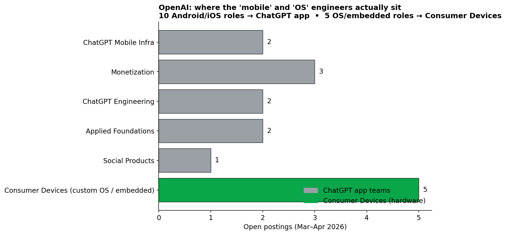
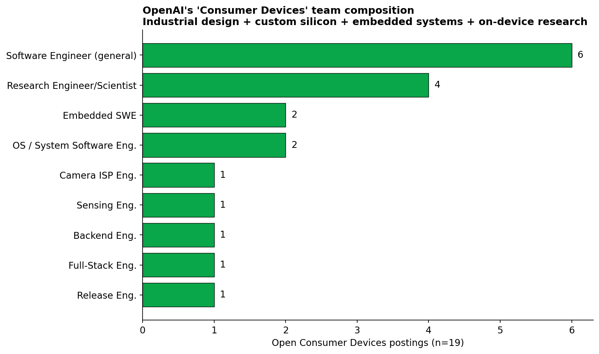
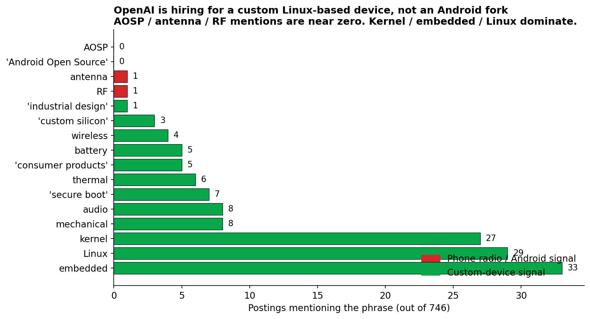

# OpenAI Is Hiring a Phone Team. The Job Postings Show It.

**Date:** 2026-04-27
**Source:** Skillenai job index (`prod-enriched-jobs`), 746 OpenAI postings ingested Mar–Apr 2026
**Analyst:** Skillenai

A press rumor that OpenAI is building a phone says nothing about *what* they are building or *how*. Job postings do. We pulled every active OpenAI posting from our index and looked for the kind of roles you can only justify if you're shipping consumer hardware. They are all there, and they are sitting on a team OpenAI labels — explicitly — "Consumer Devices."

## Top-line findings

1. **19 open roles** are titled "...Consumer Devices" — a single, recognizably-staffed team building hardware in San Francisco.
2. The team description, lifted verbatim from a posting, says they "build end-to-end **hardware and software systems** that bring AI into the physical world... at the intersection of **custom silicon, embedded systems, operating systems, and cloud services**."
3. There is a dedicated **Operating Systems Engineer** role on the Consumer Devices team. It describes kernel work, secure boot, sandboxing, **battery and thermal-aware tuning** — the textbook definition of building an OS for a battery-powered device.
4. **Zero postings** mention "AOSP," "Android Open Source," or "Android framework." The 10 Android Engineers OpenAI is hiring are *all* on ChatGPT app teams (Mobile Infra, Monetization, Applied Foundations, Social Products) — none on Consumer Devices. If they're going to use Android, no engineer has been hired to do it yet.
5. There is also a **Camera ISP Software Engineer** ("ISP" = image signal processor — a camera silicon role), an **Embedded SWE for "Consumer Devices,"** a **Software Engineer for "Sensing"** (the Neosensing team), and an **SMS Prototype Handling Specialist** under a "Secure Manufacturing & Stealth" team that exists specifically to keep prototypes confidential until launch.

This is not a vapor team. It is a shipping organization.

## Where OpenAI's "mobile" engineers actually sit

The most common rebuttal you'll see — "if OpenAI were building a phone they'd be hiring Android engineers" — is exactly backwards. They *are* hiring Android engineers. They're hiring them for the **ChatGPT app**.

| Team | Android / iOS / Mobile roles |
|---|---:|
| ChatGPT Mobile Infrastructure | 2 |
| Monetization | 3 |
| ChatGPT Engineering | 2 |
| Applied Foundations | 2 |
| Social Products | 1 |
| **Consumer Devices** | **0** |

The Consumer Devices team is hiring its own OS engineers from scratch — not Android specialists.

## The Consumer Devices roster

All 19 are San Francisco, hybrid 4-days-in-office:

| Title | Function |
|---|---|
| Operating Systems Engineer \| Consumer Devices | Custom OS kernel + userspace |
| System Software Engineer, Consumer Devices | OS frameworks |
| Embedded SWE, Consumer Devices (×2) | Low-level firmware |
| Camera ISP Software Engineer, Consumer Devices | Image signal processor (camera silicon) |
| Software Engineer – Sensing, Consumer Devices | "Neosensing" team — new sensor modalities |
| Software Engineer – Human Alignment, Consumer Devices (×2) | On-device safety/UX |
| Research Engineer/Scientist – Human Alignment, Consumer Devices (×2) | Same, research-track |
| Research Engineer/Scientist – Generative UI, Consumer Devices (×2) | Models that *generate* the UI |
| Software Engineer, Engineering Acceleration \| Consumer Devices (×2) | Internal tooling |
| Software Engineer, Quality & Developer Tools, Consumer Devices | Testing |
| Software Engineer, Infrastructure, Consumer Devices | Cloud back-end |
| Backend Engineer, Consumer Devices | Cloud back-end |
| Full-Stack Engineer, Consumer Devices | Companion app |
| Release Engineer, Consumer Devices | Build/release |

Note the two **Generative UI** researchers. The job description says the team's mission is to "**train and evaluate SoTA models** along axes that are important to our vision for **future devices**" and "help define how software works for decades to come." That is not work you do for a chatbot redesign — that is on-device model R&D.

## The hardware perimeter outside Consumer Devices

There are seven more hardware-flavored roles that don't carry the "Consumer Devices" suffix but plainly support the same effort (and aren't tagged "Stargate," which is the data-center buildout):

| Title | What it tells you |
|---|---|
| Hardware / Software CoDesign Engineer – 3P | "3P" = third-party silicon partner |
| ML Research Engineer – Hardware Codesign | ML/silicon co-design |
| Hardware Tools Engineer | Internal hardware-dev tooling |
| Hardware Development Infrastructure Engineer | Build-and-test rigs for prototype boards |
| Hardware Procurement Operations Lead (Controls & Integrations) | Buying components at scale |
| Strategic Finance, COGS & Supply Chain Finance | A finance role specifically for **cost of goods sold** — i.e., a physical product |
| **SMS Prototype Handling Specialist** | Sits inside an OpenAI **"Secure Manufacturing & Stealth"** team whose stated job is "ensuring our innovations remain confidential until launch" |

You don't hire a COGS finance leader, a procurement lead, and a prototype-secrecy specialist for vapor.

## Will the device run Android? Probably not.

This was the open question in the news rumor. The data answers it.

We searched every OpenAI posting for phone-radio and OS-fork keywords:

| Phrase | Postings (of 746) | Read |
|---|---:|---|
| AOSP | **0** | No Android-fork work |
| "Android Open Source" | **0** | No Android-fork work |
| antenna | 1 | One mention, in passing |
| RF | 1 | One mention, in passing |
| acoustic | 0 | No audio-DSP hires yet |
| "industrial design" | 1 | Only one role mentions it |
| "custom silicon" | 3 | Plural mentions in Consumer Devices team text |
| "consumer products" | 5 | The internal name for the org |
| battery | 5 | Battery-powered device |
| thermal | 6 | Thermals → device, not server |
| "secure boot" | 7 | Trusted-execution OS |
| Linux | 29 | Linux-based |
| kernel | 27 | OS kernel work |
| embedded | 33 | Embedded systems |

The signature is unmistakable: lots of **kernel**, **embedded**, **Linux**, **secure boot**, **thermal**, **battery**. Zero **AOSP**, zero **Android Open Source**, near-zero **antenna** and **RF**.

That points to a **custom Linux-based OS**, not a forked Android, and an early-stage device whose **cellular radio stack is not yet being staffed in San Francisco** — meaning it's either deferred, outsourced to an ODM partner, or the first device isn't a phone-with-its-own-modem at all (it could land as a Wi-Fi/companion device first). Either way, the Jony-Ive-uses-Android scenario is **not** what the hiring shows.

## What we'd expect to see next if this is real

A real consumer-electronics shipping plan would, within the next two quarters, need to staff some categories that are conspicuously light or absent today:
- **Acoustic / audio DSP engineers** (0 postings)
- **RF / antenna engineers** (1 each, weak)
- **Mechanical engineers** (8 postings, mostly data-center adjacent)
- **Industrial designers** (1 mention)
- **Regulatory / FCC / wireless certification**
- **Retail / packaging / unboxing**

Watching those categories light up in our index is the next dipstick. We'll re-run this analysis in 60 days.

## Methodology

- Index: `prod-enriched-jobs` on the Skillenai Data Products API, snapshot covering 2026-03-01 through 2026-04-27.
- All 746 OpenAI postings via `companyCanonicalName.keyword == "OpenAI"`.
- Team-membership signal: `match_phrase` on `title` for "Consumer Devices" → 19 hits.
- Mobile-team mapping: `match` on `title` for Android/iOS/Mobile → 10 hits, then read the post-comma team name.
- Keyword frequency: per-phrase `match_phrase` on `extractedText`.
- Caveats: (1) our index does not yet cover Big Tech proprietary ATS platforms like Apple, Google, Microsoft directly; this analysis is OpenAI-internal and not affected by that gap. (2) We snapshot live postings, so a role that has been filled and removed from the OpenAI careers site is no longer in our count. (3) Two months is enough to characterize a current hiring posture but not enough to compute a trend; we're saying "what they are staffing right now," not "their hiring is accelerating."

Full code and JSON pulls in the [`openai-phone-evidence/`](../openai-phone-evidence/) sibling folder.
