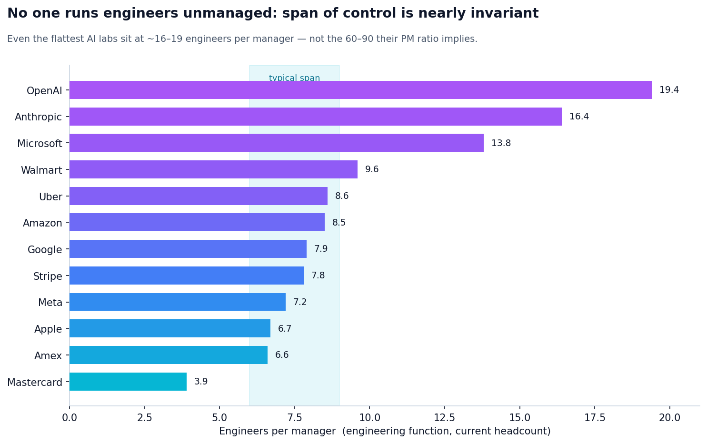
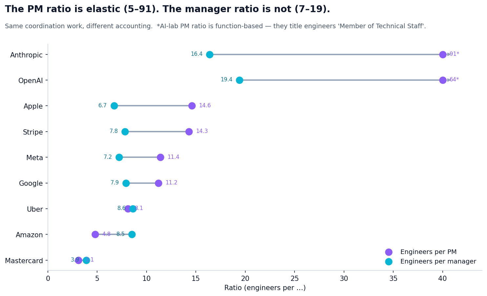
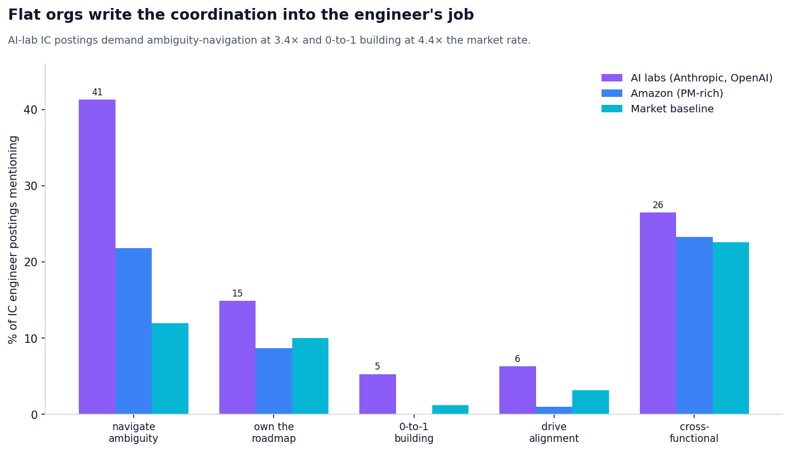
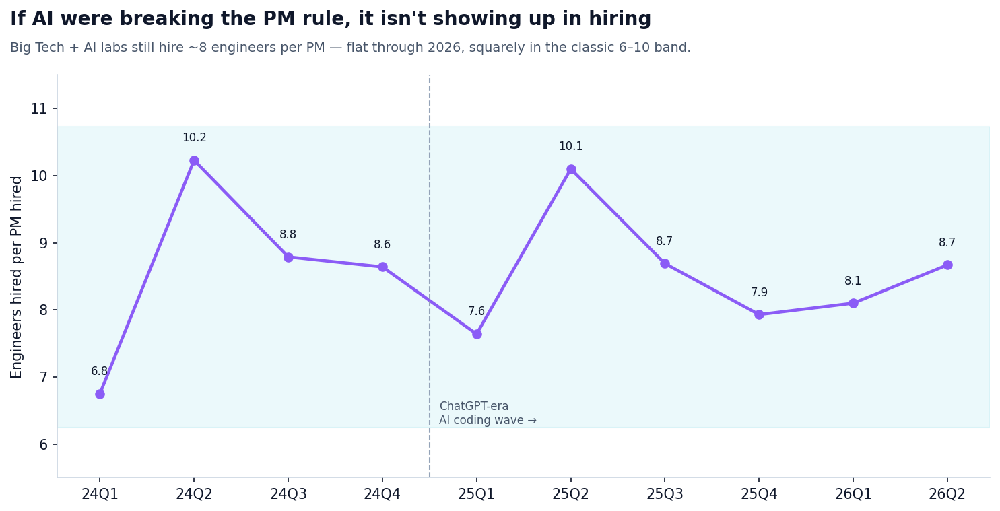

# The Coordination Tax: Why "1 PM per 30 Engineers" Is a Mirage

*Analysis date: July 2026*
*Sources: [Live Data](https://workforce.ai) (workforce.ai) — current employee headcount by title, function, and level; [Skillenai](https://skillenai.com) job-postings index — ~275K enriched postings. Hook: a widely-shared Levels.fyi chart of PM-to-engineer submission ratios.*

A Levels.fyi chart went around recently: **Apple runs ~1 product manager per 30 engineers, Uber ~1 per 5, payments companies fewer than 5, and the "engineering-first" giants (Apple, Meta, Google) run far leaner** than the 20-year-old rule of thumb of 6–10 engineers per PM. The natural reading — and the one the post floated — is that AI is letting a few high-leverage PMs steer ever-larger armies of engineers, and maybe Apple's leanness is the "AI-native" model.

We set out to corroborate it with two independent datasets Levels.fyi doesn't use: **actual headcount composition** (Live Data) and **job-posting language** (Skillenai). The cross-section holds up. The interpretation does not.

**Bottom line: no company lets engineers run unmanaged. The coordination tax is real and roughly invariant — companies just *badge* it differently. Apple's "1 PM per 15 engineers" is 1 *manager* per 7. Anthropic's "1 per 91" is 1 manager per 16, plus engineers hired explicitly to navigate ambiguity and own roadmaps.**

---

## 1. The cross-section corroborates — the shape is real

Using Live Data current headcount, with a clean apples-to-apples definition (individual-contributor **software-engineer titles** ÷ **de-noised product-manager titles**, stripping "product marketing / design / quality manager" noise), the Levels.fyi ordering reproduces from real org composition:

| Company | Engineers per PM (headcount) | Levels.fyi (submissions) |
|---|---|---|
| Apple | 14.6 | 30 |
| Stripe | 14.3 | — |
| Meta | 11.4 | 15 |
| Google | 11.2 | 12 |
| Uber | 8.1 | 5.2 |
| JPMorgan | 5.4 | — |
| Amazon | 4.8 | 7.5 |
| Mastercard | 3.1 | 1.8 |

Consumer-tech giants run lean on PMs; payments and banks run PM-rich. The absolute numbers differ from Levels.fyi (their submission-volume proxy self-selects differently than headcount, and title conventions vary), but the **shape is independently confirmed**. So far, so good for the chart.

> **A note on definitions.** This ratio is extremely sensitive to how you count. Counting the *entire engineering function* (which at Apple includes silicon, hardware, manufacturing, and QA engineers) instead of software-engineer titles inflates Apple to ~30+; counting every "product-X-manager" title instead of true PMs deflates it. The elasticity of the metric is itself the story — see §2.

---

## 2. The debunk: span of control is nearly invariant

The PM ratio measures only *one* slice of coordination. The larger, unavoidable slice is the **engineering management chain** — and it's bounded by organizational physics. A human can directly manage ~5–9 people, so we measured engineers per manager (manager + director + VP + C-level) *inside the engineering function*, using the same method for every company.

| Company | Engineers per **PM** | Engineers per **manager** |
|---|---|---|
| Mastercard | 3.1 | 3.9 |
| Amex | 2.6 (Levels) | 6.6 |
| Apple | 14.6 | **6.7** |
| Meta | 11.4 | **7.2** |
| Stripe | 14.3 | 7.8 |
| Google | 11.2 | **7.9** |
| Amazon | 4.8 | 8.5 |
| Uber | 8.1 | 8.6 |
| Walmart | 3.6 (Levels) | 9.6 |
| Microsoft | 6.6 (Levels) | 13.8 |
| Anthropic | ~91 | **16.4** |
| OpenAI | ~64 | **19.4** |

The **engineers-per-PM** column spans **3 → 91 (a 30× range)**. The **engineers-per-manager** column, for the eight established non-bank companies, clusters at **6.6–9.6** — a ~1.5× range — even though those same companies looked wildly different by PM ratio.

**Apple's "1 PM per 15 engineers" coexists with 1 manager per 6.7 engineers.** The coordination isn't missing — it's badged as Engineering Management, not Product. And the AI labs that appear to run 60–91 engineers per coordinator actually run **1 manager per 16–19**: genuinely flatter than Apple (young research orgs are), but nowhere near the order-of-magnitude "unmanaged" figure the PM ratio implies.

---

## 3. Where the "missing" coordination hides: adjacent titles

Lean-PM companies distribute product-coordination work across titles the PM ratio never counts:

| Company | PMs | Technical Program Mgrs | Product Owners |
|---|---|---|---|
| Google | 4,009 | **3,287** | 16 |
| Apple | 779 | 363 | 44 |
| Amazon | 7,969 | 4,072 | 40 |
| JPMorgan | 2,289 | 241 | **609** |

**Google runs nearly one Technical Program Manager for every Product Manager** — TPMs are 45% of its product-coordination headcount. Folding TPMs and Product Owners into the count cuts Apple's ratio from 14.6 → 9.6 and Google's from 11.2 → 6.1. Banks, meanwhile, substitute the Agile-framework title **Product Owner** (JPMorgan has 609; Apple has 44) — so part of their apparent PM-richness is just a different word.

---

## 4. At the flattest orgs, the coordination is written into the engineer's job

That still leaves a genuine residual: AI labs run flatter (16–19 per manager) than Big Tech (~7). Where does *their* coordination go? Into the IC role itself. Measuring the language of individual-contributor **engineer** postings in the Skillenai index:

| Phrase in IC engineer postings | AI labs | Amazon (PM-rich) | Market baseline |
|---|---|---|---|
| "navigate ambiguity" | **41.3%** | 21.8% | 12.0% |
| "own the roadmap" | 14.9% | 8.7% | 10.0% |
| "0-to-1 / zero to one" | **5.3%** | 0.0% | 1.2% |
| "drive alignment" | 6.3% | 1.0% | 3.2% |
| "cross-functional" | 26.5% | 23.3% | 22.6% |

**AI-lab engineer postings demand ambiguity-navigation at 3.4× the market rate and 0-to-1 building at 4.4×**, and put *roadmap ownership* — normally a PM word — on individual engineers. Amazon, which is PM-rich and *has* people to absorb that work, asks its ICs for the least (0% "0-to-1", 1% "drive alignment"). The flatter the org, the more the discovery-and-alignment work is baked into what it hires engineers to do.

---

## 5. And no, AI isn't (yet) breaking the rule

If AI were letting one PM steer ever-more engineers, the *hiring* ratio would be widening. It isn't. Big Tech + AI-lab **hiring** (software-engineer hires per PM hire, same clean definitions) has been flat through 2026, squarely in the classic 6–10 band:

The largest move in the last decade was the 2021–22 zero-interest-rate hiring bubble (companies over-hired PMs) and its 2023 correction — not an AI regime change. The "AI is collapsing the PM role" narrative is, so far, not visible in the data.

---

## Takeaways

1. **The PM-to-engineer ratio is a bad proxy for how coordinated an org is.** It's elastic (3–91 across these companies) because it measures only how much coordination a company chooses to *badge* "product."
2. **Span of control is near-invariant.** Established big tech runs ~7–9 engineers per manager regardless of PM ratio; the flattest AI labs run ~16–19 — flatter, but never "unmanaged."
3. **Coordination gets paid three ways:** the management chain, adjacent titles (TPM at Google; Product Owner at banks), and — at the flattest orgs — the engineer's own job description (ambiguity, roadmap, 0-to-1).
4. **AI hasn't broken the rule.** The PM:engineer *hiring* ratio is flat through 2026.
5. **For engineers reading a viral org-chart stat:** "few PMs" rarely means "less coordination." It usually means the coordination lands on your manager, a TPM, or you.

---

## Methodology

- **Two independent sources.** Live Data (workforce.ai) supplies current-employee counts by title, function (18-category taxonomy), and level; Skillenai supplies enriched job postings. Cross-source triangulation is the point — neither is used to check itself.
- **Clean role definitions.** "Engineers per PM" uses IC **software-engineer titles** ÷ **product-manager titles with "marketing/design/quality/program manager" excluded**. An earlier draft using the whole *engineering function* (hardware + QA + manufacturing) over fuzzy PM titles inflated ratios ~2–3× — that artifact is corrected here.
- **Span of control** counts manager + director + VP + C-level over IC levels within the engineering function.
- **Known caveats.** (a) Banks title senior individual contributors "VP," so JPMorgan's raw manager count is unreliable and it is excluded from the invariance claim. (b) Microsoft's engineering level distribution is unusually senior-IC-heavy, which may reflect leveling inference rather than a genuinely flat org. (c) AI labs title engineers "Member of Technical Staff," so their PM ratio uses the engineering *function* (title-based undercounts them); span-of-control and posting-language cuts are unaffected. (d) Recent-quarter hiring counts are lightly affected by profile-update lag; ratios are more robust than levels. (e) One job aggregator that had been mis-attributed as a single "employer" was excluded before computing posting-based ratios.
- **Not measured.** Actual coordination *work* (we measure headcount and posting language, both proxies); private-ATS employers under-represented in public postings; companies outside this set.
- Raw per-company aggregation outputs are available on request.
