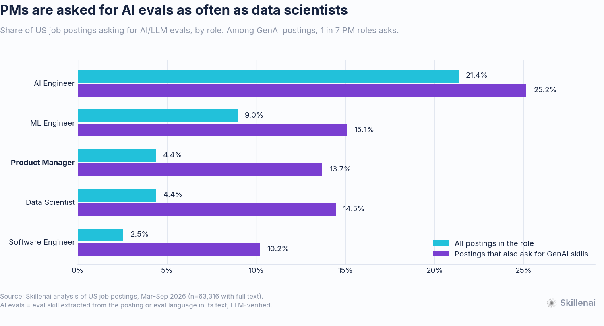
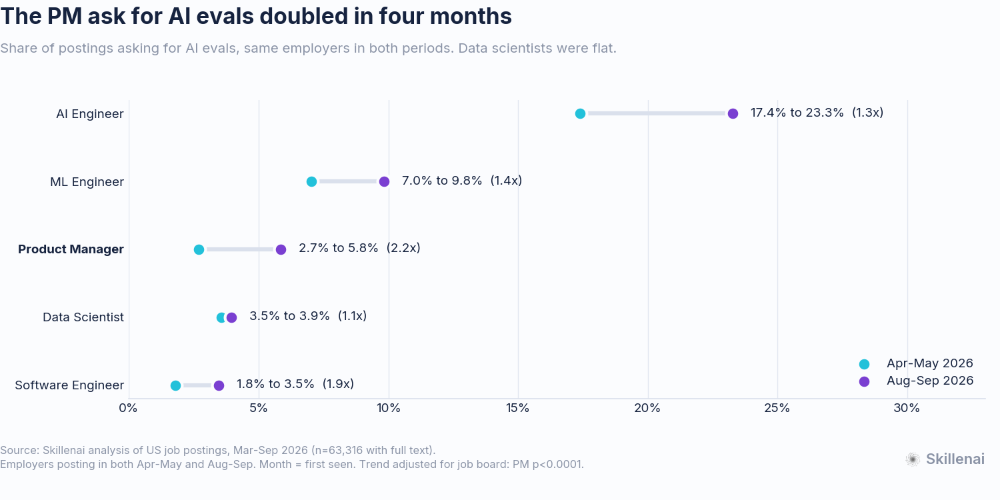
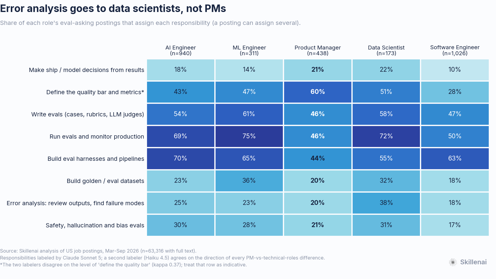
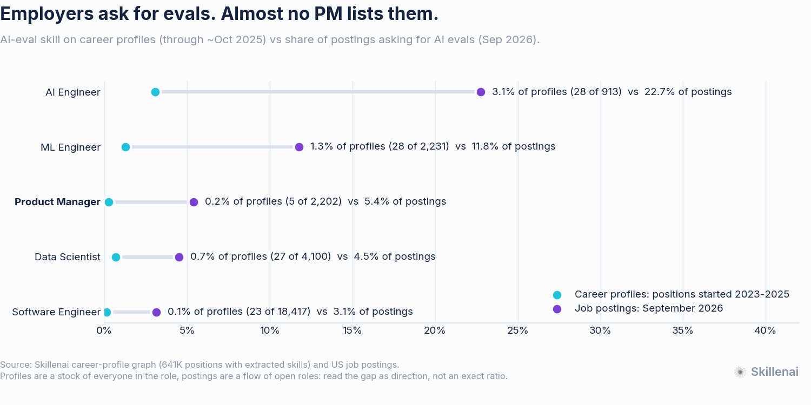

# Do PMs really need AI evals? What 63,000 job postings say

**Analysis date:** 2026-09-23
**Data:** Skillenai `prod-enriched-jobs`: US postings for five role families, first seen March to September 2026 (74,857 postings, 63,316 with full description text). Also the Skillenai career-profile graph: 641K positions with extracted skills, employment history through roughly October 2025.
**Prompted by:** Hamel Husain and Shreya Shankar, [*Advanced evals: How to find (and fix) hidden AI failures in your product*](https://www.lennysnewsletter.com/p/advanced-evals-how-to-find-and-fix) (Lenny's Newsletter, 2026-09-22). The piece opens with Mike Krieger calling evals "probably the most important thing" to teach product people.

---

## TL;DR

- **The PM eval ask is real but narrow.** 4.4% of US PM postings ask for AI evals, which is **1 in 7 (13.7%) among PM roles on GenAI products**. That is the same rate as data scientists (4.4% / 14.5%) and well above software engineers (2.5% / 10.2%).
- **It doubled in four months.** Among employers that posted in both periods, the PM rate went from **2.7% in Apr-May to 5.8% in Aug-Sep** (p<0.0001, adjusted for job board). Data scientists were flat.
- **Employers want PMs to do it, not just understand it.** 79% of PM eval asks are hands-on, and **46% ask the PM to write evals.**
- **The step the experts call most important goes to data scientists.** Husain and Shankar say error analysis is the part to prioritize if you only have time for one. Employers assign it in **38% of data-science eval asks and 20% of PM eval asks**, about the same rate as for software engineers. What PMs are asked for less often than engineers is building eval infrastructure and running evals.
- **Supply hasn't caught up.** In career profiles through about October 2025, **0.2% of PM positions (5 of 2,202)** list an AI-eval skill. By September 2026, **5.4% of PM postings** ask for it.

> **Employers aren't asking PMs to understand evals. They're asking them to write them. But error analysis, the step Husain and Shankar say to prioritize above all others, still mostly lands on data scientists.**

---

## 1. How often each role is asked for AI evals

| Role family | Postings | Asked for AI evals | Postings asking for GenAI skills | Asked for evals, within those | Share of all eval-asking postings |
|---|---:|---:|---:|---:|---:|
| AI Engineer | 4,410 | 21.4% | 3,521 | 25.2% | 32.3% |
| ML Engineer | 3,469 | 9.0% | 1,764 | 15.1% | 10.7% |
| **Product Manager** | **10,105** | **4.4%** | **2,687** | **13.7%** | **15.1%** |
| Data Scientist | 3,973 | 4.4% | 1,010 | 14.5% | 6.0% |
| Software Engineer | 41,359 | 2.5% | 8,257 | 10.2% | 36.0% |

Because the PM job market is large, employers posted **442 eval-asking PM roles** in our window. That is more than ML engineers (311) and 2.5 times data scientists (175).

The PM result does not depend on AI titles. PMs with AI in the title (e.g. "AI Product Manager", n=289) are asked more often (16.6%), but the 9,816 PMs *without* an AI title are still asked at 4.0%. This is an ordinary PM requirement now, not a niche title's.

## 2. It doubled in four months

| Role family | Apr-May | Aug-Sep | Change | Monthly trend (logit, job-board FE), p |
|---|---:|---:|---:|---|
| **Product Manager** | **2.7%** | **5.8%** | **2.2x** | <0.0001 |
| Software Engineer | 1.8% | 3.5% | 1.9x | <0.0001 |
| ML Engineer | 7.0% | 9.8% | 1.4x | 0.046 |
| AI Engineer | 17.4% | 23.3% | 1.3x | <0.0001 |
| Data Scientist | 3.5% | 3.9% | 1.1x | 0.43 |

*Same employers in both periods. The all-employer version shows the same pattern (PM 3.2% to 4.7%, p<0.0001).*

The rise is **not** a case of more PM jobs touching GenAI. The share of PM postings asking for GenAI skills held at 25-26% across the window. Among those GenAI PM postings, the share asking for evals rose from 11.4% to 15.6%. Evals are becoming part of what an AI PM job *is*.

Software engineers rose almost as fast, so this is part of a broader shift toward evaluating AI features. We do not claim PMs are rising fastest. We claim the PM rate doubled while the data-science rate stayed flat.

## 3. What each role is actually asked to do

For each of the 3,041 eval-asking postings, we extracted every sentence that mentions evaluation. An LLM then labeled which eval responsibilities the posting assigns to the hire, and whether the ask is hands-on or familiarity only. We first built the responsibility list from open-ended labels on a sample of 300 postings, rather than writing it ourselves.

Share of each role's eval-asking postings assigning each responsibility (primary labeler Claude Sonnet 5; second labeler Haiku 4.5 in brackets):

| Responsibility | PM | AI Eng | ML Eng | Data Sci | SWE |
|---|---:|---:|---:|---:|---:|
| Write evals (cases, rubrics, LLM judges) | **46** [36] | 54 [52] | 61 [60] | 58 [59] | 47 [38] |
| Run evals and monitor production | **46** [45] | 69 [65] | 75 [68] | 72 [64] | 50 [52] |
| Build eval harnesses and pipelines | **44** [37] | 70 [73] | 65 [69] | 55 [56] | 63 [69] |
| Make ship / model decisions from results | **21** [45] | 18 [36] | 14 [35] | 22 [35] | 11 [24] |
| Error analysis: review outputs, find failure modes | **20** [34] | 25 [44] | 23 [39] | **38** [57] | 18 [31] |
| Build golden / eval datasets | **20** [23] | 23 [28] | 36 [44] | 32 [42] | 18 [21] |
| Safety, hallucination and bias evals | **21** [19] | 30 [30] | 28 [28] | 31 [31] | 17 [19] |
| Define the quality bar and metrics\* | **60** [81] | 43 [82] | 47 [86] | 51 [90] | 28 [65] |
| **Hands-on (not just familiarity)** | **79** | 88 | 93 | 87 | 79 |

\*The two labelers agree on direction but not on level for this row (Cohen's kappa 0.37). PM job descriptions habitually say "own the quality bar", so treat any PM lead here as indicative only.

What holds under both labelers:

1. **PMs are asked to do the work, not just understand it.** Four in five PM eval asks are hands-on, the same share as software engineers. Nearly half ask the PM to write evals: "Write evals, together with our engineering and research", "Build and own the evaluation harness: define golden datasets, quality rubrics, and regression testing", "own the quality bar... the evals, guardrails, and feedback loops".
2. **PMs are asked to build and run eval infrastructure much less often than engineers** (44% vs 55-70% for building harnesses; 46% vs 50-75% for running and monitoring). Compared with the four technical roles pooled, PMs are 22 points lower on infrastructure and 15 points lower on running and monitoring, under both labelers.
3. **Error analysis goes to data scientists.** DS 37.6% vs PM 19.6% (z=4.6, p=4e-6); under the second labeler, 56.7% vs 34.4% (z=5.0). No single employer drives it: the top employer holds 12% of DS error-analysis asks, and excluding it leaves DS at 34.5%. Husain and Shankar call error discovery "the eval equivalent of product discovery", a job that looks most like a PM's. Employers haven't assigned it that way yet.

## 4. Employers ask for it; almost no PM lists it

| Role family | Profile positions started 2023-2025 | With an AI-eval skill | Share | Postings asking, Sep 2026 |
|---|---:|---:|---:|---:|
| AI Engineer | 913 | 28 | 3.1% | 22.7% |
| ML Engineer | 2,231 | 28 | 1.3% | 11.8% |
| **Product Manager** | **2,202** | **5** | **0.2%** | **5.4%** |
| Data Scientist | 4,100 | 27 | 0.7% | 4.5% |
| Software Engineer | 18,417 | 23 | 0.1% | 3.1% |

Over the longer horizon, AI-eval skills first appear on career profiles in 2022. From then on the order is the same as in postings: AI engineers first, then ML engineers, data scientists, and software engineers and PMs last. PMs are at the bottom: across 2018-2025 no year has more than 3 PM positions listing an AI-eval skill.

This is a comparison of direction, not an exact ratio. Profiles are a stock (everyone who held the role, as described in their own words); postings are a flow (open roles, as described by employers). Profile employment history also ends around October 2025, before most of the rise in section 2.

---

## What this means for your career

- **PMs on AI products:** evals are now a line in about 1 in 7 of your job postings, and it is a hands-on line: write them, build the golden set, set the bar. Almost nobody in your cohort lists it yet, so it is one of the few requirements where you can stand out.
- **PMs outside AI products:** at 1 in 100 non-GenAI PM postings, this is not your bottleneck yet.
- **PMs who want to go further:** error analysis is where the method's authors say the value is, and employers still mostly give it to data scientists. A PM who can run it is doing something the market hasn't asked of them yet.
- **Data scientists:** employers post 2.5x more eval-asking PM roles than DS roles. Evaluation is not DS territory by default any more. Error analysis still is.

---

## Methodology

**Role families.** Matched on the pipeline's normalized `role` title, in the same families as our [who-builds-with-llms](https://github.com/skillenai/skillenai-notebooks/tree/master/who-builds-with-llms) analysis. Product Manager includes Technical, Principal, Group, Staff and AI Product Manager, and excludes Product Marketing. See `fam.py`. A carpet-bombing spam employer is excluded throughout.

**Selection bias check.** Our job crawler admits postings either by R&D title or by AI-heavy description content. "Product manager", "software engineer", "data scientist" and "machine learning" are all *title* keywords, so every family here was admitted regardless of AI content. That keeps rates within a family unbiased with respect to how the crawler selects postings. The career-profile corpus uses the same kind of title list.

**Full text only.** Several job-board platforms deliver postings without descriptions. We keep postings with at least 500 characters of text (63,316 of 74,857).

**"Asked for AI evals"** = at least one of two independent detectors fires, and an LLM check did not reject it:
1. **Extracted skills:** the enrichment pipeline's LLM-extracted skill/product entities, classified by `evalclass.py`. 397 skill names count, e.g. `evals`, `LLM evaluation`, `LLM-as-judge`, `agent evaluation`, `eval harnesses`, LangSmith, Langfuse, Braintrust, RAGAS, DeepEval. Vendor, program, performance, usability, risk, test-and-evaluation and red-team entries are excluded. Plain `model evaluation` (classic ML validation) is **not** counted, since counting it would favor data scientists and ML engineers by construction.
2. **Text:** a pattern match on the full description text for AI-eval language ("evals", "LLM-as-a-judge", "AI/LLM/agent evaluation", "eval harness/framework", "evaluate model outputs", named eval tools, "golden dataset"). A spot-check of 30 random PM matches found all 30 were genuinely about AI evals.
3. **Rejection:** the responsibility labeler flagged 5% of detections as not about evaluating AI systems (company boilerplate like an eval vendor describing its product, candidate-screening notices, choosing AI tools to adopt). These are removed.

The two detectors agree on direction everywhere. The skills measure runs lower (PM 2.9%) and the text measure higher (PM 3.9%) than their union.

**Time axis.** The index's posting-date field is trustworthy for only a fraction of postings and clusters in Aug-Sep, so we use the month each posting was **first seen**. March 2026 is the first-scrape backlog month and is excluded from trend tests. Trends are logistic regressions of the monthly flag on month index with job-board fixed effects, run on all employers and on employers present in both Apr-May and Aug-Sep. Job-board mix shifted during the window (two platforms were added in August), which is why we adjust for it.

**Responsibilities.** We extracted every sentence mentioning evaluation from each eval-asking posting and labeled it with Claude Sonnet 5 through a forced tool call returning structured fields (never parsed prose). The prompt and schema are in `label_responsibilities.py`. The responsibility list was derived from an open-ended labeling pass on 300 postings (60 per role). All 3,041 postings were independently labeled a second time by Claude Haiku 4.5. On a 250-posting overlap check, agreement was kappa 0.59-0.84 for seven of the eight responsibilities and 0.60 for hands-on vs familiarity. "Define the quality bar" had kappa 0.37 and is treated as indicative. We initially split depth four ways (leads / builds / familiarity / not AI), but the leads-vs-builds boundary was not reliable (61% agreement), so we report hands-on vs familiarity only.

**Career profiles.** Per-position, dated skills extracted from the position descriptions on career profiles (641K positions carrying at least one skill), classified with the same `evalclass.py`. The denominator is positions *with at least one extracted skill*, so differences in how much profiles describe do not show up as skill differences. PM counts are very small (5 positions in 2023-2025), so the profile figure shows direction only.

**Limitations.**
- Postings describe what employers ask for, not what the hire does or whether the requirement is enforced.
- Big Tech employers that run proprietary job boards are under-represented in our index.
- Six months is a short window.
- LLM-labeled responsibilities over-assign when a single sentence names several things. That affects every role equally, so compare across roles rather than reading absolute levels.

**Files.** `01_rates_by_role.csv`, `02_trend.csv`, `02_monthly.csv`, `03_profiles_vs_postings.csv`, `04_responsibilities_{sonnet,haiku}.csv`; `evalclass.py` (eval-skill classifier), `fam.py` (role families), `label_responsibilities.py` (labeling prompt and schema), `make_figures.py`, `brand.py`. The per-posting extract (790 MB) is not committed; it is available on request.
