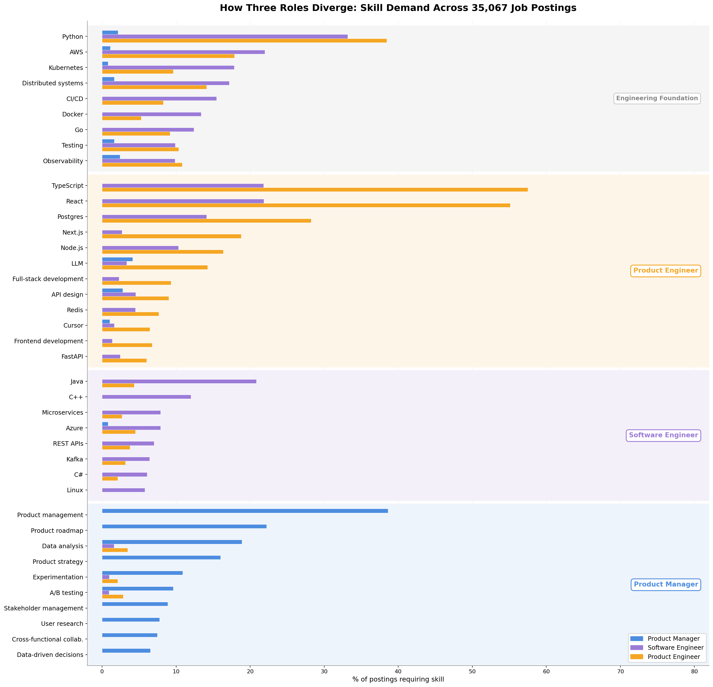
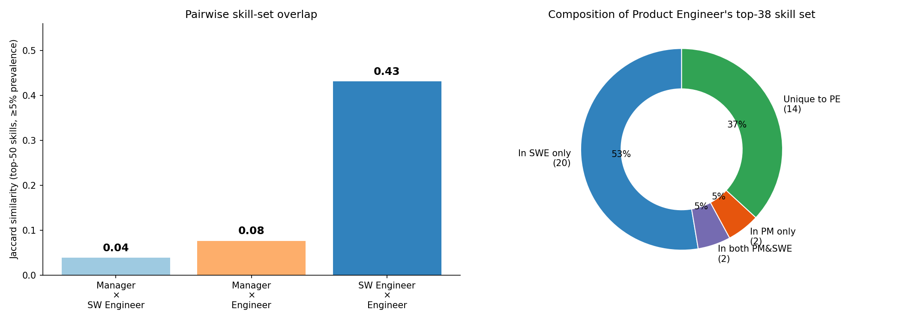
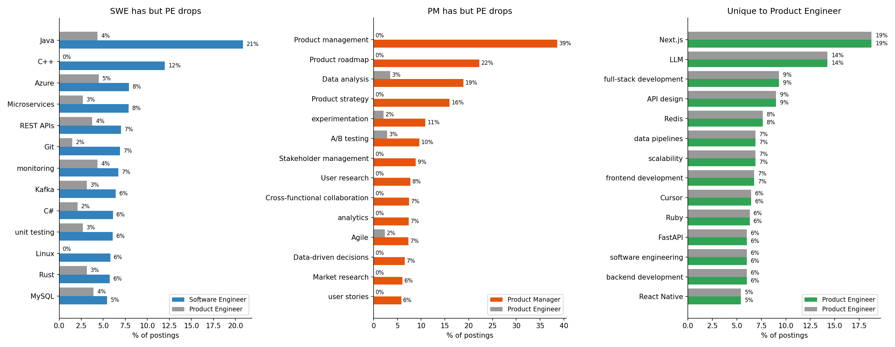
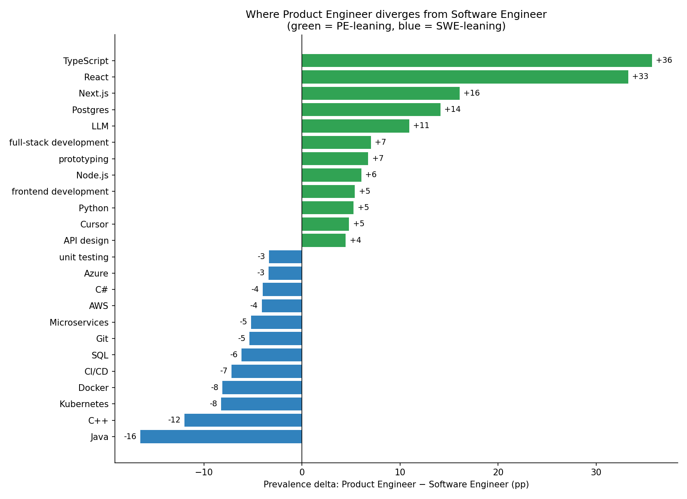
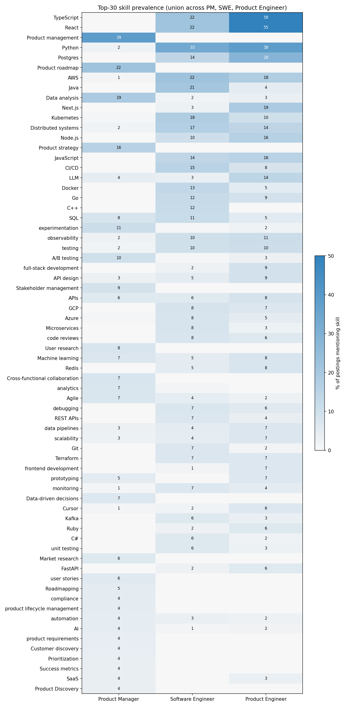

# Product Engineer ≠ PM × Software Engineer

**There is no Venn-diagram intersection for "Product Engineer" to live in.**

A common framing — popularized recently by levels.fyi — claims Product Engineer (PE)
sits at the **intersection** of Product Manager (PM) and Software Engineer (SWE):
"think like a PM, ship code like an engineer." The geometry implies a meaningful
overlap region between the PM and SWE skill circles for PE to occupy.

We measured that overlap directly. It is essentially empty. PE is not a hybrid
role — it is a **modern-stack SWE archetype** with a heavy AI / web-product tilt.

- **Date**: 2026-05-07
- **Source**: Skillenai labor-market index (`prod-enriched-jobs`), 159K job postings
- **Scope**: 35,067 postings across 35 role-title variants, after filtering

---

## TL;DR

| | Software Engineer ↔ Product Manager | Product Manager ↔ Product Engineer | Software Engineer ↔ Product Engineer |
|---|---:|---:|---:|
| **Jaccard (top-50 skills, ≥5% prevalence)** | **0.04** | **0.08** | **0.43** |
| Skills shared | 2 of 51 | 4 of 52 | 22 of 51 |

PM and SWE share only **2 skills** in their top-50 each (Agile, Data analysis).
There is no rich PM∩SWE region for PE to occupy. Of PE's 38 top skills, **53% are
SWE-only, 5% are PM-only, 5% are in both, 37% are unique to PE**. The unique-to-PE
skills are not "PM responsibilities engineers borrow" — they are **modern web and
AI tooling**: Next.js, LLM, Cursor, full-stack development, FastAPI.

---

## Method

### Role buckets (entity-resolved `role.keyword`, exact-term match)

| Bucket | Variants included | Postings (after filters) |
|---|---|---:|
| **Product Manager** | `Product Manager`, `Senior/Staff/Principal/Lead/Group/Associate Product Manager`, `Technical Product Manager`, `AI Product Manager` | 7,411 |
| **Software Engineer** | `Software Engineer`, `Senior/Staff/Principal/Lead Software Engineer`, `Backend/Frontend/Full Stack/Fullstack/Full-Stack Software Engineer`, `Software Development Engineer`, `AI Software Engineer` | 26,990 |
| **Product Engineer** | `Product Engineer`, `AI Product Engineer`, `Product Software Engineer`, `Staff/Lead/Principal Product Engineer`, `Full Stack/Backend/Frontend Product Engineer` (and Fullstack variants) | 666 |

We **excluded specialized variants** (Embedded, Robotics, Flight, Security,
SDET, Test, Intern, Manager) from all buckets to keep this an apples-to-apples
IC-track comparison.

### Filters applied
- **Speechify excluded** (carpet-bombs ~120 PE postings, 15% of the raw bucket)
- **Hardware Product Engineer excluded by construction.** Verified the bucket
  is software-only: 0 semiconductor employers (Intel, Micron, Lam, TSMC, NVIDIA,
  AMD, etc.) in the top 50 PE employers; only 2 of 666 PE postings mention any
  hardware skill (Verilog/SystemVerilog). The skill profile (TypeScript 58%,
  React 55%) confirms.
- **Single-employer dominance check**: PE top employer is Intercom at 4.2%, well
  below the 25% red-line threshold. SWE top employer 1.5%, PM top employer 3.7%.

### Skill measurement
- Top 200 skills per role bucket via nested aggregation on `entities[]` filtered
  to `entityType = "skill"` (entity-resolved canonical names)
- Light alias canonicalization (TypeScript / typescript, Postgres / PostgreSQL, LLM / large language models, etc.) — addresses the known SKI-165 duplicate-canonical-name issue
- **Prevalence** = `mentions / total_postings_in_bucket`. NER emits each skill
  ~once per posting, so this is a tight upper bound on unique-job prevalence.

### Statistical tests
- Per-skill 2×2 chi-square (Yates corrected): PE vs PM+SWE combined
- Bonferroni correction across 68-skill union: α = 0.05 / 68 = 0.000735
- Effect size: Cramer's V (φ for 2×2)
- All top-20 deviations significant at corrected α (full table: [pe_vs_others_chi2.csv](pe_vs_others_chi2.csv))

---

## Finding 1: PM and SWE barely overlap to begin with

The Venn diagram in the original framing implies a substantial PM ∩ SWE overlap
region. The data says otherwise.

Of the top-50 high-prevalence skills (≥5% of postings) in each role:

- **Product Manager top-18 high-prevalence skills**: Product management (39%),
  Product roadmap (22%), Data analysis (19%), Product strategy (16%),
  Experimentation (11%), A/B testing (10%), Stakeholder management (9%),
  Cross-functional collaboration (7%), User research (8%), KPIs, OKRs, GTM…
- **Software Engineer top-35 high-prevalence skills**: Python (33%), AWS (22%),
  TypeScript (22%), Java (21%), React (22%), Kubernetes (18%), Distributed
  systems (17%), CI/CD (15%), JavaScript (14%), Docker, Microservices…

Only **two skills cross both lists**: *Agile* and *Data analysis*. That is the
entire intersection. Jaccard(PM, SWE) = **0.039**.

There is no fat overlap region in the Venn diagram — the two circles are nearly
disjoint vocabularies. So the framing "PE = PM ∩ SWE" defines PE as the
intersection of two nearly-disjoint sets, which mathematically forces PE to be
≈ ∅.

That isn't what we see. PE is a real, populated role. It just isn't the
intersection.

---

## Finding 2: Product Engineer is overwhelmingly SWE-flavored

Of Product Engineer's 38 top skills (≥5% prevalence):

| Composition | Count | Share |
|---|---:|---:|
| In SWE only (not in PM) | 20 | 53% |
| In both PM and SWE | 2 | 5% |
| In PM only (not in SWE) | 2 | 5% |
| Unique to PE (not in SWE or PM) | 14 | 37% |

The two PM-only skills PE inherits are **prototyping** (6.8%) and **SaaS** (3.3%) —
both arguably engineering-adjacent rather than pure product-management.

The two **PM-only top skills the original framing predicts PE should adopt are
absent**: Product management (39% in PM, 0% in PE), Product roadmap (22% PM,
0% PE), Product strategy (16% PM, 0% PE), Stakeholder management (9% PM, 0%
PE), User research (8% PM, 0% PE), Cross-functional collaboration (7% PM, 0%
PE).

If PE were a true PM/SWE hybrid, even partial inheritance of PM's signature
skills should appear. It doesn't.

---

## Finding 3: The "Product" prefix is a stack signal, not a hybrid signal

Where does PE diverge from SWE? Not toward PM-style work — toward a **modern
web and AI stack**.

PE-leaning vs SWE (top deltas, percentage points):

| Skill | PE | SWE | Δ |
|---|---:|---:|---:|
| TypeScript | 58% | 22% | **+36** |
| React | 55% | 22% | **+33** |
| Next.js | 19% | 3% | **+16** |
| Postgres | 28% | 14% | **+14** |
| LLM | 14% | 3% | **+11** |
| Node.js | 16% | 10% | **+6** |
| full-stack development | 9% | 2% | **+7** |
| Cursor | 6.5% | 1.7% | **+5** |
| FastAPI | 6.0% | 2.5% | **+4** |
| frontend development | 6.8% | 1.4% | **+5** |
| backend development | 6.0% | 3.5% | **+3** |
| API design | 9% | 5% | **+4** |

SWE-leaning vs PE (PE drops these enterprise stack items):

| Skill | PE | SWE | Δ |
|---|---:|---:|---:|
| Java | 4% | 21% | **−17** |
| C++ | 0% | 12% | **−12** |
| Microservices | 3% | 8% | **−5** |
| Azure | 5% | 8% | **−3** |
| Linux | 0% | 6% | **−6** |
| Kafka | 3% | 6% | **−3** |
| C# | 2% | 6% | **−4** |
| Distributed systems | 14% | 17% | **−3** |

The pattern is unmistakable. Going from SWE to Product Engineer means **dropping
Java/C++/Microservices and picking up Next.js/TypeScript/LLM/Cursor**. It is a
stack switch within engineering, not a shift toward product responsibilities.

---

## Finding 4: PE inherits ~zero PM vocabulary, even softened

To stress-test, we relaxed the threshold and looked at *every* top-30 PM skill to
see if **any** appears at meaningful prevalence in PE. Result:

| PM skill | PM | PE | Inherited? |
|---|---:|---:|---|
| Product management | 38.6% | 0.0% | No |
| Product roadmap | 22.2% | 0.0% | No |
| Data analysis | 18.9% | 3.4% | Trace |
| Product strategy | 16.0% | 0.0% | No |
| Experimentation | 10.9% | 2.1% | Trace |
| A/B testing | 9.6% | 2.9% | Trace |
| Stakeholder management | 8.9% | 0.0% | No |
| User research | 7.8% | 0.0% | No |
| Cross-functional collaboration | 7.5% | 0.0% | No |
| Data-driven decisions | 6.5% | 0.0% | No |
| User stories | 5.8% | 0.0% | No |
| Market research | 6.1% | 0.0% | No |
| Agile | 7.3% | 2.4% | Trace |
| Scrum | 4.5% | 0.0% | No |
| KPIs / OKRs | 4–5% | 0.0% | No |

The PM vocabulary does not transfer. The framing "PE thinks like a PM" is not
visible in the postings.

---

## What we are *not* claiming

- **Product Engineers don't make product decisions.** They almost certainly do.
  But job postings list named, hard skills — and the PM skill vocabulary
  (roadmap, strategy, A/B testing, stakeholder management) is not appearing
  in PE postings, even softened. If hiring managers expected PE candidates to
  *think* like PMs, they don't *write that they expect it* using the language
  PMs themselves are described with.
- **PE postings are recent and small (n=666).** The bucket is 38× smaller than
  SWE. Confidence intervals on PE prevalence are wider; we relied on chi-square
  with Bonferroni correction (α=0.000735) for significance. The 22 SWE-shared
  skills, 14 PE-unique skills, and 0 PM-only-and-not-SWE skills are all
  significant at that threshold.
- **Some of the SWE→PE delta is startup-vs-enterprise stack mix.** PE skews
  early-stage SaaS (Intercom, Dropbox, Attio, Linear, Replit). Some of the
  Java/C++ gap reflects "modern startup stack" rather than "PE rejects systems
  programming." But the +16pp Next.js, +11pp LLM, +5pp Cursor deltas are
  PE-distinctive even within engineering.

---

## So what *is* a Product Engineer, then?

Empirically, in software, today (2026-Q2):

> A **Product Engineer** is a Software Engineer working on a modern web/AI
> startup stack — heavy TypeScript + React + Next.js, Node.js or FastAPI on
> Postgres, building LLM-powered product features with Cursor as their daily
> tool — who carries an explicit "full-stack / ship features end-to-end"
> mandate. The "Product" prefix signals **stack and product-building style**,
> not hybrid PM/SWE responsibilities.

The typical career move SWE → Product Engineer is a **stack and tooling switch**
(adopt the modern web/AI stack, drop Java/C++/microservices vocabulary), not a
re-skill into product management. Going PM → Product Engineer is, by these
numbers, a near-total re-skill: PM keeps almost nothing of their existing
vocabulary.

---

## Caveats

- Postings are a **demand-side** measurement. They tell us what hiring managers
  *write down*, not what the role actually does day-to-day. If PE responsibilities
  include product work that isn't articulated as named skills, we miss it. But
  the same NER pipeline applied to PM postings *does* surface the product
  vocabulary cleanly — so the asymmetry is real, not an extraction artifact.
- We canonicalized obvious skill duplicates (TypeScript / typescript, Postgres
  / PostgreSQL, etc.) but skill-entity duplication remains a known data-quality
  issue in the source pipeline. Borderline name pairs may have minor effect on
  individual skill rankings (sub-percentage-point), not the headline.
- The pipeline's `ingestedAt` includes a 2026-03-30 backfill spike of ~58K
  documents. Backfill biases absolute counts but cancels out in proportions
  (which is what every comparison here uses).

---

## Files in this folder

- `00_hero.png` — Banded chart, four sections (Engineering Foundation / Product Engineer Stack / Software Engineer Enterprise / Product Manager Core)
- `01_heatmap.png` — Top-30 union prevalence across all three roles
- `02_overlap.png` — Pairwise Jaccard + PE composition donut
- `03_asymmetric.png` — Skills present in one role but missing from PE
- `04_pe_vs_swe_delta.png` — PE-vs-SWE skill prevalence delta (top 24)
- `prevalence_matrix.csv` — Full prevalence matrix across the union of top skills
- `pe_vs_others_chi2.csv` — Per-skill chi-square test (PE vs PM+SWE), Bonferroni-corrected
- `overlap_summary.json` — Set-theoretic overlap summary
- `role_doc_counts.json` — Posting counts per role bucket
