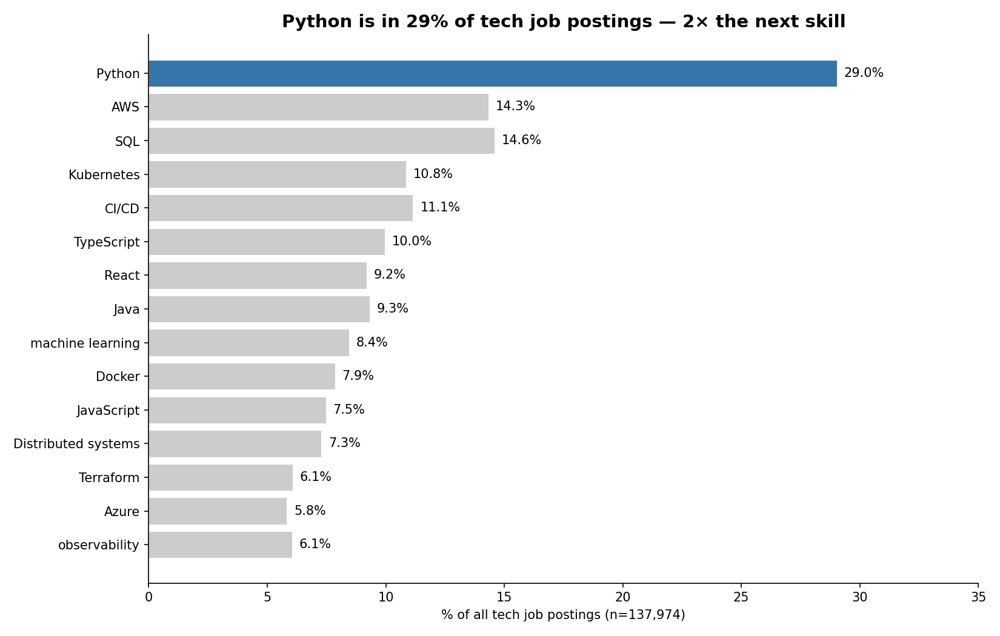
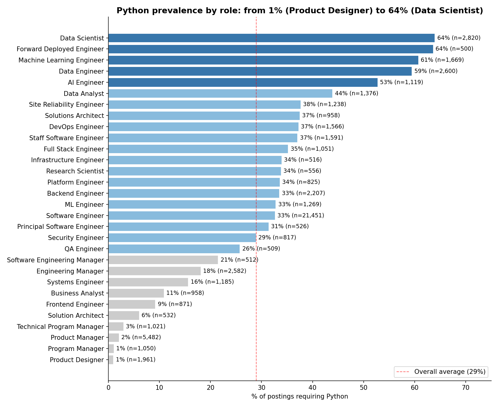
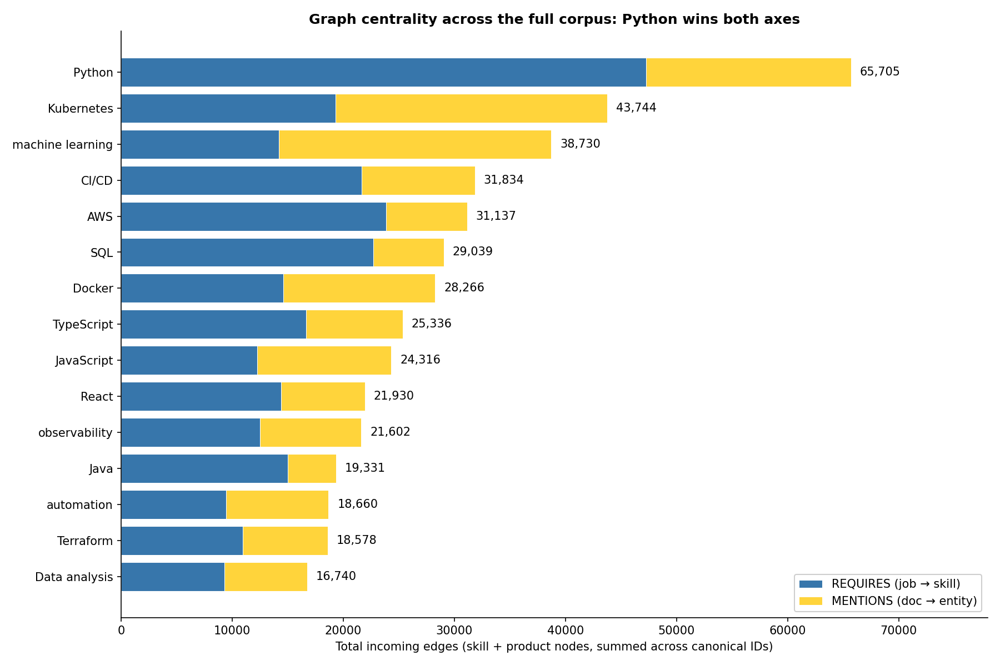
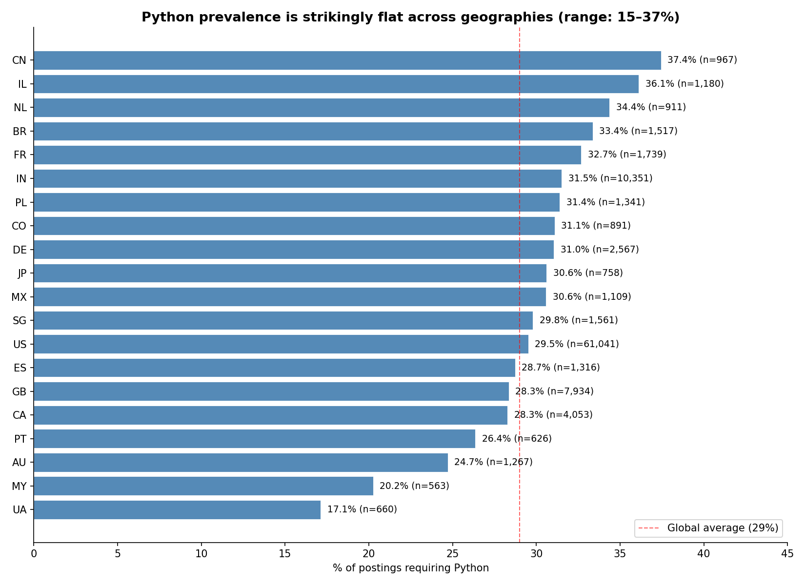
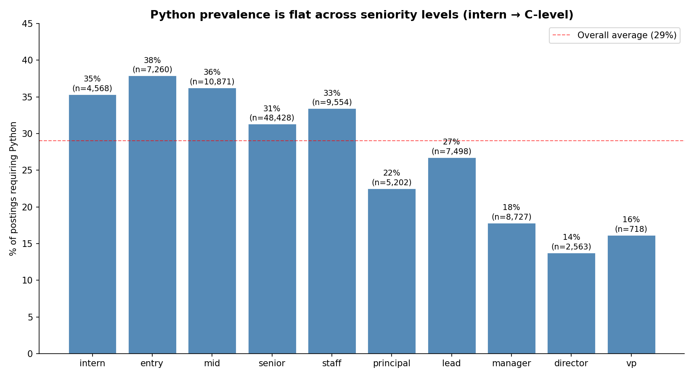
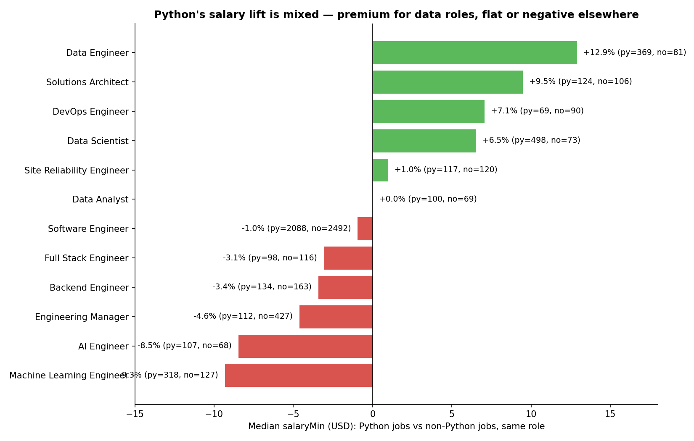
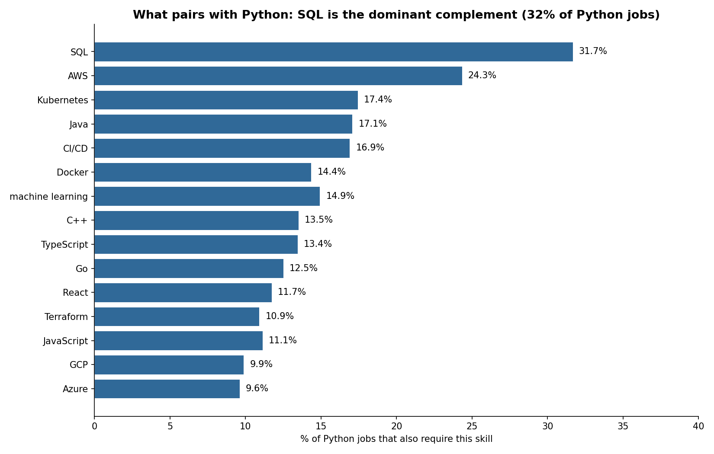
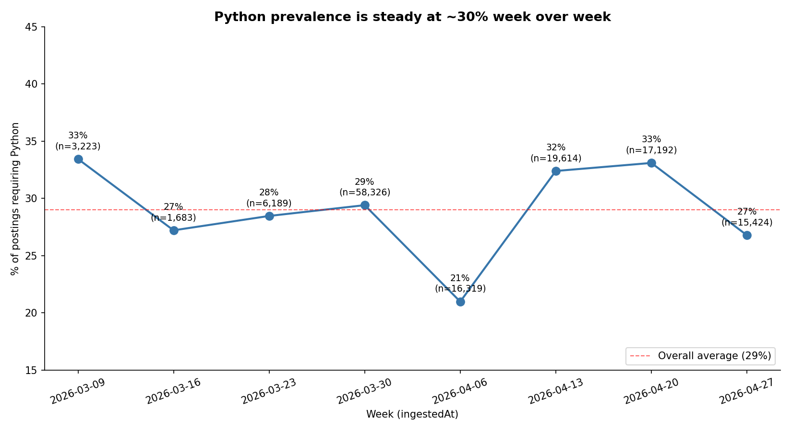

# Python Rules Tech: The Most Important Skill in the Job Market, by Five Measures

**Date:** 2026-05-03
**Source:** Skillenai job index (137,974 tech postings) + Skillenai knowledge graph (1.86M source documents across jobs, blogs, news, and scholarly content). Speechify excluded.
**Authors:** Skillenai AI Analyst

We set out to identify the most important skill in tech today and ended up needing to define what "important" means. By every reasonable definition — raw demand, cross-role universality, knowledge-graph centrality, geographic reach, and pairing with other skills — the answer is the same: **Python**. It is the only top skill in our index that is requested at roughly the same rate from San Francisco to Bangalore, from intern to staff engineer, and it dominates both edge types of the knowledge graph (jobs that *require* it AND documents that *mention* it).

---

## Methodology: what does "important" mean?

There is no single definition, so we use five.

| Dimension | Definition | Why it matters |
|---|---|---|
| 1. **Prevalence** | % of all postings that ask for the skill | Raw demand |
| 2. **Cross-role universality** | # of distinct roles where the skill appears in ≥30% of postings | Foundational vs niche |
| 3. **Graph centrality** | Incoming `MENTIONS` (doc → entity) + `REQUIRES` (job → skill) edges in the Skillenai knowledge graph | Cross-corpus footprint capturing both demand and discourse |
| 4. **Geographic flatness** | Variance of prevalence across the top 25 countries | Truly global vs regionally concentrated |
| 5. **Salary premium** | Median `salaryMin` (USD) when the skill is required vs not, controlled by role | Does the market pay for it? |

Filters applied: Speechify excluded as a known spam carpet-bomber, dedup on `companyCanonicalName.keyword`, USD-only for salary comparisons. The data quality caveats section at the end lists what is *not* in the data.

---

## 1. Prevalence: Python is in 29% of postings — 2× the next skill

The top of the leaderboard:

| Rank | Skill | % of postings | n |
|---:|---|---:|---:|
| 1 | **Python** | **29.0%** | 40,055 |
| 2 | SQL | 14.6% | 20,123 |
| 3 | AWS | 14.3% | 19,777 |
| 4 | CI/CD | 11.1% | 15,383 |
| 5 | Kubernetes | 10.8% | 14,961 |
| 6 | TypeScript | 10.0% | 13,753 |
| 7 | Java | 9.3% | 12,858 |
| 8 | React | 9.2% | 12,682 |
| 9 | Machine learning | 8.4% | 11,657 |
| 10 | Docker | 7.9% | 10,844 |

Python's lead is not a rounding-error margin. The next-most-prevalent skill (SQL) appears in half as many postings.

---

## 2. Cross-role universality: Python is the only skill that's *everywhere*

For each of the 18 most common tech roles, we computed the prevalence of each top skill. A "universal" skill is one that's required across many different roles, not concentrated in one.

| Skill | Roles where ≥15% of postings require it | Roles where ≥30% require it | Mean per-role % |
|---|---:|---:|---:|
| **Python** | **16 / 18** | **14 / 18** | **36.3%** |
| AWS | 12 / 18 | 5 / 18 | 20.4% |
| CI/CD | 8 / 18 | 3 / 18 | 15.8% |
| Kubernetes | 6 / 18 | 4 / 18 | 17.2% |
| Machine learning | 5 / 18 | 4 / 18 | 14.4% |
| Docker | 5 / 18 | 1 / 18 | 10.7% |
| Terraform | 4 / 18 | 3 / 18 | 11.4% |
| SQL | 4 / 18 | 3 / 18 | 15.1% |

Python is required in 14 of 18 top tech roles at a rate of 30% or more. No other skill clears that bar more than 5 times. Its mean per-role prevalence (36.3%) is more than 1.7× the runner-up.

### What that looks like, role by role

The role-level pattern is bimodal:

- **Heavy-Python roles (≥50%)**: Data Scientist (64%), Forward Deployed Engineer (64%), ML Engineer (61%), Data Engineer (59%), AI Engineer (53%)
- **Moderate-Python roles (25–50%)**: Solutions Architect, Software Engineer, Backend, DevOps, SRE, Platform, Full Stack, Data Analyst, etc.
- **Python-free roles (<10%)**: Product Designer (1%), Program Manager (1%), Product Manager (2%), Technical Program Manager (3%), Solution Architect (6%), Frontend Engineer (9%)

The pattern is clear: **if your role touches code or data, you need Python. If it doesn't, you don't.** This is not a story about "everyone needs Python" — it's a story about Python being the price of admission to the technical-IC track.

---

## 3. Graph centrality: Python wins both edge types

The Skillenai knowledge graph (Apache AGE on Postgres) connects ~3M entities to ~1.9M source documents (jobs, blogs, news, and scholarly articles) via two edge types:

- **`REQUIRES`** — job nodes pointing to required skills (the structured representation of a job posting's skill requirements)
- **`MENTIONS`** — document nodes (blogs, news, scholarly papers) pointing to entities discussed in their text

Degree centrality summed across both edge types and across both `:skill` and `:product` canonical IDs gives a corpus-wide measure of importance.

| Rank | Entity | REQUIRES (jobs) | MENTIONS (docs) | Total | %REQUIRES |
|---:|---|---:|---:|---:|---:|
| 1 | **Python** | **47,275** | **18,430** | **65,705** | 72% |
| 2 | Kubernetes | 19,289 | 24,455 | 43,744 | 44% |
| 3 | machine learning | 14,201 | 24,529 | 38,730 | 37% |
| 4 | CI/CD | 21,669 | 10,165 | 31,834 | 68% |
| 5 | AWS | 23,826 | 7,311 | 31,137 | 77% |
| 6 | SQL | 22,722 | 6,317 | 29,039 | 78% |
| 7 | Docker | 14,583 | 13,683 | 28,266 | 52% |
| 8 | TypeScript | 16,668 | 8,668 | 25,336 | 66% |
| 9 | JavaScript | 12,235 | 12,081 | 24,316 | 50% |
| 10 | React | 14,390 | 7,540 | 21,930 | 66% |

Python wins decisively at 65,705 total edges — 1.5× Kubernetes (#2) and 1.7× machine learning (#3). Two things stand out:

1. **The shape of each entity is itself a signal.** Look at the `%REQUIRES` column. Python (72%), AWS (77%), SQL (78%), Java (78%), and CI/CD (68%) are *primarily hiring requirements* — employers list them as required skills. Machine learning (37%) and Kubernetes (44%) are *primarily discussed in writing* — they show up in blogs and scholarly papers more often than they show up as job requirements. Docker (52%) and JavaScript (50%) are evenly split. The shape tells you whether something is "required to do the work" vs "talked about as a topic."

2. **Python is the only entity that wins both axes simultaneously.** It has the most REQUIRES edges (47,275, vs SQL's 22,722 — 2× more than the runner-up) and the third-most MENTIONS edges (18,430, behind only ML's 24,529 and Kubernetes' 24,455). Most other top entities specialize in one direction or the other. Python doesn't.

The graph view confirms what prevalence already showed and adds a second dimension: Python isn't just the most-required skill; it's also one of the most-mentioned in the broader corpus of tech writing.

---

## 4. Geographic flatness: Python is the closest thing to a global lingua franca

Across the top 25 countries by job count, Python's prevalence sits in a tight band of **roughly 25–37%**. The mean is 29.0% and the standard deviation is ~5pp — remarkably flat for a global market.

| Country | n | Python % |
|---|---:|---:|
| China | 967 | **37.4%** |
| Israel | 1,180 | 36.1% |
| Netherlands | 911 | 34.4% |
| Brazil | 1,517 | 33.4% |
| France | 1,739 | 32.7% |
| India | 10,351 | 31.5% |
| Germany | 2,567 | 31.0% |
| US | 61,041 | 29.5% |
| Singapore | 1,561 | 29.8% |
| UK | 7,934 | 28.3% |
| Canada | 4,053 | 28.3% |
| Spain | 1,316 | 28.7% |
| Japan | 758 | 30.6% |
| Australia | 1,267 | 24.7% |
| South Africa | 562 | 14.8% |

Compare this to most other skills — for example, React skews higher in frontend-heavy markets, AWS skews higher in the US, and Java skews higher in India. Python is the rare skill that's just *the same percentage everywhere*.

This matters. In a market where most skills cluster regionally (because of language, ecosystem, or hiring preference), Python has effectively no regional flavor. It's the closest thing tech has to a global standard.

---

## 5. Seniority flatness: Python is a floor, not a ladder

| Seniority | n | Python % |
|---|---:|---:|
| Entry | 7,260 | 37.9% |
| Mid | 10,871 | 36.2% |
| Staff | 9,554 | 33.4% |
| Intern | 4,568 | 35.3% |
| Senior | 48,428 | 31.3% |
| Lead | 7,498 | 26.7% |
| Principal | 5,202 | 22.5% |
| Manager | 8,727 | 17.8% |
| VP | 718 | 16.2% |
| Director | 2,563 | 13.7% |
| C-level | 374 | 6.7% |

The pattern is striking: Python prevalence is essentially flat (32–38%) across all individual contributor levels from intern to staff, then drops as you move into people-management roles (manager → VP → C-level). It's not a beginner skill that you outgrow, and it's not an expert skill you have to build toward. **It's the persistent floor of technical IC work.**

The drop in management roles isn't because Python becomes less relevant — it's because manager job descriptions describe what the team needs to do, not what the manager personally codes.

---

## 6. Salary: Python is the floor, not a premium

Median `salaryMin` (USD only) for Python jobs vs non-Python jobs, same role:

| Role | Python median | Non-Python median | Lift |
|---|---:|---:|---:|
| Data Engineer | $149,152 | $132,100 | **+$17,052 (+12.9%)** |
| Solutions Architect | $180,656 | $165,000 | +$15,656 (+9.5%) |
| Product Manager | $170,000 | $158,348 | +$11,652 (+7.4%) |
| DevOps Engineer | $129,000 | $120,500 | +$8,500 (+7.1%) |
| Data Scientist | $149,468 | $140,300 | +$9,168 (+6.5%) |
| Frontend Engineer | $170,000 | $159,840 | +$10,160 (+6.4%) |
| Site Reliability Engineer | $151,495 | $150,000 | +$1,495 (+1.0%) |
| Data Analyst | $97,000 | $97,000 | +$0 (0.0%) |
| Software Engineer | $157,412 | $158,955 | -$1,543 (-1.0%) |
| ML Engineer | $176,800 | $181,500 | -$4,700 (-2.6%) |
| Full Stack Engineer | $150,000 | $154,800 | -$4,800 (-3.1%) |
| Backend Engineer | $156,151 | $161,727 | -$5,576 (-3.4%) |
| AI Engineer | $137,250 | $150,000 | -$12,750 (-8.5%) |
| Engineering Manager | $199,487 | $209,173 | -$9,686 (-4.6%) |
| Machine Learning Engineer | $171,273 | $188,907 | -$17,634 (-9.3%) |

The salary picture has two stories:

1. **For data roles (Data Engineer, Data Scientist, Solutions Architect)**, Python jobs pay 6–13% more. Python is genuinely value-additive in those contexts.
2. **For ML/AI roles (ML Engineer, AI Engineer, Machine Learning Engineer)**, Python jobs pay 3–9% *less*. This is counterintuitive but consistent: the highest-paying ML/AI jobs are the ones requiring something *beyond* Python — CUDA, C++, Triton, custom infra, distributed systems specialization. Python is assumed; what gets the premium is the layer above.

The net read: **Python is the floor for technical compensation, not a premium on top of it.** You don't get paid extra for knowing Python in a software engineering role — you get paid extra for knowing something Python-adjacent that fewer people have.

---

## 7. What pairs with Python: SQL, AWS, Kubernetes

Of the 40,055 jobs that require Python:

| Co-occurring skill | % of Python jobs |
|---|---:|
| SQL | 31.7% |
| AWS | 24.3% |
| Kubernetes | 17.4% |
| Java | 17.1% |
| CI/CD | 16.9% |
| Machine learning | 14.9% |
| Docker | 14.4% |
| C++ | 13.5% |
| TypeScript | 13.4% |
| Go | 12.5% |

The top complement is SQL — nearly a third of Python jobs also require SQL. Together, **Python + SQL is the dominant tech-skill pair in our index**: 12,688 postings, more than any other two-skill combination we tested. AWS comes in second; the modern Python developer is also expected to know cloud and increasingly Kubernetes.

This is the deeper career signal: Python alone gets you considered, but Python + SQL + a cloud platform (AWS, GCP, or Azure) is the modal "ready for a tech IC role" stack.

---

## 8. Time series

Weekly Python prevalence is stable in the 25–35% band over the 8 weeks of usable data. The 2026-04-06 week (21%) is anomalous, likely due to a smaller post-backfill sample. The 2026-03-30 spike in volume (58K postings) is from a one-time index backfill, but the proportion holds because both numerator and denominator shift together.

| Week | n postings | Python % |
|---|---:|---:|
| 2026-03-09 | 3,223 | 33.4% |
| 2026-03-16 | 1,683 | 27.2% |
| 2026-03-23 | 6,189 | 28.5% |
| 2026-03-30 | 58,326 | 29.4% |
| 2026-04-06 | 16,319 | 21.0% |
| 2026-04-13 | 19,614 | 32.4% |
| 2026-04-20 | 17,192 | 33.1% |
| 2026-04-27 | 15,424 | 26.8% |

We do not have enough history in this snapshot to make trend claims. What we can say: Python's dominance is steady, not recently emerging.

---

## 9. Takeaways

1. **Python wins by every measure.** Prevalence (29% of postings, 2× the next skill), cross-role coverage (≥30% in 14/18 roles), graph centrality (65,705 edges, 1.5× the next entity), geographic flatness (25–37% in every major market), and seniority flatness (32–38% across all IC levels). Five different definitions of "most important," same answer.
1a. **Python is uniquely two-axis dominant in the graph.** It has the most `REQUIRES` edges (47,275 — 2× SQL at #2) AND the 3rd-most `MENTIONS` edges (18,430 — behind only machine learning at 24,529 and Kubernetes at 24,455). Most top skills specialize in one dimension or the other (AWS, SQL, Java are 78% required-by-jobs; ML and Kubernetes are mostly mentioned-in-docs). Python is the only one that's both heavily required AND heavily discussed.
2. **Python is universal where most skills are regional or role-specific.** React clusters in frontend; AWS clusters in US tech; Java clusters in India enterprise. Python is the same ~30% everywhere. There is no other top skill with that property.
3. **Python is a floor, not a premium.** It's the price of admission to technical IC work, not a salary differentiator. Where Python *does* pay more (data roles), it's because data roles can't be done without it. Where it pays less (ML/AI specialist roles), it's because Python is assumed and the premium goes to the *next* layer.
4. **The career-relevant question is no longer "should I learn Python?"** It is: "what stacks on top of my Python?" The data-side answer is SQL + a cloud platform. The ML-side answer is C++/CUDA/distributed systems. The product-engineering-side answer is TypeScript + React + Kubernetes.
5. **There are entire tech roles that don't need Python.** Product Manager (2%), Product Designer (1%), Program Manager (1%), Frontend Engineer (9%). If you're in or moving toward those roles, the universal-Python narrative does not apply to you.

---

## Methodology notes & caveats

- **Source**: Skillenai job index, `prod-enriched-jobs` index, snapshot taken 2026-05-03. n = 137,974 postings after excluding Speechify (a known carpet-bomber).
- **Skill detection**: skill mentions come from named-entity recognition over each posting's `extractedText`. Counts are at the *posting* level (one posting can mention Python multiple times but counts once). For the entity-based aggregations we filter on `entities.resolved.entityType = "skill"` and aggregate on `entities.resolved.canonicalName.keyword`.
- **Salary**: median `salaryMin` for `salaryCurrency = USD` postings only, to avoid mixing GBP/EUR/INR base ranges. Coverage of structured salary fields is partial (~30% of US postings, much lower elsewhere).
- **Graph centrality**: Apache AGE graph, `MENTIONS` edges, summed across all matched entity IDs (e.g. Python exists as both a `:skill` node and a `:product` node — we sum them). We resolved entity names to canonical IDs via `/v1/resolution/entities` rather than relying on string matching, since the same name can map to multiple node labels.
- **Big Tech under-represented**: Google, Apple, Microsoft, Netflix, NVIDIA largely don't appear because they use proprietary ATS platforms we don't scrape. Python prevalence at those companies could be different (likely higher).
- **Skill canonicalization**: the entity resolver still produces some duplicate canonical names (e.g. `Postgres` vs `PostgreSQL`, `REST` vs `REST APIs`). These don't affect Python's lead but may slightly understate skills further down the list.
- **Entity-tag undercount for generic concepts**: the NER resolver tags concrete tools (Python, LangChain) accurately but dramatically undercounts generic concept words. For example, "AI" is text-mentioned in 53% of postings but only entity-tagged in 1.5%. Bare "AI" is either dropped as too ambiguous or split into more specific entities (`Generative AI`, `AI agents`, `AI/ML`). For *concept-level* prevalence questions, prefer `match_phrase` on `extractedText` over entity counts. The Python ranking here is robust because Python is a concrete tool; LLM/RAG/agent rankings further down would be substantially higher under a text-mention measure. Tracked separately as a data-quality issue.
- **Time series caveat**: `ingestedAt` is the crawler timestamp, not the original `postedDate`. The 2026-03-30 spike is a backfill artifact. Trend statements would require longer history.

The full per-role and per-country tables are in this folder's JSON artifacts. Aggregated CSV exports can be regenerated from the Skillenai Data Products API using the methodology above.
