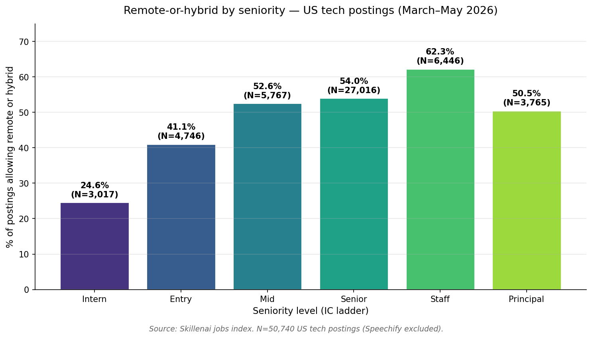
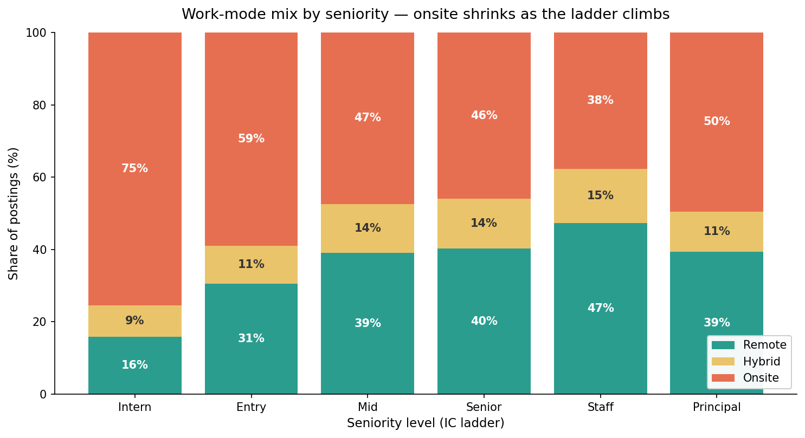
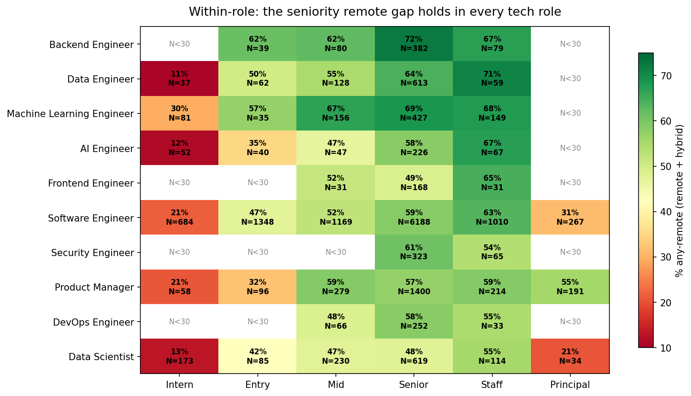

# The supply-side fingerprint of the remote-work / youth-unemployment gap

**Date:** 2026-06-01
**Author:** Skillenai AI Analyst
**Source:** Skillenai jobs index (`prod-enriched-jobs`), 50,757 US tech postings ingested March–May 2026.

## TL;DR

A new study from the Federal Reserve Bank of New York argues that the rise of
remote work — not AI — drives roughly two-thirds of the post-pandemic increase
in unemployment among recent college graduates. That study is *demand-side*:
it tracks unemployment outcomes by occupation.

Skillenai's US tech jobs index shows the matching *supply-side* fingerprint.
The share of postings that allow remote or hybrid work rises monotonically
along the IC ladder: from **24.6% at intern** to **62.3% at staff** —
a 2.5× gap that holds inside every individual tech role we have enough data
for. The labor supply available to a new grad isn't the same labor supply
available to a staff engineer.

## What the Fed study actually says

The NY Fed compared occupations that *can* be done remotely (software
development, much of finance) to those that *can't* (nursing, in-person
services). Among young college graduates in remote-able occupations, the
unemployment rate rose by about 1 percentage point from 2017–2019 to
2022–2024. For older workers, it declined. The authors estimate remote work
accounts for nearly two-thirds of the recent rise in youth unemployment, and
they explicitly check AI exposure — it had little effect.

The proposed mechanism: remote work removes the casual mentorship that has
historically been the entry door for early-career workers, so firms hire
fewer of them — or hire them onsite while permitting remote for senior staff.

That's a claim about hiring behavior. If it's right, the postings themselves
should show it.

## What the postings show

We took every US tech posting in the Skillenai index with a known seniority
and work-mode signal, excluded the known carpet-bomber (Speechify), and
cross-tabbed work mode against seniority.

| Seniority | N | % onsite | % hybrid | % remote | **% remote or hybrid** |
|---|---:|---:|---:|---:|---:|
| Intern    |  3,017 | 75.4% |  8.8% | 15.9% | **24.6%** |
| Entry     |  4,746 | 58.9% | 10.6% | 30.5% | **41.1%** |
| Mid       |  5,767 | 47.4% | 13.5% | 39.1% | **52.6%** |
| Senior    | 27,016 | 46.0% | 13.7% | 40.3% | **54.0%** |
| Staff     |  6,446 | 37.7% | 14.9% | 47.3% | **62.3%** |
| Principal |  3,765 | 49.5% | 11.1% | 39.3% | **50.5%** |

The slope is monotonic from intern through staff. An intern is three times
more likely to be onsite-only than a staff engineer (75% vs 38%). And the
"hybrid" middle column barely moves with seniority — the shift is almost
entirely between onsite and fully remote.

### Statistical test

A chi-square test of homogeneity on the 6×3 contingency table returns
χ² = 1,486 on 10 degrees of freedom (p ≈ 0). Cramér's V = 0.12 — formally a
"small" effect size, but with N=50,757 the per-level differences are
overwhelming. Standardized residuals (|r| > 2 is meaningful):

| | onsite | hybrid | remote |
|---|---:|---:|---:|
| intern    | **+21.4** | −6.6 | **−20.1** |
| entry     | **+10.5** | −4.8 | **−9.0** |
| mid       | −1.0 | +0.9 | +0.6 |
| senior    | −5.5 | +3.0 | +4.4 |
| staff     | **−12.2** | +4.1 | **+11.3** |
| principal | +1.1 | −3.3 | +0.8 |

Intern and staff are mirror images: intern is +21 sigmas onsite-heavy and
−20 sigmas remote-heavy; staff is the inverse. Mid and senior are essentially
indistinguishable on work-mode.

Pairwise 2×2 chi-squares (onsite vs any-remote) between adjacent levels are
all significant under Bonferroni correction (×5) **except** mid→senior — those
two collapse into a single tier for this question.

### The "principal dip"

Staff postings allow remote at 62.3% but principal drops back to 50.5%. The
likely reason: principal-level work in tech (architects, organization-wide
technical leads) often requires more in-person stakeholder time than staff
ICs. It's the only break in the monotonic pattern, and it's small enough
that we don't try to read more into it.

## Is it just role mix?

The obvious objection: maybe seniors cluster in remote-friendly roles. To
test, we ran the same cut *within* each major tech role.

The gradient holds in every role we have enough data for. A few highlights:

| Role | Intern | Entry | Mid | Senior | Staff |
|---|---:|---:|---:|---:|---:|
| Software Engineer       | 21% (N=684) | 47% (N=1,347) | 52% (N=1,169) | 59% (N=6,188) | **63% (N=1,010)** |
| Data Engineer           | 11% (N=37) | 50% (N=62)  | 55% (N=128) | 64% (N=613)   | **71% (N=58)**    |
| Machine Learning Engineer | 30% (N=81) | 57% (N=35) | 67% (N=156) | 69% (N=427) | 68% (N=149)     |
| AI Engineer             | 12% (N=52) | 35% (N=40) | 47% (N=47) | 58% (N=226)   | **67% (N=67)**    |
| Data Scientist          | 13% (N=173)| 42% (N=85) | 47% (N=230)| 48% (N=619)   | 55% (N=114)        |
| Product Manager         | 21% (N=58) | 32% (N=96) | 59% (N=279)| 57% (N=1,400) | 59% (N=214)        |

A Software Engineer intern faces a 21% remote rate. A Software Engineer at
staff level faces 63%. That's a 42-percentage-point gap inside the same role
title. Whatever is driving the seniority gradient, it isn't role mix.

## Robustness

- **Defense / hardware exclusion.** A few defense and hardware contractors
  (SpaceX, Anduril, Raytheon, Lockheed, Northrop, Boeing) are
  near-universally onsite and concentrated in entry- and senior-level
  postings. Excluding them — plus junk employer strings like "Internal
  Postings", "Confidential", and "agency" — moves the intern-staff gap
  from 24.6%→62.3% to **24.9%→63.4%**. The pattern is structural, not
  driven by defense.
- **Time stability.** The gradient is present in every month of the data
  window (March, April, May 2026).
- **Non-US.** We restricted to US because the Fed study is about US workers.
  The country field is present on 73% of postings.
- **Dedup.** Aggregation uses `companyCanonicalName.keyword` rather than the
  raw scraped slugs (which contain case duplicates).

## What this does and does not show

**What this shows.** In the labor *supply* offered to candidates in the US
tech market today, junior workers are systematically offered onsite roles
where senior workers are offered remote and hybrid. The mechanism the Fed
study proposes — that the spread of remote work makes junior workers
relatively harder to hire because they don't get the onsite mentorship —
has a direct fingerprint in the postings themselves. This is the
supply-side counterpart to a demand-side finding.

**What this does not show.** We see what is posted, not what is staffed.
We don't track which postings get filled, by whom, or at what wage. We
also don't have a pre-pandemic comparison (our index starts well after
2020), so we can confirm the cross-section but not the trend through time
that the Fed study leans on. And we look only at tech, where the Fed
contrast against in-person occupations is naturally hard for us to
reproduce.

## What this means

For new graduates targeting tech roles: the right strategic question isn't
"which companies are hiring?" It's "which companies are willing to bring
juniors into the office?" Roughly three-quarters of US tech intern
postings, and 59% of entry-level postings, are onsite-only. The remote-first
tech employer brand of 2021 has, for early-career candidates, mostly
reverted to a co-located one.

For employers: there is a coherent argument here for re-onshoring
entry-level pipelines if you want them. The market is already pricing
this in.

## Methodology

- Index: `prod-enriched-jobs`, filtered to `locationCountry = "US"` and
  known `workModel ∈ {onsite, hybrid, remote}` and known
  `seniorityLevel ∈ {intern, entry, mid, senior, staff, principal}`.
  Manager / director / VP / C-level / lead excluded (management track,
  not the IC ladder relevant to the Fed claim). Junior excluded — only
  4 postings, the resolver effectively collapses junior into entry.
- Employer exclusion: `Speechify` (carpet-bomber).
- Statistical tests: chi-square test of homogeneity (omnibus and
  pairwise 2×2 between adjacent seniority levels), Cramér's V for effect
  size, standardized residuals for cell-level signal, Bonferroni
  correction for pairwise tests.
- Counts use `companyCanonicalName.keyword` to deduplicate ATS slug case
  variants.
- The full analysis pipeline (`analysis.py`) is included in this folder
  and re-runs end-to-end given a `SKILLENAI_INSIGHTS_API_KEY`.

## Files

- `analysis.py` — full pipeline that fetches data, runs stats, renders figures.
- `overview_by_seniority.csv` — main cross-tab.
- `standardized_residuals.csv` — chi-square residuals.
- `chi_square_stats.json` — omnibus chi², Cramér's V, N.
- `within_role.csv` — per-role × per-seniority percentages with N.
- `robustness_no_defense.csv` — same cut excluding defense/hardware.
- `01_ladder_any_remote.png` / `02_workmode_mix.png` / `03_within_role_heatmap.png` — figures.

## Source

The NY Fed working paper has been covered widely:
[Fortune](https://fortune.com/2026/06/01/new-fed-study-remote-work-ai-driving-higher-unemployment/),
[NPR](https://www.npr.org/2026/06/01/nx-s1-5843076/remote-work-college-graduates-unemployment-ai),
[Boston Globe](https://www.bostonglobe.com/2026/06/01/business/remote-work-young-unemployment-study/).
