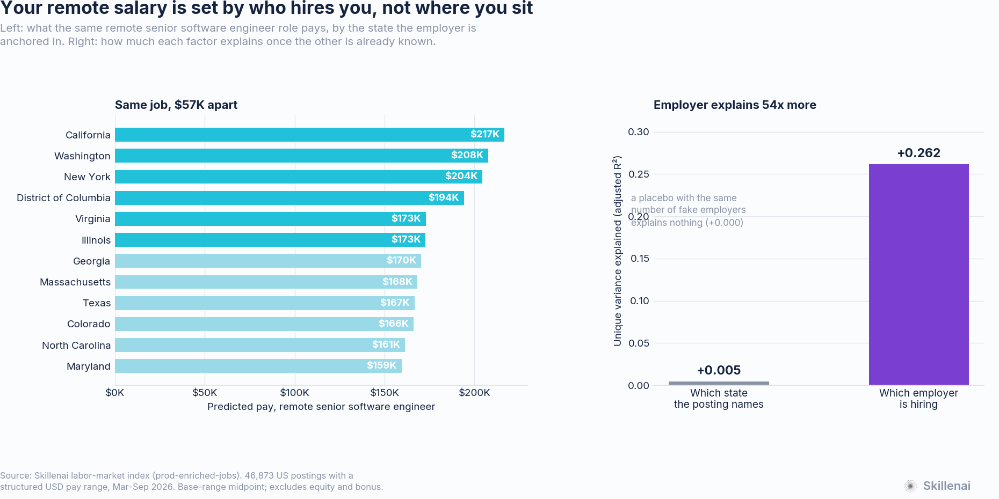
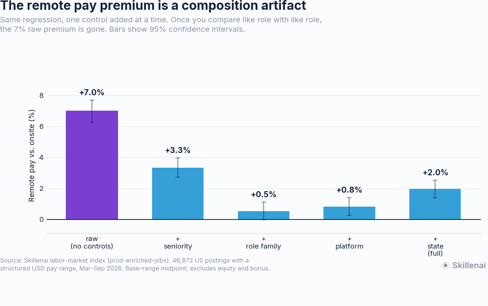
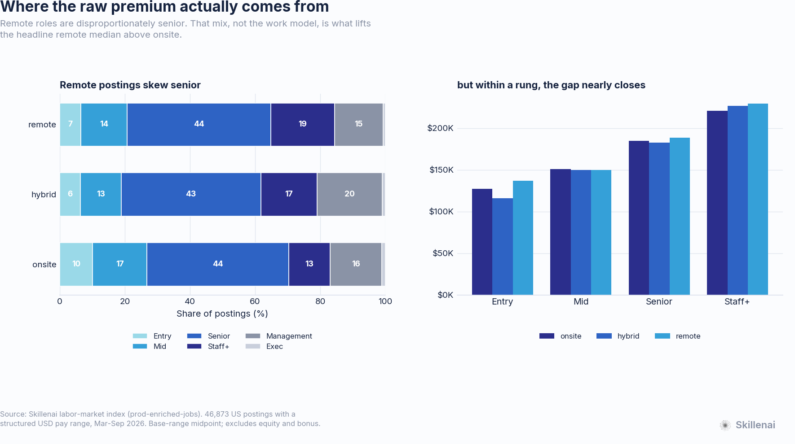
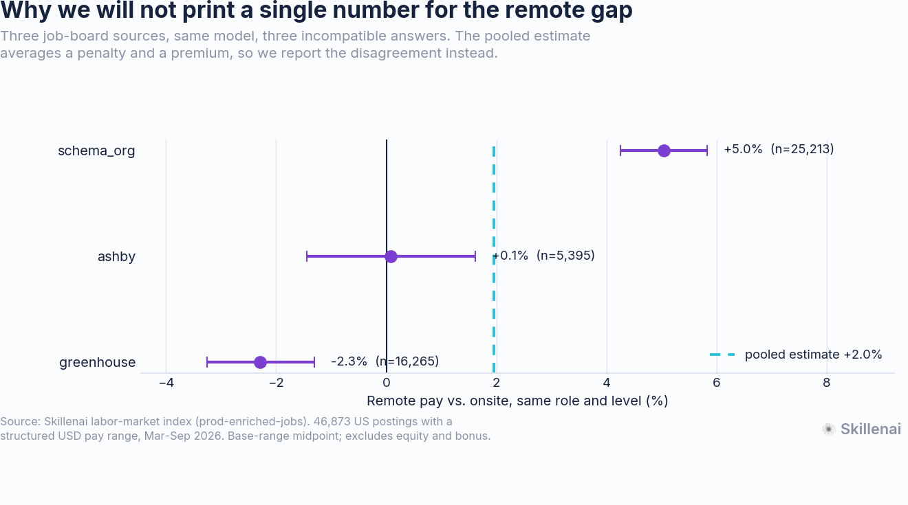

# Your remote salary is set by who hires you, not where you sit

**Going remote barely changes what a job pays. And the geography that still shows up in remote pay is the employer's, not the worker's — two remote offers for the same senior engineering role run $57,082 apart depending on where the company is anchored.**

- **Date**: 2026-09-14 (revised 2026-09-17 — see *Revisions*)
- **Source**: Skillenai labor-market index (`prod-enriched-jobs`), US postings
- **Scope**: 54,231 US postings carrying a structured USD pay range and a work-model label; 46,873 of them also carry a usable seniority rung and enter the models
- **Measure**: midpoint of the advertised base range. **Excludes equity and bonus.**

---

## TL;DR

1. **The headline remote premium is a composition artifact.** Remote postings advertise a median of $190,000 against $178,500 onsite — **+6.4%**. Control for role family and rung and it collapses to **+0.5%**. Among individual contributors in the full model it is **+0.9%** (95% CI +0.3% to +1.5%).
2. **We will not print a single number for the residual gap, because our three sources disagree.** Same model, same controls: greenhouse says **−2.3%**, ashby says **+0.1%**, schema_org says **+5.0%**, and the intervals do not overlap. What survives is the *bound*: whatever the remote gap is, it is small, and it is not 6%.
3. **Remote pay is exactly as geographically dispersed as onsite pay.** Weighted SD of the state effect: onsite 6.5%, remote 9.2%. Regressing each state's remote premium on its onsite premium gives a pass-through of **1.44** (95% CI 1.01 to 1.88, r = 0.88). We can reject zero pass-through decisively (p < 0.0001). We cannot reject *full* pass-through.
4. **The location that matters is the employer's, and it barely matters on its own.** 64.0% of remote postings carry the same state as their employer's dominant onsite location, against a 33.2% chance baseline. Once you know which company is hiring, the state adds almost nothing: unique adjusted R² of **+0.005 for state against +0.262 for employer**, a ratio of about **54 to 1**. A placebo with the same number of fake employers explains nothing at all, so this is not a degrees-of-freedom artifact.
5. **The spread is a career-sized number.** Holding role, rung and platform fixed, the same remote senior software engineer posting predicts **$216,534** at a California-anchored employer and **$159,452** at a Maryland-anchored one — **$57,082**, or 35.8%. Inside a single employer, the median spread across states is only **7.9%**.
6. **Remote bands are wider; hybrid bands are narrower.** Controlled, remote ranges run **+1.3pp** wider relative to their midpoint and hybrid **−2.2pp** narrower. The uncertainty about remote pay shows up in the spread, not the level.
7. **This is a cross-section, not a trend.** Only 32,533 US postings carry a trustworthy source posting date and 55% of those land in a single month. No claim here is about change over time.

---

## 1. The premium that isn't

| Control set | Remote vs. onsite | 95% CI |
|---|---:|---|
| Raw, no controls | **+7.0%** | +6.2% to +7.7% |
| + seniority rung | +3.3% | +2.7% to +4.0% |
| + role family | **+0.5%** | −0.0% to +1.1% |
| + platform | +0.8% | +0.3% to +1.4% |
| + state (full model) | +2.0% | +1.4% to +2.5% |

Role family does more work than seniority. Once you are comparing a backend engineer to a backend engineer, the premium is statistically indistinguishable from zero.

The reason is visible in the mix. Remote postings are 19.4% Staff+ against 12.6% onsite, and 6.6% Entry against 10.2% onsite. Remote hiring is tilted up the ladder, and the ladder is where the money is.

| Rung | Onsite | Hybrid | Remote | n (onsite / hybrid / remote) |
|---|---:|---:|---:|---|
| Entry | $127,500 | $116,500 | $137,250 | 1,985 / 443 / 1,336 |
| Mid | $151,500 | $150,000 | $150,000 | 3,256 / 874 / 2,879 |
| Senior | $185,000 | $183,000 | $189,182 | 8,504 / 2,990 / 8,999 |
| Staff+ | $221,300 | $227,175 | $230,000 | 2,460 / 1,208 / 3,959 |

Within a rung the three columns are close enough that the differences are worth less than a single promotion. For context, the companion analysis in this repo, [what tech roles actually pay in 2026](https://github.com/skillenai/skillenai-notebooks/tree/master/tech-role-pay-2026), puts one rung at $40K–$65K. The work-model effect is an order of magnitude smaller than the rung effect.

## 2. Why we refuse to print one number

| Source | n | Remote vs. onsite, same role and rung | 95% CI |
|---|---:|---:|---|
| greenhouse | 16,265 | **−2.3%** | −3.3% to −1.3% |
| ashby | 5,395 | +0.1% | −1.4% to +1.6% |
| schema_org | 25,213 | **+5.0%** | +4.3% to +5.8% |
| *pooled* | *46,873* | *+2.0%* | *+1.4% to +2.5%* |

Three sources, one model, three incompatible answers. The pooled estimate is an average of a penalty and a premium, and reporting it alone would imply a precision we do not have.

We have not identified the mechanism. Salary disclosure rates differ sharply by source and by work model — on schema_org 48.2% of remote postings disclose pay against 24.8% of onsite ones, while on greenhouse the ordering reverses (40.4% remote, 48.1% onsite) — so which postings become *visible* to a pay analysis is not random, and it varies by exactly the axis under study. That is a plausible driver but we have not demonstrated it.

What the disagreement does support is a bound. Every point estimate sits inside ±5%, and every specification kills the raw 6–7% gap. "Small, and not what the raw number says" is the finding; the sign is not.

## 3. The part that does not collapse

If remote work had unbundled pay from geography, the state a remote posting names would stop predicting its pay. It does not.

Residualizing pay on role family, rung and platform — removing everything except location — and then measuring how much each state moves the remainder:

| Work model | States (n≥150) | Postings | Weighted SD of state effect |
|---|---:|---:|---:|
| Onsite | 14 | 17,371 | 6.5% |
| Hybrid | 9 | 5,836 | 9.5% |
| Remote | 12 | 14,636 | **9.2%** |

Remote pay varies across states *at least as much* as onsite pay. Plotting each state's remote premium against its onsite premium gives a pass-through slope of **1.44** (95% CI 1.01 to 1.88, r = 0.88, 11 states, Maryland excluded — see Robustness).

- Against zero pass-through (pay is location-blind): **rejected**, p < 0.0001.
- Against full pass-through (location matters exactly as much as onsite): **not rejected** at any conventional bar in the full-state specification (p = 0.22).

California remote postings carry a +10.9% premium where California onsite postings carry +4.5%. Washington: +6.6% remote, +2.7% onsite. Colorado: −13.7% remote, −11.2% onsite. The rank order of expensive and cheap states is preserved when the job goes remote.

### The attenuation check

A low pass-through would have been the more publishable result, and it is also the result a measurement artifact would produce: if `locationAdmin1` were merely a noisier label on remote postings, every state's mean would drift toward the national average and the slope would shrink toward zero on its own.

**Hybrid is the placebo.** A hybrid employee has to physically commute, so a hybrid posting's state must be real. If anchor states were uninformative labels, hybrid would flatten too. It does the opposite — slope **1.78** (CI 1.20 to 2.37, r = 0.92). Location labels carry real signal when presence is required, so the near-unity remote slope is not a label-noise artifact.

## 4. Whose geography?

Two facts locate the gradient in the employer rather than the worker.

**The anchor state is usually the employer's own.** Taking the 1,008 companies with at least three onsite postings and a clear modal state, **64.0%** of their remote postings carry that same state, against a **33.2%** chance baseline from the state distribution. Hybrid behaves similarly (57.3% vs 30.1%).

**Once you know the employer, the state tells you almost nothing.** On remote postings with role family, rung and platform already controlled:

| Model | R² | adjusted R² |
|---|---:|---:|
| Role family + rung + platform | 0.420 | 0.416 |
| + which **state** (12 levels) | 0.504 | 0.500 |
| + which **employer**, *shuffled placebo* | 0.445 | **0.416** |
| + which **employer** (495 levels) | 0.769 | **0.757** |
| + both | 0.773 | 0.762 |

Unique contribution, each measured over the other: **state +0.005**, **employer +0.262** — a ratio of about **54 to 1**.

A 495-level factor beats a 12-level factor on degrees of freedom alone, so that comparison is meaningless without a control. Shuffling company labels across postings while preserving the company-size distribution exactly gives a placebo with the identical parameter count: it lands at adjusted R² **0.416**, indistinguishable from the base model. Degrees of freedom explain **none** of the employer effect. Averaged over five seeds the placebo moves adjusted R² by +0.0001.

**What that costs a person.** Holding role family, rung and platform fixed and varying only the employer's anchor state:

| Employer anchored in | Predicted pay, remote senior SWE | n |
|---|---:|---:|
| California | **$216,534** | 7,268 |
| Washington | $207,776 | 1,328 |
| New York | $204,442 | 2,516 |
| District of Columbia | $194,122 | 283 |
| Virginia | $172,905 | 378 |
| Illinois | $172,743 | 333 |
| Georgia | $170,299 | 181 |
| Massachusetts | $168,111 | 961 |
| Texas | $166,734 | 472 |
| Colorado | $166,144 | 400 |
| North Carolina | $161,434 | 150 |
| Maryland | **$159,452** | 366 |

Top to bottom is **$57,082**, or 35.8%. For scale, the companion analysis in this repo puts a full seniority rung at $40K–$65K.

But that spread is overwhelmingly *which companies sit where*, not location pricing. Of the 36 employers that post remote roles against three or more states, the **median within-employer spread is 7.9%** (p25 4.7%, p75 19.5%). Location banding inside firms is real and small; which firm you join is the large term.

So remote work did not detach pay from a map. It made the employer's address the one that counts — and the employer, not the address, is what you are actually choosing.

## 5. Bands, not levels

| Work model | Median band width | Mean | Controlled vs. onsite |
|---|---:|---:|---:|
| Hybrid | 26.4% | 29.7% | **−2.2pp** (p < 1e-17) |
| Onsite | 28.8% | 33.2% | — |
| Remote | 29.1% | 34.6% | **+1.3pp** (p < 1e-8) |

Band width is `(max − min) / midpoint`. Remote postings quote wider ranges than onsite for the same role, rung, state and platform; hybrid postings quote the narrowest of all. A remote req that may be filled from several pay markets has more to hedge; a hybrid req tied to one office has the least.

We flag this as a single-instrument result — it has not been cross-checked against a second measure the way the geography finding has.

## Robustness

- **Maryland is excluded from the pass-through fit.** It was the largest outlier (onsite +5.2%, remote −13.6%, an 18.8pp gap). Its onsite postings are dominated by cleared defense work — Captivation (198), Johns Hopkins Applied Physics Laboratory (65), Lockheed Martin (40), Accenture Federal (35) — which is well paid and onsite by necessity, so the two work modes describe different populations rather than the same one under different terms. Excluding it *strengthens* the result (r 0.69 → 0.88); including it gives slope 1.37 (CI 0.75 to 2.00) and the conclusion is unchanged.
- **Pay units.** Hourly ranges (`salaryMax ≤ 300`) are annualized at ×2080; weekly/monthly ranges are undecidable and dropped (361 postings). The unit mix is nearly identical across work models (98.6% annual onsite, 98.9% remote), so this is not a differential filter.
- **Levels.** `intern` and `lead` are excluded — `lead` is a title-inflation grab-bag in this index that mixes individual contributors with people managers. Management and Exec are retained as controls; the IC-only model is reported separately.
- **Spam.** Speechify is excluded; it carpet-bombs near-identical fully-remote listings across hundreds of cities and would inflate the remote share on its own.
- **Platform scope.** Restricted to greenhouse, schema_org and ashby. Other sources in the index either publish no description text — which makes the work-model label default to `onsite` on postings whose text is missing — or disclose almost no pay.

## What this cannot tell you

- **Total compensation.** These are advertised base ranges. Equity and bonus are not in the data and are exactly where a location policy might live instead.
- **What the worker is paid.** This is what employers *advertise*, not what anyone accepted.
- **Where remote workers actually live.** The state on a remote posting is the employer's anchor. We show it is usually the employer's own location; we cannot see the employee's.
- **Any change over time.** Trustworthy posting dates cover too short and too lopsided a window.
- **The broad economy.** The index is sourced from applicant-tracking feeds and skews to technology and startup employers.

## Files

| File | Contents |
|---|---|
| `analysis.py` | Full pipeline: prep, models, geography, robustness |
| `make_charts.py` | Figures (uses the shared `brand.py`) |
| `results.json` | Every statistic quoted above |
| `state_premiums.csv` | Per-state onsite and remote residual premiums |
| `predicted_pay_by_anchor_state.csv` | Predicted pay for the same remote role by employer anchor state |
| `stepwise_controls.csv` | The control build-up in section 1 |
| `platform_robustness.csv` | Per-source remote coefficients |
| `pay_by_level_workmode.csv` | Median pay by rung and work model |
| `level_mix_by_workmode.csv` | Rung composition by work model |

The per-posting extract (54,819 rows) is not committed. It is reproducible from the index with the partitioned download described in `analysis.py`'s header; available on request.

## Revisions

**2026-09-17.** The first version of section 4 reported that company fixed effects absorb 62% of the remote geographic gradient and described "the residual 38%" as location banding inside firms. That came from comparing the standard deviation of state coefficients with and without company fixed effects, which answers "how much do state effects shrink" — not "which factor explains more pay". A variance decomposition answers the second question, and it is far more lopsided: unique adjusted R² of +0.005 for state against +0.262 for employer, about 54 to 1. The within-employer spread across states is real but small (median 7.9%).

The conclusions in sections 1, 2, 3 and 5 are unchanged, including the pass-through of 1.44 and the hybrid placebo. What changed is the mechanism behind section 3's result: remote pay tracks geography because expensive-state employers pay more in every work mode, not because remote roles are being location-adjusted. The revision also adds the employer-anchor pay table, the shuffled-employer placebo, and figure 5.

## Method note

Pay-unit normalization, role-family collapsing and seniority bucketing are deliberately identical to [tech-role-pay-2026](https://github.com/skillenai/skillenai-notebooks/tree/master/tech-role-pay-2026) so the two analyses can be read together. Models are OLS on log midpoint with HC1 robust standard errors. Geographic premiums are residuals from a role-family + rung + platform model, aggregated to states with at least 150 postings in the relevant work model. Pass-through is a postings-weighted least-squares fit of remote-on-onsite state premiums, tested against both slope = 0 and slope = 1.
