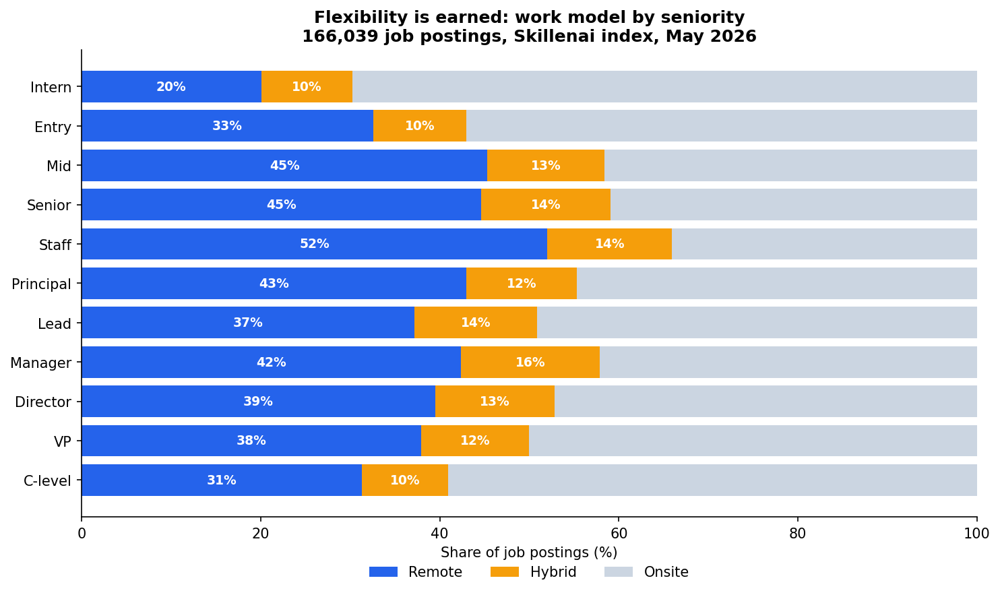
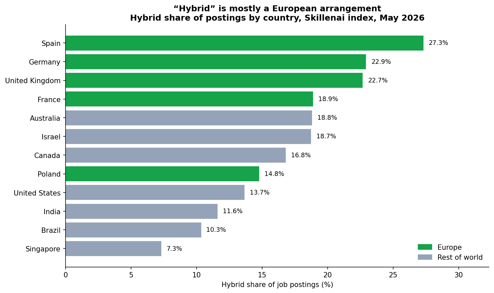

# Remote vs. Hybrid vs. Onsite — what job postings actually say

**Date:** May 2026
**Source:** Skillenai job-posting index (`prod-enriched-jobs`)
**Scope:** 166,039 job postings (Speechify excluded — see methodology)

This folder is the **evidence record** for an analysis of how employers label the
work model of their open roles. It contains the query, the raw aggregation output,
the two charts, and the data tables. It is not the article itself.

## Method

- `query_workmodel.py` queries the Skillenai job index for the `workModel` field,
  aggregated overall and broken down by `seniorityLevel`, `locationCountry`, and
  `role`. Raw output is saved to `workmodel_results.json`.
- `make_charts.py` renders the two charts from that JSON.

### Data quality filters

- **Speechify excluded.** A single employer posts ~5,000 near-identical, 100%-remote
  listings across hundreds of cities. Including it inflates the remote share by
  roughly 1.5 points. Excluded via `companyCanonicalName.keyword`.
- **`workModel` field.** A keyword field with ~99.9% coverage. Validation against
  posting text: 88% of `hybrid`-labelled and 60% of `remote`-labelled postings
  literally contain the words "hybrid"/"remote" even though posting text is often
  truncated to the title — i.e. **remote and hybrid are positively detected and
  reliable.** `onsite` postings rarely contain the word "onsite" (~9%), so **onsite
  is best read as the residual bucket**: "the posting declared no flexibility."
- **Corpus skew.** The index is sourced from applicant-tracking-system feeds and
  skews toward technology and startup employers. Large broad-economy datasets put
  the hybrid share anywhere from 7% to 25%; our 13% sits mid-range. The elevated
  *remote* share (~40%) reflects the tech-sector skew and should not be read as an
  all-industry figure.
- **No trend claim.** The index has no reliable job-posted date, and ingestion
  timestamps are distorted by a one-time backfill. This analysis is a cross-section
  only — no over-time claims are made.

## Headline numbers

| Work model | Postings | Share |
|---|---:|---:|
| Onsite | 78,593 | 47.3% |
| Remote | 65,668 | 39.6% |
| Hybrid | 21,709 | 13.1% |

Remote postings outnumber hybrid postings roughly **3 to 1**.



## Work model by seniority

| Seniority | N | Remote | Hybrid | Onsite |
|---|---:|---:|---:|---:|
| Intern | 5,274 | 20% | 10% | 70% |
| Entry | 8,880 | 33% | 10% | 57% |
| Mid | 13,200 | 45% | 13% | 42% |
| Senior | 57,464 | 45% | 14% | 41% |
| Staff | 11,367 | 52% | 14% | 34% |
| Principal | 6,436 | 43% | 12% | 45% |
| Lead | 9,323 | 37% | 14% | 49% |
| Manager | 10,770 | 42% | 16% | 42% |
| Director | 3,283 | 39% | 13% | 47% |
| VP | 918 | 38% | 12% | 50% |
| C-level | 480 | 31% | 10% | 59% |

Remote share rises steeply with individual-contributor seniority (20% intern →
52% staff). **Hybrid stays flat at 10–16% across every level** — it is never used
as a seniority-differentiated arrangement.



## Hybrid share by country (top 12 by posting volume)

| Country | N | Remote | Hybrid | Onsite |
|---|---:|---:|---:|---:|
| United States | 72,335 | 36% | 13.7% | 50% |
| India | 12,515 | 31% | 11.6% | 57% |
| United Kingdom | 9,119 | 28% | 22.7% | 49% |
| Canada | 5,397 | 41% | 16.8% | 42% |
| Germany | 3,068 | 37% | 22.9% | 40% |
| Brazil | 2,058 | 41% | 10.3% | 49% |
| France | 2,055 | 31% | 18.9% | 50% |
| Singapore | 1,780 | 25% | 7.3% | 67% |
| Poland | 1,733 | 41% | 14.8% | 44% |
| Spain | 1,667 | 33% | 27.4% | 39% |
| Australia | 1,529 | 27% | 18.8% | 54% |
| Israel | 1,444 | 30% | 18.7% | 52% |

The UK, Germany, France and Spain post hybrid roles at roughly twice the US rate.
Country cells below ~2,000 postings (France, Spain, Australia, Israel) have wider
sampling error; the UK (N=9,119) and Germany (N=3,068) are the most robust.

## Work model by role (top 18 by volume)

| Role | N | Remote | Hybrid | Onsite |
|---|---:|---:|---:|---:|
| Software Engineer | 26,163 | 44% | 12% | 45% |
| Product Manager | 7,391 | 34% | 14% | 53% |
| Data Scientist | 3,406 | 29% | 15% | 56% |
| Data Engineer | 3,372 | 41% | 11% | 49% |
| Engineering Manager | 3,136 | 53% | 15% | 32% |
| Backend Engineer | 2,501 | 64% | 10% | 26% |
| Product Designer | 2,487 | 41% | 14% | 45% |
| DevOps Engineer | 2,008 | 38% | 14% | 49% |
| Machine Learning Engineer | 1,951 | 51% | 16% | 33% |
| Staff Software Engineer | 1,800 | 64% | 16% | 20% |
| Data Analyst | 1,779 | 29% | 11% | 60% |
| ML Engineer | 1,674 | 26% | 6% | 68% |
| Site Reliability Engineer | 1,517 | 52% | 14% | 34% |
| Systems Engineer | 1,489 | 29% | 9% | 62% |
| Business Analyst | 1,382 | 20% | 11% | 69% |
| Program Manager | 1,371 | 31% | 12% | 56% |
| AI Engineer | 1,368 | 41% | 12% | 47% |
| Technical Program Manager | 1,243 | 34% | 15% | 51% |

Hybrid never exceeds 16% for any role. The remote/onsite split varies widely —
Backend Engineer and Staff Software Engineer are ~64% remote; Business Analyst,
Systems Engineer and ML Engineer are 60–69% onsite.

## Reproducing

```bash
export API_KEY=...                       # Skillenai insights API key
export API_URL=https://api.skillenai.com
python3 query_workmodel.py               # -> workmodel_results.json
python3 make_charts.py                   # -> chart_seniority.png, chart_country.png
```

Explore the live Skillenai labor-market data at <https://skillenai.com/data>.
