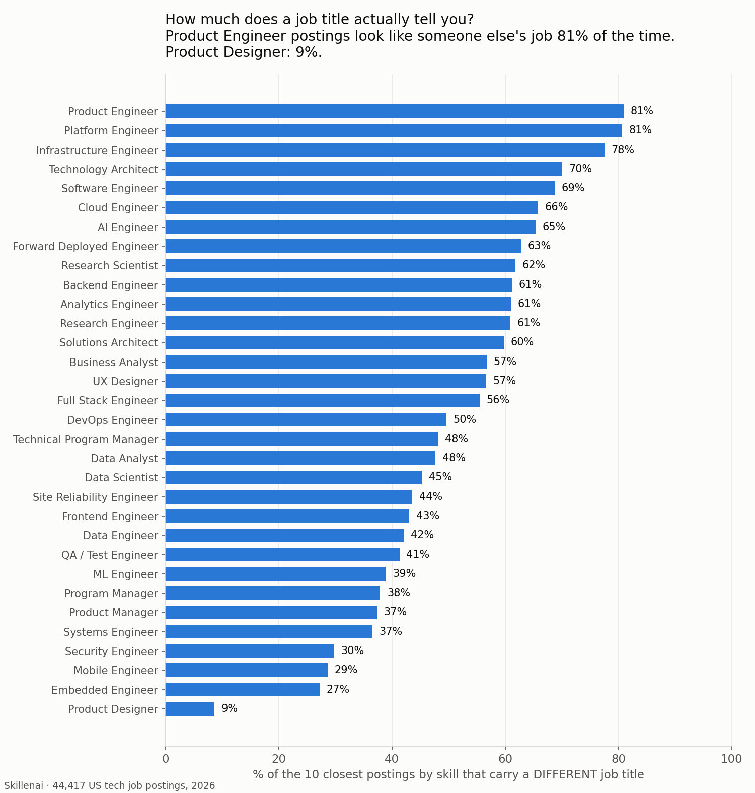
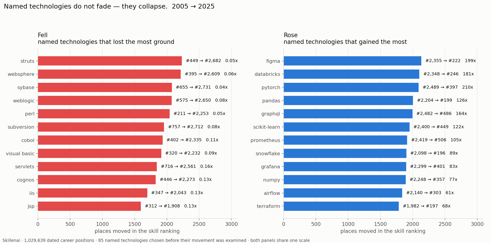
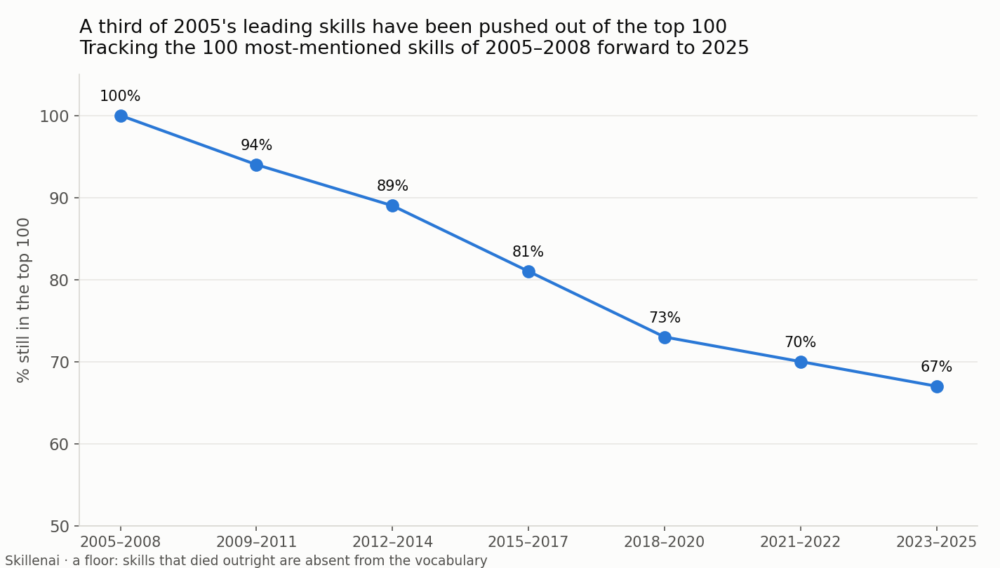
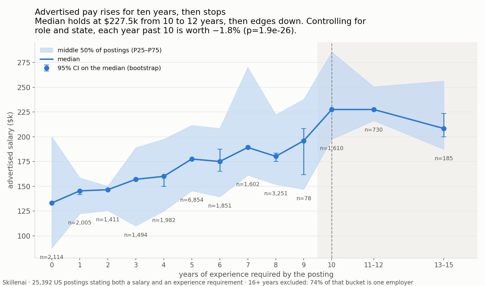

# Your job title doesn't describe your job — and the skills underneath it turn over

**Date:** 2026-09-07
**Sources:** Skillenai job-postings index (`prod-enriched-jobs`) — 44,417 US tech postings; Skillenai talent graph — 569,143 career profiles yielding 1,029,639 dated position descriptions, 1995–2025.
**Scope:** US, text-bearing ATS platforms, spam employers excluded.

---

## TL;DR

1. **Job titles are weak descriptions of work.** A title explains **under 10%** of the variance in the skills a posting asks for. For **52.5%** of postings, most of their closest skill-matches carry a *different* title.
2. **How blurred a role is varies enormously.** Product Engineer postings look like someone else's job **81%** of the time. Product Designer: **9%**. That's a 9× spread.
3. **Specific technologies do collapse** — Struts, WebSphere, Sybase and Perl sit at **4–8%** of their peak, and the on-prem stack was displaced by the cloud/data stack. ⚠️ **The claim that they decay *faster than generic capabilities* is retracted** — see [section 2](#2-named-technologies-rise-and-fall-retracted-comparison).
4. **At least a third of 2005's leading skills** have been pushed out of the top 100 by 2025 — a floor, and the true figure is higher.
5. **Experience is paid for a decade, then it isn't.** +5.3%/yr up to 10 years; −1.8%/yr beyond. Only **4.5%** of postings ask for more than 10 years; **0.03%** ask for more than 20.

---

## 1. How much does a job title tell you?

Give me a posting's title and ask me to predict its skills: cross-validated, the title explains **6.9%** of the variance (5.4% on the full vocabulary, 8.6% restricted to skills appearing in ≥50 postings).

**This replicates on an independent corpus with an opposite generating process.** A job ad is written by a recruiter to attract applicants; a career-profile description is written by the worker afterwards. Running the identical test on 138,123 profile positions (2018+, 27 roles, 5,200 skill dimensions):

| | job postings | career profiles |
|---|---|---|
| records | 44,417 | 138,123 |
| **CV variance explained by title** | **6.9%** | **3.9%** |
| shuffled-label baseline | −0.15% | −0.04% |
| nearest neighbours under another title | 47.6% | 57.6% |
| **majority under another title** | **52.5%** | **62.2%** |

Titles explain *less* on the profile side, not more.

For the per-role view we find the ten postings whose *skills* are closest, and ask how many carry a different job title. No role model, no thresholds, no clustering — just nearest neighbours in skill space.

**Product Engineer and Platform Engineer keep only ~19% of their own neighbourhood.** Four out of five of their closest postings are filed under someone else's title. At the other end, Product Designer is 92% self-contained — design is the one genuinely bounded profession in this data.

### Which roles blur into which

Listing every neighbour role holding ≥8% of the ten nearest postings (a variable-length list, so a role that blurs diffusely is visibly different from one that blurs into a single partner):

| role | keeps | blurs into |
|---|---|---|
| Platform Engineer | 19% | DevOps 20%, SRE 12%, Software Engineer 9% *(+41% spread thinly)* |
| Product Engineer | 19% | Full Stack 21%, Software Engineer 15%, Frontend 13% *(+32% thin)* |
| Infrastructure Engineer | 24% | DevOps 16%, SRE 15%, Platform 8% *(+37% thin)* |
| Technology Architect | 30% | Software Engineer 11% *(+60% thin)* |
| Software Engineer | 31% | Full Stack 11%, Backend 9% *(+49% thin)* |
| Cloud Engineer | 34% | DevOps 23% *(+42% thin)* |
| AI Engineer | 35% | ML Engineer 16% *(+50% thin)* |
| Analytics Engineer | 39% | Data Engineer 28%, Data Analyst 19% |
| UX Designer | 43% | **Product Designer 51%** |
| Data Scientist | 56% | Data Analyst 14%, ML Engineer 11% |
| Security Engineer | 72% | *nothing above threshold* |
| Product Designer | **92%** | *nothing above threshold* |

**The per-role ordering is specific to job postings and does not transfer to profiles.** Across the 13 roles measurable on both sides the correlation is weak and not significant (Spearman ρ=0.23, p=0.45): Product Designer is the most self-contained title in job ads (9%) but only middling in how designers describe their own work (33%), while Software Engineer runs the opposite way (69% vs 44%). That may be a real difference between advertising a job and describing having done it, or it may reflect that the two sides identify roles differently — the postings side uses the index's own `role` field, the profile side a regex over free-text titles. Not separable here, so the table below is a claim about **job postings**.

**The asymmetries are the interesting part.** UX Designer sends 51% of its neighbourhood to Product Designer, and Product Designer sends essentially nothing back — that is a title being absorbed, not two titles merging. The same one-way pull shows up in Research Engineer → ML Engineer (26%), Research Scientist → ML Engineer (24%), and Cloud/Platform/Infrastructure → DevOps (23%, 20%, 16%): four titles orbiting one job.

And some roles blur into *nothing in particular*. Technology Architect (+60%), Solutions Architect (+57%) and Software Engineer (+49%) have most of their overlap spread thinly across many roles with no single partner. These aren't hybrids of two jobs; they're titles that don't map onto a coherent skill set at all.

## 2. Named technologies rise and fall (retracted comparison)

> **⚠️ Retraction, 2026-09-16.** This section originally claimed that named technologies decay faster than generic capability terms: named tools at a median 0.81 of peak with 25.9% below a quarter, versus 0.89 and 4.1% for 2,650 other skill terms (Mann-Whitney p=0.0016).
>
> **That comparison was invalid, and its direction reverses when measured properly.** On open-vocabulary, position-scoped extraction the result flips at every frequency threshold — named tools hold **0.77** of peak against **0.54** for other terms at ≥0.5% of a year; 0.67 vs 0.33 at ≥0.1%; 0.67 vs 0.00 at ≥0.02%. Tools are *more* durable than generic skill terms, not less.
>
> **The cause was the comparison set, not the tools.** Both sides were drawn from a vocabulary built on 2026 job postings, so every term in it survives to 2026 by construction. The "generic skills" set could not contain a word that had fallen out of use, while named tools could still register declining share. Checked directly against that vocabulary: **11 of 14 technologies known to have died are absent from it entirely** — Novell, Windows NT, Delphi, ASP, PowerBuilder, ColdFusion, Silverlight, ActionScript, VB6, Lotus Notes, Crystal Reports. A term that is not in the dictionary cannot register any decline.
>
> The superseding measurement is [**thirty-years-of-tech-tools**](https://github.com/skillenai/skillenai-notebooks/tree/master/thirty-years-of-tech-tools), which extracts skills per position from the position's own text instead of matching a present-day list against old résumé text. Its sections 2 and 6 carry the detail.
>
> **The general lesson:** an instrument anchored in the present cannot measure disappearance, and applying one to the past will reliably understate how much changed. This was flagged here as a limitation and treated as a conservative bias. It was load-bearing, and it produced a sign error.

What survives is the movement of individual named technologies, which does not depend on the invalid comparison:

| fell | rank | now | | rose | rank | now |
|---|---|---|---|---|---|---|
| struts | #449 → #2,682 | 0.05× | | figma | #2,355 → #222 | 199× |
| websphere | #395 → #2,609 | 0.06× | | databricks | #2,348 → #246 | 181× |
| sybase | #655 → #2,731 | 0.04× | | pytorch | #2,489 → #397 | 210× |
| perl | #211 → #2,253 | 0.05× | | pandas | #2,204 → #199 | 126× |
| cobol | #402 → #2,335 | 0.11× | | snowflake | #2,098 → #196 | 89× |
| subversion | #757 → #2,712 | 0.08× | | terraform | #1,982 → #197 | 68× |

Even this understates the churn, for the same reason: the technologies that vanished outright are missing from the table because they were never in the vocabulary.

## 3. A third of 2005's top skills have been displaced

**At least 33%** of the skills that were top-100 in 2005 had been pushed out of the top 100 by 2025. A floor rather than a point estimate: skills that died outright are absent from a vocabulary built on 2026 postings, so the true figure is higher — the open-vocabulary instrument in [thirty-years-of-tech-tools](https://github.com/skillenai/skillenai-notebooks/tree/master/thirty-years-of-tech-tools) would place it higher still. Unlike section 2, this figure does not rest on a comparison between two vocabularies, so it is directionally sound. Re-running on past positions only (removing people describing their *current* job in more detail) gives 32%.

Rank is the right unit here. It is computed within each period, so the shorter descriptions in recent years deflate every skill's share together and leave the ordering intact.

## 4. Experience is paid for a decade

Median advertised pay climbs to 10 years of required experience and stops: **$227,500 at 10 years, $227,500 at 11-12 years**, then $208,340 at 13-15. Bands show the middle 50% of postings; error bars are bootstrap 95% CIs on the median.

The **16+ bucket is excluded**: 74% of it (167 of 225 postings) is a single employer, which is a composition artifact rather than a market rate. With that employer removed the bucket holds 58 postings at a $208,340 median - directionally consistent, too thin to plot. With role and state fixed effects, each year up to 10 is worth **+5.27%** (p≈0); each year beyond is worth **−1.75%** (p=1.9e-26). Under a conservative specification that also controls seniority — arguably over-controlling, since seniority is *how* experience gets paid — it is +2.40% then −0.14% (n.s.): flat either way.

Demand thins out fast:

| asks for more than | share of postings |
|---|---|
| 5 years | 37.5% |
| 10 years | 4.5% |
| 15 years | 0.89% |
| 20 years | **0.03%** (7 of 25,392) |

---

## What we could *not* establish

Stated plainly, because these were tested and failed rather than skipped:

- **Whether role blurring has increased.** The postings index begins 2026-03, so there is no demand-side history. Every supply-side proxy we built — NMF theme spread, role-axis concentration, two-role depth, raw skill density — came back **flat**, but each is measured on self-written career descriptions rather than employer requirements. *Roles are blurred* is supported; *roles are blurring more* is not.
- **A skill "half-life."** Exponential decay is the wrong model: fitting seven competing forms per skill, rise-and-fall shapes (bi-logistic 31%, logistic 21%) beat exponential (12%), and exponential wins mainly where the observation window hides the adoption phase. Roughly half of skills are still rising.
- **The true magnitude of skill death.** The skill vocabulary is built from 2026 postings and therefore contains only survivors. Every churn figure here is a lower bound. **This limitation proved worse than stated** — it did not merely understate churn, it inverted the section 2 comparison entirely. Measuring disappearance requires open-vocabulary extraction.
- **Whether jobs ask for more skills than they used to.** Measured against a 2026 vocabulary, skills per position rises 1.36×. Measured on skills present in both eras, it is **0.99×** — flat. The apparent growth is the dictionary, not the jobs.

## Method

**Title vs skills.** Cross-validated: role means fit on a train half, scored on a held-out half, so the number answers "given only the title, how well can you predict a *new* record's skills". Run identically on both corpora.

**Role blurring.** Postings are binary vectors over 7,562 canonicalised skills (≥10 postings each); cosine nearest neighbours; role labels from the index's own `role` field with spelling and seniority variants merged.

*Seniority is normalised.* A `Software Engineer` posting whose neighbour is `Senior Software Engineer` counts as the **same** role. Only 1,295 of 51,859 postings (2.5%) carry a seniority-marked raw title — `Staff Software Engineer`, `Senior Product Manager`, `Senior Software Engineer` — and all of them map onto their base axis; none are dropped. On the profile side the title matcher strips Senior/Staff/Sr./Lead/Principal/Junior/II before matching.

*How much does the grouping choice matter?* Merging can only **lower** measured blur, so the published figures are the conservative end:

| role grouping | groups | neighbours under another title | majority under another |
|---|---|---|---|
| raw `role.keyword`, no merging | 39 | 54.2% | 60.6% |
| **as published** (seniority + alias merged) | 32 | 48.2% | 53.6% |

Aliases are also merged (Software Developer → Software Engineer; Test, QA and Automation Engineer into one axis), which is the more aggressive direction and pushes the number down further. 400 sampled query postings per role, roles with ≥300 postings.

**Skill churn.** 1,029,639 dated position descriptions from 569,143 profiles across two corpus snapshots, deduplicated by profile id. Skills extracted by deterministic n-gram matching (no LLM, so the instrument cannot drift across years). Yearly *shares*, so corpus growth cancels. Ranking is computed among skills only, so prose terms don't compete for rank positions.

**Pay.** 25,392 US postings carrying both a USD salary and a structured experience requirement. Years-of-experience is the *maximum* across qualification paths; the minimum is unusable because "PhD + 0 years" records as 0 in 63% of postings.

**Known caveats.** Position descriptions are self-written and edited at unknown times, so modern vocabulary may be applied retroactively to old roles. Old positions are only visible if the person still maintains a profile — survivorship. Large employers using proprietary ATS platforms are under-represented. Skill entity resolution produces duplicate surface forms, canonicalised here but imperfectly. 2024–25 position descriptions are shorter and skew heavily to current jobs; rank-based measures are robust to this, share-based ones are not, and the distinction is respected throughout.

Reusable code and the full per-role blurring table (`role_blurring.csv`) accompany this folder.
