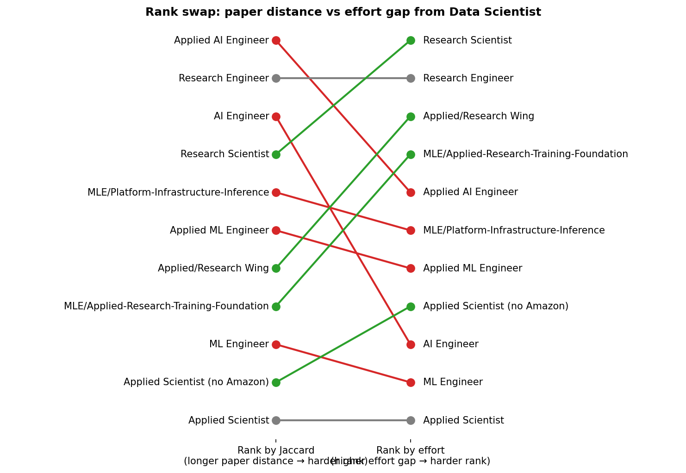

# The Hardest Skill in AI Hiring is JAX

**Date:** 2026-05-06
**Source:** Skillenai data products — 8,732 enriched job postings across the AI/ML/DS role taxonomy, 26,527 USD-salaried postings used for the salary-premium regression. Scholarly and blog frequency from the Skillenai content corpora (~30K and ~327K documents respectively).

## The hardest skill in AI hiring is one most engineers have never written

We scored 222 AI/ML/DS skills on four independent difficulty signals — how senior the postings asking for it are, how much salary premium it commands controlling for role and location, how academically deep it is, and how many other skills it presupposes.

One skill is the highest-paying skill in the universe that 90% of postings still gate to senior+ engineers: **JAX** — Google's numerical-computing library.

The heatmap reads top-down by composite difficulty. Three things to notice:

- **The research peak** (top three rows: diffusion models, representation learning, reward modeling) lights up red on academic depth and seniority gradient — but salary is hatched gray because these skills appear in fewer than 30 USD-salaried postings each. The frontier labs that hire for them either don't disclose pay or post outside the US.
- **The engineering peak** (★ JAX, distributed training, FSDP, CUDA) lights up red on salary premium *and* seniority but pinches in on academic depth — they're tools, not papers.
- **The easy end** (bottom rows) is mostly blue, with two dramatic deep-blue cells: prompt engineering at −21.6% and data labeling at −32.7%. The labor market doesn't just under-pay these; it actively discounts them.

JAX carries a **+17.6% salary premium** controlling for role, country, and seniority — top decile of our 144-skill regression panel. **Ninety percent of JAX postings are senior or above.** It has a deeper prerequisite stack than most tooling skills (Python → PyTorch → JAX). And — the most telling part — its scholarly footprint is *low*. JAX isn't an academic concept. It's a tool. The papers that use JAX cite the methods, not the framework. So you can't pick up JAX by reading papers; you pick it up by writing code in it. And the code is mostly only written inside frontier AI labs.

That's why the salary premium is so high relative to the seniority gating. JAX is one of the few hard skills that requires both senior-level engineering judgment *and* access to an environment where someone is already writing it. The market pays for the combination.

## What is JAX, exactly?

For readers who haven't worked with it: JAX is Google's numerical-computing library — a NumPy-shaped API plus a compiler. Think of it as PyTorch's quieter, more academic sibling. It does three things PyTorch doesn't do natively:

1. **JIT compile** Python functions to fused GPU/TPU kernels via Google's XLA compiler. The same Python code can run 100× slower or 100× faster depending on whether you've expressed it in a way XLA can fuse.
2. **Functional transformations** — `grad`, `vmap` (auto-batching), and `pmap` (auto-multi-device parallelism) compose like Lego. You write a single-example loss function, and `vmap` and `pmap` give you batched and parallelized versions for free.
3. **Purely functional model code** — no in-place mutation. Every model is a function from `(params, inputs)` to `outputs`. State is passed through explicitly.

**Who uses it:** Google DeepMind (Gemini, Gemma), Anthropic (Claude — partly), Apple's research arm, and a handful of academic groups. Most of the open-source ecosystem outside that orbit — Hugging Face, the LLaMA family, LangChain — runs on PyTorch.

**Why it's hard to learn:** the functional / pure-function model is genuinely different from PyTorch's eager mode. There's no Stack Overflow safety net for the corner cases. Most JAX questions get answered by Google researchers in GitHub issues, not by tutorials. The compiler errors are notoriously inscrutable. You can't "vibe-code your way through" because the JIT will surface every shape mismatch and side-effect at trace time.

Companies that need JAX need engineers who can debug XLA compile failures, design SPMD parallelism across TPU pods, and write functional model code without leaking state. None of this is bootcamp material. It's the skill you reach after 5–10 years of ML engineering, after PyTorch is muscle memory.

## How we measured difficulty

Job postings tell you which skills employers want, not which ones are hard. We built four independent proxies for difficulty and z-scored each one.

**Seniority gradient.** For each skill, the share of postings requiring it that fall in each IC seniority band. A high gradient means the skill appears almost exclusively at senior+ — proxy for "the labor market does not believe juniors can do this."

**Salary premium.** A hedonic Ridge regression on log USD midpoint salary across **26,527 postings**, with one-hot role/country/seniority controls. Per-skill coefficients are partial elasticities — the salary delta a posting carries when it lists a skill, holding role, location, and seniority fixed. Skills with N≥30 USD-salaried postings make the regression panel (144 skills); below that, Ridge estimates were too noisy to interpret.

**Academic-depth ratio.** For each skill, the ratio of `match_phrase` hits in the scholarly corpus to (scholarly + blog) hits across 357K Skillenai content documents. High = academically grounded (transformer architecture, RL theory). Low = practitioner-driven (Kubernetes, JAX tooling docs).

**Prerequisite depth.** A directed prerequisite DAG built from asymmetric co-occurrence: skill B is a prerequisite of A iff `P(B|A) ≥ 0.55`, the asymmetry `P(B|A) − P(A|B) ≥ 0.15`, and N(B) > N(A). Captures toolkit and conceptual stacking — `pytorch → distributed training → FSDP`.

We're not measuring "how many hours did this take to learn for *you*." We're measuring how the labor market treats a skill — who it hires for it, what it pays for it, and what other skills it expects alongside it.

## Twin peaks: engineering hard vs. research hard

The composite ranking surfaces two distinct clusters of "hard" at the top of the distribution. They look different on the four signals.

**The engineering peak** — JAX, distributed training, CUDA, FSDP, profiling, large-scale training. High seniority gradient, high salary premium where measurable, low scholarly density, deep prerequisite chains. These are the skills that *implement* frontier model training. You can't acquire them by reading papers; you need to write code that runs on hundreds of GPUs or TPU pods.

**The research peak** — diffusion models, generative modeling, representation learning, reward modeling, SFT, DPO, distillation, vision-language models, imitation learning. High seniority gradient, high scholarly density, salary often unmeasured (these skills appear in fewer than 30 USD-salaried postings each — concentrated at frontier labs that don't always disclose pay). These are the skills that *design* frontier models. You can't acquire them without reading papers.

The top of our composite ranking — excluding three artifact entries (mxnet, scipy, xgboost) that score high because they're old toolkits with deep prerequisite chains, not because they're cutting-edge:

| # | Skill | Seniority gradient | Salary premium | Scholarly ratio | Prereq depth |
|--:|---|--:|--:|--:|--:|
| 1 | diffusion models | 0.91 | +2.6% | **0.54** | 2 |
| 2 | generative modeling | 0.97 | n/a | 0.47 | 2 |
| 3 | representation learning | 1.01 | n/a | 0.53 | 1 |
| 4 | vision-language models | 0.45 | n/a | **0.73** | 1 |
| 5 | reward modeling | **1.08** | n/a | 0.42 | 1 |
| 8 | SFT | **1.11** | n/a | 0.46 | 0 |
| 10 | DPO | **1.05** | n/a | 0.31 | 1 |
| 12 | distributed training | 0.96 | **+17.9%** | 0.06 | 2 |
| 14 | FSDP | 1.00 | n/a | 0.07 | **3** |
| **16** | **JAX** | **0.90** | **+17.6%** | 0.05 | **2** |

JAX is the only skill that scores positive on all four signals AND lands top-decile on both seniority and salary. Most of the research-peak skills don't make the salary cut at all — they appear in too few USD-salaried postings to estimate a coefficient. The labor market values both peaks. It just hires for them in different places. Engineering peak is hired by companies; research peak is hired by labs.

## What the easy end of the distribution looks like

The other end is just as informative. Some of the most ubiquitous skills in tech sit at the bottom of the difficulty composite.

| Skill | Seniority gradient | Salary premium | Composite z |
|---|--:|--:|--:|
| TypeScript | 0.53 | −0.5% | −0.75 |
| Git | 0.55 | n/a | −0.62 |
| SQL | 0.55 | −8.9% | −0.71 |
| FastAPI | 0.55 | −7.2% | −0.76 |
| JavaScript | 0.48 | −11.2% | −1.12 |
| AI agents | 0.46 | −9.0% | −0.71 |
| **Prompt engineering** | 0.75 | **−21.6%** | **−0.93** |
| React | 0.28 | +5.3% | −0.95 |
| **Data labeling** | 0.66 | **−32.7%** | **−1.46** |

The most surprising entry is **prompt engineering**, which carries a −21.6% salary coefficient — among the lowest in the entire 144-skill panel. Reading the coefficient literally: holding role, location, and seniority fixed, a posting that mentions prompt engineering pays ~22% less than one that doesn't. The market is signalling that prompt engineering is a commodity skill — the kinds of jobs that explicitly recruit for it tend to be at companies and price points that don't pay frontier-model rates.

This is a sharp contrast with **agentic workflows** (+15.1%) and **evaluation frameworks** (+17.7%), both of which are AI Engineer-adjacent skills that *do* command premiums. The pattern is that the labor market discriminates within "AI Engineer" skills based on technical depth — prompt engineering is at the bottom; agent design and evaluation harness work are at the top.

## What this means for transitioning between AI/ML roles

If we anchor at Data Scientist and walk to each adjacent role on the AI/ML taxonomy, the standard Jaccard skill-set overlap gives us a "paper distance." But Jaccard treats every missing skill as equally costly to acquire. When we replace it with the sum of difficulty z-scores over the missing skills, the rank order shifts.

Three roles move *up* in the ranking when measured by effort instead of paper distance:

- **Research Scientist** — #4 by Jaccard, #1 by effort. The missing skills are the entire research peak: diffusion models, generative modeling, JAX, distributed training, RL, post-training. All top-decile difficulty.
- **MLE / Applied-Research wing** — #8 by Jaccard, #4 by effort. Same cluster plus engineering tooling.
- **Applied/Research Wing aggregate** — #7 by Jaccard, #6 by effort.

Two roles move *down*:

- **AI Engineer** — #3 by Jaccard, #8 by effort. The missing skills are LangGraph, vector databases, RAG, observability, MLOps, prompt engineering — the bottom half of the difficulty distribution. AI Engineer looks like the longest paper-jump from a Data Scientist resume but is actually the *easiest* role transition in effort terms.
- **Applied AI Engineer** — #1 by Jaccard, #3 by effort. Mostly the same as AI Engineer plus agentic workflows and agent architectures, which are top-quartile.

The shape of each transition's bar chart is its own diagnostic. AI Engineer has many short bars (many easy missing skills); MLE-Platform has medium bars dominated by one signal (operational seniority); Applied Scientist has few but very tall bars (research-deep). They reach similar total effort gaps in different ways.

## A counterweight finding: the closest jump on paper is the steepest

One result deserves its own table. The transition with the **highest average difficulty per missing skill** is the *closest* role to Data Scientist on the Jaccard map.

| Target role | Jaccard | Skills missing | Effort gap | Avg difficulty per missing skill |
|---|--:|--:|--:|--:|
| **Applied Scientist (no Amazon)** | **0.333** | 15 | 28.3 | **1.89** |
| Research Scientist | 0.154 | 22 | 38.7 | 1.76 |
| Applied/Research Wing | 0.225 | 19 | 31.7 | 1.67 |
| MLE / Applied-Research wing | 0.225 | 19 | 31.4 | 1.66 |
| Research Engineer | 0.132 | 23 | 37.5 | 1.63 |
| Applied ML Engineer | 0.200 | 20 | 28.8 | 1.44 |
| MLE / Platform-Infrastructure-Inference | 0.176 | 21 | 29.6 | 1.41 |
| Applied AI Engineer | 0.132 | 23 | 29.7 | 1.29 |
| AI Engineer | 0.154 | 22 | 28.2 | **1.28** |

A Data Scientist transitioning to Applied Scientist (excluding Amazon's outsized share of those postings) only needs to learn 15 new skills — the smallest gap on the table. But those 15 include diffusion models, distributed training, JAX, transformer internals, pre-training, reinforcement learning, post-training, and fine-tuning. *Every single one* of the missing skills is in the top quartile of the universe.

The Applied Scientist transition is *short* (low Jaccard distance) but *steep* (highest avg-difficulty). The AI Engineer transition is *long* (high Jaccard distance) but *shallow* (low avg-difficulty). Total effort comes out close, but the shape of the climb is completely different.

## What this means for your career

For Data Scientists choosing what to learn next, the data has an opinion that's more nuanced than "move up the salary curve" or "follow the AI Engineer wave."

- If you want **the highest-paying skills**, look at **causal inference** (+22.3% — already a DS skill, deepen it), **evaluation frameworks** (+17.7%), **distributed training** (+17.9%), **JAX** (+17.6%), **agentic workflows** (+15.1%), or **PyTorch** (+18.5%). Scattered across MLE, Research Engineer, and the more technical end of AI Engineer.
- If you want **the smallest set of skills to learn**, but you're willing to learn the hardest possible ones, the answer is **Applied Scientist (no Amazon)** at 15 skills — but those 15 are the research peak.
- If you want **the easiest skills to learn**, period, the answer is **AI Engineer** at avg difficulty 1.28. Most of the missing skills are LangGraph, vector databases, RAG, observability, MLOps — the labor market revealed-prefers these as commodity.

The combination most career advice ignores is *short jump + hard skills* (Applied Scientist) versus *long jump + easy skills* (AI Engineer). Both can be defensible career moves; they're just optimizing different things.

## Methodology and caveats

**Market-revealed difficulty, not personal difficulty.** Every signal is a proxy for what employers want, not for how many hours an individual would need to acquire a skill.

**Salary regression details.** R² = 0.68 on 26,527 USD-salaried postings; Ridge with one-hot role/seniority/country and a sparse skill matrix. We filtered out 462 postings (1.7% of the salary sample) with empty `companyCanonicalName` and a templated 15-skill boilerplate — an entity-extraction artifact that distorted coefficients on a handful of skills (notably "inference" jumped to a fake +48% before filtering). Read coefficients as a comparative ranking, not as point estimates of a causal premium.

**Salary regression covers 144 skills with N≥30 USD-salaried postings.** Skills below the cutoff (most of the research peak — reward modeling, SFT, DPO, FSDP, representation learning, etc.) get a salary-z of 0 in the composite. We can't say JAX pays more than diffusion models because we don't have enough USD-salaried diffusion-model postings to estimate.

**Prerequisite depth captures toolkit chains, not operational depth.** Our DAG identifies that JAX presupposes PyTorch — clean. It does *not* identify that Kubernetes presupposes Linux and networking, because those aren't extracted as named skills. Seniority gradient compensates partially.

**Big Tech under-represented.** Postings from Google, Apple, Microsoft, NVIDIA are mostly absent (proprietary ATS platforms not scraped). For skills concentrated at Google in particular — JAX, TPUs, XLA — the prevalence and salary numbers are lower bounds on the actual market.

**No time series.** This is a cross-sectional snapshot of 2026-Q2 hiring data.

[Full methodology, per-signal CSVs, and all 222 skill scores on GitHub.](https://github.com/skillenai/skillenai-notebooks/tree/master/skill-difficulty)
