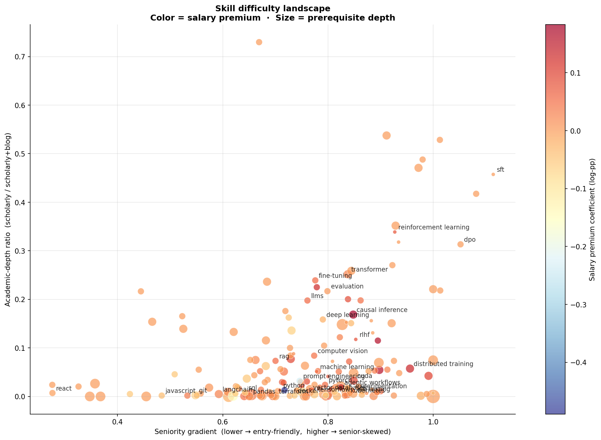
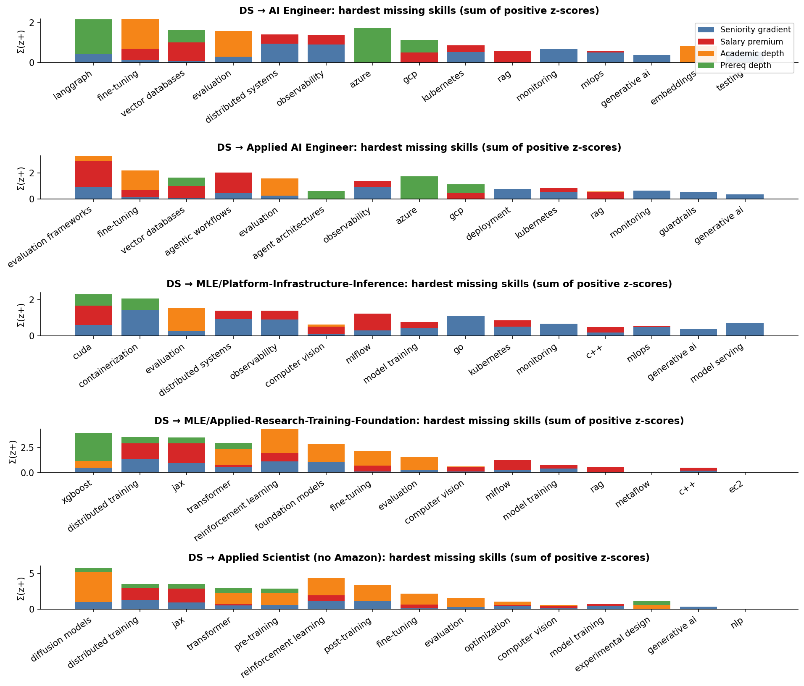

# The Hardest Skill in AI Hiring is JAX

**Date:** 2026-05-06
**Source:** Skillenai data products — 8,732 enriched job postings across the AI/ML/DS role taxonomy plus 9,733 USD-salaried postings used for the salary-premium regression. Scholarly and blog frequency from the Skillenai content corpora (~30K and ~327K documents respectively).

## TL;DR

We scored 222 AI/ML/DS skills on four independent difficulty signals: **how senior the postings asking for it are, how much salary premium it commands, how academically-deep it is, and how many other skills it presupposes.**

One skill is the highest-paying skill in the universe that 90% of postings still gate to senior+ engineers: **[JAX](#what-is-jax-a-primer)** — Google's numerical-computing library. It carries a +17.3% salary premium controlling for role, country, and seniority, and 90% of its postings are senior or above.

JAX is one of two clear "peaks" in the difficulty landscape. The other peak is the **post-training research stack** — diffusion models, reward modeling, SFT, DPO, distillation. Together they make up the work that produces frontier AI models.

Everything else — RAG, prompt engineering, LangChain, vector databases, MLOps plumbing — sits well below them on every signal we measured. **Prompt engineering carries a *negative* salary coefficient of −21.1%**, the lowest in the entire universe of measured skills.

This has a sharp implication for career planning: **a Data Scientist transitioning to AI Engineer is taking the longest paper jump on the role taxonomy but the easiest jump in effort, because the missing skills cluster at the bottom of the difficulty distribution. A Data Scientist transitioning to MLE-Platform or Research Engineer is the opposite — a shorter jump on paper, but the missing skills are senior-only, well-paid, and engineering-deep.**

---

## How we measured difficulty

Job-listing data tells you which skills employers ask for, but not which ones are hard. We built four independent proxies for difficulty and z-scored each one before averaging.

**Signal 1 — Seniority gradient.** For each skill, we measured the share of postings requiring it that fall in each IC seniority band (entry/junior, mid, senior, staff/principal), excluding management and intern tracks. The gradient is:

> `gradient = 1.5 × staff_principal_share + 1.0 × senior_share − 1.5 × entry_junior_share`

A skill with a high gradient appears almost exclusively in senior+ postings — proxy for "the labor market does not believe juniors can do this."

**Signal 2 — Salary premium.** A hedonic Ridge regression on log USD midpoint salary, with one-hot encoded role/country/seniority controls and a sparse skill-presence matrix on the right-hand side. Per-skill coefficients are partial elasticities — the salary delta a posting carries when it lists a skill, *holding role, location, and seniority fixed*. R² = 0.50 on 9,733 USD-salaried postings; coefficients reported for 124 skills with N≥50 in the regression sample.

**Signal 3 — Academic-depth ratio.** For each skill, the ratio of `match_phrase` hits in the scholarly corpus to (scholarly + blog) hits. High = academically grounded (transformer architecture papers, RL theory). Low = practitioner-driven (Kubernetes how-tos, JAX tooling docs). Two skills can both be hard but in different ways: a high scholarly ratio means "you need to read papers"; a low ratio means "you need production exposure."

**Signal 4 — Prerequisite depth.** A directed prerequisite DAG built from asymmetric co-occurrence: skill B is a prerequisite of A iff `P(B|A) ≥ 0.55`, `P(B|A) − P(A|B) ≥ 0.15`, and `N(B) > N(A)` (popularity gate that guarantees acyclicity). Depth(A) = longest chain of prerequisites under A in the resulting DAG. Captures toolkit and conceptual stacking — `numpy → pandas → scikit-learn → xgboost`, or `pytorch → distributed training → FSDP`.

The composite is the equal-weight average of all four z-scores.

### What "hard" means in this analysis

We're not measuring "how many hours did this take to learn for *you*." We're measuring **how the labor market treats a skill** — who it hires for it, what it pays for it, and what other skills it expects alongside it. These are revealed-preference proxies for difficulty. Three of the four signals (seniority, salary, prerequisite depth) come purely from job-listing behavior; one (scholarly ratio) brings in the broader content ecosystem.

A skill at the top of the composite has at least one (usually multiple) of these properties:

- It almost never appears in entry-level postings
- The market pays a premium for it controlling for the rest of the resume
- It has deep academic foundations
- It presupposes a non-trivial stack of more-fundamental skills

---

## The skill difficulty landscape

Two axes capture most of the variance:

- **The horizontal axis** is the seniority gradient. Skills on the right are senior-skewed; skills on the left are entry-friendly. React, JavaScript, Git, prompt engineering, FastAPI, SQL all cluster on the left.
- **The vertical axis** is academic-depth ratio. Skills near the top come from research papers (vision-language models, SFT, DPO, reinforcement learning, fine-tuning); skills near the bottom come from blog posts and ops docs (Kubernetes, Terraform, React).

The **top-right quadrant** is the difficulty frontier — senior-skewed *and* academically deep. SFT, DPO, RL, distillation, transformer, fine-tuning live here.

The **right edge with low scholarly density** is the engineering-frontier — senior-skewed but practitioner-driven. JAX, distributed training, CUDA, FSDP live here.

The **bottom-left quadrant** is the easy-skill quadrant — entry-friendly and not academic. React, JavaScript, Git, FastAPI, plus (notably) prompt engineering, LangChain, vector databases. This is the AI Engineer stack.

---

## Headline finding: JAX is the highest-paying hard skill in AI

The composite places JAX at #13 of 222 measured skills (excluding three artifact entries — mxnet, scipy, xgboost — that score high because they're old toolkits with deep prerequisite chains, not because they're cutting-edge). What singles JAX out is that it's the only skill in the top decile of *the difficulty composite* that's also in the **top three of the salary regression**:

| Skill | Seniority gradient | Salary premium | Academic-depth ratio | Prerequisite depth |
|---|---:|---:|---:|---:|
| **JAX** | **0.90** (top decile) | **+17.3%** (#3 of 124) | 0.05 (below median) | **2** (top quartile) |
| Distributed training | 0.96 | +14.3% | 0.06 | 2 |
| CUDA | 0.85 | +9.8% | 0.03 | 2 |
| Reinforcement learning | 0.93 | +8.0% | 0.34 | 0 |
| Fine-tuning | 0.78 | +5.8% | 0.24 | 1 |
| Reward modeling | **1.08** (top of universe) | n/a (n<50) | 0.42 | 1 |
| SFT | **1.11** (top of universe) | n/a (n<50) | 0.46 | 0 |
| Diffusion models | 0.91 | n/a (n<50) | **0.54** (top decile) | 2 |

Of every skill in the universe, JAX combines the most signals on which the market revealed-prefers it as hard:

- 90% of JAX postings are senior or above
- The hedonic regression assigns it a +17.3% salary coefficient — third-highest in the entire 124-skill panel, behind only causal inference (+20%) and evaluation frameworks (+18%)
- It has a deeper prerequisite stack than most tooling skills (Python → PyTorch → JAX)

JAX's *low* scholarly density (0.05) is itself informative. JAX isn't an academic concept — it's a tool. The papers that use JAX cite the methods, not the framework. So you can't pick up JAX by reading papers; you pick it up by writing code in it, and the code is mostly only written inside frontier labs.

That's why the salary premium is so high relative to the seniority gating: JAX is one of the few hard skills that requires both senior-level engineering judgment *and* access to an environment where someone is already writing it. The market pays for the combination.

### What is JAX? (a primer)

**JAX is Google's numerical-computing library — a NumPy-shaped API plus a compiler.** Think of it as PyTorch's quieter, more academic sibling. It does three things PyTorch doesn't do natively:

1. **JIT compile** Python functions to fused GPU/TPU kernels via Google's XLA compiler. The same Python code can run 100× slower or 100× faster depending on whether you've expressed it in a way XLA can fuse.
2. **Functional transformations** — `grad`, `vmap` (auto-batching), and `pmap` (auto-multi-device parallelism) compose like Lego. You write a single-example loss function, and `vmap` and `pmap` give you batched and parallelized versions for free.
3. **Purely functional model code** — no in-place mutation. Every model is a function from `(params, inputs)` to `outputs`. State is passed through explicitly. This makes it hard to write and easy to reason about.

**Who uses it:** Google DeepMind (Gemini, Gemma), Anthropic (Claude — partly), Apple's research arm, and a handful of academic groups. Most of the open-source ecosystem outside that orbit — Hugging Face, the LLaMA family, LlamaIndex, LangChain — runs on PyTorch.

**Why it's hard to learn:** the functional / pure-function model is genuinely different from PyTorch's eager mode. Code that *looks* like NumPy compiles to TPU pods if you know how to express it; the same code can be 100× slower if you don't. There's no Stack Overflow safety net for the corner cases — most JAX questions get answered by Google researchers in GitHub issues, not by tutorials. And the compiler errors are notoriously inscrutable: "all but the first leading axis must be of size 1" with a 200-line traceback that doesn't reference any of your code.

**Why the labor market gates it to senior+:** companies that need JAX (frontier labs) need engineers who can debug XLA compile failures, design SPMD parallelism across TPU pods, and write functional model code without leaking state. None of this is bootcamp material — it's the skill you reach after 5–10 years of ML engineering, after PyTorch is muscle memory and you've already built distributed training pipelines once.

---

## Twin peaks: engineering hard vs. research hard

The composite ranking surfaces two distinct clusters at the top of the difficulty distribution. They look different on the four signals.

**The engineering peak** — JAX, distributed training, CUDA, FSDP, profiling, large-scale training. High seniority gradient, **high salary premium where measurable**, low scholarly density, deep prerequisite chains. These are the skills that *implement* frontier model training. You can't acquire them by reading papers; you need to write code that runs on hundreds of GPUs or TPU pods.

**The research peak** — diffusion models, generative modeling, representation learning, reward modeling, SFT, DPO, distillation, vision-language models, imitation learning. High seniority gradient, **high scholarly density**, salary often unmeasured (these skills appear in fewer than 50 USD-salaried postings each — concentrated at frontier labs that don't always disclose pay). These are the skills that *design* frontier models. You can't acquire them without reading papers.

The labor market values both peaks. The market just hires for them in different places. The engineering peak is hired by companies (Google, Anthropic, Meta, OpenAI, dozens of well-funded startups). The research peak is hired by *labs* (DeepMind, Anthropic Research, OpenAI Research, Meta AI, ~50 academic groups). Both peaks are gated to senior or above almost universally.

The valley between them is sparse. There are no skills that are *both* highly engineering-deep *and* highly academically-deep — partly because the tooling and the concepts evolve in different communities, and partly because the people who can do both are rare enough that the market doesn't have a single name for the role they fill.

---

## What the easy end of the distribution looks like

The bottom of the composite ranking is a roll-call of skills the labor market actively de-values:

| Skill | Seniority gradient | Salary premium | Composite z |
|---|---:|---:|---:|
| TypeScript | 0.53 | +0.3% | −0.56 |
| Git | 0.55 | −6.4% | −0.62 |
| SQL | 0.55 | −6.5% | −0.73 |
| Data analysis | 0.57 | −3.8% | −0.63 |
| FastAPI | 0.55 | −5.1% | −0.71 |
| JavaScript | 0.48 | −0.7% | −0.89 |
| LLM APIs | 0.28 | n/a (n<50) | −1.01 |
| **Prompt engineering** | 0.75 | **−21.1%** | **−1.09** |
| React | 0.28 | −2.1% | −1.11 |
| Data labeling | 0.66 | −38.7% | −2.04 |

The most surprising entry is **prompt engineering**, which carries a −21.1% salary coefficient — the second-lowest in the entire 124-skill panel, behind only data labeling. Reading the coefficient literally: *holding role, location, and seniority fixed*, a posting that mentions prompt engineering pays 21% less than one that doesn't. The market is signalling that prompt engineering is a commodity skill — the kinds of jobs that explicitly recruit for it tend to be at companies and price points that don't pay frontier-model rates.

This is a sharp contrast with **agentic workflows** (+13.9%) and **evaluation frameworks** (+17.7%), both of which are AI Engineer-adjacent skills that *do* command premiums. The pattern is that the labor market discriminates within "AI Engineer" skills based on technical depth — prompt engineering is at the bottom; agent design and evaluation harness work are at the top.

---

## The role-transition map

If we anchor at Data Scientist and walk to each adjacent AI/ML role on the taxonomy, the standard Jaccard overlap of skill sets gives us a "paper distance":

| Target role | Jaccard | Skills missing | Effort gap (Σ difficulty of missing) | Avg difficulty per missing skill |
|---|---:|---:|---:|---:|
| Applied Scientist | 0.333 | 15 | 28.2 | 1.88 |
| **Applied Scientist (no Amazon)** | 0.333 | 15 | 36.8 | **2.45** |
| ML Engineer | 0.277 | 17 | 34.0 | 2.00 |
| Applied/Research Wing | 0.225 | 19 | 42.3 | 2.23 |
| MLE / Applied-Research wing | 0.225 | 19 | 42.7 | 2.25 |
| Applied ML Engineer | 0.200 | 20 | 41.1 | 2.06 |
| **MLE / Platform-Infrastructure-Inference** | **0.176** | 21 | 42.3 | 2.01 |
| AI Engineer | 0.154 | 22 | 40.9 | **1.86** |
| Research Scientist | 0.154 | 22 | **52.3** | 2.38 |
| Applied AI Engineer | 0.132 | 23 | 43.5 | 1.89 |
| Research Engineer | 0.132 | 23 | **51.5** | 2.24 |

The Jaccard column tells you "how many top-30 skills the two roles don't share." The effort-gap column sums the composite difficulty z-scores (shifted so the easiest skill in the universe contributes zero) over the missing skills. Two roles can have the same Jaccard distance but very different effort gaps if their missing skills are concentrated at different ends of the difficulty distribution.

### The rank inversion

Three roles move *up* in the ranking when we measure by effort instead of Jaccard:

- **Research Scientist:** #4 by Jaccard → **#1 by effort.** The missing skills are the research peak (diffusion models, generative modeling, JAX, distributed training, RL, post-training). All top-decile difficulty.
- **MLE / Applied-Research wing:** #8 by Jaccard → **#4 by effort.** Same cluster as Research Scientist plus additional engineering tooling (FSDP, transformer internals).
- **Applied/Research Wing aggregate:** #7 by Jaccard → **#6 by effort.** Same direction.

Two roles move *down*:

- **AI Engineer:** #3 by Jaccard → **#8 by effort.** The missing skills are LangGraph, vector databases, RAG, observability, MLOps, prompt engineering — the bottom half of the difficulty distribution. AI Engineer looks like the longest paper-jump from a Data Scientist resume but is actually the *easiest* role transition in effort terms.
- **Applied AI Engineer:** #1 by Jaccard → **#3 by effort.** Mostly the same as AI Engineer; misses additionally agentic workflows and agent architectures, which *are* in the top quartile of difficulty.

### Sub-finding: Applied Scientist is the closest jump on paper but the highest-quality 15 skills you'd need to learn

The single highest **average difficulty per missing skill** belongs to **Applied Scientist (no Amazon)** at 2.45. A Data Scientist transitioning to this role only needs to learn 15 new skills — the smallest gap on the table — but those 15 skills include diffusion models, distributed training, JAX, transformer internals, pre-training, reinforcement learning, post-training, and fine-tuning. *Every single one* of the missing skills is in the top quartile of the universe.

This is a clean illustration of why a single distance metric isn't enough. The Applied Scientist transition is *short* (low Jaccard distance) but *steep* (highest avg-difficulty). The AI Engineer transition is *long* (high Jaccard distance) but *shallow* (low avg-difficulty). The product — total effort — comes out close, but the shape of the climb is completely different.

---

## What makes each role transition hard, by signal

The same composite-difficulty number can be reached different ways. Looking at the breakdown for each transition tells you what *kind* of hard you'd be signing up for:

- **DS → AI Engineer:** missing-skill difficulty comes mostly from **seniority gradient** (operational AI plumbing — observability, MLOps, Kubernetes, monitoring) plus a handful of **academic-depth** contributions (fine-tuning, RAG). Salary premium contributes modestly. No skill in the missing set is a "research peak" skill.

- **DS → Applied AI Engineer:** broadly similar to AI Engineer with one important addition — **agentic workflows** and **agent architectures** appear, both with strong salary contributions (+14% for agentic workflows). This is the AIE flavor that *does* require depth.

- **DS → MLE/Platform-Infrastructure-Inference:** dominated by **seniority gradient** (Kubernetes, distributed systems, containerization, observability, model training, monitoring, scalability). Almost no academic-depth contribution — these skills are all practitioner. Salary premiums are moderate. This is the "engineering hard" flavor.

- **DS → MLE/Applied-Research-Training-Foundation:** balanced contributions across **seniority + scholarly + salary** (distributed training, JAX, transformer, RL, foundation models, fine-tuning, post-training). The wing of MLE that overlaps with research.

- **DS → Applied Scientist (no Amazon):** dominated by **academic-depth** (diffusion models, generative modeling, RL, post-training, fine-tuning, transformer, pre-training, distillation). Pure research peak.

The shape of each transition's bar chart is its own diagnostic. AI Engineer has many short bars (many easy missing skills); MLE-Platform has medium bars dominated by one signal (operational seniority); Applied Scientist has few but very tall bars (research-deep).

---

## Implications for career planning

For Data Scientists choosing what to learn next, the data has an opinion that's more nuanced than "move up the salary curve" or "follow the AI Engineer wave."

If you want **the smallest effort gap**, the answer is **ML Engineer** (effort gap 34.0) or **Applied Scientist** (28.2). These transitions reuse the largest fraction of a DS skill stack and the missing skills, while not trivial, are moderate on average.

If you want **the highest-paying skills**, you're looking at **JAX** (+17.3%), **causal inference** (+20.1% — already a DS skill, deepen it), **evaluation frameworks** (+17.7%), **distributed training** (+14.3%), **agentic workflows** (+13.9%), or **CUDA** (+9.8%). These are scattered across MLE, Research Engineer, and the more technical end of AI Engineer.

If you want **the smallest set of skills to learn**, but you're willing to learn the hardest possible ones, the answer is **Applied Scientist (no Amazon)** at 15 skills — but those 15 are diffusion models, distributed training, JAX, transformer internals, pre-training, RL, post-training, and fine-tuning.

If you want **the easiest skills to learn**, period, the answer is **AI Engineer** at avg difficulty 1.86. Most of the missing skills are LangGraph, vector databases, RAG, observability, MLOps — the labor market revealed-prefers these as commodity.

The combination most career advice ignores is *short jump + hard skills* (Applied Scientist) versus *long jump + easy skills* (AI Engineer). Both can be defensible career moves; they're just optimizing different things.

---

## Caveats and methodology notes

**Market-revealed difficulty, not personal difficulty.** Every signal we used is a proxy for what employers want, not for how many hours an individual would need to acquire a skill. A senior engineer with 10 years of distributed-systems experience could learn JAX in a quarter; a self-taught LLM-app engineer might need years. The composite says *the labor market gates these skills to senior+ and pays a premium for them* — the inference about wall-clock-hours-to-learn is a step removed.

**Salary regression is in-sample, with imperfect role/location controls.** R² = 0.50; a Ridge model with one-hot role/seniority/country plus a sparse skill matrix. Ridge regularization stabilizes the coefficients but doesn't eliminate omitted-variable bias. Read the coefficients as a comparative ranking, not as point estimates of a causal premium.

**Salary regression covers 124 skills.** Skills with fewer than 50 USD-salaried postings (e.g. diffusion models n=30 in salary sample, reward modeling n<50) drop out of the regression. For those skills the composite uses only signals 1, 3, and 4 plus a salary-z of 0 (i.e. average). When we say "JAX is the highest-paying hard skill," that's relative to the 124-skill panel; some of the research-peak skills might pay more if we had enough USD-salaried data on them.

**Prerequisite-depth signal captures toolkit chains, not operational depth.** Our DAG is built from skill co-occurrence in postings. It identifies that JAX presupposes PyTorch which presupposes Python — clean. It does *not* identify that Kubernetes presupposes Linux and networking and distributed-systems intuition, because Linux/networking/distributed-systems-intuition aren't extracted as named skills from postings. So this signal under-weights operational difficulty for skills like Kubernetes and Terraform. The seniority gradient compensates partially (K8s has gradient 0.84 — high); we report all four signals separately so readers can weight them as they prefer.

**Scholarly corpus is concentrated in 2018–2026 ML/AI literature.** Skills with deep theoretical foundations *outside* contemporary ML (statistics theory, classical optimization, classical CS theory) score lower than they "should" because the corpus sees fewer of those papers per unit of skill prevalence. This is a coverage limitation, not a skill-property finding.

**Role definitions reuse the prior post's bucketing** — Data Scientist (n=2,939), ML Engineer all-aliases (3,049), MLE wings split by title-suffix forensics (n=189 Applied wing / n=137 Platform wing), Applied Scientist with and without Amazon (15 / 281), AI Engineer aliases (1,182), Applied AI Engineer (322), Research Scientist (602), Research Engineer (515). Top-30 skill comparisons preserve methodological consistency with the prior analysis. Speechify excluded as a known posting-volume spammer.

**Big Tech under-represented.** Postings from Google, Apple, Microsoft, Netflix, NVIDIA are mostly absent from the corpus (proprietary ATS platforms we don't scrape). For skills concentrated at Google in particular — JAX, TPUs, XLA — the prevalence and salary numbers are lower bounds on the actual market.

**No time series.** This is a cross-sectional snapshot. We do not have clean per-quarter coverage to say whether JAX's salary premium is rising or falling, or whether the prompt-engineering −21% coefficient was always negative.

---

## Data files

Per-skill difficulty signals and role-distance results are committed alongside this README:

- `signal_seniority.csv` — seniority gradient per skill, plus per-band shares (178 skills with N≥30)
- `signal_salary.csv` — Ridge regression coefficients (124 skills with N≥50 in USD-salary sample)
- `signal_scholarly.csv` — academic-depth ratio (222 skills, scholarly + blog match_phrase counts)
- `signal_prereq.csv` — prerequisite DAG depth and prereq lists (181 skills)
- `difficulty_index.csv` — composite z-scores combining all four signals (222 skills)
- `role_distance.csv` — Jaccard, effort gap, avg difficulty, and missing-skill detail for 11 target roles

Per-job CSVs (8,732 target-role postings, 9,733 USD-salaried postings) are not committed due to size; available on request.
