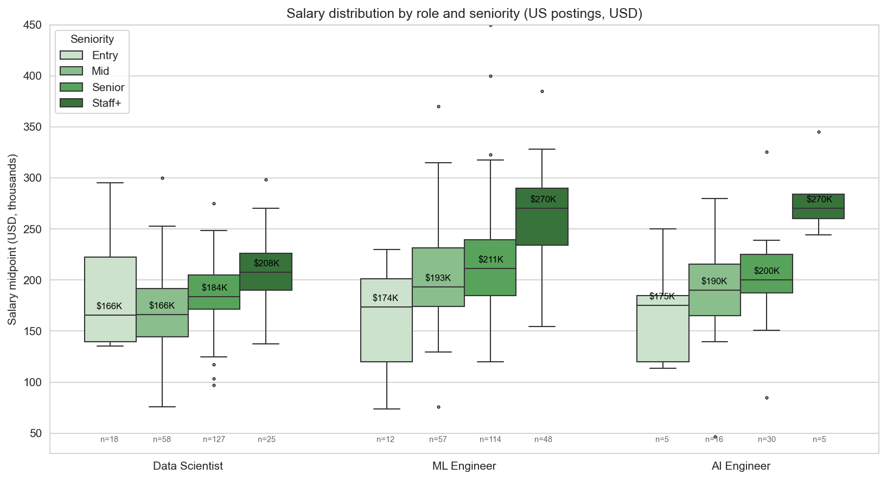
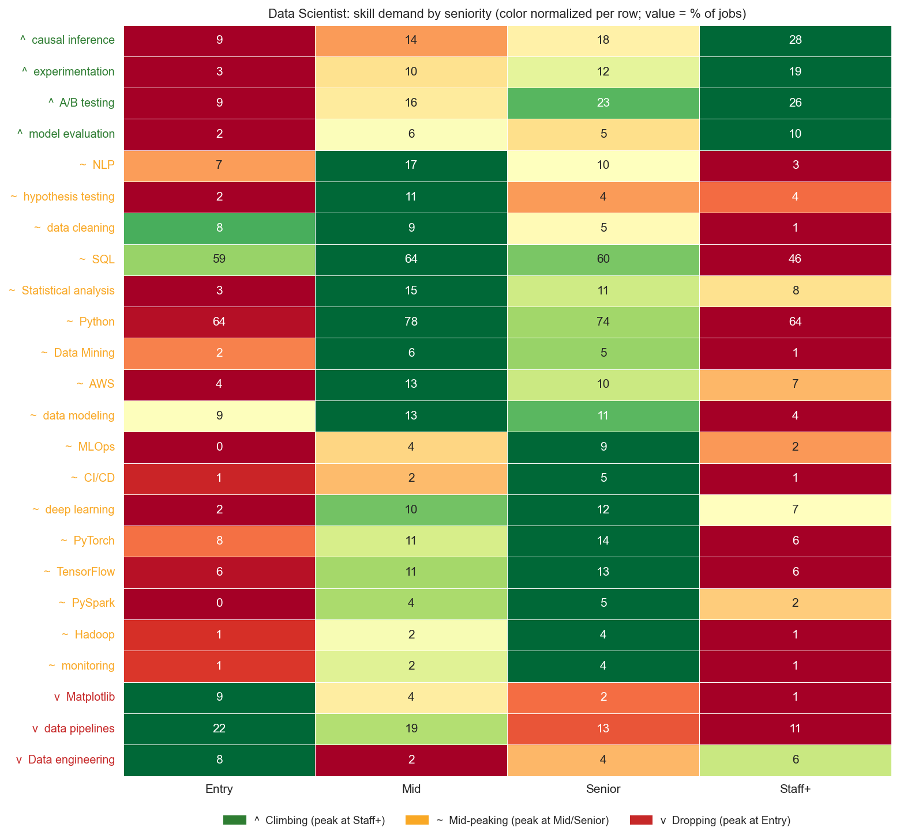
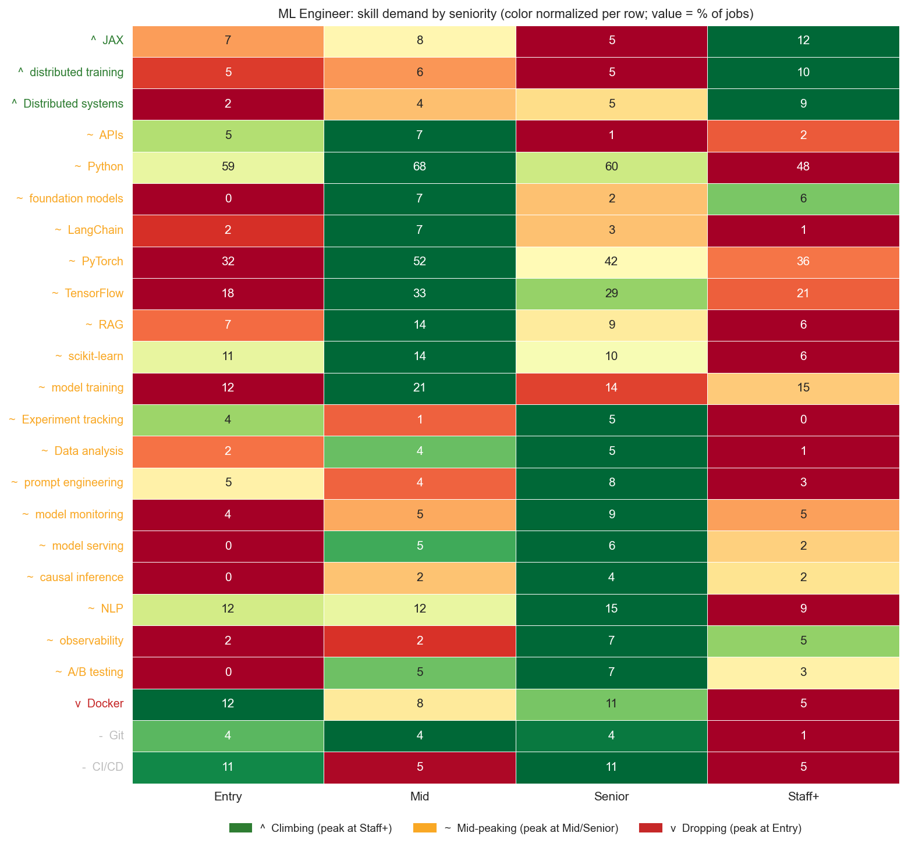
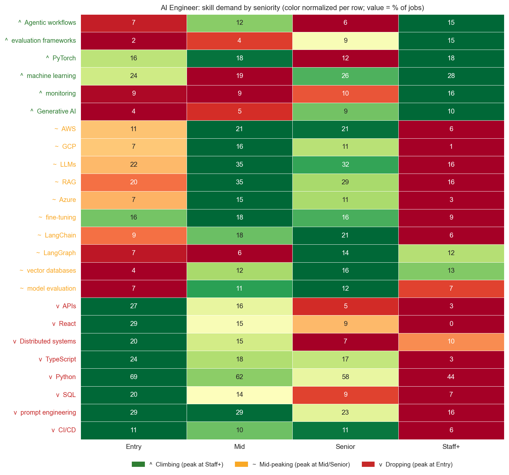
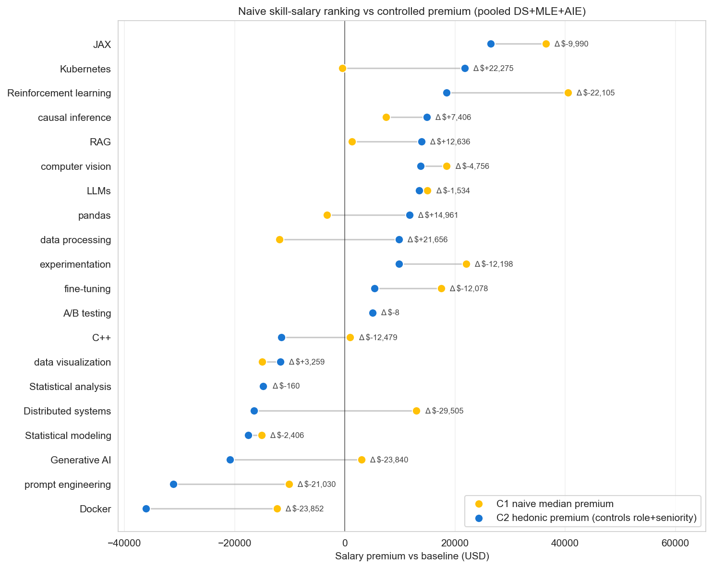
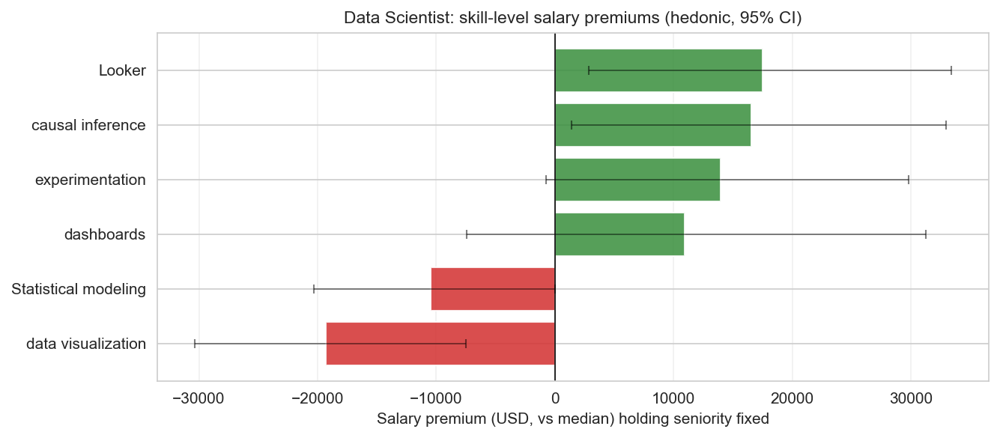
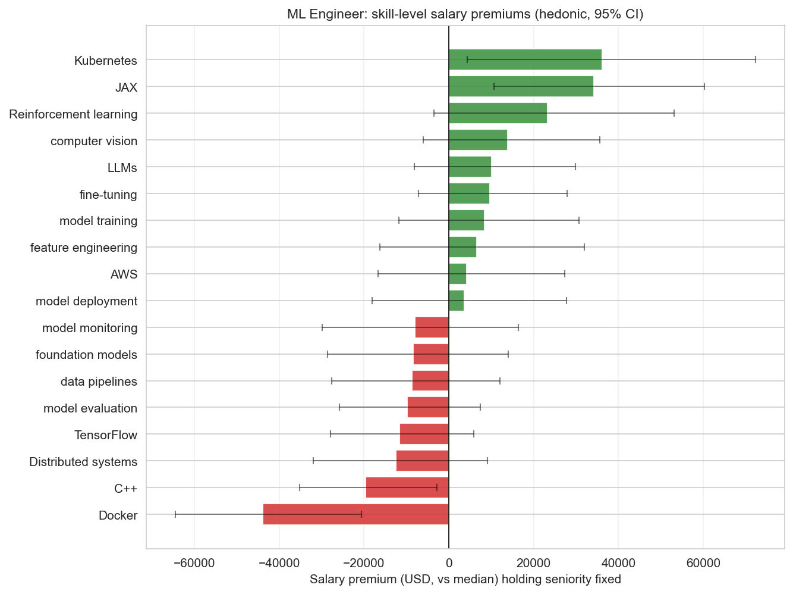

# The Senior-to-Staff Jump: What Actually Separates Mid, Senior, and Staff ML Jobs

**Date:** 2026-04-19
**Source:** Skillenai Job Index (3,277 jobs across Data Scientist, ML Engineer, AI Engineer)
**API:** `api.skillenai.com/v1`

> **Methodology:** Postings were pulled for three role buckets (Data Scientist, ML Engineer ∪ Machine Learning Engineer, AI Engineer ∪ Artificial Intelligence Engineer) across four IC seniority buckets (Entry ∪ Junior, Mid, Senior, Staff ∪ Principal). Management-track levels (Manager / Director / VP / C-level / Lead) were excluded. One spam employer (Speechify) excluded. Salary analyses are US-only, USD-only, using midpoint of `salaryMin` and `salaryMax`. Skill surface forms were collapsed using a merge map (267 normalizations for case, punctuation, acronym-expansion pairs like `RAG` ↔ `Retrieval-Augmented Generation (RAG)`). See `build_skill_merges.py` and SKI-165 for the underlying entity-resolution issue.

---

## TL;DR

1. **Getting promoted moves the needle far more than any single skill.** A Staff+ ML Engineer earns a **median $59K more** than a Senior ML Engineer. The biggest "skill" on your resume is your level.
2. **Most "hot AI skills" pay less than you think — or nothing — once you control for seniority.** Generative AI, prompt engineering, and RAG show premiums in naive rankings, but those premiums come from the seniority of the roles that list them. The regression collapses them toward zero (or negative).
3. **A few skills actually pay more after controls**: **JAX** (+$27K), **Kubernetes** (+$22K), **ETL** (+$23K), **Causal inference** (+$15K), **Computer vision** (+$14K). These are infrastructure-adjacent and stats-adjacent skills, not frontier-model skills.
4. **Skills come in three shapes across seniority**: **climbing** (peak at Staff+; keep investing), **mid-peaking** (peak at Mid/Senior, then fade; these are "prove-you-know-it" items that fall off the Staff resume), and **dropping** (Entry-level signatures). The mid-peaking category is where most of the "required stack" lives — PyTorch, TensorFlow, RAG, LLMs, Python itself.
5. **The skills that genuinely climb to Staff are different for each role:**
   - **DS** → *causal inference, experimentation, A/B testing*
   - **MLE** → *distributed systems, JAX, reinforcement learning, distributed training*
   - **AIE** → *evaluation frameworks, agentic workflows, observability*
6. **Entry-level signature skills** (drop sharply with level) hint at the job-before-this-one: Data Scientists come in via *Matplotlib* and *data pipelines*; AI Engineers come in via *React*, *TypeScript*, and *APIs*.

---

## Dataset

| Role | Entry | Mid | Senior | Staff+ | Total IC postings | US-USD salaried |
|---|---:|---:|---:|---:|---:|---:|
| **Data Scientist** | 103 | 284 | 842 | 162 | 1,391 | 228 |
| **ML Engineer** | 56 | 263 | 738 | 325 | 1,382 | 231 |
| **AI Engineer** | 45 | 80 | 311 | 68 | 504 | 57 |

Salary coverage is 10–22% per cell (US postings with both min and max). Phase A (skill proportions) uses the full 3,277-job set. Phase B–C (salary) uses the 515-job US-USD subset.

---

## 1. How much more do you earn per level?

| Role | Entry | Mid | Senior | Staff+ | Mid→Senior | Senior→Staff |
|---|---:|---:|---:|---:|---:|---:|
| **Data Scientist** | $166K (n=18) | $166K (n=58) | $184K (n=127) | $208K (n=25) | +$17K (p=.001) | +$24K (p<.001) |
| **ML Engineer** | $174K (n=12) | $193K (n=57) | $211K (n=114) | **$270K** (n=48) | +$18K (p=.04) | **+$59K** (p<.001) |
| **AI Engineer** | $175K (n=5)† | $190K (n=16) | $200K (n=30) | $270K (n=5)† | +$10K (p=.13) | †thin |

† N < 10. Pairwise p-values via Mann-Whitney U. Medians reported; rank-biserial effect sizes for Senior→Staff: DS r=0.50, MLE r=0.54 (both "large"); AIE too thin for a stable estimate.

**Reading the numbers:**

- DS Entry→Mid is flat (likely small-N noise for Entry), but Mid→Senior→Staff is a clean $17K then $24K jump
- **MLE is the steepest ladder**: Senior→Staff is a 28% median jump — $211K to $270K
- AIE medians track MLE but the Staff sample is too thin (N=5) to stand on. The trend looks real but the magnitude is uncertain

The headline question: **what gets you over the Senior→Staff threshold?** That's the rest of this analysis.

---

## 2. Which skills separate Mid from Senior? Senior from Staff?

For each role, we computed the share of jobs at each seniority level that require each skill, then ran a 2×4 chi-square (has-skill × level) with Bonferroni-corrected pairwise tests. Skills were required to appear in ≥40 jobs within the role.

Each skill gets classified into one of three shapes based on which level it peaks at:
- **^ Climbing** — peak at Staff+. Keep investing as you level up.
- **~ Mid-peaking** — peak at Mid or Senior; drops at Staff+. Treat as "middle-level signature" skills — they carry your resume through Mid/Senior and then fade as you specialize upward.
- **v Dropping** — peak at Entry. Early-career signature skills that fall off the resume fast.

Mid-peaking is the most interesting class. It captures the skills that *every* Senior-ish engineer is expected to know, but which Staff+ engineers no longer list because their resume has room for only 5-10 differentiators.

### Data Scientist

**^ Climbing (keep investing):**

| Skill | Entry | Mid | Senior | Staff+ | Omnibus p |
|---|---:|---:|---:|---:|---:|
| Causal inference | 9% | 14% | 18% | **28%** | **1.0e-04** |
| A/B testing | 9% | 16% | 23% | **26%** | **2.5e-04** |
| Experimentation | 3% | 10% | 12% | **19%** | **4.9e-04** |
| Model evaluation | 2% | 6% | 5% | **10%** | n.s. |
| Databricks | 1% | 6% | 7% | **9%** | n.s. |

**~ Mid-peaking (get through Mid/Senior, then fade):**

| Skill | Entry | Mid | Senior | Staff+ | Omnibus p |
|---|---:|---:|---:|---:|---:|
| Python | 64% | **78%** | 74% | 64% | 2.1e-03 |
| SQL | 59% | **64%** | 60% | 46% | **1.4e-03** |
| NLP | 7% | **17%** | 10% | 3% | **4.4e-05** |
| Statistical analysis | 3% | **15%** | 11% | 8% | **2.3e-03** |
| AWS | 4% | **13%** | 10% | 7% | 2.6e-02 |
| Hypothesis testing | 2% | **11%** | 4% | 4% | **7.7e-05** |
| MLOps | 0% | 4% | **9%** | 2% | **1.1e-05** |
| PyTorch | 8% | 11% | **14%** | 6% | n.s. |
| TensorFlow | 6% | 11% | **13%** | 6% | n.s. |
| Deep learning | 2% | 10% | **12%** | 7% | 8.7e-03 |

**v Dropping (early-career signatures):**

| Skill | Entry | Mid | Senior | Staff+ | Omnibus p |
|---|---:|---:|---:|---:|---:|
| Data pipelines | **22%** | 19% | 13% | 11% | **7.0e-03** |
| Matplotlib | **9%** | 4% | 2% | 1% | **3.6e-04** |
| Data engineering | **8%** | 2% | 4% | 6% | n.s. |

The DS story has three chapters. **Staff+ DS is defined by experimentation and causal reasoning** — those are the only skills that climb monotonically through to Staff. **Mid-level DS looks like a code keyword match**: Python peaks at 78%, SQL at 64%, and specific tools (NLP, statistical analysis, hypothesis testing, MLOps) cluster as mid-peaking. These are the "prove you can do the job" items that stop carrying weight once you're Staff. **Entry-level DS is marked by plumbing**: data pipelines, Matplotlib, data engineering — the tools of the first year.

### ML Engineer

**^ Climbing (keep investing):**

| Skill | Entry | Mid | Senior | Staff+ | Omnibus p |
|---|---:|---:|---:|---:|---:|
| JAX | 7% | 8% | 5% | **12%** | **4.5e-03*** |
| Distributed systems | 2% | 4% | 5% | **9%** | 1.2e-02 |
| Reinforcement learning | 5% | 6% | 8% | **12%** | n.s. |
| Distributed training | 5% | 6% | 5% | **10%** | n.s. |

*Omnibus on DS was 4.5e-04; for MLE the omnibus fails Bonferroni but the Senior→Staff jump is significant (p=5e-04).

**~ Mid-peaking (get through Mid/Senior, then fade):**

| Skill | Entry | Mid | Senior | Staff+ | Omnibus p |
|---|---:|---:|---:|---:|---:|
| Python | 59% | **68%** | 60% | 48% | **1.6e-05** |
| PyTorch | 32% | **52%** | 42% | 36% | **7.8e-04** |
| TensorFlow | 18% | **33%** | 29% | 21% | **1.1e-03** |
| RAG | 7% | **14%** | 9% | 6% | n.s. |
| scikit-learn | 11% | **14%** | 10% | 6% | n.s. |
| Foundation models | 0% | **7%** | 2% | 6% | **1.0e-03** |
| Model serving | 0% | 5% | **6%** | 2% | n.s. |
| NLP | 12% | 12% | **15%** | 9% | n.s. |
| Observability | 2% | 2% | **7%** | 5% | n.s. |
| Model monitoring | 4% | 5% | **9%** | 5% | n.s. |

**v Dropping (early-career signatures):**

| Skill | Entry | Mid | Senior | Staff+ | Omnibus p |
|---|---:|---:|---:|---:|---:|
| Docker | **12%** | 8% | 11% | 5% | 2.3e-02 |

Three things land in the MLE heatmap:

1. **JAX and distributed systems are the Staff+ signals.** Both roughly double between Senior and Staff. Frontier-research depth — novel architectures, training at scale.
2. **Python, PyTorch, and TensorFlow are all mid-peaking, not climbing.** Mid MLE postings peak at 68% Python, 52% PyTorch, 33% TensorFlow — these are "prove you know the stack" items. By Staff, the expected toolkit is assumed and postings talk about research direction instead.
3. **MLOps-adjacent skills cluster at Senior.** Model serving, model monitoring, observability all peak at Senior (6–9%) and then drop at Staff. Staff MLE postings describe what you'll architect, not what you'll operate.
4. **Docker is the only real "dropping" skill** — peaks at 12% Entry and fades to 5% Staff. Docker-forward postings are junior ops roles.

### AI Engineer

**^ Climbing (keep investing):**

| Skill | Entry | Mid | Senior | Staff+ | Omnibus p |
|---|---:|---:|---:|---:|---:|
| Evaluation frameworks | 2% | 4% | 9% | **15%** | n.s. |
| Agentic workflows | 7% | 12% | 6% | **15%** | n.s. |
| Observability | 11% | 18% | 16% | **21%** | n.s. |
| Generative AI | 4% | 5% | 9% | **10%** | n.s. |

**~ Mid-peaking (Mid AIE sweet spot):**

| Skill | Entry | Mid | Senior | Staff+ | Omnibus p |
|---|---:|---:|---:|---:|---:|
| LLMs | 22% | **35%** | 32% | 16% | 2.5e-02 |
| RAG | 20% | **35%** | 29% | 16% | 3.9e-02 |
| AWS | 11% | **21%** | 21% | 6% | 1.9e-02 |
| LangChain | 9% | 18% | **21%** | 6% | 1.3e-02 |
| GCP | 7% | **16%** | 11% | 1% | 3.6e-02 |
| Azure | 7% | **15%** | 11% | 3% | 7.7e-02 |
| Fine-tuning | 16% | 18% | 16% | 7% | n.s. |
| Vector databases | 4% | 13% | **16%** | 13% | n.s. |

**v Dropping (the full-stack onramp):**

| Skill | Entry | Mid | Senior | Staff+ | Omnibus p |
|---|---:|---:|---:|---:|---:|
| APIs | **27%** | 16% | 5% | 3% | **4.4e-07** |
| React | **29%** | 15% | 9% | 0% | **1.0e-05** |
| TypeScript | **24%** | 18% | 17% | 3% | 9.7e-03 |
| Distributed systems | **20%** | 15% | 7% | 10% | 1.7e-02 |
| Prompt engineering | **29%** | 29% | 23% | 16% | n.s. |
| SQL | **20%** | 14% | 9% | 7% | 8.3e-02 |

The **"AI Engineer" title is a full-stack onramp**: entry AIE postings look like frontend/backend job descriptions with LLM sprinkle — heavy on React, TypeScript, APIs. **Mid AIE is the LLM-app-builder persona** — LLMs, RAG, LangChain, cloud providers all peak at Mid. **Staff+ AIE moves up a level of abstraction** to evaluation, agentic systems, and production LLM observability. Prompt engineering is an entry-level badge that never climbs.

---

## 3. Does each skill actually pay more?

Two models, same data (515 US-USD salaried jobs across the three roles):

- **C1 — Naive**: median salary of jobs requiring each skill, no controls. This is what a reader sees if they rank skills by "jobs that list X earn $Y".
- **C2 — Hedonic regression**: `log(salary) ~ role + seniority + skill_dummies`, Lasso-selected then OLS-refit. This isolates each skill's marginal effect *holding role and seniority fixed*.

The gap between C1 and C2 is the story. Skills where **C2 ≪ C1** are seniority markers in disguise. Skills where **C2 ≈ C1** are true premiums. Skills where **C2 > C1** pay more than raw medians suggest (their premium is masked by them being common across all levels).

### The senior-proxy skills (premium collapses when controlled)

| Skill | Naive (C1) | Controlled (C2) | Shrinkage |
|---|---:|---:|---:|
| Reinforcement learning | +$40K | +$18K | **−55%** |
| Generative AI | +$3K | **−$21K** | **sign flip** |
| Experimentation | +$22K | +$10K | −55% |
| Fine-tuning | +$17K | +$5K | −70% |
| Distributed systems | +$13K | **−$17K** | **sign flip** |

Reinforcement learning really pays — but only half as much as the naive view suggests. The other half is just that RL jobs are senior. Generative AI posts *look* well-paid because they're biased toward senior AIE roles, but at fixed level, the "GenAI" tag is a **negative** signal (probably because it correlates with hype-heavy entry-level AIE roles).

### The hidden-premium skills (worth more than they look)

| Skill | Naive (C1) | Controlled (C2) | Uplift |
|---|---:|---:|---:|
| Kubernetes | ~$0 | **+$22K** | +$22K |
| RAG | +$1K | +$14K | +$13K |
| Pandas | −$3K | +$12K | +$15K |
| Data processing | −$10K | +$10K | +$20K |

Kubernetes is the cleanest example. Because Kubernetes appears across seniority levels (entry/mid platform engineers also use it), its naive median salary looks average. Once seniority is controlled, there's a real +$22K premium that was being masked.

### Skills with genuine standalone premium (controlled)

Ranked by hedonic dollar premium, restricted to skills appearing in ≥20 jobs:

| Skill | N | Premium % | Premium $ | 95% CI | p |
|---|---:|---:|---:|---:|---:|
| JAX | 42 | +13.6% | **+$27K** | [+$10K, +$44K] | .001 |
| ETL | 21 | +11.7% | +$23K | [+$2K, +$46K] | .03 |
| Kubernetes | 38 | +11.2% | +$22K | [+$3K, +$42K] | .02 |
| Deployment | 23 | +9.7% | +$19K | [+$1K, +$39K] | .04 |
| Computer vision | 40 | +7.0% | +$14K | [+$2K, +$27K] | .02 |
| LLMs | 93 | +6.9% | +$13K | [+$3K, +$25K] | .01 |
| RAG | 30 | +7.1% | +$14K | [−$4K, +$33K] | .13 |
| Causal inference | 51 | +7.6% | +$15K | [−$2K, +$34K] | .09 |

### Skills with a genuine salary *penalty* after controls

| Skill | N | Premium % | Premium $ | 95% CI | p |
|---|---:|---:|---:|---:|---:|
| Docker | 31 | **−18.5%** | **−$36K** | [−$51K, −$20K] | **<.001** |
| Prompt engineering | 30 | −16.0% | −$31K | [−$49K, −$11K] | .003 |
| Generative AI | 37 | −10.7% | −$21K | [−$36K, −$4K] | .02 |
| Statistical modeling | 55 | −9.0% | −$18K | [−$30K, −$4K] | .009 |
| Data cleaning | 23 | −7.9% | −$15K | [−$28K, −$1K] | .03 |

**How to read a negative premium.** Docker doesn't *cause* a pay cut. It's a signal: jobs that explicitly list Docker as a requirement tend to be at a lower salary tier at the same seniority, probably because they're more ops-focused, less research-y. At Staff+ levels, Docker is assumed and goes unmentioned — similar to how Python drops off Staff postings. A corollary: **job postings that foreground operational tooling are lower-paid than postings with the same seniority label that foreground research/architecture**, at least for ML.

---

## 4. Per-role hedonic premiums

### Data Scientist (N=228)

Only 6 skills survived Lasso selection in the DS model. The significant premium-payers are specific and small: `Looker` (+$18K), `causal inference` (+$17K), `experimentation` (+$14K). The `data visualization` label carries a **−$19K** penalty at fixed seniority — consistent with `data visualization`-labeled DS jobs being more analyst-flavored than ML-flavored.

### ML Engineer (N=231)

The MLE model has more signal (R² = 0.35 vs 0.22 for DS). The clear winners: **Kubernetes (+$36K)** and **JAX (+$30K)**. Both significant after controls. RL trends positive but fails Bonferroni. Docker is a −$44K penalty at fixed seniority — a larger effect than in the pooled model, suggesting the Docker signal is sharpest within MLE.

### AI Engineer

Skipped for the hedonic model. N=57 US-USD salaried is too thin for a reliable regression with skill dummies. The pooled model captures AIE-relevant signals (prompt engineering penalty, RAG positive, evaluation frameworks positive) indirectly.

---

## 5. Putting it together: a level-up playbook

For each role, the skills that matter most for the next level, based on chi-square residuals at the Senior→Staff transition combined with hedonic dollar premium:

### Data Scientist: Mid → Senior
Spend learning time on: **causal inference**, **A/B testing**, **experimentation**. These climb monotonically from Mid (10–16%) to Staff (19–28%) and the regression says each one pays $10–17K at fixed seniority.

### Data Scientist: Senior → Staff
Develop: **Databricks-flavored pipelines** and **deeper statistical/causal rigor**. Let go of: day-to-day SQL and data visualization tooling — Staff DS don't list these. The $24K bump at Staff comes from scope and influence more than individual skills.

### ML Engineer: Mid → Senior
Build: **systems depth** (distributed training, model serving, observability). These roughly double Mid → Staff. Kubernetes in particular is a +$36K premium at fixed seniority and appears in Staff MLE jobs twice as often as Mid.

### ML Engineer: Senior → Staff
Go deep: **JAX**, **reinforcement learning**, **transformers**, **distributed systems**. This is the biggest compensation jump in the entire dataset (+$59K median). The skills that land here are frontier-research signals.

### AI Engineer: Any level
Invest in: **evaluation frameworks**, **agentic workflows**, **observability for LLMs**. Depreciate: **prompt engineering** as a standalone skill — it's an entry-level badge. If you're coming in from full-stack (React / TypeScript / APIs), staying in AI Engineer requires trading those for LLM infrastructure skills over time.

---

## 6. Caveats

- **Posted-salary selection bias.** Jobs that disclose salary skew toward salary-transparent US states and companies. Results generalize to that market, not the global MLE/DS/AIE job pool. Coverage is 10–22% per role-level cell.
- **Big Tech under-represented.** Google, Apple, Microsoft, Netflix, NVIDIA mostly don't appear in our index because we don't scrape their proprietary ATS platforms (see SKI-139). This particularly affects Staff+ compensation estimates, since top compensation in our data is already $270K median and these employers pay higher.
- **Skill entity resolution has gaps.** We manually merged 267 case/punctuation/acronym variants (see SKI-165). Some skills that look semantically close remain separate — for example, `dashboards` and `data visualization` end up with different signs in the DS regression. They may genuinely be different concepts (dashboards = deliverable, data visualization = general skill), or the resolver could stand to merge them. We chose not to force the merge.
- **R² values (0.22–0.35 per-role, 0.39 pooled) are modest but typical for salary regressions.** Firm-level variance (the company you work for) is the largest source of salary variation we don't capture. Skill coefficients should be read as "on average across firms, holding role and seniority fixed."
- **Entry-level cells are thin.** DS Entry n=18, MLE Entry n=12, AIE Entry n=5 for the salary cells. Entry-level claims should be taken with wider error bars than what the medians suggest.
- **Staff+ sample for AIE is N=5.** The $270K Staff AIE median is consistent with MLE Staff but shouldn't be presented as well-estimated.

---

## Data & code

| File | Purpose |
|---|---|
| `jobs.csv` | Raw per-job pull (3,277 rows, 12 role×level cells, pre-merge) — *gitignored, regenerate via `download_jobs_by_seniority.py`* |
| `jobs_merged.csv` | After applying 267 skill-surface normalizations — *gitignored, regenerate via `apply_merges.py`* |
| `skill_merge_map.json` | Surface-form → canonical mapping |
| `skill_merge_candidates.csv` | Review table of all merge candidates |
| `phase_a_{role}_skills_by_seniority.csv` | Per-skill chi-square + residuals + pairwise transitions |
| `phase_b_salary_by_level.csv` | Salary summary by (role, level) |
| `phase_b_pairwise.csv` | Mann-Whitney pairwise level comparisons |
| `phase_c1_{pooled,ds,mle}.csv` | Naive median-salary-by-skill |
| `phase_c2_{pooled,ds,mle}.csv` | Hedonic regression premiums + CIs |
| `build_skill_merges.py` | Surface-form clustering |
| `phase_a_*.py`, `phase_b_*.py`, `phase_c1_*.py`, `phase_c2_*.py` | Analysis pipeline |
| `plots.py` | All figures in this report |

Related ticket: [SKI-165](https://linear.app/skillenai/issue/SKI-165/skill-entity-resolution-emits-duplicate-canonical-entities) — skill entity resolution duplicate-canonical issue discovered during this analysis.
