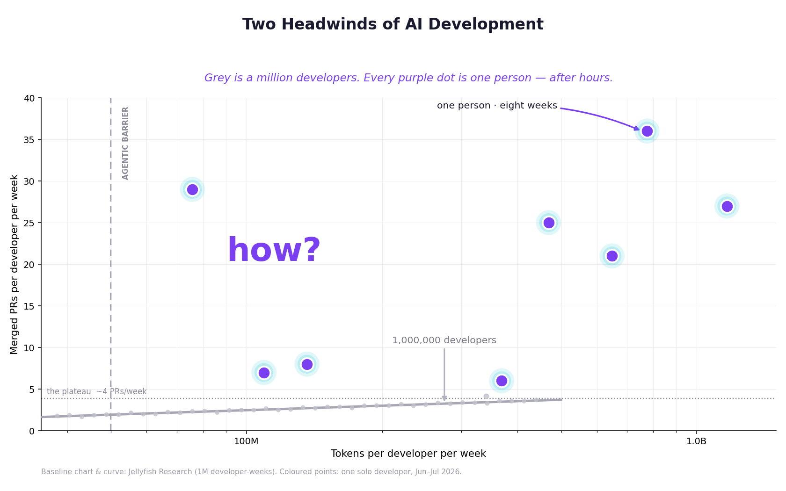
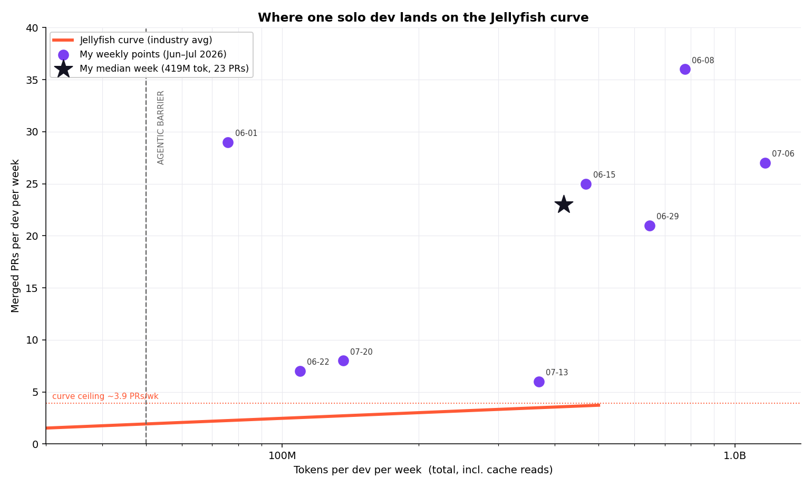
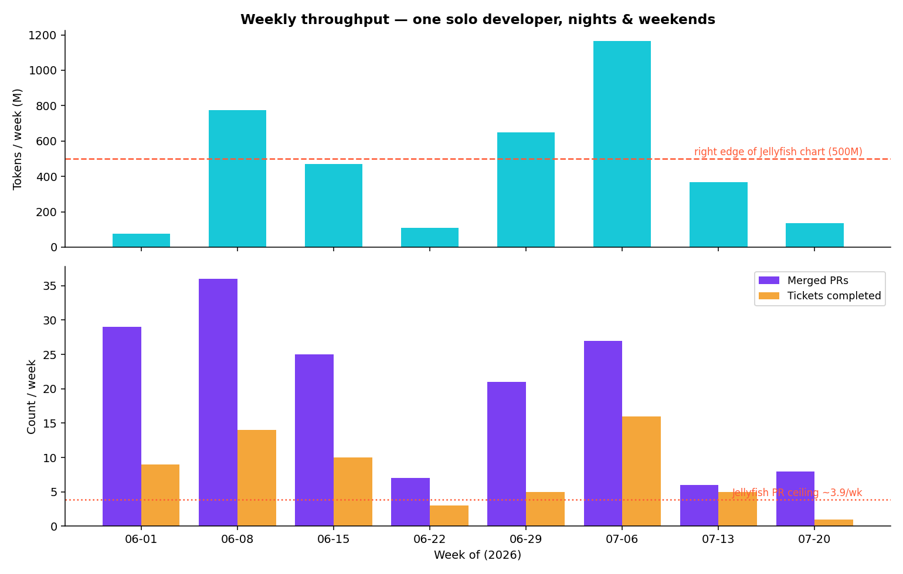
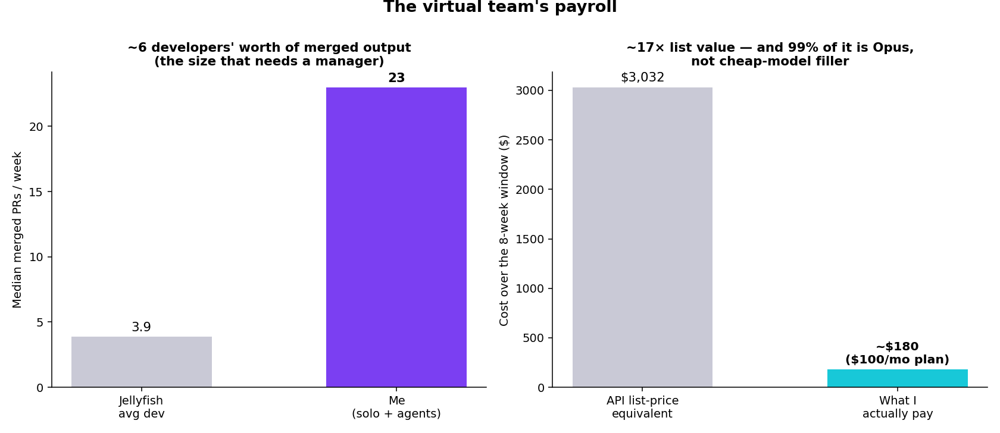

# Two Headwinds of AI Development. And Then There's Me.

*A solo, after-hours look at agent orchestration — and why the "diminishing returns" plateau is really a Coordination Tax.*

**Date:** 2026-07-23 · **Author:** Jared Rand · **Data:** my own Claude Code token logs (ccusage), merged PRs (GitHub), completed tickets (Linear), June–July 2026.

---

Jellyfish published a chart I can't stop thinking about. They plotted ~1 million developer-weeks of Cursor and Claude Code usage — tokens spent per week against merged PRs shipped per week — and found two "headwinds":

1. **The Agentic Barrier (~50M tokens/week).** Below it you're doing interactive, autocomplete-style coding. Above it you've handed real work to autonomous agents.
2. **Diminishing returns.** Past the barrier the curve bends over and flattens toward **~4 merged PRs per developer per week**. Spend more tokens, get almost nothing extra.

I run a solo, nights-and-weekends Skillenai side project with a fleet of Claude Code agents. Out of curiosity I dropped my own weekly numbers onto their axes. I did not land on the curve. I landed in a different room of the building.

## Where I land

Over the eight weeks with token data (Jun 1 – Jul 20 2026):

| Metric | Jellyfish population | Me (solo + agents) |
|---|---|---|
| Median tokens / week | *(chart tops out at 500M)* | **419M** |
| Peak tokens / week | 500M (right edge) | **1.17B** (2.3× off the chart) |
| Median merged PRs / week | curve ceiling ~**3.9** | **23** |
| Best week | — | **36 PRs** |

My *median* week sits about **6.4× above** the curve's PR ceiling, and my peak token week is **2.3× past the right edge** of their chart entirely. Even my two quietest weeks (6 and 8 PRs) clear the top of their plot.

## The weekly reality

This isn't one heroic week cherry-picked. It's the steady state: most weeks land 20–36 merged PRs and 5–16 completed tickets, across **six repositories** — a Fargate backend, a data pipeline, a public API/plugin set, and this notebooks repo. In a company, that surface area is three or four teams.

Full window (Apr–Jul), the merged-PR count is **573** across those six repos. The tickets are an independent, coarser tracker of *units of work finished*, and they move with the PRs — which is the point: this isn't PR-splitting inflating a vanity metric.

## Why the plateau doesn't bind me

Here's the claim I'll actually defend: **the Jellyfish curve flattens because of coordination, and I don't pay for any.**

In an earlier Skillenai analysis I looked at how engineering orgs spend their marginal effort and found that coordination is nearly invariant — roughly **7–9 engineers per manager** at big tech, a bit higher at AI labs — and that most of it gets *badged* as engineering management, TPM, and product-owner headcount rather than shown as overhead. The bigger the team, the larger the share of every additional hour that goes into standups, handoffs, review queues waiting on other humans, alignment meetings, and keeping N people's mental models in sync. That's the Coordination Tax, and it's exactly the kind of cost that makes an output curve bend over: you add capacity, but capacity gets eaten by the friction of using it together.

A solo human plus a fleet of agents has a **span of control of zero.** The agents *are* the team, and they need no coordinating with each other. There is no standup, no PM handoff, no cross-team dependency, no PR sitting for two days waiting on a reviewer who's in a different timezone. The marginal token goes almost entirely into *work*, not into *coordinating the work*. So the thing that flattens team output simply isn't present.

Note what this argument is **not**: it's not "the model is superhuman." If the plateau were a model-capability ceiling, it would bind me too — and it doesn't. I'm at 23, not 4. Whatever separates me from the Jellyfish population isn't the model; it's the org chart.

## The economics

Two numbers make the "virtual team" framing concrete:

- **~6 developers' worth of merged output.** 23 PRs/week ÷ 3.9 (the Jellyfish per-dev ceiling) ≈ **5.9**. That's precisely the team size at which span-of-control says you'd hire a manager. I get the throughput of that team and skip both the team *and* its manager.
- **A payroll of ~$100/month.** ccusage prices my usage at **$3,032** over the eight weeks — but that's the *API list-price equivalent*, not what I pay. I'm on a **$100/month Claude subscription**, so my real out-of-pocket for the window is roughly **$180**. The subscription delivers about **17× its list value**.

And this is not cheap-model output: **98.9% of my tokens and 99.6% of the cost are Opus** (almost entirely Opus 4.8). It's premium-model work, not haiku/sonnet filler run up to pad a token count. (For the curious: **96.9% of tokens are cache reads**, billed at ~1/10 the input rate — that discount is already baked into the $3,032. Priced without caching, the list number would be roughly $50K.)

### The subscription is the actual enabler

Over this window, $100/month buys roughly **$1,700/month of API-list-equivalent usage** — a subsidy the orchestration workflow depends on. Metered per-token, an 8-week orchestration run at these volumes would cost thousands, and I'd throttle myself into the "interactive coding" band on instinct. The flat subscription removes the meter, and removing the meter is what lets you leave a fleet of Opus agents running against large contexts without flinching.

This is, honestly, why I switched from Cursor to Claude Code. Cursor's pricing is usage-based — and it more or less *has* to be, because it pays third-party model vendors per token, so every token you spend is a token it owes upstream. (Even its move toward in-house models is, in part, an attempt to escape that pass-through.) A subscription that eats the token cost can only exist when the vendor also owns the model. That pricing structure — not any single feature — is what makes "just let the agents run" a rational default instead of a budget decision. The plateau on the Jellyfish chart is partly coordination; the reason *anyone* can reach the right side of that x-axis at all is partly which pricing model they're on.

## Honest caveats

I'd rather state these than have you find them:

- **What "tokens" means.** ~97% of my token volume is cache reads — the agents re-reading large contexts. On a *billable-non-cache* definition, my weekly input+output is only ~0.5–6M, which would put me on the far **left** of the chart, in "interactive coding." I read Jellyfish's axis as total throughput (their 50M starting point is unreachable otherwise), but the metric is doing real work in this comparison and you should know which one it is.
- **PR granularity.** A large share of these PRs are authored by agents inside orchestrated flows. They're plausibly finer-grained than a human's hand-written PR, so "23 PRs" is a statement about *merged throughput*, not 23 acts of individual genius. The tickets number is the more conservative read.
- **The tax buys something.** Coordination isn't pure waste. It buys shared context, mutual error-catching, and institutional memory. A solo+agents setup skips the tax partly by skipping what it pays for — which is fine for a side project and *not* fine for a bank.
- **n = 1.** One person, eight weeks, one setup. This is a demonstration, not a study.

## Methodology & sources

- **Tokens/cost:** [`ccusage`](https://github.com/ryoppippi/ccusage) parsing local Claude Code transcripts, aggregated by ISO week (Monday start). "Total tokens" = input + output + cache-read + cache-creation. Cost is ccusage's API-list-price equivalent with cache discounts applied; it is **not** what I pay. Token data reliably covers June onward (earlier local transcripts are pruned).
- **Merged PRs:** GitHub search for merged PRs I authored across the six repos, deduped, bucketed by merge date into Monday weeks.
- **Tickets:** issues transitioned to a completed state, bucketed by completion date. Reported as aggregate weekly counts only.
- **Jellyfish curve:** reconstructed as `y = 0.78·ln(x) − 11.9` to match the published chart; used only as a visual reference. The base chart and the 1M-developer-week dataset are Jellyfish Research's.
- **Reproduce:** [`make_figures.py`](make_figures.py) + [`weekly_data.json`](weekly_data.json).

## Takeaways

1. **The plateau is org structure, not model capability.** A curve built from team-embedded developers measures coordination drag as much as it measures the tool.
2. **A solo builder with agents can operate several teams' worth of surface area** — because the coordination that would normally cap that output isn't there to cap it.
3. **The unit economics are absurd in the good direction:** ~6 developers of throughput, on premium Opus, for the price of a gym membership.
4. **Pricing model is a capability.** A flat subscription that eats the token cost — which really only works when the vendor owns the model — is what makes "let the agents run" the default. Metered per-token, you self-throttle back down the curve.
5. **Know what you're giving up.** Zero coordination is a feature for a side project and a liability for anything that needs a second pair of human eyes. The trick is knowing which one you're building.

---

*Reference: [Jellyfish Research, "Two Headwinds of AI Development"](https://jellyfish.co/).*
