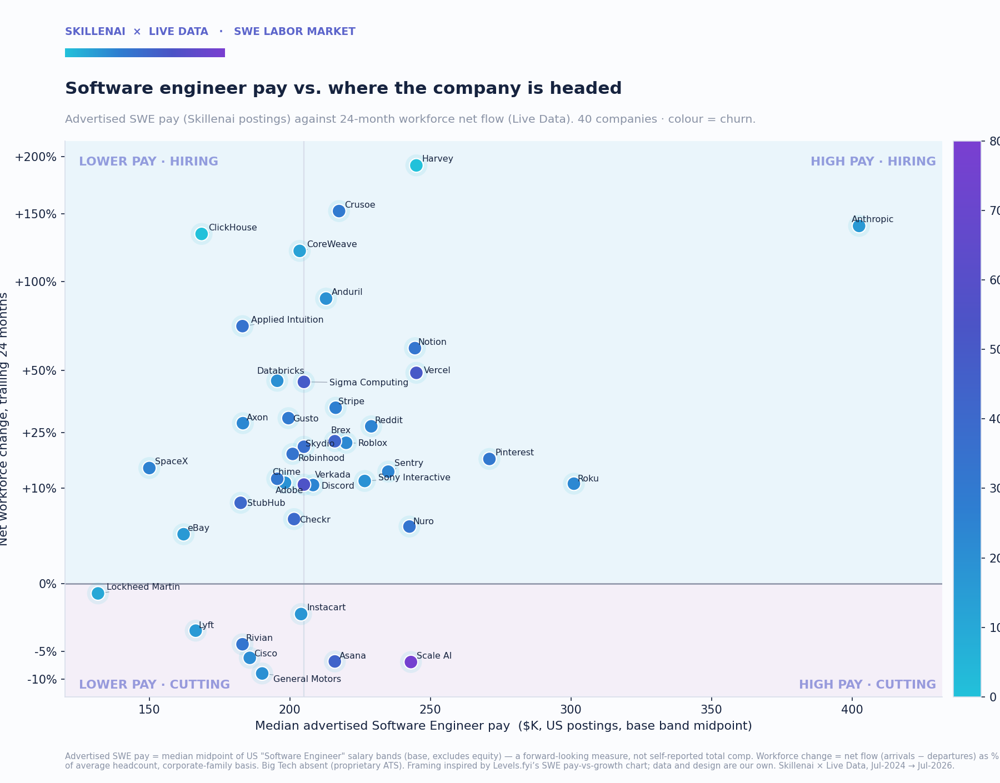
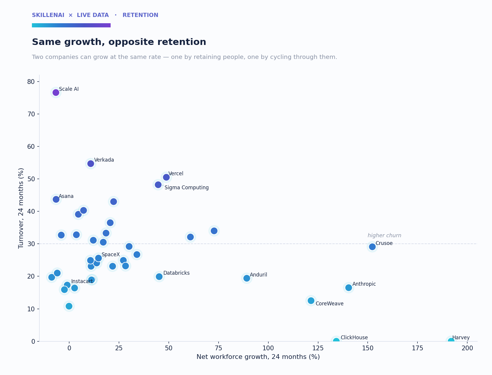
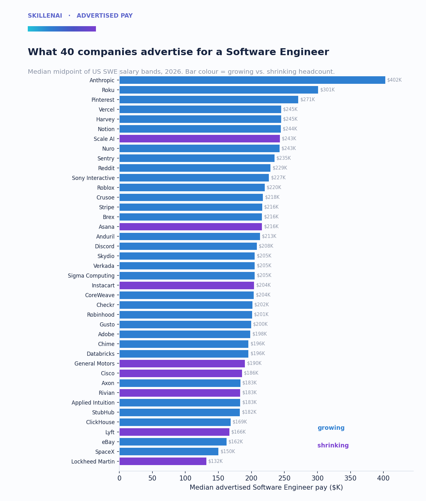

# Software engineer pay vs. company trajectory: an independent map of 40 employers (2026)

**Skillenai × Live Data · advertised software-engineer pay vs. company workforce trajectory · analysis date 2026-07-06**

The team at **[Levels.fyi](https://www.levels.fyi/)** recently shared a chart — *"Where should I work as a SWE in 2026?"* — plotting senior-SWE total compensation against how much each company had grown or cut over the trailing 24 months, using Levels.fyi for pay and Layoffs.fyi + SEC filings for headcount. Their point was sharp and, we think, correct: **in a volatile market, the offer number on its own stopped being enough to answer "where should I go?"**

We wanted to see whether that conclusion holds up when you rebuild the picture from *completely different data* — and whether a couple of extra signals we happen to have can extend it. This is a companion to their work, not a correction of it. Where they used self-reported total compensation, we use **live job-posting salary bands**; where they used discrete layoff events, we use **continuous month-by-month workforce flow**. Two independent lenses on the same question.

Short version: **their central claim survives the switch of data sources intact.** Advertised pay and company trajectory turn out to be roughly independent — the pay number really doesn't tell you whether a company is growing or shrinking. And a third axis we can add, **turnover**, splits companies that look identical on a growth chart into "durable growth" and "hire-and-replace."

---

## What's different about our two measurements (read this first)

This is **not** a reproduction of Levels' numbers, and it shouldn't be read as one:

- **Pay = advertised, not total comp.** Our x-axis is the **median midpoint of advertised US "Software Engineer" salary bands** from job postings (base salary bands; **excludes equity, bonus, and self-reported figures**). Levels measures self-reported *total* compensation including equity. So our Anthropic (~$402K) and Levels' Anthropic (~$800K TC) are measuring different things. What's striking is that the **rank order is preserved** — Anthropic tops both charts — which is a nice cross-validation of two very different collection methods. But do not compare the dollar *levels* between the charts; compare the *positions*.
- **Trajectory = continuous net flow, not a layoff flag.** Our y-axis is **net workforce flow (arrivals − departures) over 24 months, as a share of average headcount**, from Live Data's supply-side panel of professional profiles — measured on a **corporate-family basis** (e.g. Cruise counts within GM, Meraki within Cisco). Levels used a binary "did they run a layoff at all" rule.
- **Different company set.** Big Tech — Google, Meta, Amazon, Microsoft, Nvidia, Netflix, Intel, Oracle, IBM — is **absent from our pay axis** because those firms hire through proprietary applicant systems we don't index (fewer than 15 salaried US SWE postings each). So we cannot reproduce the newsworthy Intel/Oracle/IBM bottom-left corner (established names taking deep cuts). Our set skews toward **scale-ups and defense-tech** — the companies whose postings we see cleanly.

Everything below should be read as *directional positioning*, not precise pay estimation. Per-company posting counts range from 15 to ~500.

---

## The map

We split the map into four quadrants with plain labels: **high pay · hiring** (top-right), **lower pay · hiring** (top-left), **high pay · cutting** (bottom-right), **lower pay · cutting** (bottom-left). The vertical line is the median advertised SWE pay across the set (~$205K); the horizontal line is zero net change.

### Finding 1 — Pay barely predicts trajectory

Across 40 companies, the correlation between advertised SWE pay and 24-month workforce change is **weak and not robust** (Spearman ρ = 0.29, p = 0.07; drop the single outlier Anthropic and it falls to ρ = 0.24, p = 0.15 — indistinguishable from zero). In plain terms: **knowing what a company advertises for a software engineer tells you almost nothing about whether that company is growing or shrinking.** That is exactly the spirit of Levels' original point, now visible in a second, independent dataset. The information is in *where a company sits on the map*, not in the pay number alone.

### Finding 2 — The top of the market has no trade-off (Anthropic)

**Anthropic sits alone in the top-right corner:** the highest advertised SWE pay in the set (~$402K midpoint, versus ~$301K for the next company) *and* +140% headcount growth over 24 months, at a low 16% turnover. The richest offer in our data is also attached to the fastest-growing, best-retaining company. Whatever the pay-vs-stability tension is, it does not bind at the very top right now — the AI leaders are paying the most and hiring the hardest at the same time.

### Finding 3 — High pay, shrinking headcount: the Scale AI case

The high-pay / shrinking corner is where a job-seeker most needs the second number. In our data the standout is **Scale AI**: top-three advertised pay (~$243K) but **net −7% headcount** and the **highest turnover in the entire set (77%)**.

We checked whether that churn was just a labeling artifact of the mid-2025 Meta stake — i.e. staff flipping their profile from Scale AI to Meta — and it isn't. Tracing where Scale AI's leavers actually went (447 with a recorded next employer), **Meta is only the single largest destination at ~9%**; the other ~91% scattered across frontier labs that had been Scale's customers (xAI, Anthropic, OpenAI, Google, Amazon) and a swarm of rival data-labeling startups (Mercor, micro1, Snorkel AI, Turing, Appen, Welo). No single destination cracks 10%. So the turnover is a **genuine post-deal unwinding**: the Meta stake spooked Scale's customers, its business contracted, and talent dispersed to the competitors who picked up the displaced work. On pay alone Scale AI looks like a top destination; on trajectory and churn it's the clearest case in the set of an offer number and a company's direction pointing opposite ways.

### Finding 4 — The turnover axis Levels couldn't see

Because we measure continuous flow rather than a layoff flag, we can add a dimension the original chart couldn't: **churn**.

Growth and turnover are essentially uncorrelated (ρ = −0.13), which means **companies growing at the same rate can be doing it in completely different ways.** Compare two ~45% growers: **Databricks** (+45% net, 20% turnover — durable, retained growth) versus **Vercel** (+49% net, **50% turnover** — hire-and-replace). Same dot on a growth-only chart; very different places to spend three years of your career. The cleanest "durable growth" cluster (fast growth, low churn) is **Harvey, ClickHouse, CoreWeave, Anthropic, Anduril, Databricks**; the "growing but churny" pair is **Vercel and Sigma Computing**.

### Finding 5 — Legacy names drift down, new defense-tech climbs

Our lower-pay / shrinking corner holds the established names we *can* see: **General Motors (−9%), Cisco (−6%), Rivian (−4%), Lyft (−2%), Lockheed Martin (~0%)** — flat-to-shrinking trajectories (though these are shallow drifts, not the deep cuts the original chart showed for Intel/Oracle). Meanwhile a **new-defense / hard-tech cluster hires hard at mid-market pay**: **Anduril (+89%, $213K), Applied Intuition (+73%, $183K), Axon (+28%), Skydio (+21%), SpaceX (+15%, $150K)**. The contrast between old defense (Lockheed, flat) and new defense (Anduril, +89%) is one of the sharper stories on the map.

---

## Full data

| Company | Adv. SWE pay | SWE N | Net Δ 24mo | Turnover | Quadrant |
|---|--:|--:|--:|--:|---|
| Anthropic | $402K | 174 | +140% | 16% | High pay · hiring |
| Roku | $301K | 21 | +11% | 23% | High pay · hiring |
| Pinterest | $271K | 18 | +17% | 30% | High pay · hiring |
| Harvey | $245K | 35 | +192% | 0% | High pay · hiring |
| Vercel | $245K | 24 | +49% | 50% | High pay · hiring |
| Notion | $244K | 15 | +61% | 32% | High pay · hiring |
| Scale AI | $243K | 39 | -7% | 77% | High pay · cutting |
| Nuro | $243K | 29 | +4% | 33% | High pay · hiring |
| Sentry | $235K | 17 | +14% | 24% | High pay · hiring |
| Reddit | $229K | 23 | +27% | 25% | High pay · hiring |
| Sony Interactive | $227K | 15 | +12% | 19% | High pay · hiring |
| Roblox | $220K | 22 | +22% | 23% | High pay · hiring |
| Crusoe | $218K | 24 | +152% | 29% | High pay · hiring |
| Stripe | $216K | 19 | +34% | 27% | High pay · hiring |
| Asana | $216K | 22 | -7% | 44% | High pay · cutting |
| Brex | $216K | 17 | +22% | 43% | High pay · hiring |
| Anduril | $213K | 495 | +89% | 19% | High pay · hiring |
| Discord | $208K | 64 | +11% | 25% | High pay · hiring |
| Sigma Computing | $205K | 88 | +45% | 48% | High pay · hiring |
| Verkada | $205K | 37 | +11% | 55% | High pay · hiring |
| Skydio | $205K | 15 | +21% | 36% | High pay · hiring |
| Instacart | $204K | 24 | -1% | 17% | Lower pay · cutting |
| CoreWeave | $204K | 38 | +122% | 12% | Lower pay · hiring |
| Checkr | $202K | 15 | +5% | 39% | Lower pay · hiring |
| Robinhood | $201K | 22 | +18% | 33% | Lower pay · hiring |
| Gusto | $200K | 26 | +30% | 29% | Lower pay · hiring |
| Adobe | $198K | 42 | +11% | 19% | Lower pay · hiring |
| Databricks | $196K | 129 | +45% | 20% | Lower pay · hiring |
| Chime | $196K | 29 | +12% | 31% | Lower pay · hiring |
| General Motors | $190K | 33 | -9% | 20% | Lower pay · cutting |
| Cisco | $186K | 78 | -6% | 21% | Lower pay · cutting |
| Axon | $183K | 31 | +28% | 23% | Lower pay · hiring |
| Applied Intuition | $183K | 55 | +73% | 34% | Lower pay · hiring |
| Rivian | $183K | 15 | -4% | 33% | Lower pay · cutting |
| StubHub | $182K | 27 | +7% | 40% | Lower pay · hiring |
| ClickHouse | $169K | 15 | +134% | 0% | Lower pay · hiring |
| Lyft | $166K | 19 | -2% | 16% | Lower pay · cutting |
| eBay | $162K | 23 | +3% | 16% | Lower pay · hiring |
| SpaceX | $150K | 172 | +15% | 26% | Lower pay · hiring |
| Lockheed Martin | $132K | 25 | -0% | 11% | Lower pay · cutting |

*Turnover shown as 0% for Harvey and ClickHouse reflects **no departures recorded in the panel** for these very young, recently-scaled companies — read it as "too new to have measurable attrition," not literally zero.*

---

## Methodology

**Pay (x-axis) — Skillenai job-posting index.** Median of the per-posting midpoint `(salaryMin + salaryMax)/2` for postings with `role = "Software Engineer"`, `salaryCurrency = USD`, US location, and both salary bounds present. Company variants were merged to a single canonical entity (e.g. three "Anduril" spellings; two "CoreWeave"). We report all-seniority medians for sample size; a senior-only slice (senior/staff/principal) tracks them closely for most companies. Known spam employers were excluded.

**Trajectory (y-axis) — Live Data supply-side panel.** Arrivals and departures for each company (job status = any, so departures are counted) aggregated over 2024-07-01 → 2026-07-01, on a corporate-family basis. **Net change** = arrivals − departures; **growth** = net change ÷ average headcount over the window (a symmetric rate, which behaves well for companies that were near-zero in the panel at the start). **Turnover** = departures ÷ average headcount. These are panel-based sample measures: treat signs and relative magnitudes as the signal, not absolute counts.

**Correlations** use Spearman's ρ (rank-based, robust to the skew in both axes), with an outlier-sensitivity check.

### Limits and honest caveats
- Advertised base bands ≠ total compensation; **do not compare dollar levels to Levels.fyi**, only positions.
- Big Tech and other proprietary-ATS employers are absent from the pay axis; the set is scale-up / defense-tech heavy.
- Per-company posting counts are small (15–500); positions are directional.
- Corporate-family consolidation folds subsidiaries into parents (e.g. Cruise → GM); a few small subsidiary attributions are approximate.
- A handful of companies were dropped for insufficient or unreliable panel coverage.
- The supply-side panel is a sample of professional profiles with update lag; very young companies can show artificially low departures.

---

## Credit

The framing, the quadrants, and the original question are **Levels.fyi's** — this is an independent corroboration and extension built on top of their idea, using live job-posting pay data (Skillenai) and supply-side workforce flow (Live Data). If the pay-vs-stability question interests you, their interactive chart and data explorer are the place to start.
