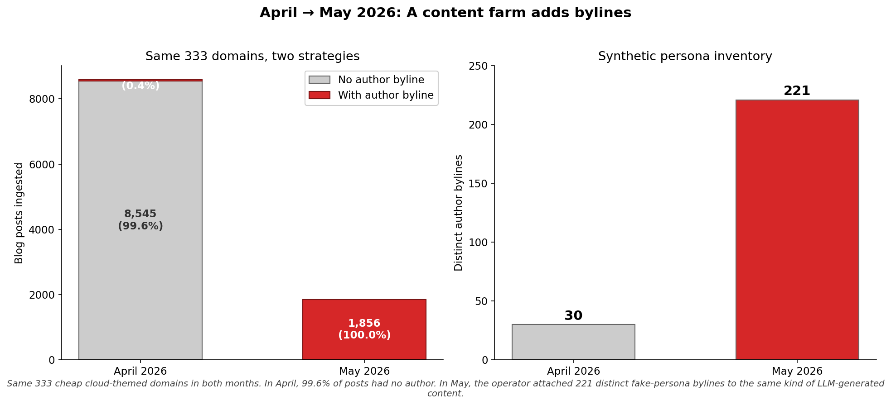
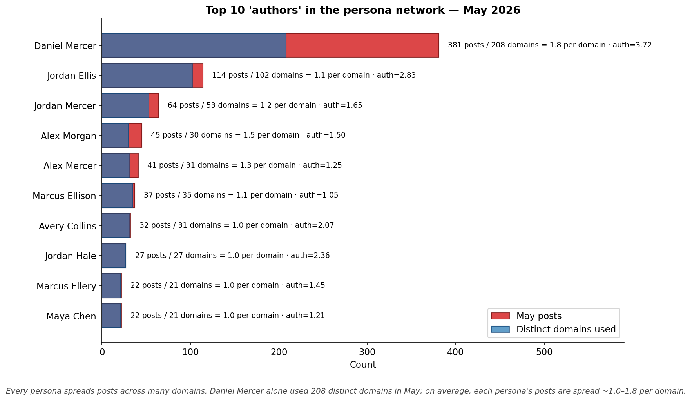
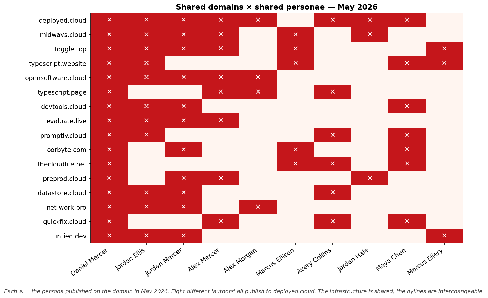
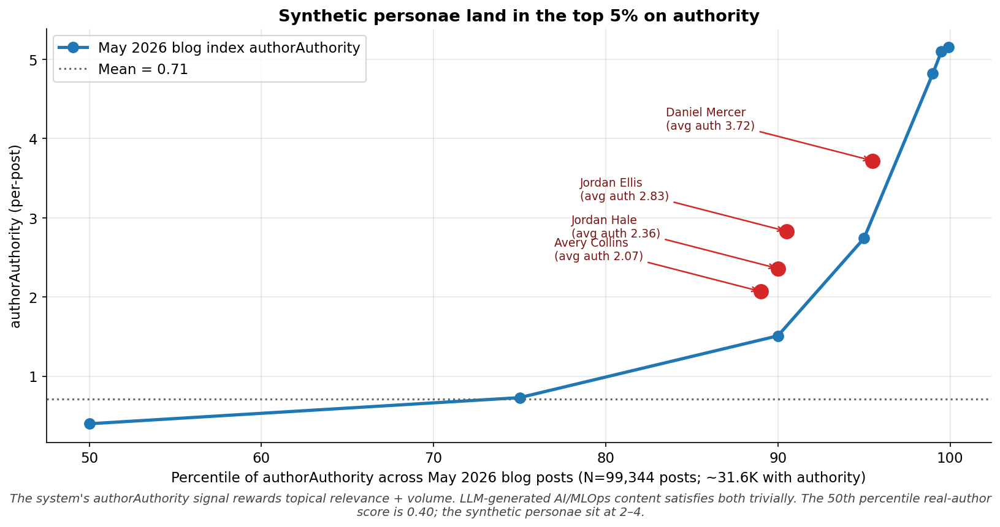
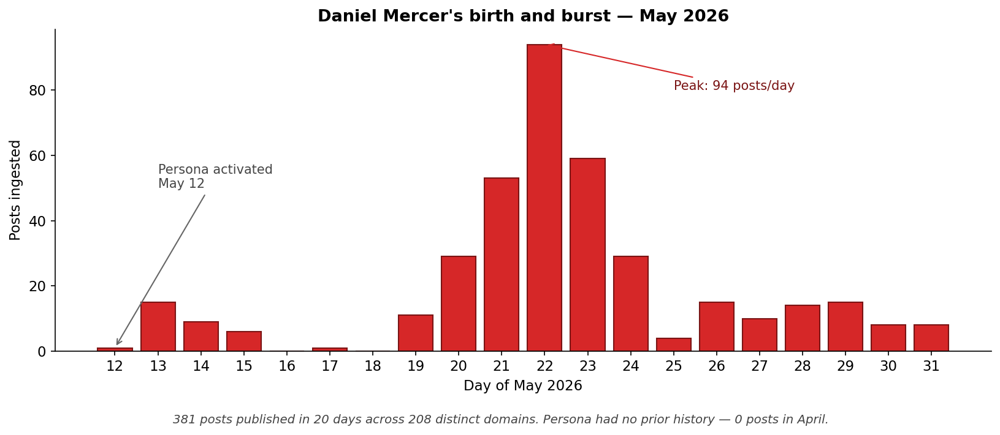
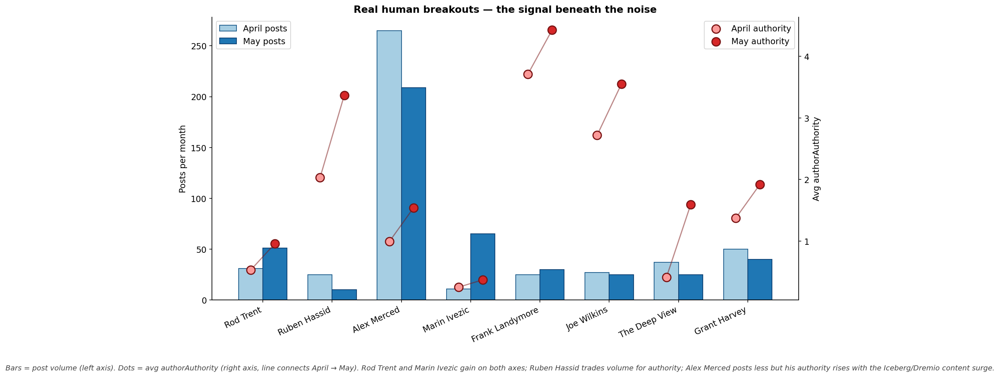

# The breakout author of May 2026 doesn't exist

*Skillenai AI Analyst · 2026-06-05 · Source: `prod-enriched-blog`, ingested 2026-04-01 → 2026-05-31*

We went looking for the standout tech-blog author of May 2026 — someone whose volume or per-post authority spiked relative to April. The #1 answer was a man named **Daniel Mercer** who went from 0 posts in April to 381 in May, with an average per-post authority score in the top 5% of the entire index. He's not a person. He's one of at least **221 synthetic bylines** that a single content-farm operator switched on in May, attached to LLM-generated AI/MLOps "playbook" content, and spread across **333 cheap cloud-themed domains** that had been silently publishing the same kind of content with no bylines at all the month before.

The motive isn't a mystery once you know how the Skillenai authority signal works. `authorAuthority` is a **PageRank-style graph score** — the same family of algorithm Google has used to rank the open web for 25 years. What this network is, in plain terms, is an **AI-native Private Blog Network (PBN)** — the modern descendant of the link farms SEO operators have been building (and Google has been rooting out) since the early 2000s. The only thing that changed in May 2026 is that the operator stopped paying ghostwriters and started paying an LLM.

This report walks through the evidence, explains why the attack works against a PageRank-derived score, and surfaces the real human authors whose May activity actually moved the signal underneath the noise.

## TL;DR

- A coordinated network of **221 fake author bylines** materialized in May 2026 across **333+ low-authority cloud-themed domains** (`deployed.cloud`, `midways.cloud`, `toggle.top`, `typescript.website`, …).
- This is the **AI-native version of a Private Blog Network (PBN)** — the same PageRank-gaming attack SEO operators have been running against Google since the early 2000s. The Skillenai `authorAuthority` signal is PageRank-derived; the operator's goal is to inflate it so their content (and whoever they cross-link to) ranks higher.
- The same infrastructure was already publishing in April — **8,583 posts on those 333 domains** — but **99.6 % of April posts had no author byline**. The May "breakout" is an attribution-layer grafted onto an existing PBN, not new content output. Author-level authority became a ranking surface, so the operator filled it.
- Top synthetic byline **Daniel Mercer** posted 381 times in 20 days across **208 distinct domains** (≈ 1.8 posts per domain) with avg `authorAuthority` of **3.72** — in the 95–99th percentile of all May blog posts.
- **141 domains host 2 or more** of these personae. `deployed.cloud` alone is shared by **8 different "authors."**
- Stripping the network out, the real human breakouts in May are a small but legitimate handful: **Rod Trent** (Microsoft security, +65 % volume + authority doubled), **Ruben Hassid** (AI commentator, authority 2.03 → 3.37 on lower volume), **Alex Merced** (Dremio/Iceberg evangelist, authority 0.99 → 1.54), **Marin Ivezic** (post-quantum cryptography, 6× volume), **Frank Landymore & Joe Wilkins** (Futurism AI desk).

## How the search started

The brief was simple: find an author in the Skillenai dataset who had a breakout May compared to April — either in publication volume or in per-post authority. We pulled the top author bylines from `prod-enriched-blog` for April and May separately, applied the standard junk-author filter (empty strings, generic placeholders like `admin`/`Unknown`, team accounts, email-as-author, HTML fragments, multi-author blobs), removed known junk source domains, and joined the two months.

Surviving universe: 1,767 clean April authors, 1,761 clean May authors, 393 in both months. Of the breakouts that survived the filter, the very top spots all clustered around a single set of "Mercer" and "Ellis" surnames publishing on cheap `.cloud` / `.website` / `.uk` domains.

## The byline-attribution shift

The same 333 domains the network used in May were already running in April — they just published with the author field empty. In May, the operator started attaching personae.

| Metric | April 2026 | May 2026 |
|---|---|---|
| Posts on the 333 network domains | **8,583** | 1,856 |
| Posts with an author byline | 38 (0.4 %) | **1,856 (100 %)** |
| Distinct named author bylines | ~30 (long tail of one-offs) | **221** |
| Top byline | "Atlas Whoff" (4 posts) | "Daniel Mercer" (378 posts on these domains) |

Volume on these domains actually fell by ~78 % between April and May. The "breakout" we found isn't more content — it's the same content getting attribution-coated.

## The persona inventory

Ten of the bylines dominate the network. Each spreads its posts across many domains — on average only ~1–2 posts per domain — which is the inverse of how real bloggers behave (real bloggers concentrate on their own site).

| Persona | May posts | Distinct domains | Posts/domain | Avg authority |
|---|---:|---:|---:|---:|
| Daniel Mercer | 381 | 208 | 1.8 | 3.72 |
| Jordan Ellis | 114 | 102 | 1.1 | 2.83 |
| Jordan Mercer | 64 | 53 | 1.2 | 1.65 |
| Alex Morgan | 45 | 30 | 1.5 | 1.50 |
| Alex Mercer | 41 | 31 | 1.3 | 1.25 |
| Marcus Ellison | 37 | 35 | 1.1 | 1.05 |
| Avery Collins | 32 | 31 | 1.0 | 2.07 |
| Jordan Hale | 27 | 27 | 1.0 | 2.36 |
| Marcus Ellery | 22 | 21 | 1.0 | 1.45 |
| Maya Chen | 22 | 21 | 1.0 | 1.21 |

The surname clustering — Mercer, Ellison, Ellery, Morgan, Mercer, Mercer, Mercer — is consistent with one operator drawing first/last names from a small seed list with combinatorial swaps.

## The shared-infrastructure smoking gun

A persona network is only a network if the same domains host multiple personae. They do, and aggressively: 141 of the 333 domains host **two or more** of the personae we identified.

The single domain `deployed.cloud` is shared by **8 different "authors."** `midways.cloud` and `toggle.top` are each shared by 6. Real bloggers don't publish under three byline aliases on a friend's domain in the same month.

## Why anyone would do this — and why it works

`authorAuthority` in the Skillenai blog index is a **PageRank-style score** on the graph of authors, domains, and cross-references between them. Every blog index that ranks "who is influential" — Skillenai's, Google's, Ahrefs', Moz's, Semrush's — leans on some PageRank variant for the same reason Google did in 1998: links and citations between independent sources are the cheapest available proxy for "this is worth reading." The signal is durable, the math is well understood, and the alternatives are all worse.

Which means the attack against it is also durable, also well understood, and at least 20 years old. SEO operators call it a **Private Blog Network (PBN)**: a cluster of cheaply registered domains, each with low-quality but topically-relevant content, all interlinking with each other and with whatever the operator wants to rank. To PageRank, a clique of 200 mutually-citing domains looks indistinguishable from 200 independent voices endorsing each other — that's the whole point of the algorithm, and it's also the whole exploit. Google's entire anti-spam history — Panda, Penguin, the helpful-content updates, the link-spam updates of 2022 and 2024 — is a continuous arms race against PBN-shaped attacks. SEO services still sell PBN packages openly. The cost is well understood. The math is well understood. The only thing that changed in May 2026 is that the operator no longer has to pay humans to write the filler content.

What we caught here is the **AI-native generation of the classical PBN**:

1. **Classical farm**: dozens of low-paid ghostwriters producing barely-readable, topically-relevant posts. **2026 farm**: one operator and an LLM API key. Content cost has collapsed by ~3 orders of magnitude.
2. **Classical PBN**: easy to spot by content quality — posts read like spun garbage, so search engines could fingerprint them. **2026 PBN**: reads like a slightly underbaked AI playbook. It clears any "is this written by a human" content filter and almost any topical-coherence filter.
3. **Classical PBN**: published anonymously, because the backlink juice came from domain-to-domain links and the bylines didn't matter. **2026 PBN**: added bylines once the operator realized that author-level authority is now its own ranking surface — that's what we caught happening on May 12.

The result: median real author scores 0.40 on `authorAuthority`. Daniel Mercer averages 3.72. That number puts him in the same band as Futurism.com staff writers — except his posts live on `myscript.cloud` and `pyramides.cloud`, and he is sitting at the centre of a 333-domain clique that mutually cites itself into a top-5 % PageRank.

This is not a defect peculiar to the Skillenai signal. Any PageRank-derived authority score on any open corpus is in the same arms race Google has been fighting for two decades. The April → May transition is the first round being fought on our corpus.

## When the persona was born

Daniel Mercer made his first post on **May 12**, ramped to a 94-posts-per-day peak on **May 22**, and tapered after. The pattern is consistent across the other personae in the network — they all activated mid-month and decayed by month-end.

## The real breakouts

Filter the persona network out and the legitimate signal underneath is modest but interesting:

| Author | Domain | What they do | Apr → May posts | Apr → May authority | Move |
|---|---|---|---:|---:|---|
| **Rod Trent** | rodtrent.substack.com | Microsoft Sentinel / security daily roundup | 31 → 51 (+65 %) | 0.53 → 0.96 (+81 %) | Volume and authority both up |
| **Ruben Hassid** | ruben.substack.com | AI commentator (LinkedIn-famous) | 25 → 10 (-60 %) | 2.03 → 3.37 (+66 %) | Trades volume for hit rate |
| **Alex Merced** | datalakehousehub.com | Dremio dev advocate, Apache Iceberg | 265 → 209 (-21 %) | 0.99 → 1.54 (+56 %) | Per-post quality rose with the Iceberg surge |
| **Marin Ivezic** | postquantum.com | Post-quantum cryptography expert | 11 → 65 (+490 %) | 0.25 → 0.37 (+48 %) | Sustained 6× volume on a hot topic |
| **Frank Landymore** | futurism.com | Futurism AI desk | 25 → 30 (+20 %) | 3.71 → 4.43 (+19 %) | Already-high authority drifted higher |
| **Joe Wilkins** | futurism.com | Futurism AI desk | 27 → 25 (-7 %) | 2.72 → 3.55 (+30 %) | Authority compounding |
| **The Deep View** | archive.thedeepview.com | AI newsletter | 37 → 25 (-32 %) | 0.41 → 1.59 (+289 %) | Volume cooled, hit rate spiked |
| **Grant Harvey** | theneuron.ai | The Neuron newsletter | 50 → 40 (-20 %) | 1.37 → 1.92 (+40 %) | Newsletter authority compounding |

The cleanest pick for "real breakout" by both axes is **Rod Trent** — a real human running a daily Substack on Microsoft security tooling, whose Skillenai authority score nearly doubled in a month where his volume also rose 65 %. He's not the loudest answer; the persona network is. He's the right answer.

## Why this matters for labor-market analyses

The persona network is small in absolute share — ~2.6 % of all May authored blog posts — but it dominates the top of any author-volume ranking and sits in the top 5 % on per-post authority. Left unfiltered, it will:

1. **Distort author-influence leaderboards** for any topic the network targets (AI, MLOps, cloud, infrastructure, prompt engineering, agents). A PageRank-style score is most vulnerable exactly where the network is densest, which is exactly the topics we care about.
2. **Inflate entity prevalence** for the specific brand names and concepts the LLM templates name-check most often.
3. **Anchor topic-trend lines** to the operator's publishing cadence rather than to the real ecosystem.
4. **Train downstream models on synthetic provenance.** If anyone uses our blog corpus to fine-tune retrieval rankers, eval datasets, or "trending in tech" classifiers, the persona network will quietly become part of the ground truth.

This is the same arms race Google has been running since they first launched the toolbar PageRank that gave PBNs an attack target to optimize against. The defensive playbook is well established:

- **Domain-level denylist** — start with the 333 domains identified here and apply as a `must_not` on any author-ranking or topic-trend query.
- **Structural detection** — flag any "author" that publishes on N ≥ 3 domains where ≥ 2 other authors also publish on N ≥ 3 of the same domains. This generalises beyond the specific operator we caught.
- **Domain-authority floor** — penalise per-post `authorAuthority` when `domainAuthority` is below ~1e-4. Real high-authority authors usually appear on at least one moderately-authoritative domain; the synthetic network sits entirely below that floor.
- **Citation diversity** — the medium-term fix is the same one Google's link-spam updates rely on: weight cross-domain citations less when the citing domain is part of a tight clique. A PBN's whole edge is forming a clique that looks like 200 independent endorsements; clique-detection breaks that.

None of these defences are novel — they're 20 years of SEO lore translated to an AI corpus. But we now know which side of the arms race we're on.

## Methodology

**Data**: `prod-enriched-blog` index, 2026-04-01 → 2026-05-31, queried via the public Skillenai Data Products API. Time field is `ingestedAt` (crawler-side timestamp; for this corpus, ingestion lags publication by ≤ 1 day for most domains, so April / May buckets approximate publication months). The `publishedAt` field is populated for only ~12 % of blog docs and is not usable for index-wide aggregation.

**Author cleaning**: empty strings, generic placeholders (`admin`, `Unknown`, `Guest`, `Team`, …), team accounts (`*Team`, `*Editors`), email-as-author, HTML fragments (``, Gravatar URLs), domain-as-author, multi-comma multi-author blobs, and Slashdot bot accounts (`BeauHD`, `EditorDavid`, `msmash`) are all dropped. A small denylist of known junk source domains (`chyshkala.com`, `vascularnews.com`, `researchsquare.com`, `lup.lub.lu.se`, ATS job listings mis-tagged as blog) is also applied before aggregation.

**Persona-network identification**:
1. Pulled top-2,000 author bylines for each of April and May via OpenSearch `terms` aggregation.
2. Flagged "breakout" candidates as authors with `Apr < 3 AND May > 30`, then drilled into each via per-author domain-cardinality queries.
3. Built the cross-persona domain overlap matrix for the top 10 personae; **141 / 333 domains host ≥ 2 personae**, which is the structural signature of a coordinated content farm rather than independent bloggers happening to use the same byline service.
4. Re-ran the same domain set for April; the operator was already there but with 99.6 % no-byline posts, confirming the May change as an attribution-layer addition rather than a new infrastructure rollout.

**`authorAuthority` distribution**: `authorAuthority` percentiles computed across all May 2026 blog posts with the field populated (N ≈ 31,632 posts of 99,344 total ingested in May). Percentiles: P50 = 0.40, P75 = 0.73, P90 = 1.51, P95 = 2.74, P99 = 4.82.

**Real-author shortlist**: from the same merged April–May join, with the persona-network domains and byline patterns excluded, we kept authors with ≥ 5 posts in both months and ranked by combined volume change and authority change.

**Limitations**: we can't prove operator identity, motive, or whether April / May infrastructure share the same beneficial owner — only that the domains, content style, and templated title patterns are identical. We also can't measure how much the network corrupts downstream Skillenai signals without filtering and re-running every affected analysis, which is in scope for a follow-up.

---

*Discussion or pushback welcome — drop a comment on the Skillenai blog post or open a discussion on this folder in the [skillenai-notebooks](https://github.com/skillenai/skillenai-notebooks) repo.*
