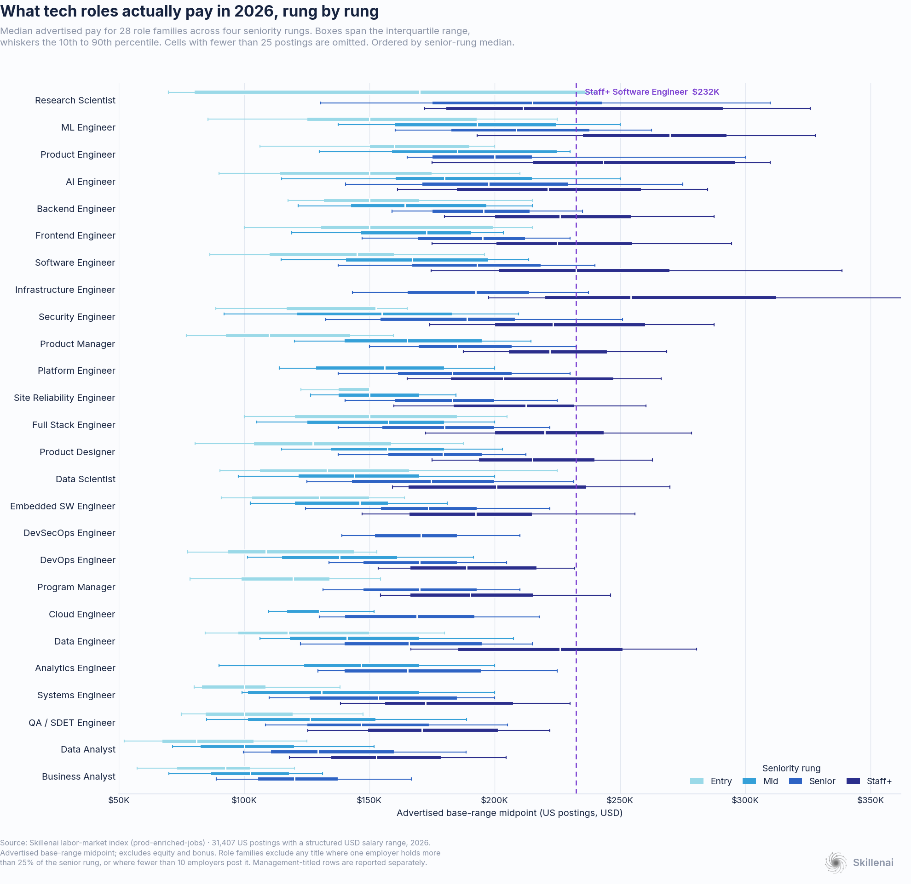
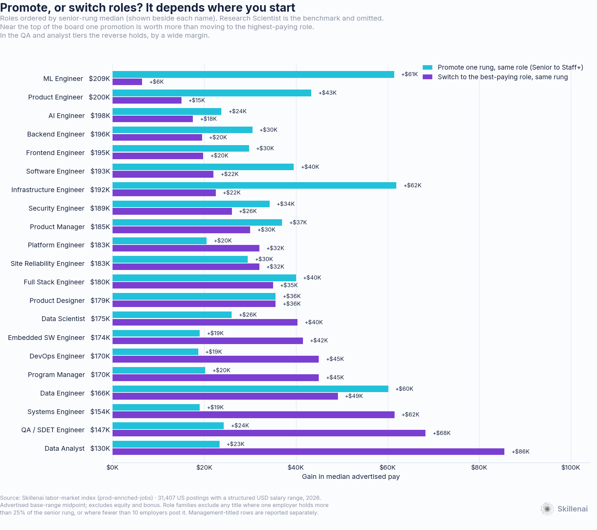
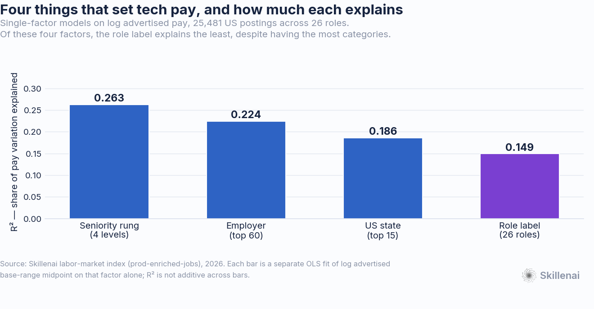

# Which tech role pays the best in 2026?

**ML and AI research roles top the board. But the gap between them and a plain software engineer is about $16K — and the gap between a mid and a staff engineer doing the same job is $65K.**

- **Date**: 2026-09-10 (revised 2026-09-11 — see *Revisions*)
- **Source**: Skillenai labor-market index (`prod-enriched-jobs`), US postings
- **Scope**: 62,805 US postings carrying a structured USD salary range; 31,407 of them across the 26 role families that clear the gates below
- **Measure**: midpoint of the advertised base range. **Excludes equity and bonus.**

---

## TL;DR

1. **Research Scientist ($215K) and ML Engineer ($209K) lead at the senior rung** — and they are *not* statistically separable from each other (Mann-Whitney p = 0.83, bootstrap CI on the median difference spans zero). AI Engineer is 4th at $198K.
2. **The ML Engineer premium over Software Engineer is real but modest: +$16K** (+8.1% with rung and state controlled). It survives every robustness check, including a within-employer paired test.
3. **The top of the board is compressed.** Ranks 1 through 13 span $215K down to $180K — a $35K band covering most of the engineering job market. The full 26-role board spans $95K.
4. **One rung is worth about three role switches.** A senior software engineer moving to staff gains **+$40K**; mid to staff gains **+$65K**. Switching to the single best-paying role at the same rung gains **+$22K**.
5. **There are two cliffs below the engineering tier, not one.** QA / SDET sits **$46K** below Software Engineer at the same rung, and Data Analyst **$63.5K** below. Both are large effects (rank-biserial −0.543 and −0.685). No engineer-vs-engineer gap is close.
6. **Whether to promote or switch depends entirely on where you start.** Promotion wins for 11 of 21 roles — the well-paid ones. In the QA and analyst tiers, switching is worth two to four times a promotion.
7. **Eleven titles could not be measured honestly** — eight because a single employer owns them in our index, three because the bucket is not comparable to the rest of the board.

---

## 1. The leaderboard

Senior rung only, so nothing here is a seniority-mix artifact.

| # | Role | Median | 95% CI | n | Employers | Top employer |
|---|---|---:|---|---:|---:|---:|
| 1 | Research Scientist | **$215K** | $200K–$222K | 265 | 85 | 19% |
| 2 | ML Engineer | **$209K** | $205K–$213K | 529 | 229 | 11% |
| 3 | Product Engineer | **$200K** | $192K–$209K | 68 | 47 | 6% |
| 4 | AI Engineer | **$198K** | $193K–$206K | 164 | 109 | 6% |
| 5 | Backend Engineer | **$196K** | $192K–$200K | 383 | 194 | 8% |
| 6 | Frontend Engineer | **$195K** | $190K–$200K | 180 | 121 | 10% |
| 7 | Software Engineer | **$193K** | $192K–$194K | 5,855 | 1,498 | 8% |
| 8 | Infrastructure Engineer | **$192K** | $182K–$200K | 121 | 86 | 7% |
| 9 | Security Engineer | **$189K** | $180K–$190K | 422 | 207 | 8% |
| 10 | Product Manager | **$185K** | $183K–$190K | 458 | 262 | 3% |
| 11 | Platform Engineer | **$183K** | $178K–$195K | 145 | 103 | 5% |
| 12 | Site Reliability Engineer | **$183K** | $178K–$190K | 319 | 145 | 10% |
| 13 | Full Stack Engineer | **$180K** | $175K–$185K | 595 | 334 | 3% |
| 14 | Product Designer | **$179K** | $175K–$184K | 458 | 275 | 3% |
| 15 | Data Scientist | **$175K** | $167K–$178K | 666 | 352 | 3% |
| 16 | Embedded SW Engineer | **$174K** | $170K–$180K | 279 | 94 | 18% |
| 17 | DevSecOps Engineer | **$171K** | $160K–$180K | 62 | 33 | 21% |
| 18 | DevOps Engineer | **$170K** | $165K–$172K | 224 | 129 | 4% |
| 19 | Program Manager | **$170K** | $162K–$179K | 73 | 43 | 12% |
| 20 | Cloud Engineer | **$169K** | $160K–$174K | 66 | 39 | 8% |
| 21 | Data Engineer | **$166K** | $162K–$170K | 435 | 278 | 3% |
| 22 | Analytics Engineer | **$165K** | $154K–$180K | 88 | 62 | 7% |
| 23 | Systems Engineer | **$154K** | $148K–$160K | 725 | 235 | 13% |
| 24 | QA / SDET Engineer | **$147K** | $138K–$153K | 234 | 136 | 9% |
| 25 | Data Analyst | **$130K** | $123K–$140K | 187 | 116 | 5% |
| 26 | Business Analyst | **$120K** | $120K–$125K | 132 | 82 | 9% |

The compression matters as much as the ranking. Thirteen roles sit inside a $35K band, and several adjacent pairs have overlapping confidence intervals that should be read as ties rather than as a ranking — Platform Engineer and Site Reliability Engineer are both $183K, and Research Scientist and ML Engineer cannot be separated at all.

### Is the ML Engineer premium real?

This is the one role-level premium robust enough to state plainly. Against Software Engineer at the senior rung:

| Check | ML Engineer | Software Engineer | Gap |
|---|---:|---:|---:|
| All postings | $209K | $193K | **+$16K** |
| Excluding its top employer | $205K | $192K | +$12K |
| California only | $231K | $205K | +$26K |
| **Within-employer paired** (37 employers posting both) | — | — | **+$12.7K** |

The paired test is the one that counts: across the 37 employers that post both roles at the senior rung with at least 3 postings each, ML Engineer pays more at **25 of 37** (Wilcoxon signed-rank p = 0.0006). That is a second, independent instrument agreeing with the first, so we state it as a finding rather than a measurement.

Mann-Whitney on the pooled comparison: p = 9.3e-26, median difference +$15.6K, bootstrap 95% CI [+$12.0K, +$20.8K].

---

## 2. The rung outweighs the label

For a senior software engineer, the arithmetic is stark:

| Move | Gain |
|---|---:|
| Promote to Staff+, same role | **+$40K** |
| Mid to Staff+, same role | **+$65K** |
| Switch to the best-paying role at the same rung | +$22K |
| Switch specifically to ML Engineer | +$16K |

One rung is **3.0x** the best available role switch.

But this reverses at the bottom of the board, and the chart above shows exactly where. Promotion beats switching for 11 of 21 roles — and they are the 11 best-paid ones. For a Data Analyst, a promotion is worth +$23K while moving into the best-paying role is worth **+$86K**; for a QA / SDET engineer the same comparison is +$24K against +$68K. Median across all roles: +$30K to promote, +$32K to switch. Pooled it is a coin flip; the useful signal is entirely in *which* roles fall on which side.

### The full ladder

| Role | Entry | Mid | Senior | Staff+ | Entry to Staff+ |
|---|---:|---:|---:|---:|---:|
| Research Scientist | $170K | — | $215K | $211K | **+41K** |
| ML Engineer | $150K | $193K | $209K | $270K | **+120K** |
| Product Engineer | $160K | $185K | $200K | $243K | **+83K** |
| AI Engineer | $150K | $180K | $198K | $221K | **+71K** |
| Backend Engineer | $150K | $164K | $196K | $226K | **+76K** |
| Frontend Engineer | $150K | $173K | $195K | $225K | **+75K** |
| Software Engineer | $145K | $167K | $193K | $232K | **+88K** |
| Infrastructure Engineer | — | — | $192K | $254K | — |
| Security Engineer | $152K | $155K | $189K | $223K | **+71K** |
| Product Manager | $110K | $165K | $185K | $222K | **+112K** |
| Platform Engineer | — | $156K | $183K | $204K | — |
| Site Reliability Engineer | $150K | $150K | $183K | $212K | **+62K** |
| Full Stack Engineer | $150K | $158K | $180K | $220K | **+70K** |
| Product Designer | $128K | $157K | $179K | $215K | **+88K** |
| Data Scientist | $133K | $144K | $175K | $201K | **+68K** |
| Embedded SW Engineer | $130K | $146K | $174K | $192K | **+62K** |
| DevSecOps Engineer | — | — | $171K | — | — |
| DevOps Engineer | $109K | $138K | $170K | $189K | **+80K** |
| Program Manager | $119K | — | $170K | $190K | **+71K** |
| Cloud Engineer | — | $130K | $169K | — | — |
| Data Engineer | $117K | $141K | $166K | $226K | **+109K** |
| Analytics Engineer | — | $147K | $165K | — | — |
| Systems Engineer | $100K | $131K | $154K | $172K | **+72K** |
| QA / SDET Engineer | $100K | $126K | $147K | $171K | **+71K** |
| Data Analyst | $81K | $100K | $130K | $153K | **+72K** |
| Business Analyst | $92K | $102K | $120K | — | — |

Research Scientist is the one role whose Staff+ median sits below its Senior median. That cell is thin (n = 93) and its Mid cell is too thin to report at all, so read that row as noisy rather than as a real inversion.

---

## 3. How much does the title actually explain?

Fit log advertised pay on each factor separately, and the role label comes last of the four — despite carrying the most categories:

| Factor | Categories | R² alone |
|---|---:|---:|
| Seniority rung | 4 | **0.263** |
| Employer | 60 | 0.224 |
| US state | 15 | 0.186 |
| **Role label** | 26 | **0.149** |

Incremental R² tells the same story in both directions, so ordering is not driving it: adding rung on top of role lifts R² by **+0.221**, while adding role on top of rung lifts it by only **+0.108**.

This is a statement about these four factors, not a claim that the title is the weakest possible predictor of pay. What it does say is that if you are choosing between job titles to maximise pay, you are optimising the smallest of the four levers you have.

### Role premium with controls

| Role | Raw | + rung | + rung, state | + rung, state, employer |
|---|---:|---:|---:|---:|
| ML Engineer | +14.6% | +11.2% | +8.1% | +7.6% |
| Research Scientist | +7.8% | +4.9% | +6.3% | +2.0% |
| Product Engineer | +4.6% | +8.7% | +1.8% | +5.5% |
| AI Engineer | +1.5% | +2.1% | +1.8% | +6.0% |
| Infrastructure Engineer | +2.7% | +2.2% | +1.1% | +1.2% |
| Backend Engineer | +3.5% | +2.5% | +0.3% | +3.6% |
| Frontend Engineer | +0.0% | +1.2% | -0.5% | +2.5% |
| Security Engineer | -3.4% | -3.3% | -2.1% | -1.9% |
| Platform Engineer | -3.6% | -4.6% | -2.6% | +0.3% |
| Site Reliability Engineer | -4.6% | -5.5% | -4.1% | -2.5% |
| Product Manager | +2.2% | -4.2% | -4.5% | -2.2% |
| Full Stack Engineer | -9.2% | -4.8% | -4.9% | -2.0% |
| DevSecOps Engineer | -14.7% | -14.1% | -5.1% | -1.0% |
| Data Scientist | -11.7% | -10.3% | -7.5% | -5.7% |
| Data Engineer | -13.9% | -11.3% | -7.8% | -6.0% |
| Product Designer | -4.2% | -6.9% | -9.0% | -6.8% |
| Cloud Engineer | -18.7% | -15.1% | -9.3% | -6.1% |
| Analytics Engineer | -14.3% | -11.0% | -9.5% | -7.5% |
| DevOps Engineer | -16.0% | -13.9% | -9.7% | -6.5% |
| Embedded SW Engineer | -13.3% | -12.9% | -13.0% | -9.6% |
| Program Manager | -13.1% | -16.4% | -14.9% | -14.2% |
| Systems Engineer | -21.9% | -21.5% | -16.5% | -11.0% |
| QA / SDET Engineer | -26.7% | -23.2% | -20.9% | -20.0% |
| Data Analyst | -40.7% | -35.0% | -31.6% | -30.1% |
| Business Analyst | -43.0% | -37.6% | -32.5% | -31.1% |

Read the "+ rung, state" column as the honest role premium. Only ML Engineer holds a premium above +5%. Most engineering roles land within ±5% of Software Engineer. The large negatives are the QA and analyst families.

### Geography rivals the role

| State | vs California |
|---|---:|
| California | — (reference) |
| New York | -3.1% |
| Washington | -3.5% |
| Maryland | -9.4% |
| District of Columbia | -13.2% |
| Massachusetts | -18.3% |
| Virginia | -18.5% |
| Illinois | -21.3% |
| Colorado | -22.4% |
| Texas | -23.0% |
| New Jersey | -24.3% |
| North Carolina | -24.6% |
| Georgia | -25.7% |
| other | -27.6% |
| Florida | -32.6% |

Holding role and rung constant, a posting in Florida advertises **32.6% less** than the same role and rung in California. That single dimension moves pay more than almost any role switch on the board.

---

## 4. The eleven titles we could not measure

Our first draft of this leaderboard was topped by Research Engineer at $260K. That number is an artifact: 26.8% of senior Research Engineer postings come from one employer, and removing them drops the median to $220K.

We therefore required, for every role on the board: **at least 10 distinct employers, and no single employer holding more than 25% of the senior rung.** Separately, three titles are excluded because the bucket is not comparable to the rest of the board at all.

**Employer concentration** (fewer than 10 employers, or one employer above 25% of the senior rung):

| Title | Senior n | Employers | Top employer | Its share | Median | Median without it |
|---|---:|---:|---|---:|---:|---:|
| Research Engineer | 205 | 71 | anthropic | 27% | $260K | $220K |
| Mission Software Engineer | 62 | 3 | anduril | 85% | $222K | n=9 |
| Forward Deployed Engineer | 163 | 65 | databricks | 36% | $215K | $196K |
| Solutions Architect | 461 | 158 | databricks | 40% | $210K | $175K |
| Applied Scientist | 80 | 24 | amazon | 54% | $200K | $207K |
| Firmware Engineer | 68 | 12 | anduril | 54% | $193K | $192K |
| Technical Program Manager | 159 | 66 | anduril | 31% | $190K | $176K |
| Cybersecurity Specialist | 217 | 44 | defenseinformationsystemsagencydisa | 44% | $125K | $124K |

**Definitional** (the bucket is not comparable to the rest of the board):

| Title | Senior n | Why |
|---|---:|---|
| Engineering Manager | 76 | 92.9% people-management - reported in the management band instead |
| It Specialist | 191 | federal job-series classification, not a market role title |
| Test Engineer | 104 | DISCIPLINE-MIXED: top skill term is 'manufacturing' 25.6% vs Selenium 6.7%, pytest/junit 1.6%; top employers are hardware/aerospace. Cannot be attributed cleanly to software or hardware test, so it is not comparable to the rest of the board. |

Three notes on these gates.

**The employer-count rule bound on only one title** — concentration did all the real work, and a `>=5` employer threshold would have excluded exactly the same eight.

**The exclusions are not nothing.** They say something real about who owns a job title. When 85.5% of "Mission Software Engineer" postings and 61% of one identical salary band trace to a single defense manufacturer, that title is one company's internal ladder, not a market rate.

**Detecting the concentration required fixing an entity-resolution problem first.** Our index carried the same employer under three separate canonical names, plus several unresolved applicant-tracking-system slugs. Before normalising them, three of the eight concentration exclusions passed the 25% gate; after, they failed. Any concentration check run on raw employer names will under-detect.

### Why "Test Engineer" is not on the board

"Test Engineer" is the largest single test-related title in the index (949 US postings), and it is tempting to read it as software QA. It is not. Measuring skill-term prevalence inside those postings:

| Term | Test Engineer | QA Engineer | SDET |
|---|---:|---:|---:|
| manufacturing | **25.6%** | 8.5% | 2.1% |
| test automation | 14.8% | 37.0% | **65.5%** |
| CI/CD | 9.8% | 36.4% | **78.9%** |
| Selenium | 6.7% | 24.6% | 35.9% |
| pytest / JUnit | 1.6% | 9.5% | 29.6% |
| oscilloscope | 1.6% | 0.0% | 0.0% |
| soldering | 1.7% | 0.0% | 0.0% |

Its top skill term is *manufacturing*, and its leading employers are hardware and aerospace firms. It is a discipline-mixed bucket spanning manufacturing, hardware and some software test, so its median cannot be attributed to either discipline and does not belong beside Software Engineer. `QA Engineer` and `SDET`, by contrast, are unambiguously software — zero oscilloscope or soldering mentions between them.

---

## 5. What this does not measure

- **Advertised base pay only.** No equity, no bonus, no sign-on. This understates total compensation most at AI labs and at senior levels, which is where equity is largest. Read the board as a base-pay ranking.
- **Only postings that disclose.** About 15% of US postings carry a structured salary range, and disclosure varies roughly 50x by applicant-tracking platform, so this is the disclosing subset rather than the whole market.
- **Big Tech is largely absent.** Google, Apple, Microsoft, Meta and Netflix use applicant systems we do not index. The employer mix skews toward defense-tech, AI labs and scale-ups; the top employers in the salaried set are Anduril, Anthropic, SpaceX, Waymo and Databricks.
- **Management is held out of the board.** Titles that are majority people-management (Engineering Manager at 92.9%, Program Manager at 82.9%, Technical Program Manager at 63.7%, Product Manager at 55.6%) have their management rows separated so the ranking compares individual contributors like for like. The management band's advertised median ($170K) sits below the Staff+ IC median ($225K) — but base pay excludes the equity and bonus that dominate management compensation, so we do not read that as management paying less.
- **"Research Scientist" is heterogeneous.** Most of it is frontier-lab ML research; a small number of academic research roles carry the same title.
- **A posting is not a hire.** These are advertised ranges, not accepted offers.

---

## 6. One alternative reading

If the role labels were noisy — if "Software Engineer" quietly contained ML engineers and vice versa — between-role differences would shrink toward zero mechanically, and the compression we report would be an artifact rather than a finding.

We do not think that is what is happening, for two reasons. The label set is clean on inspection: 5,725 of 5,855 senior "Software Engineer" postings carry that exact string, and only 55 are "Software Developer". And the QA and analyst gaps are enormous under the very same labels — label noise large enough to flatten the engineering roles would have flattened those too.

It remains a real limit. The strongest version of the compression claim is the within-employer paired test in Section 1, which does not depend on cross-role label purity.

---

## Method

1. **Extract.** All US postings with a USD salary currency and both `salaryMin` and `salaryMax` populated, pulled by paginating over `documentId` ranges (md5-uniform, so contiguous slices are unbiased — `random_score` is silently ignored by the query endpoint). 63,155 rows.
2. **Normalise pay units.** 400 postings advertise hourly rates and were converted at 2,080 hours; 107 in an ambiguous weekly-or-monthly band were dropped rather than guessed; 243 with implausible annual midpoints (outside $30K–$1.2M) were dropped. 62,805 clean rows.
3. **Merge role families.** Seniority words are stripped from titles so that `Staff Software Engineer` folds into Software Engineer rather than competing with it as a separate "role". Spelling variants are merged (`Full Stack`/`Fullstack`/`Full-Stack`, `Machine Learning`/`ML`, `Software Developer`/`Software Engineer`). Software QA is assembled explicitly from 14 fragmented titles (`QA Engineer`, `Quality Assurance Engineer`, `Software Test Engineer`, `Software Development Engineer in Test`, `SDET`, …) — individually each falls below the size threshold, which is how it went missing from the first version of this analysis.
4. **Bucket seniority.** `entry`+`junior` → Entry, `mid` → Mid, `senior` → Senior, `staff`+`principal` → Staff+. `manager`+`director` → Management, `vp`+`c-level` → Exec, both held out of the IC board. `intern` and `lead` are excluded — `lead` is a title-inflation grab-bag rather than a rung.
5. **Normalise employers, then gate on concentration.** Canonical names are case-folded, de-punctuated and stripped of corporate suffixes so that variants of one employer collapse. Role families then require >=60 senior postings, >=10 distinct employers, and <=25% from any one employer.
6. **Check discipline before comparing.** Titles that can span hardware and software were tested by skill-term prevalence inside the posting text, not by title alone. This is what removed `Test Engineer` from the board.
7. **Statistics.** Bootstrap (4,000 resamples) for every median confidence interval. Mann-Whitney U with rank-biserial correlation for two-group comparisons. Wilcoxon signed-rank for the within-employer paired test. OLS on log pay for the hedonic specifications.
8. **Charts.** Palettes validated for colour-vision-deficiency separation before use; the ordered seniority ramp clears ΔE 14.1 (deuteranopia) between adjacent steps, and the two-series categorical palette clears ΔE 25.3.

Scripts in this folder: `download.py` (extract), `prep.py` (clean, families, rungs), `fix_qa.py` (software-QA family, discipline exclusions), `make_charts.py` + `brand.py` (figures). The raw 33MB extract is not committed; the aggregated result tables are.

---

## Revisions

**2026-09-11.** A reader asked why QA Engineer was absent. It should not have been, and fixing it surfaced two further errors:

- **Added QA / SDET Engineer** (senior median $147K, n = 234, 136 employers). The role is fragmented across 14 titles in the index and no single one clears the 60-posting threshold, so the original pipeline dropped all of them. Assembled as a family it is one of the better-populated roles on the board, and it is a **second cliff** below the engineering tier at −$46K versus Software Engineer (rank-biserial −0.543, p = 3.8e-45).
- **Removed `Test Engineer`** ($139K in the first version). Skill-term prevalence shows it is discipline-mixed and manufacturing-led, not software QA — see Section 4.
- **Removed `SW Engineer in Test`** ($150K, n = 79) as a separate row. It is a fragment of the same QA family and was double-counting the concept.

No headline number changed: the top two, the $35K top-13 compression, the $95K board spread, the 3.0x rung-versus-role ratio and the ordering of the four explanatory factors all hold. The board went from 28 families to 26.

### Data-quality issues found

- **Employer canonical names fragment.** One employer appeared under three canonical names, and several employers appear as raw applicant-tracking slugs rather than resolved names. This directly biases any employer-concentration check downward. Filed internally.
- **Structured-pay coverage is drifting upward on one platform** that previously had none, which means salary-disclosure rates are not comparable across time without holding platform mix constant.
- **The spam employer that dominated a previous pay analysis is now entirely absent** from the salaried set.
