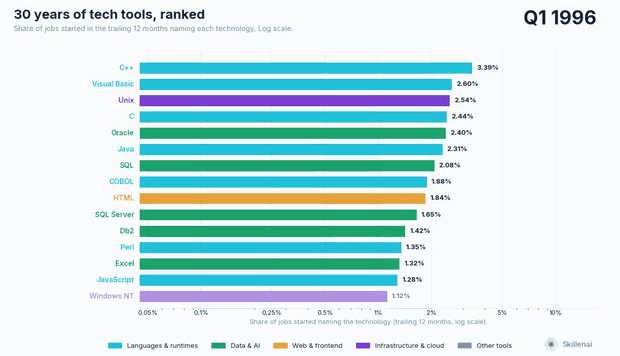
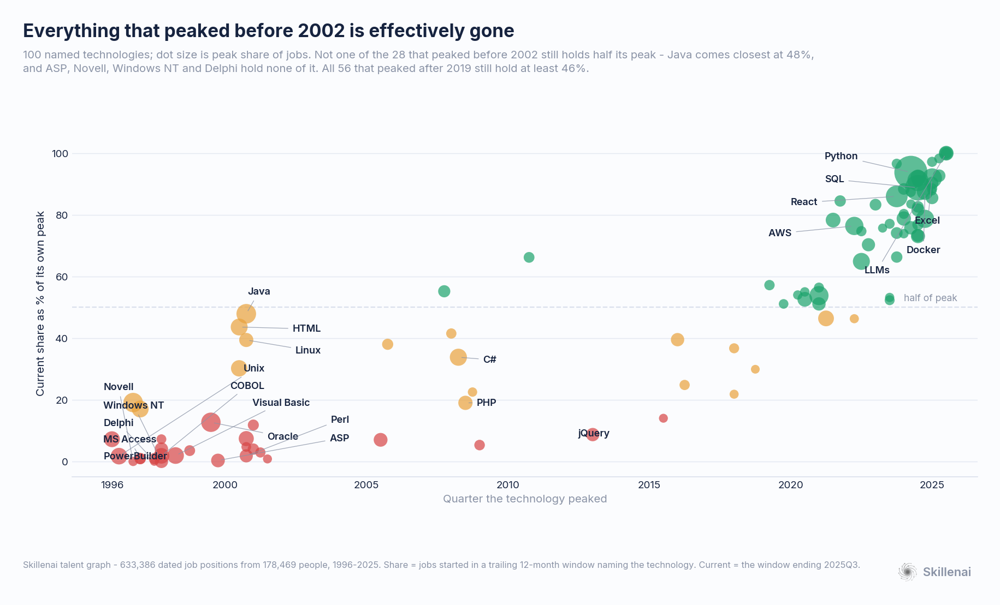
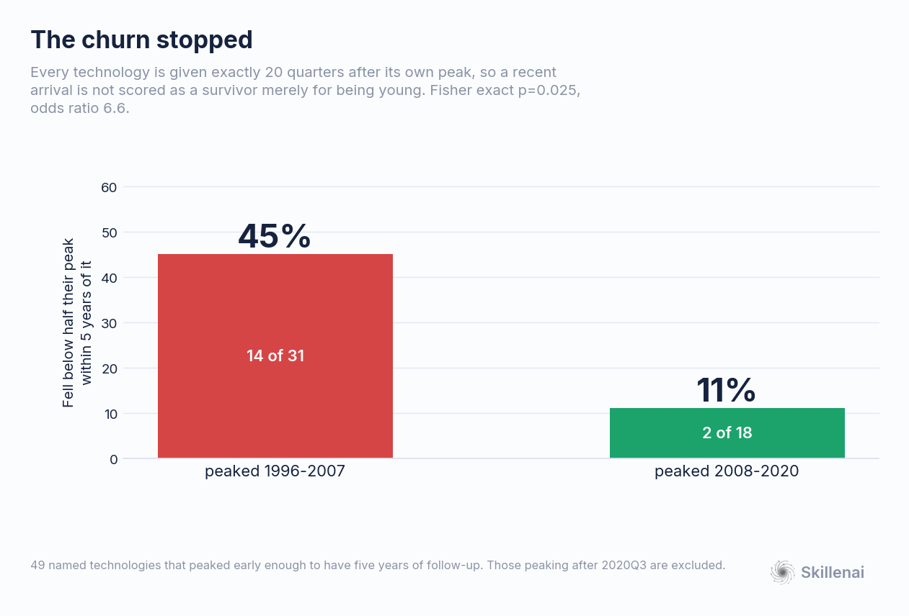
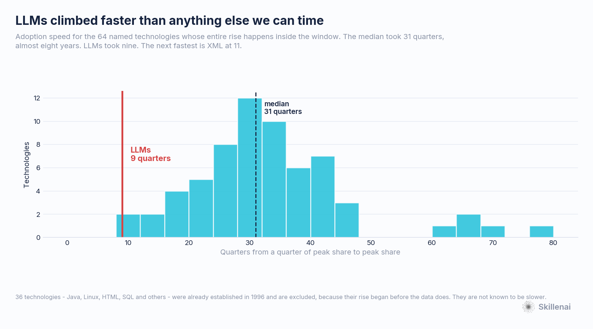

# Thirty Years of Tech Tools — What Died, What Lasted, What Moved Fastest

*A Skillenai analysis. September 2026.*

**Data.** The Skillenai talent graph: **633,386 dated job positions** held by **178,469 people**, 1996–2025. Every skill in this analysis is tied to a *specific position* — this employer, this job title, this start date — and resolved to an entity, so "what were people actually using when they started a job in 1998" is a question the data answers directly rather than by inference.

That linkage is new. Until this month skills hung off the *person*, not the position, with no date attached, and the only way to get a time series was to match a present-day skill list against old résumé text. This analysis is the first run on the position-scoped data, and the difference turns out to matter — see [What changed, and why it reverses an earlier result](#what-changed-and-why-it-reverses-an-earlier-result).

---

## TL;DR

- **Not one of the 28 named technologies that peaked before 2002 still holds half its peak.** Java comes closest at 48%. **ASP, Novell, Windows NT and Delphi hold none of it** — they round to zero.
- **Then the churn stopped.** Of technologies peaking 1996–2007, **45% fell below half their peak within five years**. Of those peaking 2008–2020, **11%**. Measured at a fixed five-year follow-up so young technologies aren't scored as survivors (Fisher exact p=0.025, odds ratio 6.6).
- **Java and Perl peaked in the same quarter — 2000Q4.** Java is at **48%** of that peak today. Perl is at **1.8%**.
- **The two longest climbs in the data belong to the two oldest tools.** SQL rose for **114 quarters** and peaked in 2024Q3. Excel rose for **116** and peaked in 2025Q1. A 1974 query language and a 1985 spreadsheet are both at all-time highs.
- **LLMs went from a quarter of their peak to their peak in 9 quarters.** The median named technology took 31. The next fastest is XML at 11.
- **Tools are not more fragile than "durable skills."** Named technologies hold a median **77%** of peak; other skill terms hold **54%**. That is the opposite of the conventional advice, and the opposite of what a survivor-only vocabulary reports.

---

## 1. Thirty years, ranked

*Video: [`01_tool_race.mp4`](01_tool_race.mp4) — 74s, higher quality than the GIF.*

Each bar is the share of jobs started in the trailing twelve months whose description names that technology. Quarterly steps, log scale.

Only **named technologies** race — a language, product, framework, platform or service. Activities are excluded: testing, documentation, project management and CI/CD are real and common, but a capability that never had a version number cannot be replaced by the next release, and mixing the two hides the thing this is about.

The 1997 board is C++, Java, Windows, Unix, Oracle, Visual Basic, COBOL, SQL, C, HTML. The 2025 board is Python, SQL, React, Power BI, Excel, Tableau, AWS, Docker. Two names survive the trip.

## 2. The cliff at 2002

| peaked 1996–1998 | now vs peak | | peaked 1999–2001 | now vs peak |
|---|---:|---|---|---:|
| Novell, Windows NT, Delphi | **0%** | | ASP | **0%** |
| MS Access, PowerBuilder, Solaris | 1% | | Flash | 1% |
| COBOL, Unix, Visual Basic | 2% | | Perl | 2% |
| Db2, Crystal Reports | 4% | | JSP | 4% |
| C | 7% | | XML | 7% |
| Oracle | 13% | | Linux | 39% |
| C++ | 19% | | HTML, Java | 44%, 48% |

The chart is two populations with almost nothing between them. Everything on the left is at or near zero. Everything on the right of about 2019 is within half of its own high, and the lowest of the 56 post-2019 peakers is 46%.

**The same quarter, opposite outcomes.** Java and Perl both peaked in **2000Q4**, both after a 19-quarter climb. Java kept 48% of its peak. Perl kept 1.8% — a 27× difference in what survived, from the same starting point. Whatever separates a technology that lasts from one that doesn't, it is not when it arrived.

## 3. The churn stopped

The obvious objection to section 2 is that recent technologies simply haven't had time to die. So each technology is given exactly **20 quarters after its own peak** and asked whether it fell below half in that window — the same follow-up for everything, with anything peaking after 2020Q3 excluded for not having five years yet.

The gap survives: **45% (14/31)** for 1996–2007 peakers, **11% (2/18)** for 2008–2020. Fisher exact p=0.025, odds ratio 6.6.

The modern stack has been remarkably stable. The things that dominate 2025 — Python, SQL, AWS, Docker, React, Postgres — have mostly been climbing for seven to ten years without a serious challenger appearing.

## 4. Except for one thing

**LLMs took 9 quarters** to go from a quarter of their peak share to their peak. The median named technology took **31** — close to eight years. The next fastest is XML at 11.

This is a bounded claim and worth stating as one: 36 technologies, including Java, Linux, HTML and SQL, were already established when the data begins in 1996, so their rise cannot be timed and they are excluded. They are not known to be slower. Among the 64 whose whole climb is visible, LLMs is the fastest.

So the AI stack is not adding to an already-churning market. It is arriving on top of one that had gone quiet — which is a different situation, and arguably a more disruptive one.

## 5. The oldest tools are at their all-time highs

| technology | first shipped | quarters rising | peaked | share at peak |
|---|---|---:|---|---:|
| Excel | 1985 | **116** | 2025Q1 | 3.94% |
| SQL | 1974 | **114** | 2024Q3 | 6.95% |
| Python | 1991 | 34 | 2024Q2 | **11.72%** |

Python's 11.72% is the highest share any single technology reaches anywhere in these thirty years. For scale, the most common technology of 1998 was Oracle at 3.44%, and no technology that peaked before 2015 ever got above 4% — the record holder was Java, at 3.91%.

## 6. Tools are not the fragile part

The standard career advice says to invest in durable capabilities rather than specific products, because products churn and capabilities don't. On this data that is backwards.

| terms ever reaching | named technologies: median now vs peak | all other skill terms |
|---|---:|---:|
| 0.5% of a year | **0.77** | 0.54 |
| 0.1% of a year | **0.67** | 0.33 |
| 0.02% of a year | **0.67** | 0.00 |

Named technologies are *more* persistent than the average skill phrase at every frequency cut. The advice isn't wrong about Novell — it is wrong about the base rate. Specific products that reach real adoption tend to stay; it is the vague middle of the vocabulary that evaporates.

What actually predicts whether a tool survives is **when it peaked**, not whether it is a product.

## What this means

- **Auditing your résumé by "is this a product or a skill" won't help.** The split that matters is generational. A tool that took hold after about 2008 has been a good bet; one that peaked in the Windows NT era was not, and no amount of it being a "real" technology changed that.
- **The stability is recent and may not be a law.** Seventeen years of a stable core stack is what the data shows, not a prediction. The one technology moving at 1990s speed right now is the newest one.
- **If you learned the current stack, you have had an unusually easy decade.** Someone who learned Python, SQL and Linux in 2015 has needed to replace almost nothing. Someone who learned Visual Basic and Novell in 1997 lost essentially all of it within five years.

---

## What changed, and why it reverses an earlier result

An earlier Skillenai analysis of the same question used the only instrument then available: a vocabulary of skills drawn from **2026 job postings**, matched by regular expression against old résumé text. It reported that named tools decay while generic capabilities endure, and flagged its own limitation — a vocabulary built from today's postings contains only survivors, so every churn figure was a lower bound.

The limitation turns out to be load-bearing. Every term in a present-day dictionary still exists today by construction, so the comparison set of "generic skills" could not contain a word that had fallen out of use, while named tools *could* still show decline. That asymmetry produced the result.

With open-vocabulary extraction the comparison reverses at every frequency threshold (section 6), and technologies that vanished outright — Novell, Windows NT, Delphi, ASP, PowerBuilder — become visible for the first time. They are the entire left edge of the chart in section 2, and the earlier instrument could not see any of them.

The general lesson is the one worth keeping: **an instrument anchored in the present cannot measure disappearance**, and applying one to the past will reliably understate how much changed.

---

## Methodology

**Corpus.** Two talent-graph snapshots (July 2026 and August 2026), deduplicated by profile id. Skills are extracted per position by a language model from the position's own description text and resolved to entities, then attached to that position's start date, employer and job title. The population is US tech/AI professionals filtered on job title at ingest — a large sample of the tech workforce, not a census. Read shares and ratios; treat absolute counts as a floor.

**Unit of analysis is the position.** Share means *positions started in a trailing twelve-month window naming technology X, over positions started in that window naming any skill at all*. Both sides are restricted to skill-bearing positions on purpose: the description-length gate and the per-position attribution rate are properties of the instrument, and dividing by all positions would let them drift into the series.

**Trailing-twelve-month windows, quarterly steps.** Two reasons. A source date carrying only a year is imputed to January, which puts 17.7% of all position starts in January at 2.4× the expected rate; a twelve-month window contains exactly one January, so the imputation cancels. And the window removes calendar seasonality, so a partial final year does not read as a collapse.

**Reporting lag.** Employment records in this corpus are current to roughly October 2025. Windows ending after 2025Q2 are drawn and labelled **provisional** rather than dropped. No claim here rests on the final two quarters.

**Named technologies** are hand-classified: a specific artifact someone ships and someone else adopts, with a version number and an owner. Every term reaching 0.5% of a window is classified, and the classifier asserts that none is left unassigned, so the race cannot silently omit something that belongs in it. Borderline calls are made explicitly in `named.py`: SQL counts as named (a specification, and listed as a tool in practice); REST APIs, CI/CD, ETL and machine learning count as capabilities; **LLMs counts as named**, which is a judgement call — it is a class rather than one product, but it is a thing adopted rather than an activity performed, and excluding it would blind the analysis to the AI wave.

**Entity canonicalisation.** The resolver emits case, punctuation and parenthetical variants of the same concept (`python` / `Python (pandas)` / `Python (FastAPI)`). These are merged on a normalised key that preserves `+` and `#` so C, C++ and C# stay distinct; 7,837 groups merge. The merge is applied to entity ids and audited in `_out/merge_audit.txt`.

**Lifecycle measures.** *Rise* is quarters from the first window at ≥25% of a technology's own peak to its peak. *Fall* is quarters from the peak to the first window below 50% of it. Fall is right-censored for anything still near its peak; censored items are counted as "has not fallen" rather than dropped, since dropping them keeps only the dead and makes every era look equally fatal. The era comparison uses a fixed 20-quarter follow-up for this reason. The rise comparison excludes the 36 technologies already rising when the data begins, because their rise is cut off by the window rather than by adoption speed.

**Artifact checks run before interpreting anything.** Three plausible ways to manufacture these results were tested and excluded. *Thin early years* — 1996 has 3,227 skill-bearing positions against 44,267 in 2022, and noise both depresses year-to-year similarity and inflates apparent diversity; a split-half null (two disjoint halves of the same year at a sample size held equal across all years) removes it. Under that null, year-over-year skill churn shows **no trend at all** across thirty years: mean excess over the null 0.0043 in 1997–2005 against 0.0044 in 2016–2024, with the confidence interval excluding zero in 1 of 28 years. *Verbosity drift* — skills per position rises 4.5 to 6.7 across the window, so concentration was recomputed within strata of identical skill count and the pattern holds in each. *Vocabulary quality* — the trend survives on a fixed set of 84 well-canonicalised named technologies, so it is not an artifact of older text being described in vaguer language.

**Career-length bias, tested.** The extraction pipeline is known to under-yield on profiles with 11 or more positions, and those are exactly the long careers that carry 1990s positions — so the bias points straight at this analysis, and could in principle tilt it toward recent positions. Measured: the 11+ band does under-yield badly (2.93 skills per position in 1996 against 4.74 for the 4–6 band, and 4.66 against 7.27 in 2024), but it is only **1.3–2.6% of positions in any year**, and its share drifts slightly *down* over the window rather than up. Recomputing with the 11+ band removed entirely changes nothing that matters: Novell 0.0% to 0.0% of peak, Visual Basic 1.4% to 1.5%, COBOL 2.3% to 2.4%, Oracle 16.7% to 16.6%, Java 64.3% to 64.9%. The 1998 composition also reproduces inside the 4–6 band on its own. The bias is real and does not reach these shares.

**Survivorship.** A 1996 position exists in this data only if the person holding it still maintained a profile in 2026. Early years are therefore biased toward people whose tech careers lasted — which, if anything, *understates* the death of the 1990s stack, since the people who left with it are absent.

**Position descriptions are self-written** and edited at unknown times, so modern vocabulary may be applied retroactively to old roles. This is a real limitation and it cuts against finding *any* old-technology signal; that Novell, Windows NT and Delphi still show up clearly in the 1990s is evidence the effect is not swamping the measurement.

**Statistics.** Era fall rates compared with Fisher's exact test; named-vs-other durability with Mann-Whitney U; churn nulls by split-half resampling at fixed sample size, 300 replicates.

---

*Figures and the scripts that produce them are in this folder. `lifecycle.csv` carries the peak, rise, fall and current share of all 100 named technologies; `race_series.csv` carries the full quarterly series behind the video. The underlying profile corpus is not redistributable.*
