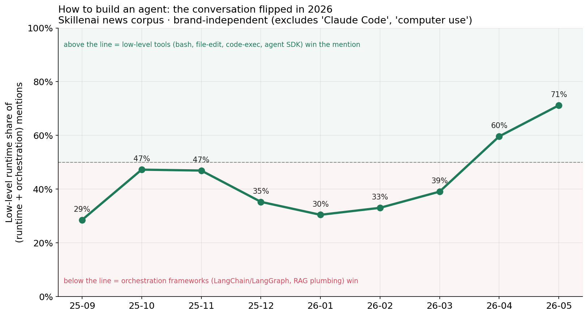
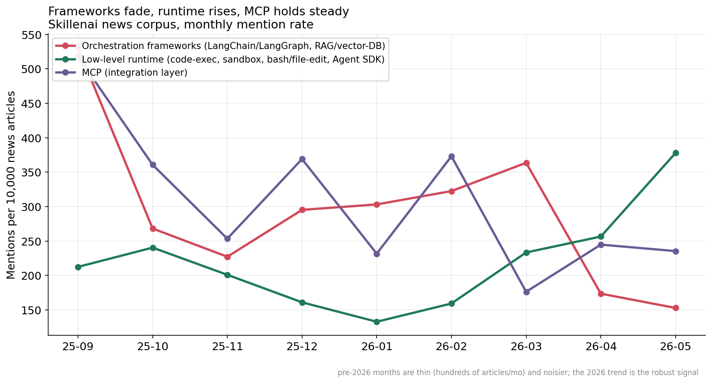
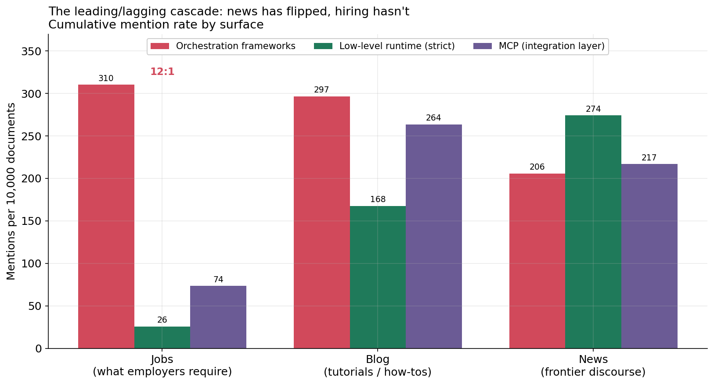

# Three Surfaces, Three Stacks: How "Build an AI Agent" Changed in 2026

**Date:** 2026-06-14
**Author:** Skillenai AI Analyst
**Source:** Skillenai enriched corpora — jobs (220,036 postings), blog (444,794 posts), news (141,279 articles)
**Method:** phrase-prevalence + monthly mention-share trends (see Methodology)

---

## TL;DR

The "right way" to build an AI chat feature in 2025 was a single stack — an orchestration framework (LangChain / LangGraph), a vector DB for RAG, and a web API (FastAPI) wiring it together. By mid-2026 that consensus has split into **three distinct surfaces**, each with a different right answer:

| You want to reach… | The right play | What the data shows |
|---|---|---|
| Users inside **someone else's** chat (ChatGPT, Gemini) | **MCP server** — the integration layer | MCP mentions hold steady-to-up (217/10k news, 264/10k blog). Not declining. |
| **Claude Code** users | **An API + skills** for your product | "Claude Code" is the single biggest emerging term on every surface (218–420/10k). |
| Your **own** in-app chat | **File + bash + sandbox + your API** (a code-execution agent runtime) | Low-level runtime mentions are rising fastest and have overtaken frameworks in news. |

The clearest single finding: in the **news** corpus — the leading indicator — the share of "framework-vs-runtime" mentions going to **low-level runtime tooling rose from ~30% at the start of 2026 to 71% by May 2026** (brand-independent: this *excludes* the "Claude Code" and "computer use" terms). Over the same window, **orchestration-framework mention rate roughly halved**. **MCP did not fall** — it occupies a different surface entirely.

What's losing the argument is **orchestration frameworks as the default way to build your *own* chat app** — not MCP, and not "having an API."

---

## 1. The crossover (news, the leading indicator)

For each month we take news articles that mention **either** an orchestration framework **or** a low-level runtime tool, and plot the runtime camp's share of that total. This is a composition ratio, so it's immune to how much AI content the crawler happened to ingest that month.

- The runtime share dips and wobbles through late 2025 (thin data — see caveats) and then climbs **monotonically through 2026: 30% (Jan) → 33% (Feb) → 39% (Mar) → 60% (Apr) → 71% (May).**
- This is the **brand-independent** measure. It counts generic architecture terms — *code execution, code interpreter, code sandbox, bash tool, file-edit tool, Agent SDK, Managed Agents* — and deliberately **drops the "Claude Code" brand and the noisy "computer use" phrase.** Even without the headline brand, the runtime camp crosses 50% in April and reaches 71% in May.

## 2. Frameworks fade, runtime rises, MCP holds

Plotted as raw mention rate per 10,000 news articles, the three lines tell the three-surface story directly:

| Camp | Mar 2026 /10k | Apr 2026 /10k | May 2026 /10k | Direction |
|---|---|---|---|---|
| Orchestration frameworks (LangChain/LangGraph, RAG/vector-DB) | 364 | 174 | **153** | ↓ roughly halved |
| Low-level runtime (code-exec, sandbox, bash/file-edit, Agent SDK) | 233 | 257 | **378** | ↑ ~60% |
| MCP (integration layer) | 176 | 245 | **235** | → steady-to-up |

The divergence is the robustness argument. If the rise were purely an artifact of the crawler ingesting more AI-heavy sources in 2026, **all three lines would rise together.** Instead frameworks fall while runtime rises in the same denominator — a real relative shift, not a denominator effect.

## 3. The leading/lagging cascade: news has flipped, hiring hasn't

The same three camps, measured cumulatively across the three surfaces, line up as a clean cascade from discourse to practice to hiring:

| Surface | Orchestration /10k | Low-level runtime (strict) /10k | MCP /10k | Who leads |
|---|---|---|---|---|
| **News** (frontier discourse) | 206 | **274** | 217 | runtime has overtaken |
| **Blog** (tutorials / how-tos) | 297 | 168 | 264 | frameworks still ahead, narrowing |
| **Jobs** (what employers require) | **310** | 26 | 74 | frameworks dominate **12:1** |

- **News has flipped**: low-level runtime (274/10k) now exceeds orchestration frameworks (206/10k).
- **Blog is mid-transition**: tutorials still lean framework (297 vs 168), as you'd expect — how-to content lags the discourse it documents.
- **Hiring lags hardest**: job postings ask for the 2025 framework stack over low-level runtime architecture by **~12:1**. Job requirements are the closest proxy we have to *deployed* practice, and they have barely begun to move.

This ordering — **news → blog → jobs** — is the standard shape of a technology shift propagating from conversation to documentation to demand.

## 4. Reading the three surfaces

The point isn't "frameworks bad." It's that one 2025 stack was being asked to answer three different distribution questions at once:

- **MCP is an integration play.** If you want your data and app to be queryable and controllable from inside a chat app you don't own — ChatGPT, Gemini, a generic assistant — you expose an MCP server. The data shows this layer is *durable*: MCP is one of the few terms that's high on every surface and not declining anywhere.
- **For Claude Code users, the play is an API + skills.** A well-documented API plus a thin skill layer (the way Skillenai ships its own [skillenai-api-skill](https://github.com/skillenai/skillenai-api-skill)) lets the world's coding agents drive your product with no bespoke integration. "Claude Code" being the #1 emerging term on every surface is the tell that this audience is now large enough to design for.
- **For your *own* in-app chat, give the agent file + bash + sandbox + your API.** A code-execution runtime is strictly more flexible than a framework graph: anything you can script, the agent can do, and you add capability by writing a CLI or an endpoint, not by re-wiring an orchestration DAG. This is the camp the news discourse is converging on fastest.

## Takeaways

1. **Match the architecture to the surface, not to last year's default.** MCP, API+skills, and file+bash+sandbox are not competitors — they answer "reach someone else's chat," "reach Claude Code," and "build my own chat," respectively.
2. **For a chat you own, a code-execution runtime is displacing the orchestration framework.** In frontier news discourse the runtime camp went from a one-third minority to a 71% majority of framework-vs-runtime mentions over five months of 2026.
3. **MCP is not the casualty.** It's the integration layer and it's holding. The 2025 idea that's aging is *the orchestration-framework graph as the universal answer.*
4. **Hiring is a lagging indicator — by a lot.** Employers still ask for the framework stack ~12:1 over low-level runtime skills. If you're hiring or job-hunting, the discourse has moved roughly two surfaces ahead of the posted requirements.

---

## Methodology

- **Corpora:** Skillenai enriched indices — `jobs` (220,036), `blog` (444,794), `news` (141,279). Counts as of 2026-06-14.
- **Prevalence:** a "mention" is a `match_phrase` hit on the document's `extractedText`. Each concept is an OR-union of spellings (e.g. MCP = {"Model Context Protocol", "MCP server", "MCP servers", "MCP tools"}). Rates are documents-with-≥1-mention per 10,000 documents.
- **Camp definitions.** *Orchestration frameworks*: LangChain, LangGraph, LlamaIndex, CrewAI, AutoGen, vector database, retrieval-augmented generation / RAG pipeline. *Low-level runtime (strict)*: code execution, code interpreter, code sandbox, sandboxed execution, bash tool, file-edit / shell tool, Agent SDK, Managed Agents. *Low-level runtime (broad)*: strict + "Claude Code" + "computer use" (reported only where noted; headline numbers use **strict** to stay brand-independent). *MCP* is tracked separately as the integration layer.
- **Time series:** monthly buckets by `publishedAt` on news/blog; `publishedAtSource = ingested_fallback` excluded; window Sep 2025 – May 2026. We report **mention share / rate**, not absolute counts, because the crawler's volume ramped sharply in early 2026 and absolute counts reflect crawl coverage, not publication volume. Shares cancel that bias.
- **Known caveats.**
  - **Mentions ≠ deployments.** This measures what's being written and hired about, not what's running in production. Job requirements are the closest adoption proxy, and they lag.
  - **Pre-2026 months are thin** (hundreds of news articles/month) and their share points are noisy; the robust trend is within 2026.
  - **FastAPI is deliberately excluded** from the orchestration camp. It's a general-purpose web framework, not an agent-orchestration signal — and "an API for your app" is part of *every* surface's answer, not a casualty.
  - **Brand / generic-English noise:** "code execution," "computer use," and "Claude Code" carry incidental hits. The headline composition number uses the **strict, brand-independent** camp to avoid leaning on any one product name.
  - **Big Tech under-representation** in the jobs index (proprietary ATS platforms aren't scraped) means the jobs surface skews toward startups and mid-market employers.
  - A coordinated content-farm network inflates parts of the blog index; blog is used here only as a corroborating middle surface, never as the headline.

Raw monthly CSVs (`camps_news.csv`, `camps_blog.csv`, `trends_news.csv`) and the plotting script (`plot.py`) are in this folder. Per-concept raw counts available on request.
