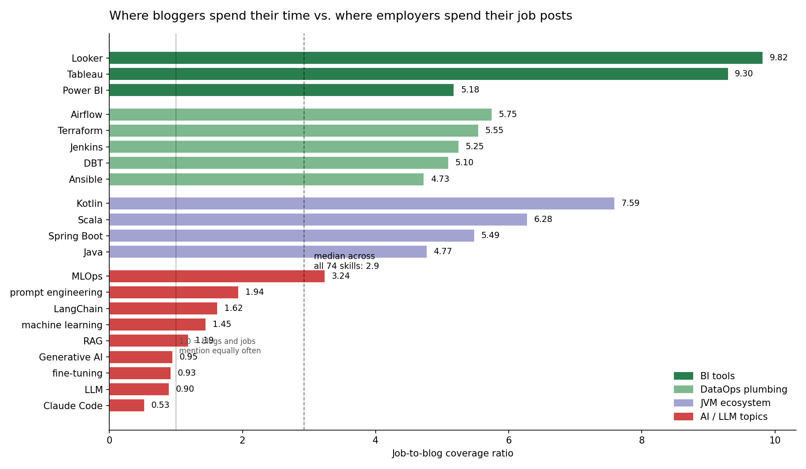
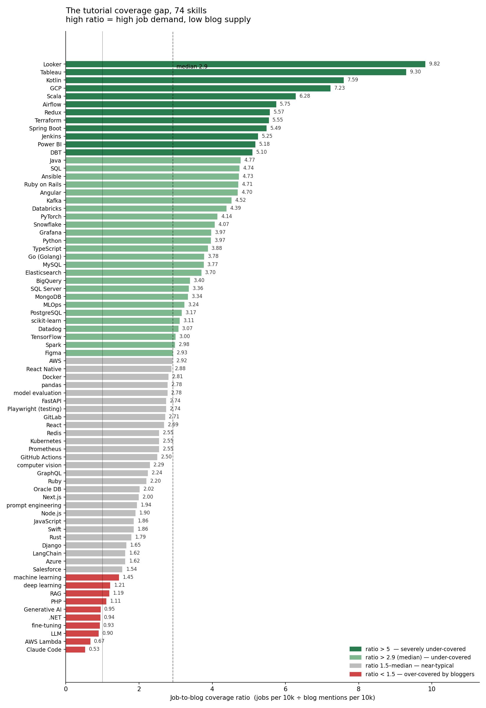
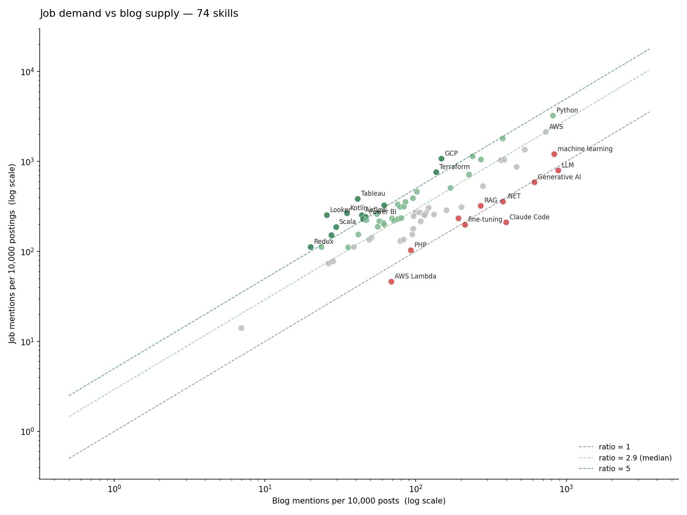
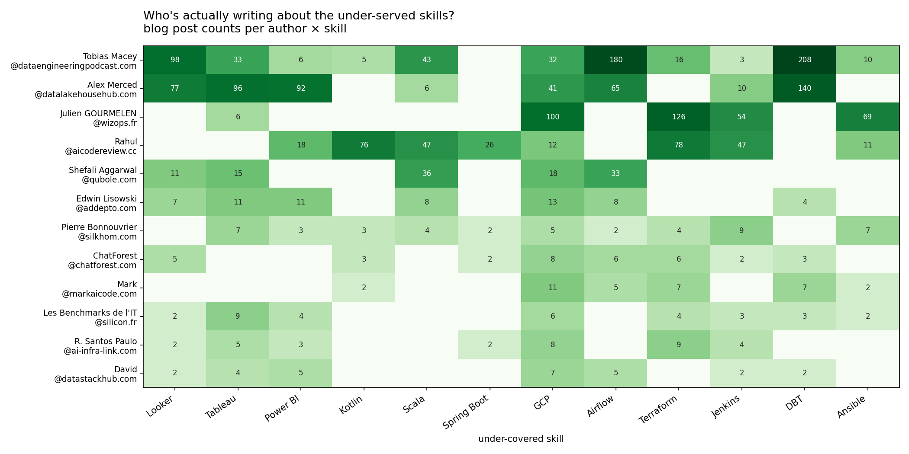

# The tutorial coverage gap

*Where bloggers spend their time vs. where employers spend their job posts*

**Date:** 2026-06-06
**Source:** Skillenai indices — 205,895 enriched job postings (`prod-enriched-jobs`) and 408,420 enriched blog posts (`prod-enriched-blog`, post-denylist).
**Methodology:** For each of 74 candidate skills, count job postings and blog posts whose `extractedText` contains the skill phrase (any of a small OR-group of spellings). Compute job-mentions-per-10k and blog-mentions-per-10k. The ratio of the two is the "coverage gap": high ratio means the skill is asked for at work more often than it is written about; low ratio means the opposite.

---

## TL;DR

Tech bloggers are writing about Claude Code at almost 2× the rate jobs ask for it. Employers are hiring for **Looker** at 10× the rate anyone is writing about it. Across the whole AI/LLM cluster — LLM, RAG, fine-tuning, Generative AI — blog supply meets or exceeds job demand, while the BI / DataOps / JVM stack runs 5–10× short. The most under-served tutorial niches on the internet right now are **BI tools**, **DataOps plumbing**, and the **JVM ecosystem**. The most over-served are everything in the LLM stack: Claude Code, RAG, fine-tuning, Generative AI.

The median skill in this set has a job-to-blog ratio of **~2.9**. Anything above ~5 is meaningfully under-blogged. Anything below ~1.5 is meaningfully over-blogged.

---

## The ranking

74 skills, ranked from most over-blogged (top) to most under-blogged (bottom). The dashed line is the median across all 74.

### Top 12 most under-served (high job demand, low blog supply)

| Rank | Skill | Jobs | Blog posts | Job:blog ratio |
|---:|---|---:|---:|---:|
| 1 | Looker | 5,215 | 1,053 | **9.82** |
| 2 | Tableau | 7,904 | 1,686 | **9.30** |
| 3 | Kotlin | 5,481 | 1,432 | **7.59** |
| 4 | GCP | 22,111 | 6,067 | **7.23** |
| 5 | Scala | 3,846 | 1,214 | **6.28** |
| 6 | Airflow | 5,207 | 1,797 | **5.75** |
| 7 | Redux | 2,309 | 822 | **5.57** |
| 8 | Terraform | 15,657 | 5,600 | **5.55** |
| 9 | Spring Boot | 3,122 | 1,129 | **5.49** |
| 10 | Jenkins | 6,694 | 2,528 | **5.25** |
| 11 | Power BI | 4,979 | 1,906 | **5.18** |
| 12 | DBT | 4,707 | 1,832 | **5.10** |

### Top 12 most over-served (low job demand, high blog supply)

| Rank | Skill | Jobs | Blog posts | Job:blog ratio |
|---:|---|---:|---:|---:|
| 1 | Claude Code | 4,336 | 16,296 | **0.53** |
| 2 | AWS Lambda | 952 | 2,819 | **0.67** |
| 3 | LLM | 16,389 | 36,125 | **0.90** |
| 4 | fine-tuning | 4,073 | 8,696 | **0.93** |
| 5 | .NET | 7,375 | 15,515 | **0.94** |
| 6 | Generative AI | 12,087 | 25,149 | **0.95** |
| 7 | PHP | 2,122 | 3,801 | **1.11** |
| 8 | RAG | 6,619 | 11,052 | **1.19** |
| 9 | deep learning | 4,810 | 7,864 | **1.21** |
| 10 | machine learning | 24,850 | 33,996 | **1.45** |
| 11 | Salesforce | 6,405 | 8,230 | **1.54** |
| 12 | Azure | 2,787 | 3,404 | **1.62** |

---

## Two patterns, one story

Three skill categories explain almost all of the under-served list:

1. **BI tools** — Looker, Tableau, Power BI. Three of the top eleven. The dashboards employers actually use to run their businesses.
2. **DataOps plumbing** — Airflow, Terraform, Jenkins, DBT, Ansible. Five of the top fifteen. The pipeline glue that makes the modern data stack work.
3. **JVM ecosystem** — Kotlin, Scala, Spring Boot, Java. Four of the top fifteen. The languages large enterprises still build on.

One skill category explains almost all of the over-served list:

- **The AI/LLM stack** — Claude Code, LLM, RAG, fine-tuning, Generative AI, prompt engineering. Every member of this cluster sits below median, and the top of the cluster sits below the equal-coverage line.

You can see the two populations on a log-log plot of job demand vs. blog supply:

The red dots — every AI/LLM term — sit *below* the median diagonal. The green dots — BI, DataOps, JVM — sit *above* it. Python and AWS straddle the median because both populations care about them.

---

## Who is actually writing about the under-served skills?

We aggregated blog posts containing any of the twelve top under-served skills by `author`, applying the standard junk-author filter (no team accounts, no email addresses, no domain-as-byline, no Slashdot bots, no multi-author blobs) and removing the synthetic-persona content-farm network identified earlier this year.

A few names dominate:

| Author | Site | Skills covered (of 12) | Total posts | Max per-skill authority |
|---|---|---:|---:|---:|
| **Tobias Macey** | dataengineeringpodcast.com | **11** | 634 | 1.56 |
| **Alex Merced** | datalakehousehub.com / iceberglakehouse.com / alexmerced.blog | 8 | 527 | **2.79** |
| Rahul | aicodereview.cc | 8 | 315 | 0.75 |
| Julien GOURMELEN | wizops.fr | 5 | 355 | 1.41 |
| Andreas & Michael Wittig | cloudonaut.io | 4 | 72 | **3.02** |

Two observations stand out:

- **Tobias Macey** ([Data Engineering Podcast](https://dataengineeringpodcast.com)) is the only writer in our corpus who covers eleven of the twelve most-under-blogged skills. His back catalog of interviews — 208 episodes touching DBT, 180 touching Airflow, 98 touching Looker, 43 touching Scala — is, by simple post-count, the de facto data-engineering reference on the open web. (We're treating each podcast episode as a blog post because that's how it lands in our crawl.)
- **Alex Merced** is the highest-authority multi-topic gap-filler. He writes from inside the lakehouse-vendor world (Dremio, Iceberg, Nessie) and his per-post authority sits at 2.79 — above the corpus median.
- **Andreas & Michael Wittig** (cloudonaut.io) post the most authoritative content (3.02) in the Terraform / Jenkins corner.

The other top "authors" for individual BI tools — Mary Rybalchenko at windsor.ai, Shefali Aggarwal at qubole.com, Edwin Lisowski at addepto.com, Sarah Donahoo at fugo.ai — are almost entirely vendor SEO content. There is, in 2026, no independent named tutorial creator with significant volume writing about Looker, Tableau, or Power BI.

---

## The interpretation

A tutorial economy is, structurally, an attention economy. Tutorial writers chase what generates social signal — new tools, frontier models, the freshest demo. RAG, Claude Code, fine-tuning, and LLMs are *interesting*. They produce screenshots that get retweeted. Looker dashboards do not.

Employers, on the other hand, hire for what they need to *operate* the business: a dashboard tool to read the data, a pipeline tool to land the data, and a JVM service to keep the legacy core running while everyone argues about the rewrite.

The result, this quarter, is a measurable gap between what the open web teaches and what employers pay for. That gap is concentrated in three skill clusters and, by simple author-count, is being filled by two people: a podcaster and a lakehouse advocate.

There is a tangible career opportunity in the boring tutorial.

---

## Caveats

- **Mention is not tutorial.** A blog post that contains the word "Looker" might or might not teach Looker. A job posting that lists Looker almost certainly requires it. The ratio is biased in the same direction for every skill (jobs are stricter than blogs), but the magnitude of the bias may vary.
- **Match-phrase is case-insensitive and analyzer-lossy.** We dropped `C++`, `C#`, `Excel`, `Bash`, `R`, and `Cursor` because their phrase tokens collide with English text or other tokens after analysis. For ambiguous tokens that survived (`pandas`, `Playwright`, `Go`) we required a co-occurring disambiguator phrase.
- **The candidate skill list comes from the jobs index.** Skills that are heavily blogged but rare in job postings (game-dev frameworks, niche scientific stacks, hobbyist tooling) are by construction not in the table.
- **Big Tech is under-represented in jobs.** Google, Apple, Microsoft, NVIDIA, and Netflix mostly run proprietary ATS platforms we don't crawl. That likely suppresses .NET / Azure / GCP / Swift demand and may explain part of .NET's appearance on the over-served list.
- **Window:** the jobs index begins on 2026-03-10. This is a three-month snapshot.
- **Blog index hygiene:** we excluded a 333-domain coordinated content-farm network identified earlier in 2026, plus five known ATS / medical / preprint domains that get mis-classified as `source_type=blog`.
- **Podcast bias on the author side.** Tobias Macey's lead on the under-served skills is partly an artifact of how a podcast feed lands in a blog crawl — every episode becomes a "post" in our index. The substantive point survives anyway: the data-engineering coverage on the open web *is* his catalog of interviews. There simply isn't a higher-volume independent voice.

---

## Reproducing

All inputs and scripts are in this folder:

- [`concepts.json`](concepts.json) — the 80-skill concept file (label → OR-group of phrases)
- [`run_prevalence.py`](run_prevalence.py) — batched `match_phrase` filters-aggregation against jobs + blog (post-denylist)
- [`rank_skills.py`](rank_skills.py) — drop unreliable concepts and rank by ratio
- [`find_gap_authors.py`](find_gap_authors.py) — author aggregation per under-served skill with junk-author filter
- [`make_charts.py`](make_charts.py) — generates all four figures
- [`prevalence.json`](prevalence.json), [`ranked_skills.json`](ranked_skills.json), [`gap_authors.json`](gap_authors.json) — raw outputs

Requires `SKILLENAI_INSIGHTS_API_KEY` in env.
