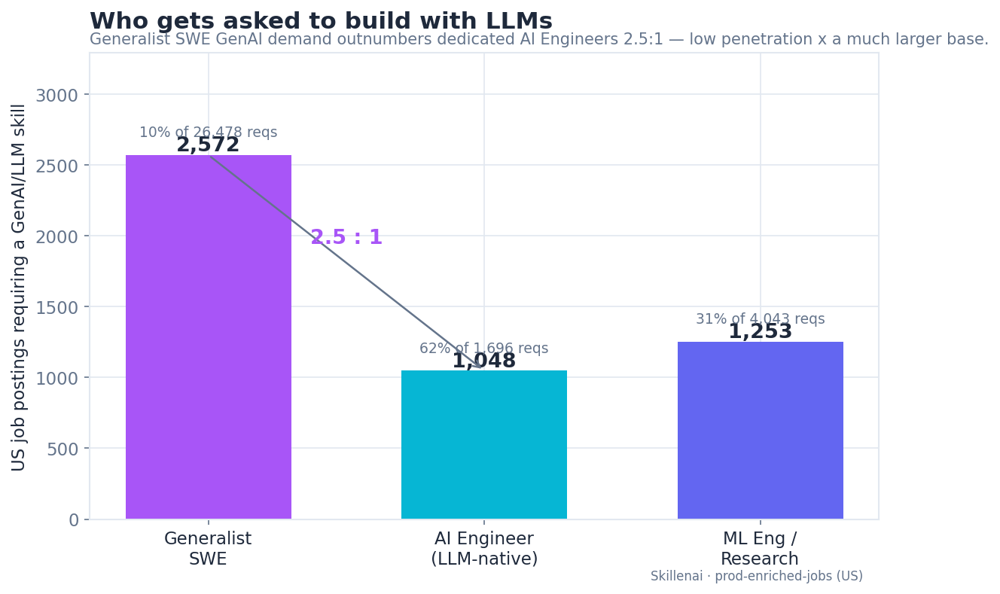
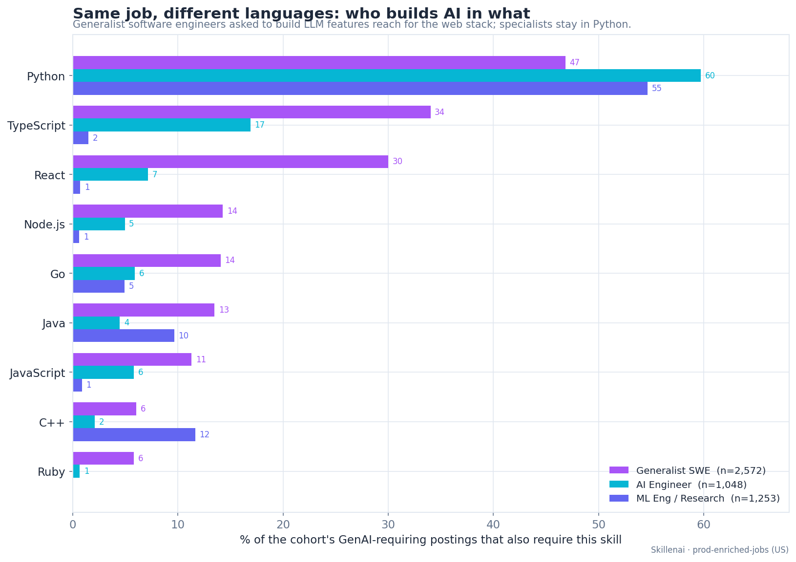
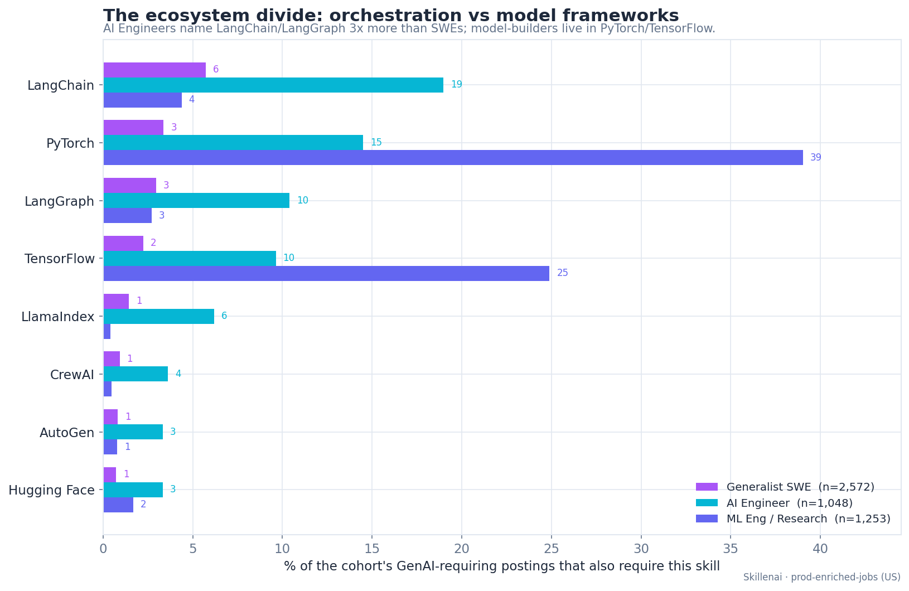
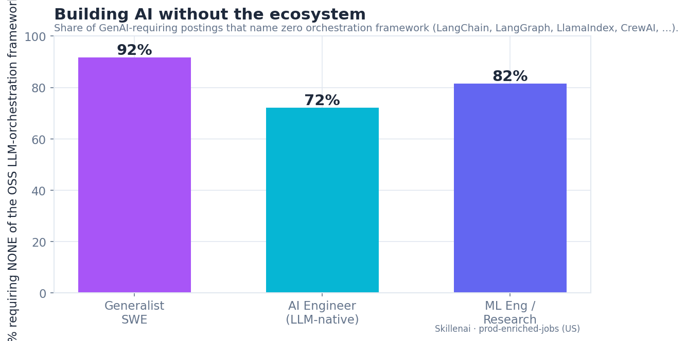
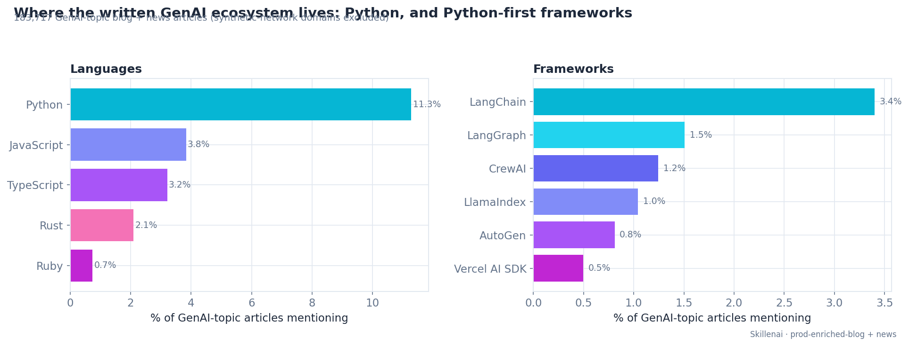

# Who Actually Builds With LLMs: Generalist Engineers vs AI Engineers

**Date:** 2026-07-22
**Source:** Skillenai `prod-enriched-jobs` (US postings) + `prod-enriched-blog` / `prod-enriched-news`
**Method:** structured skill entities (`entities.resolved`, entity-resolved), not body keyword matching

---

## TL;DR

For every dedicated **AI Engineer** a US company posts to build with LLMs, there are
**~2.5 generalist software engineers** being asked to do the same — and the two groups
build in provably different stacks. The generalists reach for the web stack
(TypeScript, Ruby, React) and name **no** LLM-orchestration framework 92% of the time;
the specialists stay in Python and are 3x more likely to name LangChain/LangGraph. A
third role family — ML Engineers and Research Scientists — is a different world again:
Python plus PyTorch/TensorFlow, almost no web, mostly not doing generative AI at all.

This extends our earlier
[Data Scientist vs ML Engineer vs AI Engineer](https://github.com/skillenai/skillenai-notebooks/tree/master/ds-vs-mle-vs-aie)
skills comparison. That post mapped how the three *specialist* roles differ. This one
adds the role that outnumbers all of them on AI-feature work: the generalist software
engineer.

> **US employers are asking 2.5x more generalist software engineers than AI engineers to build with LLMs — and the generalists are doing it in TypeScript and Ruby, without LangGraph.**

---

## Scope & method

- **Index:** `prod-enriched-jobs`, `locationCountry = US`. A carpet-bombing spam
  employer is excluded throughout.
- **"Requires a GenAI/LLM skill"** = the posting carries at least one *conceptual*
  generative-AI skill entity: LLMs, generative AI, prompt engineering, RAG, AI agents /
  agentic workflows, fine-tuning, embeddings, or vector databases. Framework names
  (LangChain / LangGraph / LlamaIndex) are **deliberately excluded from this selector**
  so the framework co-occurrence measured later is not circular.
- **Three role families** (by exact `role` title):
  - **Generalist SWE** — Software Engineer, Backend / Frontend / Full Stack, Staff/Principal SWE, Software Developer, ...
  - **AI Engineer (LLM-native)** — AI Engineer, Applied AI Engineer, AI Software Engineer, AI/ML Engineer, AI Agent Engineer, Forward Deployed AI Engineer, Staff AI Engineer.
  - **ML Engineer / Research** — Machine Learning Engineer, ML Engineer, Research Scientist, Applied Scientist, ML Research Engineer, ... (shown for context).
- Skill synonyms are OR-grouped before counting (e.g. `LLMs` + `LLM` + `Large language
  models (LLMs)`; `Ruby` + `Ruby on Rails`; `Go` + `Golang`) to fix known
  entity-resolver duplication.
- **Demand-side only.** These are *job postings* — what employers ask for, not what gets
  built, by whom, or how well. See caveats at the end.

---

## 1. Who gets asked to build with LLMs

| Role family | US postings | Require a GenAI skill | Penetration |
|---|---|---|---|
| Generalist SWE | 26,478 | **2,572** | 9.7% |
| AI Engineer (LLM-native) | 1,696 | **1,048** | 61.8% |
| ML Engineer / Research | 4,043 | 1,253 | 31.0% |

Any single AI-Engineer req is ~6x more likely to require GenAI skills than a SWE req —
of course, it's the job. But the generalist SWE base is ~16x larger, so a 9.7%
penetration still produces **more** GenAI-requiring postings (2,572) than the entire
LLM-native AI-Engineer demand pool (1,048): a **2.5 : 1** ratio. On raw titles alone,
"Software Engineer" + GenAI (1,926) beats "AI Engineer" + GenAI (609) by **3.2 : 1**.

The scarce specialists get out-numbered by the sheer size of the generalist workforce.
That is the demand-side signature of "throw software engineers at the AI problem."

---

## 2. Same job, different languages

% of each family's GenAI-requiring postings that also require the language:

| Language | Generalist SWE | AI Engineer | ML/Research | SWE-vs-AIE skew |
|---|---|---|---|---|
| Python | 46.9% | 59.7% | 54.7% | 1.3x toward AIE |
| **TypeScript** | **34.0%** | 16.9% | 1.5% | **2.0x toward SWE** |
| **React** | **30.0%** | 7.2% | 0.7% | **4.2x toward SWE** |
| Node.js | 14.3% | 5.0% | 0.6% | 2.9x toward SWE |
| JavaScript | 11.3% | 5.8% | 0.9% | 1.9x toward SWE |
| **Ruby** | **5.8%** | 0.7% | 0.0% | **8.7x toward SWE** |
| Go | 14.1% | 5.9% | 4.9% | 2.4x toward SWE |
| Java | 13.5% | 4.5% | 9.7% | 3.0x toward SWE |
| C++ | 6.1% | 2.1% | 11.7% | 1.2x toward AIE |

Two things stand out. First, generalist SWEs building AI are **less than half Python**
(46.9%) and heavily web-stack — TypeScript, React, Node, and (the sharpest single skew
in the data) **Ruby at 8.7x**. Second, this is *not* just "SWE reqs list more
languages": the AI-Engineer cohort is emphatically Python-first, and the model-builders
are Python + C++ with essentially zero web.

Because the open-source LLM tooling ecosystem is Python-first, a **Ruby + LLM** posting
is almost by definition a bespoke, roll-your-own integration — there is no LangGraph for
Rails.

---

## 3. The ecosystem divide

% of each family's GenAI-requiring postings that also require the framework:

| Framework | Generalist SWE | AI Engineer | ML/Research |
|---|---|---|---|
| LangChain | 5.7% | **19.0%** | 4.4% |
| LangGraph | 3.0% | **10.4%** | 2.7% |
| LlamaIndex | 1.4% | **6.2%** | 0.4% |
| CrewAI | 0.9% | 3.6% | 0.5% |
| AutoGen | 0.8% | 3.3% | 0.8% |
| Hugging Face | 0.7% | 3.3% | 1.7% |
| PyTorch | 3.4% | 14.5% | **39.0%** |
| TensorFlow | 2.3% | 9.6% | **24.9%** |

Three signatures, three worlds:

- **Generalist SWE** — low on everything; a framework-light, web-stack world.
- **AI Engineer** — the orchestration layer: **3.3x more LangChain and 3.5x more
  LangGraph** than SWEs.
- **ML Engineer / Research** — the model layer: PyTorch (39%) and TensorFlow (25%),
  the deep-learning training stack.

### Building AI without the ecosystem

Share of each family's GenAI-requiring postings that name **none** of the OSS
orchestration frameworks (LangChain, LangGraph, LlamaIndex, Hugging Face, CrewAI,
AutoGen, Transformers, vLLM):

| Generalist SWE | AI Engineer | ML/Research |
|---|---|---|
| **91.6%** | 72.1% | 81.6% |

Naming no framework is common everywhere — but the generalists do it 14 points more than
the specialists. Note the "bespoke" signal is **not** that SWEs name raw provider SDKs
instead: `OpenAI`-as-a-skill appears in 3.4% of both cohorts. The generalist signal is
naming *nothing specific at all* — a language and an LLM concept, and no plumbing.

---

## 4. What the other 60% of "AI/ML" roles are doing

Restricting AI Engineer to LLM-native titles matters because the broader "AI/ML"
title space is dominated by a different job. Among ML-Engineer / Research postings that
require **no** GenAI skill (N = 2,762), the top required skills are:

`machine learning · PyTorch · TensorFlow · deep learning · computer vision ·
reinforcement learning · JAX · model training · distributed training · CUDA ·
feature engineering · recommendation systems · object detection`

Role breakdown: Machine Learning Engineer (1,083), ML Engineer (906), Research Scientist
(481). These are **model-builders** — training vision / RL / recommender / deep-learning
models — not LLM-application builders. The pool that specifically knows how to design and
evaluate **LLM systems** is smaller than the raw "AI Engineer" headcount suggests.

---

## 5. Corroboration: the written ecosystem is Python

If open-source contribution and technical writing concentrate in Python, that is where a
web-stack engineer is *least* served by existing material. Across **183,717 GenAI-topic
blog and news articles** (synthetic content-farm domains excluded):

| Language | % of GenAI articles | | Framework | % of GenAI articles |
|---|---|---|---|---|
| Python | **11.3%** | | LangChain | 3.4% |
| JavaScript | 3.8% | | LangGraph | 1.5% |
| TypeScript | 3.2% | | CrewAI | 1.2% |
| Rust | 2.1% | | LlamaIndex | 1.0% |
| Ruby | 0.7% | | AutoGen | 0.8% |
| | | | Vercel AI SDK | 0.5% |
| | | | LangChain.js | 0.04% |

GenAI content mentions **Python 3.5x more than TypeScript and 15x more than Ruby**, and
Python-first frameworks out-mindshare the flagship TypeScript framework (Vercel AI SDK)
by roughly **7 : 1** (LangChain alone). The generalists building LLM features in Ruby and
TypeScript are working in the languages the ecosystem serves *least*.

---

## 6. Two philosophies of "build AI" under one roof

The pattern that stings most is when a single company runs both playbooks at once — a
web-stack team and a Python-orchestration team both chartered to "build AI," with every
incentive to disagree about how.

- **Group A** — generalist SWE + GenAI + a web-stack language: **1,241 postings across 612 companies**
- **Group B** — AI Engineer + GenAI + an orchestration framework: **249 postings across 175 companies**
- **40 companies (22.9% of the specialist-hiring set) post both patterns simultaneously.**
  Dropping the web-stack requirement (any language), it's **32%**.

Named examples running both (web-stack-AI count | orchestration-AI count): Adobe (26|4),
Databricks (8|9), Scale AI (~18|5), SpotOn (6|3), JPMorgan Chase (4|2), Samsara (1|3),
Ironclad (3|1), Cisco (2|1), Snowflake (1|1), General Motors (1|2), AMD (1|1).

**This is a lower bound, and deliberately framed as one.** 81% of the specialist-hiring
companies have only a single AI-Engineer posting in the window — for most, there simply
isn't enough hiring signal to characterise their internal division of labour, so the
non-overlap companies are *not* evidence of clean specialist ownership. The co-occurrence
is observable mainly at the larger employers that post enough to reveal both patterns;
the named list is a floor of examples, not a census.

---

## 7. Statistical validation

Each skill flag is non-exclusive (a posting can list Python *and* TypeScript), so a
single homogeneity test over the whole language set is inappropriate. Instead we run a
per-skill 2x2 chi-square — [has skill / not] x [Generalist SWE / AI Engineer] — with
continuity correction, and report **phi** (2x2 effect size) and the risk ratio,
Bonferroni-corrected for the number of skills tested.

**Every** language and framework contrast is significant at the Bonferroni threshold.
Largest effect sizes (phi): React 0.244 (SWE), LangChain 0.204 (AIE), PyTorch 0.202
(model layer), TypeScript 0.170 (SWE), LangGraph 0.152 (AIE), Ruby 8.7x prevalence
ratio (SWE). These are genuine effects, not large-N artefacts.

---

## Caveats

- **Demand-side only.** Postings show what employers ask for, not what is built, by whom,
  or how well. This analysis can quantify that generalists are being *staffed* onto AI in
  non-AI stacks; it cannot show they build it worse, nor that AI Engineers are relegated
  to prototypes and evals. Those are hypotheses this data does not test.
- **A skill not listed is not proof the team doesn't use it** — only that the employer
  didn't require it. Valid as a *comparative* demand signal, which is how it's reported.
- **Big Tech is largely absent** (Google, Apple, Microsoft, Netflix, NVIDIA use
  proprietary ATS platforms we don't scrape), so the company-level counts understate
  true prevalence.
- **Absolute counts depend on the role-title lists**; the direction (SWE >> AIE on volume,
  web-stack vs Python, framework-light vs orchestration) is robust to reasonable changes.

---

## Reproduce

Scripts (in `skillenai-ds/scripts/`): `aie_vs_swe_skills.py` (cohorts + co-occurrence),
`aie_stats.py` (chi-square), `aie_blog_ecosystem.py` (written-ecosystem cut),
`aie_company_tension.py` / `aie_company_tension2.py` (dual-pattern co-occurrence + lower
bound), `aie_plots.py` (figures). Raw per-cohort counts are available on request (not
committed — small JSON, but analysis-specific).
