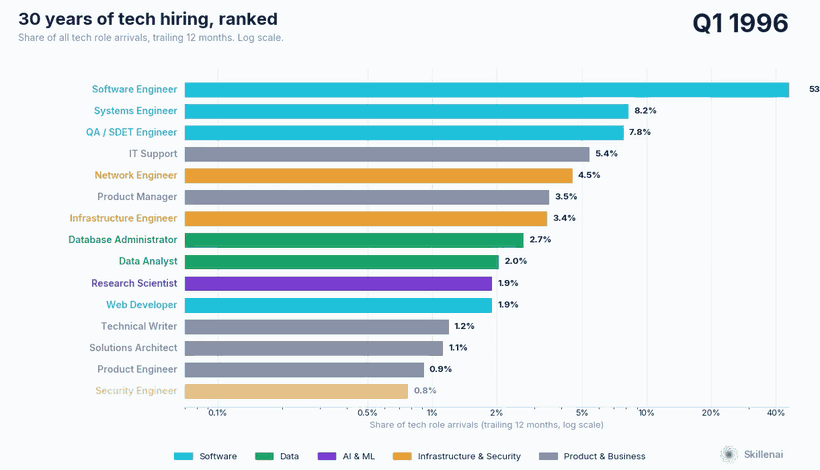
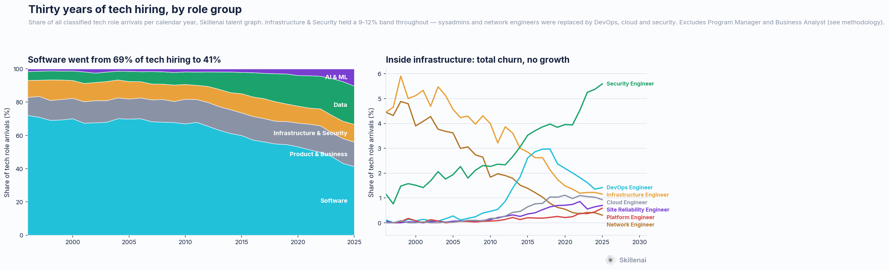
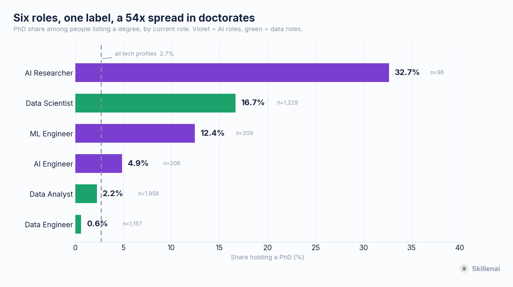
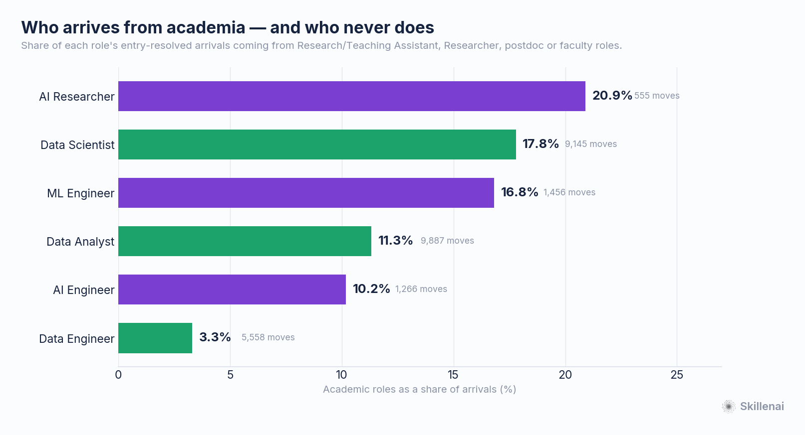

# Who Feeds the AI Roles — and What Software Lost

*A Skillenai analysis. September 2026.*

**Data.** Two Skillenai sources:

- **Supply — the Skillenai talent graph.** 568,663 unique professional career histories (two independent snapshots, 94.8% disjoint, deduplicated on profile id), with dated role-to-role transitions. Roles are **entity-resolved**: a move is *Software Engineer → AI Engineer*, not a keyword guess.
- **Demand — the Skillenai job-postings index**, used for context on what employers advertise.

Together they answer: what happened to software's share of tech hiring over thirty years, who moved into the roles that replaced it, and how differently credentialed those roles actually are.

---

## TL;DR

- **Software Engineering's share of tech hiring fell from 69% to 41%** between 1998 and 2025. It is still the largest single role by a wide margin, but it is no longer most of the job market.
- **Data roles took the largest bite** — 5.4% to 23.0% of all tech arrivals. AI roles went 1.2% to 10.3%. Together they account for almost exactly what software gave up.
- **"AI and data" is not one population.** Across six roles under that banner, PhD rates span **54x**: AI Researcher 32.7%, Data Scientist 16.7%, ML Engineer 12.4%, AI Engineer 4.9%, Data Analyst 2.2%, Data Engineer 0.6%. The tech-wide baseline is 2.7%.
- **The roles that absorbed academia are not the roles that grew.** Data Science and AI Research draw 18–21% of their arrivals from academic posts. AI Engineering draws 10.2% and Data Engineering 3.3% — and Data Engineering takes 29% of its people straight from Software Engineer.
- **The cloud era was a substitution, not an expansion.** Infrastructure & Security held a 9–12% band of tech hiring across the entire period. Inside it, sysadmins and network engineers were replaced by DevOps, cloud and security roles. The group never grew; its contents were swapped.
- **Feeder composition is essentially frozen.** AI Engineer inflow grew roughly 8x from 2020 to 2024 while the mix of roles people arrived from did not measurably change.

---

## 1. Thirty years, ranked

*Video: [`07_role_race.mp4`](07_role_race.mp4) — 74s, higher quality than the GIF.*

Each bar is a role's share of all tech role arrivals in the trailing twelve months. Quarterly steps, log scale.

Share rather than headcount is deliberate, and it matters. Recorded role starts in this corpus rise from 3,294 in 1990 to 112,143 in 2024. Almost all of that ramp is LinkedIn adoption and retrospective self-reporting, not hiring growth — a 1995 job survives in the data only if someone still profiled in 2026 bothered to list it. Racing raw counts would animate the instrument and show every role rising at once, including dying ones. Share cancels a uniform coverage factor and leaves the composition shift, which is the real signal.

## 2. What software lost, and who took it

| Group | 1998 | 2010 | 2018 | 2025 |
|---|---:|---:|---:|---:|
| Software | **69.1%** | 67.0% | 54.9% | **41.3%** |
| Data | 5.4% | 7.5% | 16.8% | **23.0%** |
| AI & ML | 1.2% | 1.8% | 2.9% | **10.3%** |
| Infrastructure & Security | 12.4% | 8.9% | 11.8% | 10.7% |
| Product & Business | 11.9% | 14.7% | 13.6% | 14.7% |

Two things worth separating.

**Data and AI genuinely expanded.** Between them they went from 6.6% of tech arrivals to 33.3% — and software fell by almost exactly the same amount.

**Infrastructure did not.** It stayed in a band of 8.6–12.4% throughout. What changed is entirely internal: Infrastructure/sysadmin fell from 5.9% to 1.2% of all tech hiring and Network Engineer from 4.9% to 0.3%, while Security Engineer rose from 1.5% to 5.6% and DevOps, cloud and platform roles appeared from nothing. The "rise of cloud" is real at the role level and invisible at the group level, because it was a replacement.

DevOps is its own cautionary tale: it peaked at 3.0% of tech hiring in 2018 and is down 52% since, as platform, SRE and cloud titles absorbed the work.

## 3. Six roles, one label, a 54x spread in doctorates

| Role | PhD share | n (listing a degree) | People in role |
|---|---:|---:|---:|
| AI Researcher | **32.7%** | 98 | 980 |
| Data Scientist | 16.7% | 1,229 | 15,985 |
| ML Engineer | 12.4% | 209 | 2,034 |
| AI Engineer | 4.9% | 206 | 1,728 |
| Data Analyst | 2.2% | 1,958 | 23,300 |
| Data Engineer | **0.6%** | 1,157 | 8,744 |
| *All tech profiles* | *2.7%* | *50,624* | *547,936* |

These six roles are routinely discussed as one labour market. They are not one labour market. An AI Researcher is eleven times more likely to hold a doctorate than a Data Analyst and fifty-four times more likely than a Data Engineer — and the two largest roles on that list, Data Analyst and Data Engineer, sit at or below the tech-wide baseline.

**What this does not show.** We tested whether growth and credentials are inversely related across these roles and found nothing: Pearson r = −0.25, p = 0.63 on six roles. "The fastest-growing roles are the least credentialed" is a tempting reading of this table and it is not supported. Data Analyst is both the largest and among the least credentialed; Data Scientist is large *and* credentialed. The spread is the finding, not a slope.

## 4. Who arrives from academia — and who never does

| Role | Arrivals from academic posts | Resolved moves |
|---|---:|---:|
| AI Researcher | **20.9%** | 555 |
| Data Scientist | 17.8% | 9,145 |
| ML Engineer | 16.8% | 1,456 |
| Data Analyst | 11.3% | 9,887 |
| AI Engineer | 10.2% | 1,266 |
| Data Engineer | **3.3%** | 5,558 |

Academic posts here means Research Assistant, Teaching Assistant, Research Intern, Researcher, Research Scientist, postdoc, or faculty — the role someone held immediately before arriving.

All three gaps against AI Engineer are significant (z = +6.77, +5.02, +6.17; p < 1e-6). The gradient is corroborated by the PhD table above, which is built from an entirely separate field of the data — profile education records rather than the resolved transition graph. Two independent instruments, same ordering.

**Data Engineering is the outlier.** It draws 3.3% of arrivals from academia and **29% directly from Software Engineer**. By both measures it is a software job that happens to touch data, not a scientific one.

**The alternative reading we tested and rejected.** AI Engineer is a young title, so its low PhD rate could simply mean its people haven't had time to earn doctorates. The direct test — PhD share within graduation cohort — is underpowered here (n < 25 per cell), so we checked educational vintage instead, where the sample is large: median last-degree year is 2023 for Data Scientists and 2024 for AI Engineers, with p25 of 2019 and 2020. A one-year difference in median cannot produce a 4x gap in PhD rate. The ordering also survives excluding managers and splitting by whether the title came from an employment record or a headline.

## 5. The intake mix is frozen

AI Engineer arrivals grew about 8x between 2020 and 2024 (46 → 375 resolved moves). Over the same period the *mix* of roles those people came from did not measurably change.

Chi-square tests of homogeneity on feeder composition across years: ML Engineer p = 0.885, AI Engineer p = 0.626, AI Researcher p = 0.241 — no detectable change. Data Scientist returns p = 0.001 but with Cramér's V = 0.043, an effect size far below the 0.1 "small" threshold; with N = 7,511 even trivial differences reach significance.

Across 2020–2025, no top-five feeder role for AI Engineer moved more than 9.6 percentage points while its inflow grew more than tenfold. The field scaled without changing who it recruits.

---

## What this means

- **For software engineers.** The adjacent roles that grew are mostly reachable without returning to school. Data Engineering in particular takes more of its people from Software Engineer than from anywhere else, and almost none from academia.
- **For people with doctorates.** The credentialed end of this market — AI Research, Data Science — is real but small. AI Researcher is 4.0% of tech hiring; Data Analyst is 11.2%.
- **For hiring managers.** Treating "AI/data" as one talent pool with one pipeline will mis-target every one of these roles. They differ by 54x on doctorates and by 6x on how much they recruit out of academia.

---

## Methodology and caveats

**Corpus.** Two talent-graph snapshots (July 2026 and August 2026), 300,000 profiles each, 94.8% disjoint, deduplicated on profile id to 568,663 unique people. The population is US tech/AI professionals filtered on job title at ingest, so it is a large sample of the tech workforce rather than a census. Read ratios and composition; treat absolute counts as a floor.

**Current role** is anchored on each profile's current-employer field rather than on an end-date sentinel, which recovers 99.97% of profiles; the naive approach silently drops about 47% and does so unevenly across employers.

**Role families are entity-resolved** for every transition-based number. Roles in the graph are fragmented by seniority and synonym, so each concept aggregates its whole family (70 role ids across the four AI families) and moves *within* a family are excluded, so a company change inside a role is not counted as a feeder.

**Month-level timing** is not available from the transition endpoints, which expose a move year only. The quarterly series in the race is therefore rebuilt from raw dated profile spells (93.7% of which carry month precision) with canonicalised titles. That instrument was validated against the entity-resolved data before use: academic-origin share agrees within 1–3 points and preserves the ordering. Feeder *composition* is reported only from the entity-resolved path, because raw-title matching collapses 26–41% of sources into an unnamed residual and inverts the Data Scientist feeder ordering.

**Reporting lag.** Employment records in this corpus are current to roughly October 2025 and thin out before that. After seasonal adjustment — calendar seasonality is large, with January at 11.9% of annual role starts against December's 4.8% — coverage holds at 0.86–1.01 of expectation through July 2025, then falls to 0.70, 0.72 and 0.45 in the three following months. A trailing-twelve-month window removes the seasonality and the partial-calendar-year problem but not the missing records, so windows ending after July 2025 are drawn faded and marked provisional. The final year of any series here should not be read as a decline.

**Survivorship.** Pre-2003 employment is retrospective self-reporting, since LinkedIn launched in 2003. Early years are biased toward people whose tech careers lasted long enough for them to still be profiled in 2026. This is the main reason the analysis reports shares rather than counts.

**Period-appropriate roles.** The role list extends the 2026 pay-analysis roles with titles that mattered in earlier eras — Webmaster/Web Developer, Systems Administrator, Network Engineer, Database Administrator, Cloud Engineer, Mobile Engineer, IT Support, Solutions Architect. Without them the 1990s would be measured with a purely modern vocabulary, which manufactures a false universal rise. Classification still matches modern titles somewhat better than old ones (46% of tech spells in the 2020s versus 31–36% earlier), so early-period shares carry more uncertainty than late ones.

**Two roles were excluded, and it changed the numbers.** Program Manager and Business Analyst were dropped from both the chart and the denominator. Both entered the corpus through an ingest keyword list rather than because they are tech roles: 90% of "Program Manager" titles carry no technical qualifier and roughly 10% sit at defense primes, while "Business Analyst" is led by a strategy consultancy that uses it as an entry-level consultant title, followed by three health insurers. Including them put Software at 54.8% in 1998 rather than 69.1%. Note this is a profile-side judgement — on the job-postings side, a Business Analyst requisition on a tech company's board genuinely is a tech role.

**Education fields are sparse.** Structured field-of-study is populated on about 8% of education records and degree level on about 11%. PhD share is therefore computed among people who listed any degree, which over-states levels — doctorate holders are more likely to record the credential. The *ordering* is what this analysis relies on, and it is corroborated by the independent academic-feeder measure. Per-role field-of-study is not reported for most roles: AI Engineer has only 10 PhD holders with an identifiable discipline, and no amount of presentation makes that a distribution.

**Statistics.** Proportions compared with two-proportion z-tests; feeder-composition stability with chi-square tests of homogeneity plus Cramér's V, since at these sample sizes significance and importance diverge sharply. Confidence intervals on discipline shares are bootstrap percentile intervals, 2,000 resamples.

---

*Figures and the analysis scripts that produce them are in this folder. The underlying profile corpus is not redistributable; the derived per-month, per-role arrival counts (`arrivals_all_roles.json`) are included.*
