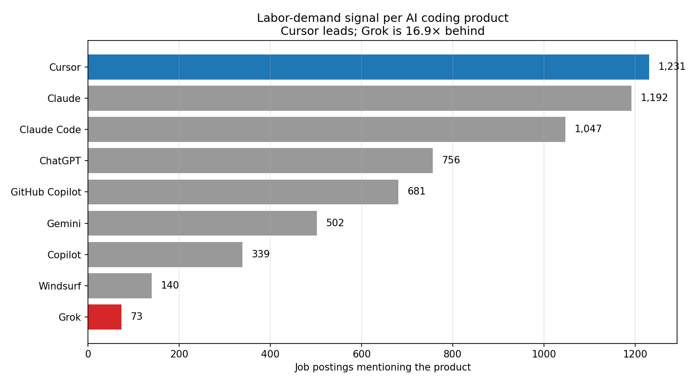
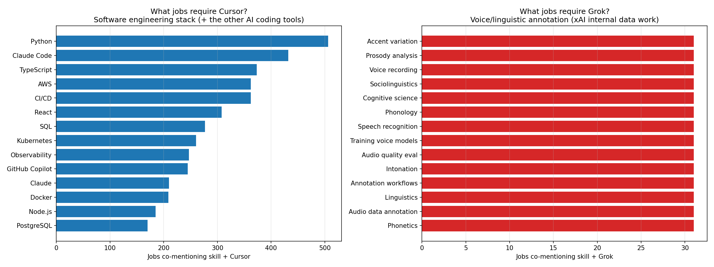
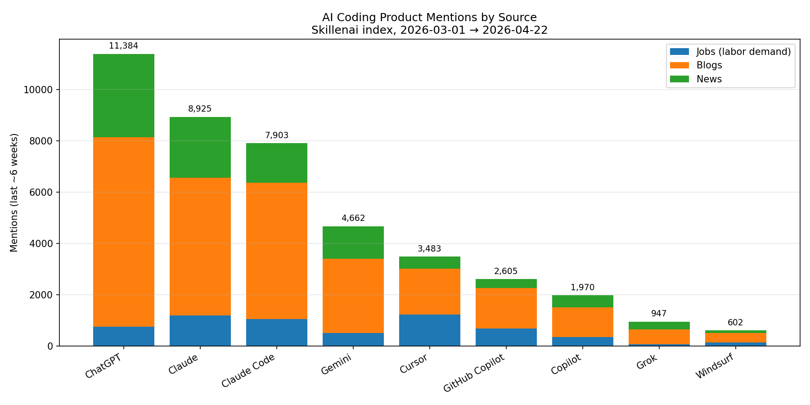
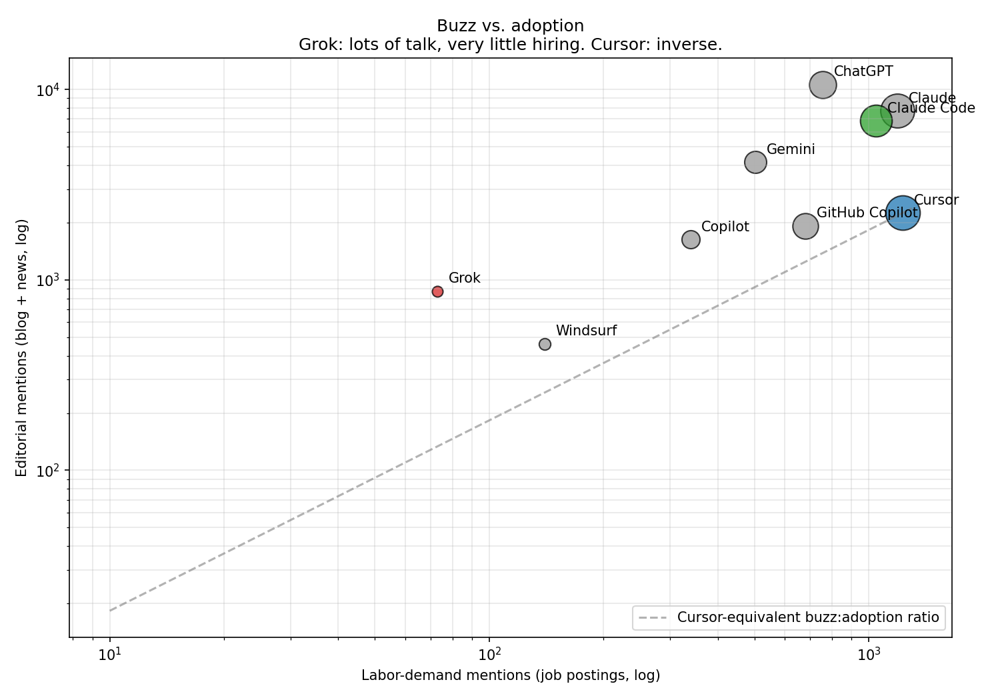
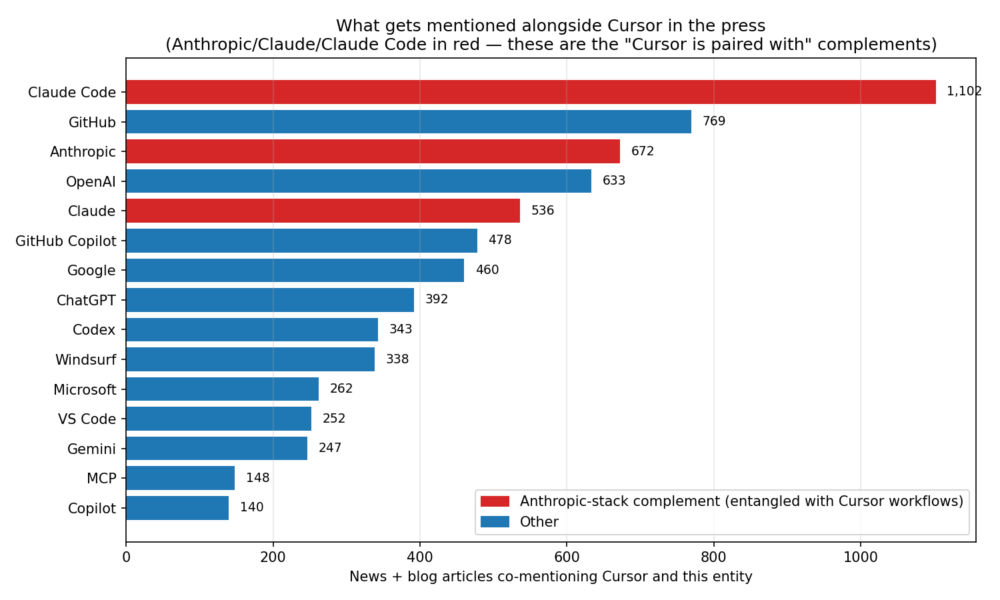
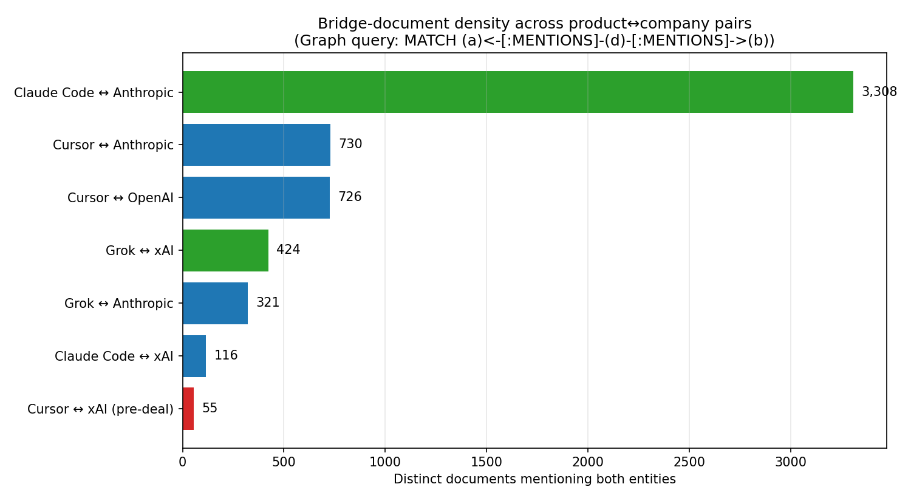
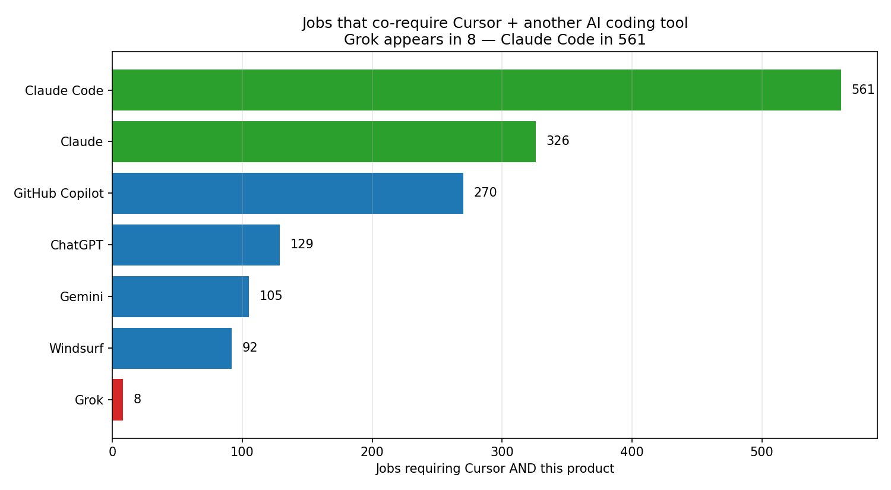
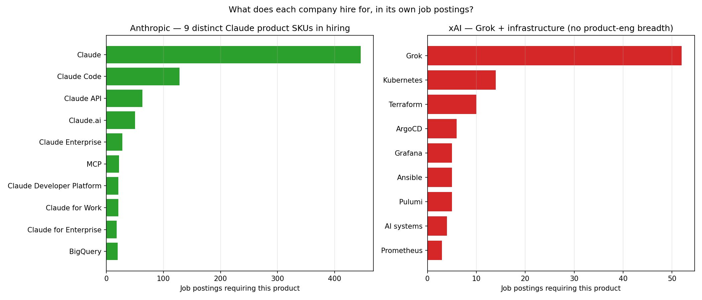

# The xAI–Cursor $60B Deal, Stress-Tested With Labor-Market and Media Data

**Date:** 2026-04-22
**Source:** Skillenai data products index (jobs, blogs, news, scholarly, social, product, company)
**Window:** 2026-03-01 → 2026-04-22 (pipeline has been running at full volume for about six weeks, so these are cross-sectional snapshots, not trends)

## Why this analysis

On 2026-04-21 SpaceX posted on X that it is partnering with Cursor to "create the world's best coding and knowledge work AI," accompanied by a call option to acquire Cursor for $60B later this year — or pay $10B for the partnership. SpaceX absorbed xAI in February 2026, so the buyer is the Musk-controlled SpaceX/xAI/X/Tesla cluster. Cursor is the dominant third-party AI-coding IDE; xAI's Grok is the Musk family's model; Anthropic's Claude Code is the competing first-party coding product tied to the leading coding foundation model.

The thesis we're testing is:

> xAI and Cursor together might be able to compete with Anthropic's vertically-integrated coding stack (compute + foundation model + agent harness + enterprise adoption). Alone, both would struggle within twelve months.

This report uses Skillenai's entity-resolved index of job postings, blogs, and news to check how much of that thesis the data corroborates, and where the data pushes back.

## Dataset and filters

- Entities were resolved via `POST /v1/resolution/entities` to get canonical entity IDs for `Cursor`, `Grok`, `Claude Code`, `Claude`, `GitHub Copilot`, `Copilot`, `Windsurf`, `ChatGPT`, `Gemini` (products) and `Anthropic`, `xAI`, `OpenAI` (companies).
- All mention counts come from `skillenai.document_entity_links` joined to `skillenai.entities`, grouped by `source_type`.
- "Editorial" counts use only `source_type IN ('blog','news')`. "Labor demand" uses only `source_type IN ('jobs','job')`.
- The `product` and `company` source types are entity-catalog rows, not editorial mentions, so they are excluded from headline numbers.
- Pipeline was only running at full volume for ~six weeks at the time of writing, so we report levels, not trends.

## Finding 1 — Grok is a non-player in software-engineering job postings

Across ~125K enriched job postings in the Skillenai index, the nine AI-coding products show sharply different labor-demand pull:

| Product | Jobs mentioning it | Blog articles | News articles |
|---|---:|---:|---:|
| Cursor | **1,231** | 1,773 | 479 |
| Claude | 1,192 | 5,371 | 2,362 |
| Claude Code | 1,047 | 5,315 | 1,541 |
| ChatGPT | 756 | 7,384 | 3,244 |
| GitHub Copilot | 681 | 1,579 | 345 |
| Gemini | 502 | 2,891 | 1,269 |
| Copilot | 339 | 1,162 | 469 |
| Windsurf | 140 | 365 | 97 |
| **Grok** | **73** | **578** | **296** |

Grok appears in just 73 job postings — fewer than Windsurf, the small Codeium/Windsurf product Cognition acquired. Cursor appears in 1,231, a 16.9× lead over Grok. Even Copilot, the legacy Microsoft non-GitHub product, outruns Grok 4.6×.



Looking at who those 73 Grok-mentioning postings belong to makes the gap clearer. Of the top companies hiring in roles that mention Grok, 52 of 73 are xAI itself — primarily linguistic data-annotation roles (the co-occurring skills are "accent variation analysis," "phonology," "prosody analysis," "speech recognition," each appearing in 31 postings). No Fortune 500 employer is hiring software engineers to use Grok. This is not an enterprise adoption signal; it's xAI scaling its own voice training pipeline.



In sharp contrast, Cursor's co-occurring skills are the entire modern application-engineering stack: Python, TypeScript, AWS, CI/CD, React, SQL, Kubernetes, observability, Docker, Node.js, PostgreSQL. Jobs requiring Cursor are jobs at companies shipping software.

## Finding 2 — Cursor and Claude Code are complements, not substitutes

The data's single most consequential finding for the deal:

| Pair co-required in a job posting | Job postings |
|---|---:|
| Cursor + Claude Code | **432** |
| Cursor + GitHub Copilot | 245 |
| Cursor + Claude | 210 |
| Claude Code + Cursor | 430 (same pairing, inverse direction) |
| Claude Code + GitHub Copilot | 169 |

35% of Cursor-mentioning job postings also require Claude Code. Engineering teams are not treating these as alternatives — they are treating them as a toolkit. That has direct implications for the acquisition: any post-deal decision to sever Claude/GPT integration in favor of xAI models would collide with real, documented workflows at the companies that power Cursor's $1–2B of ARR.

## Finding 3 — Enterprise adoption is real for Cursor, Claude Code, and Copilot. It is not real for Grok.

Top companies with job postings that mention each product (external, not self-hiring), last six weeks:

**Cursor:** Baseten, Plaud, Plaid, Sezzle, Nerdy, cognition, jack-jill-external-ats, EviSmart, Haslab, Ridgeline, Grafana Labs, datacamp, EarnIn. Fifteen distinct external employers visible. Matches the press-reported 67% Fortune 500 penetration, with room for long-tail startups.

**Claude Code:** Sezzle, Nerdy, maximustribe, Vynyl, Ridgeline, Metropolis, doitintl, datacamp, Grafana Labs, Intercom, Caylent, Adobe, Money Forward. Equal or greater external breadth.

**GitHub Copilot:** paloit, xbowcareers, hyperexponential, Tailor, Ridgeline, Vynyl, NiCE, Nerdy, Caylent, twilio, Cisco, BillionToOne, Appier, Bootstrap. Strong enterprise skew.

**Grok:** xAI (52) — then a handful of one-offs: Nerdy (7), bamboohr17 (4), Dialpad (3), one posting each at Neo4j, Fiserv, FlightHub. Essentially no independent enterprise demand.



## Finding 4 — Grok has a buzz-to-adoption gap; Cursor has the inverse

Plotting labor-demand mentions against editorial (blog + news) mentions:



Grok sits in the upper-left quadrant — considerable media coverage (874 editorial mentions) but almost no hiring signal (73 jobs). Editorial-to-labor ratio: **~12 mentions per job**. Cursor is in the opposite quadrant — 2,252 editorial mentions, 1,231 jobs. Editorial-to-labor ratio: **~1.8 mentions per job**. The rest of the field is in between, clustered around Cursor's ratio.

This gap is consistent with a product that is widely reported on but not widely used to ship software — which matches the characterization in the user's thesis that "Grok is bad at coding."

## Finding 5 — The press already frames Cursor as tied to Anthropic's products, not xAI's

Top entities co-mentioned with Cursor in blogs and news over the last six weeks:

| Co-mentioned with Cursor (news+blog) | Articles |
|---|---:|
| Claude Code (product) | 1,102 |
| GitHub (company) | 769 |
| Anthropic (company) | 672 |
| OpenAI (company) | 633 |
| Claude (product) | 536 |
| GitHub Copilot (product) | 478 |
| Google (company) | 460 |
| Codex (product) | 343 |
| Windsurf (product) | 338 |
| Microsoft (company) | 262 |
| VS Code (product) | 252 |
| Gemini (product) | 247 |
| MCP (product) | 148 |

Anthropic's products (Claude Code + Claude) are the two most-common co-mentions with Cursor in the press, and Anthropic the company is the third. xAI sits at **58** co-mentions in the six-week window — roughly 1/12 the density of Anthropic–Cursor. The public narrative before April 21 placed Cursor inside the Anthropic orbit, not the xAI orbit.



## Finding 6 — Anthropic's ecosystem depth dwarfs xAI's

Comparing how each company is co-mentioned with its own flagship product in news/blog:

| Company | Own product | Company–product co-mentions (news+blog) |
|---|---|---:|
| Anthropic | Claude Code | 3,039 |
| Anthropic | Claude | 4,097 |
| OpenAI | ChatGPT | 2,103 |
| OpenAI | Codex | 647 |
| Google | Gemini | 1,199 |
| xAI | Grok | 327 |

xAI's brand-to-product linkage is 9.3× weaker than Anthropic's Claude Code linkage and 12.5× weaker than Claude's. In media terms, xAI is recognized as a company; Grok is recognized only adjacent to Musk. Anthropic's brand is mediated through product adoption; xAI's brand is mediated through its founder.

## Finding 7 — Graph-native view: Cursor is an edge away from Anthropic and 13× further from xAI

Using Cypher over the entity graph we measured "bridge document density" — the number of distinct documents that link two entities via `MENTIONS`. This cleans up double-counting issues in the SQL view.

| Pair | Type | Bridge documents |
|---|---|---:|
| Claude Code ↔ Anthropic | first-party | **3,308** |
| Cursor ↔ Anthropic | third-party | **730** |
| Cursor ↔ OpenAI | third-party | 726 |
| Grok ↔ xAI | first-party | 424 |
| Grok ↔ Anthropic | third-party | 321 |
| Claude Code ↔ xAI | third-party | 116 |
| **Cursor ↔ xAI** (pre-deal) | third-party | **55** |



Anthropic's first-party product linkage (Claude Code ↔ Anthropic) is **28× denser** than xAI's first-party linkage (Grok ↔ xAI). Cursor was 13× more entangled with Anthropic than with xAI before the deal. The acquisition is, graphically, welding a new edge where almost none existed.

## Finding 8 — Jobs never co-require Cursor and Grok

The crispest single number comes from a two-hop Cypher query: how many job postings require Cursor and one other named AI coding tool?

| Product co-required with Cursor | Jobs |
|---|---:|
| Claude Code | **561** |
| Claude | 326 |
| GitHub Copilot | 270 |
| ChatGPT | 129 |
| Gemini | 105 |
| Windsurf | 92 |
| **Grok** | **8** |



8 jobs. Across our entire six-week enriched-jobs corpus, eight job postings require both Cursor and Grok. 70× fewer than Cursor + Claude Code. If the new stack is "Cursor + xAI models," the market has not yet encoded that expectation into a single hiring spec.

A related triangle query — which other products appear in documents that mention **both** Cursor and Claude Code — returned a top-20 AI-coding cluster of Codex, GitHub Copilot, Claude, Windsurf, ChatGPT, Gemini, Gemini CLI, VS Code, MCP, Lovable, Devin, OpenCode, Replit. **Grok does not appear in the top 20.** The conversation that surrounds Cursor today is not a conversation about Grok.

## Finding 9 — Internal hiring stacks tell the same story as external adoption

Asking each company's own job postings what products they hire for is the sharpest way to see whether the companies have comparable product organizations.

**Anthropic's internal hiring stack (top products):**

| Product | Anthropic job postings requiring it |
|---|---:|
| Claude | 446 |
| Claude Code | 128 |
| Claude API | 63 |
| Claude.ai | 50 |
| Claude Enterprise | 28 |
| MCP | 22 |
| Claude Developer Platform | 21 |
| Claude for Work | 21 |
| Claude for Enterprise | 18 |

Nine distinct Claude-family product SKUs, each with measurable hiring volume. This is a mature multi-SKU product organization.

**xAI's internal hiring stack (top products):**

| Product | xAI job postings requiring it |
|---|---:|
| Grok | 52 |
| Kubernetes | 14 |
| Terraform | 10 |
| ArgoCD | 6 |
| Grafana | 5 |
| Ansible | 5 |
| Pulumi | 5 |
| Prometheus | 3 |

This is a compute/SRE organization. Outside of Grok itself, xAI is hiring to operate a large GPU fleet — not to ship coding or enterprise products. No "Grok for Enterprise," no "Grok API," no "Grok Developer Platform" appear with meaningful volume. Which is precisely why, per the press reporting, two of Cursor's top engineering leads had already joined xAI in March 2026 reporting directly to Musk: xAI had to import an applied-AI product organization.



We also checked directly: **zero xAI job postings currently mention Cursor, and zero Anthropic job postings mention Cursor**. Each company is still operating its own internal tooling (xAI uses Grok internally, Anthropic uses Claude and Claude Code internally). The deal creates a new dependency that hasn't yet propagated into either side's hiring specs.

## Stress-testing the user hypothesis

| Claim | Verdict | Evidence |
|---|---|---|
| Grok is bad at coding | Supported | 73 job mentions vs 1,047 for Claude Code and 1,231 for Cursor. Co-occurring skills are voice annotation, not software engineering. |
| Grok has poor enterprise adoption | Supported | 52 of 73 Grok-mentioning job postings are xAI's own; no Fortune 500 SWE demand. |
| Cursor has coding strength and enterprise adoption | Supported | Cursor leads the field on jobs mentions with the widest external-employer distribution. Press-reported 67% Fortune 500 penetration is consistent. |
| Cursor lacks compute and is squeezed by vertically-integrated Anthropic | Supported, with a twist | Cursor's own Composer 2 reportedly beat Claude Opus 4.6 on Terminal-Bench at 1/10 the cost. The bottleneck is not model capability — it is the fact that every frontier-compute provider also sells a competing coding product. |
| xAI + Cursor together can compete with Anthropic's stack | Partly — with risk | xAI brings Colossus compute (1M H100-equivalent by EOY). Cursor brings the product, the engineering hires, and the F500 channel. But 35% of Cursor's hiring demand is paired with Claude Code. A forced switch to an xAI-only stack could break real workflows. |
| Alone, both would die within 12 months | Not supported | Cursor's $1–2B ARR and 67% F500 penetration is not a 12-month extinction profile. xAI is funded by SpaceX, which is preparing a $1.75T IPO. Both are more likely to face margin compression or strategic dependency than outright failure. |

## What the deal-structure tells us that the press hasn't quite spelled out

The "$60B acquisition *or* $10B payment" structure is a free option for SpaceX, not a forced buy. The most parsimonious reading of the data:

- SpaceX secured Cursor's compute channel ahead of its IPO. $10B is a reasonable price for exclusive compute-rental economics plus an AI narrative attached to a $1.75T IPO prospectus.
- Two of Cursor's top engineers had already joined xAI in March. The technical integration (Composer 2.5 training on xAI's Colossus) was already in motion.
- If Anthropic or OpenAI retaliate by restricting API access to Cursor — a defensible competitive move given Cursor's product now directly competes with Claude Code and Codex — SpaceX exercises the $60B option and absorbs the product. If Cursor continues to thrive on mixed-model access, SpaceX still pockets a multi-billion-dollar compute-rental deal.

This is a pre-IPO insurance policy as much as it is a coding-AI bet.

## What the data can and can't say

**Can say:** Labor-demand signal is cross-sectional and already decisive. Cursor has meaningful external hiring demand; Grok does not. Anthropic's product-brand linkage is roughly an order of magnitude denser than xAI's. In engineering team toolkits, Cursor and Claude Code appear together, not as alternatives.

**Can't say:** Because the pipeline has only been running at full volume for six weeks, we can't yet measure trajectory. Whether Cursor's labor-demand share is accelerating or decelerating relative to Claude Code, whether post-deal enterprise adoption shifts, and whether xAI jobs begin moving toward software engineering roles — all of these require additional months of data. We will revisit.

## Methodology notes

- Mention counts come from exact entity-ID joins on `skillenai.document_entity_links`; no free-text fallback.
- Company names come from `POSTED_BY` relationships on enriched job postings; where a company shows multiple case variants (`Cursor`, `cursor`), we kept them separate because the canonicalization pass hasn't stabilized for all employers in the index. The analysis uses relative ranks, not absolute counts, where this matters.
- The `product` source_type is an entity-catalog row, not an editorial mention, and is excluded from "editorial" totals.
- `job` and `jobs` source types are both present (legacy and current schemas); both are included in labor-demand counts.
- Entities were retrieved via `POST /v1/resolution/entities` with `mode: "auto"`. All nine target products and three target companies returned exact matches with score 1.0.

## Reproduction

This report used both SQL (`POST /v1/query/sql`) and Cypher (`POST /v1/query/graph`) against the Skillenai API. Charting scripts are in this folder:

- `make_charts.py` — SQL-derived PNGs (01–05) from `mentions_by_source.csv` and inline co-mention tables
- `make_graph_charts.py` — Cypher-derived PNGs (06–08): co-required products, bridge-document density, internal hiring stacks
- `mentions_by_source.csv` — jobs/blog/news counts per product

Key Cypher patterns (all use only MATCH/RETURN, stay within the engine's 3-hop max and 2-pattern limit):

```cypher
-- Jobs co-requiring two products
MATCH (a:product {id: $idA})<-[:MENTIONS]-(j:job)-[:MENTIONS]->(b:product {id: $idB})
RETURN count(j)

-- Bridge documents between a product and a company
MATCH (p:product {id: $pid})<-[:MENTIONS]-(d:document)-[:MENTIONS]->(c:company {id: $cid})
RETURN count(DISTINCT d)

-- Internal hiring stack for a company
MATCH (j:job)-[:POSTED_BY]->(c:company {id: $cid}), (j)-[:MENTIONS]->(p:product)
RETURN p.name, count(j) ORDER BY count(j) DESC
```

A full fetch pipeline with entity resolution and per-query throttling was used against the production API; the same queries can be re-run on newer data as the pipeline accumulates a longer time series.
